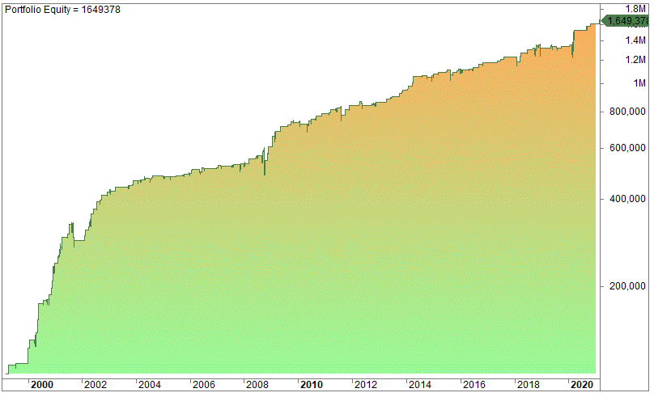

Understanding price scales is essential for making informed decisions in trading. This article examines the application of linear and logarithmic price scales in algorithmic trading, highlighting their differences, applications, and advantages.

Price scales are critical tools that traders employ to interpret market data, analyze trends, and devise strategies. By understanding these scales, traders can enhance their capability to spot profitable trades and mitigate investment risks. The mechanics of each scale and their application in various trading scenarios will be explored, with particular emphasis on how algorithmic trading can optimize their use.



Whether you are an experienced trader or just starting, mastering these concepts will equip you with the expertise to effectively navigate the complexities of financial markets. Linear price scales present absolute changes, with each unit on the vertical axis representing the same price movement. They are particularly useful for markets where nominal changes are significant. Conversely, logarithmic scales focus on percentage changes, making them ideal for analyzing long-term trends where exponential growth occurs.

Incorporating these scales into algorithmic trading can enhance decision-making processes and risk management. Modern trading platforms provide the flexibility to switch between scales, facilitating more accurate analysis and strategic planning. Let's examine how linear and logarithmic scales function and how they can be effectively integrated into contemporary trading systems.

## Table of Contents

## Understanding Linear and Logarithmic Price Scales

Linear price scales, also known as arithmetic scales, are straightforward tools used in financial charts. On a linear scale, each unit on the vertical (Y-axis) represents the same absolute change in price. For instance, a move from $50 to $60 will appear the same as a move from $100 to $110. This makes linear scales ideal for displaying data where dollar changes hold more significance than percentage changes. Their simplicity makes them suitable for analyzing short-term trends or less volatile assets where absolute price differences are more relevant than relative changes.

Conversely, logarithmic price scales, or log scales, measure equal percentage changes as equal vertical distances on the chart, regardless of the actual price level. For example, a move from $50 to $100 (a 100% increase) would be represented as the same vertical distance as a move from $100 to $200, even though the absolute price change in the latter is larger. This scaling method is particularly useful for visualizing long-term trends, where exponential growth may be present. It allows traders to focus on percentage shifts, offering a clearer view of historical price patterns and reducing distortion when earlier price changes appear smaller due to significantly lower starting prices.

The decision to use linear versus logarithmic scales hinges on the extent of price movements and the specific analysis being performed. Linear scales suit scenarios where a trader is interested in precise dollar values, such as short-term fluctuations. In contrast, logarithmic scales are advantageous when dealing with extensive historical data or when evaluating assets characterized by frequent, sizable percentage fluctuations.

Traders benefit from understanding both scales as this knowledge broadens their market perspective and enhances the analysis of price movements. By recognizing when each scale is appropriate, traders can ensure their strategies are based on comprehensive market insights, enabling more informed decision-making.

## The Importance of Logarithmic Scales in Long-Term Trading

Logarithmic scales are integral to long-term trading, especially for assets exhibiting exponential growth. Unlike linear scales, where equal distances on the graph represent absolute price changes, logarithmic scales focus on percentage changes. This characteristic makes logarithmic scales particularly advantageous for long-term investors seeking to analyze price trends without the distortion common on linear representations.

To illustrate, consider a stock with a price doubling from $10 to $20 and later from $20 to $40. On a logarithmic scale, both moves would occupy the same vertical distance because the percentage change (100%) is equivalent, regardless of the initial price. This feature is crucial for data visualization in financial markets, where exponential growth is a common occurrence over extended periods.

Beyond this practical visualization benefit, logarithmic scales serve as valuable tools in recognizing historical price patterns and significant percentage changes. They allow traders to see the relative movement in asset prices over time more clearly, aiding in the identification of consistent growth trends or cyclical patterns that might otherwise be less visible on linear scales.

The utility of logarithmic scales extends to assets known for their variable price movements, such as stocks and cryptocurrencies. Traditional linear scales can diminish earlier price changes' representation when an asset's value increases substantially over time. In contrast, logarithmic scales maintain the proportional significance of these early price changes, offering a more comprehensive view of an asset's performance trajectory.

Furthermore, employing mathematical tools such as the natural logarithm in analyzing price data can enhance traders' insights. The logarithmic scale can be expressed mathematically as:

$$
\text{Position on logarithmic scale} = \log(\text{price})
$$

Python can be efficiently utilized to convert linear price data to logarithmic scale for computational analysis:

```python
import numpy as np
import matplotlib.pyplot as plt

# Sample price data
prices = np.array([1, 2, 10, 50, 100, 500])

# Convert price data to logarithmic scale
log_prices = np.log10(prices)

# Plotting
plt.figure(figsize=(10, 6))
plt.plot(prices, label='Linear Scale')
plt.plot(log_prices, label='Logarithmic Scale')
plt.xlabel('Time')
plt.ylabel('Price')
plt.legend()
plt.title('Linear vs Logarithmic Price Scales')
plt.show()
```

This code illustrates the difference between linear and logarithmic scales, emphasizing how logarithmic transformation can assist in analyzing long-term price movements effectively. In conclusion, for traders and analysts engaging with volatile or exponentially growing markets, logarithmic scales provide a more insightful perspective, enabling more precise long-term trading decisions.

## Algorithmic Trading: Leveraging Price Scales

Algorithmic trading employs automated systems to execute trades based on predefined criteria, where interpreting price data accurately is crucial. One important aspect of this is selecting the appropriate price scale—linear or logarithmic—to optimize decision-making processes.

Logarithmic scales are particularly integrated into [algorithmic trading](/wiki/algorithmic-trading) strategies for their ability to accurately reflect percentage-based data. This characteristic is essential for both strategy development and risk management, as it allows traders to perceive equal percentage changes in price as equal movements on a chart, irrespective of the starting price. In mathematical terms, this can be represented using the formula for a logarithm:

$$
y = \log(x)
$$

where $y$ denotes the position on the Y-axis, and $x$ is the price level. This can help traders and algorithms evaluate relative performance more objectively, especially over long time periods or during periods of exponential growth.

Advanced trading platforms such as TradingView and MetaTrader now provide features that allow users to switch seamlessly between linear and logarithmic chart views. This versatility is key when designing and implementing trading algorithms, as it enables the optimization of strategies by selecting the most informative view for the data at hand. For instance, when analyzing a volatile market segment, a logarithmic scale might reveal trends that a linear scale could obscure.

Moreover, logarithmic scales are instrumental in setting price targets and identifying technical indicators like support and resistance levels. Support and resistance inform about the potential floor or ceiling of a price movement. Logarithmic charts can indicate these levels more reliably in fluctuating markets because they focus on percentage changes rather than absolute ones. This approach facilitates more effective anticipations of market reversals or continuations, directly informing transaction algorithms.

Incorporating logarithmic scales into algorithmic trading frameworks increases the precision of predictive models and strategies. Providing a clearer visualization of data—especially critical during significant market [volatility](/wiki/volatility-trading-strategies)—enhances the capacity to make informed, timely trading decisions. By emphasizing percentage change, quandaries around absolute price transformations are minimized, thus optimizing algorithmic decision models and ultimately leading to superior portfolio management.

## Comparing Linear and Logarithmic Scales: A Practical Perspective

When selecting between linear and logarithmic price scales, traders must consider the volatility and nature of the asset being analyzed. Linear scales, also known as arithmetic scales, are excellent for assets with steady price movements, where consistent dollar amounts are more significant. In these cases, each unit change on the Y-axis represents the same absolute price change, making it easy to track prices where fluctuations are minor in relation to the overall price.

For instance, a linear scale is suitable for displaying the price of a bond or utility stock, where price changes tend to be minimal. This is because the emphasis is placed on visualizing absolute changes, providing a straightforward representation of value over time.

Logarithmic scales, on the other hand, excel in situations where percentage changes are more relevant than absolute changes. This is particularly true for assets characterized by exponential growth or volatility, such as technology stocks or cryptocurrencies. On a logarithmic scale, equal vertical distances signify equal percentage changes. This approach helps maintain proportionality in the representation of data, making it easier to observe long-term trends and relative performance.

For example, consider a stock that increases from $10 to $20 and another that goes from $100 to $110. On a logarithmic scale, both changes are plotted with equal spacing because they represent the same 100% increase, making it possible to directly compare performance regardless of initial price levels. This aspect of log scales is crucial for traders who need to identify significant trends over extended periods or across different market cycles.

To capitalize on the strengths of each scale, traders should be adept at switching between linear and logarithmic charts based on the objective of their analysis. For a more comprehensive insight, leveraging both scales can reveal a fuller picture of market dynamics. This adaptive use of price scales allows traders to tailor their strategies and ensure their decisions are informed by the most relevant data insights, thereby enhancing the accuracy and effectiveness of their trading activities.

## Conclusion

Mastering both linear and logarithmic scales equips traders with the analytical competence needed to decipher complex market dynamics effectively. This understanding is vital for optimizing algorithmic trading strategies, as each scale offers unique insights essential for accurately interpreting price data.

Traders are encouraged to exploit the advanced functionalities of modern trading platforms, such as TradingView or MetaTrader, which allow for seamless transitions between linear and logarithmic chart views. These platforms provide the flexibility to apply both scales where they are most appropriate, enriching the technical analysis process and yielding a more comprehensive view of market trends.

The interaction between these scales and algorithmic trading systems is particularly pertinent. Linear scales are ideal for conditions where absolute price changes are significant, while logarithmic scales excel in scenarios marked by proportionate price variations. By understanding these interactions, traders can fine-tune their algorithms to set more precise price targets, identify robust technical indicators, and manage risks more effectively.

Ultimately, the dual mastery of these scales can lead to more informed trading decisions and improved portfolio management, as they enhance the trader's ability to identify profitable opportunities and mitigate potential losses.

## References & Further Reading

[1]: Arnott, R. D., Hsu, J., & Moore, P. (2005). ["Fundamental Indexation"](https://www.researchgate.net/publication/228289477_Fundamental_Indexation). Financial Analysts Journal.

[2]: ["Mathematical Models of Financial Derivatives"](https://link.springer.com/book/10.1007/978-3-540-68688-0) by Yue-Kuen Kwok

[3]: Murphy, J. J. (1999). ["Technical Analysis of the Financial Markets: A Comprehensive Guide to Trading Methods and Applications"](https://archive.org/details/technicalanalysi0000murp). New York Institute of Finance.

[4]: Nison, S. (1991). ["Japanese Candlestick Charting Techniques: A Contemporary Guide to the Ancient Investment Techniques of the Far East"](https://archive.org/details/japanesecandlest0000niso). New York Institute of Finance.

[5]: ["Algorithmic Trading: Winning Strategies and Their Rationale"](https://www.amazon.com/Algorithmic-Trading-Winning-Strategies-Rationale-ebook/dp/B00CY5HC0U) by Ernest P. Chan

[6]: Ulrich, D. (1997). ["An Introduction to High-Frequency Finance"](https://archive.org/details/an-introduction-to-high-frequency-finance) by Ramazan Gençay, Michel Dacorogna, Ulrich A. Müller, Richard B. Olsen, and Olivier V. Pictet

[7]: Taleb, N. N. (2010). ["The Black Swan: The Impact of the Highly Improbable"](https://www.jstor.org/stable/23045073). Random House.