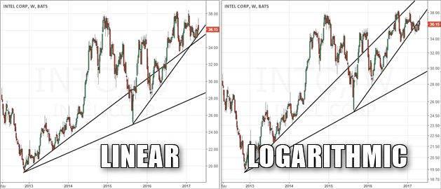

## Table of Contents

## What is a price scale in the context of financial charts?

A price scale in the context of financial charts is like a ruler that shows how much money a stock, commodity, or currency is worth at different points on the chart. It's usually on the side of the chart and helps you read the price of whatever you're looking at. If the price goes up, you'll see the line on the chart moving higher on the scale, and if the price goes down, the line moves lower.

There are two main types of price scales: linear and logarithmic. A linear scale is straightforward; it shows equal distances between price levels. So, the distance between $10 and $20 is the same as between $20 and $30. On the other hand, a logarithmic scale is used when you want to see percentage changes more clearly. It's useful for looking at things that have grown a lot over time because it shows equal distances for equal percentage changes, not just equal dollar amounts.

## What is a linear price scale?

A linear price scale is a type of scale used on financial charts that shows price changes in a straightforward way. It's like a regular ruler where the distance between numbers is always the same. So, if you look at a chart with a linear scale, the space between $10 and $20 is exactly the same as the space between $20 and $30. This makes it easy to see how much the price has gone up or down in actual dollar amounts.

Linear scales are good when you want to focus on the actual dollar changes in price. For example, if a stock goes from $50 to $60, you can easily see that it went up by $10 on a linear scale. But, linear scales can be less helpful if you're looking at big changes over a long time because they don't show percentage changes as well as other types of scales.

## What is a logarithmic price scale?

A logarithmic price scale is a way of showing prices on a chart where the distances represent percentage changes instead of fixed dollar amounts. This means that if a stock goes from $10 to $20, that's a 100% increase, and the same distance on the chart would show a stock going from $100 to $200, which is also a 100% increase. This makes it easier to see how much something has grown over time, especially if the price changes a lot.

Logarithmic scales are really useful when you're looking at things that have grown a lot over many years. For example, if you're looking at a company that started small and became huge, a logarithmic scale will show you the big jumps in its early days just as clearly as the smaller percentage changes later on. This helps you understand the growth story better than a linear scale, which might make early changes look tiny compared to later ones.

## How does a linear price scale represent price changes?

A linear price scale shows price changes in a simple way. It's like a regular ruler where the space between each price is always the same. So, if a stock goes from $10 to $20, that's the same distance on the chart as going from $20 to $30. This makes it easy to see how much the price has changed in actual dollars.

Linear scales are good when you want to focus on the real dollar changes. For example, if a stock goes up from $50 to $60, you can easily see it went up by $10. But, if you're looking at big changes over a long time, a linear scale might not be the best because it doesn't show percentage changes well.

## How does a logarithmic price scale represent price changes?

A logarithmic price scale shows price changes based on percentages, not fixed dollar amounts. This means if a stock goes from $10 to $20, that's a 100% increase, and the same distance on the chart would show a stock going from $100 to $200, also a 100% increase. It's like a special ruler where the spaces between numbers get bigger as the numbers get bigger, but the percentage change stays the same.

Logarithmic scales are great for looking at things that have grown a lot over time. For example, if you want to see how a small company turned into a big one, a logarithmic scale will show the big jumps early on just as clearly as the smaller percentage changes later. This helps you understand the whole growth story better than a regular scale, which might make early changes look tiny compared to later ones.

## What are the visual differences between linear and logarithmic price scales?

On a linear price scale, the space between each price is the same. So, if you look at a chart, the distance from $10 to $20 is the same as from $20 to $30. It's like a regular ruler where every inch is the same size. This makes it easy to see how much the price went up or down in real dollars. If a stock goes from $50 to $60, you can see it went up by $10.

On a logarithmic price scale, the space between prices shows percentage changes. If a stock goes from $10 to $20, that's a 100% increase, and the same space on the chart would show a stock going from $100 to $200, which is also a 100% increase. It's like a special ruler where the spaces get bigger as the numbers get bigger, but the percentage change stays the same. This is good for seeing how something has grown over time, especially if the price changes a lot.

## In what situations is a linear price scale more appropriate?

A linear price scale is more appropriate when you want to see how much the price of something has changed in real dollars. For example, if you're looking at a stock that went from $50 to $60, a linear scale will show you that it went up by $10 very clearly. This is helpful if you're more interested in the actual dollar amount of the change rather than the percentage.

Linear scales are also good for short-term trading or when the price changes are not too big. If you're looking at a chart for just a few days or weeks, and the prices are staying within a small range, a linear scale will make it easy to see the ups and downs in a straightforward way.

## In what situations is a logarithmic price scale more appropriate?

A logarithmic price scale is more appropriate when you want to see how much something has grown over a long time. It's good for looking at things like stocks or companies that started small and got really big. With a logarithmic scale, you can see the big jumps in the early days just as clearly as the smaller percentage changes later on. This helps you understand the whole growth story better.

Logarithmic scales are also useful when you want to see percentage changes instead of just dollar amounts. For example, if a stock goes from $10 to $20, that's a 100% increase, and the same space on the chart would show a stock going from $100 to $200, which is also a 100% increase. This makes it easier to compare how different things have grown over time, even if they started at different prices.

## How can the choice of price scale affect the interpretation of price movements?

The choice of price scale can change how you see price movements on a chart. A linear scale shows changes in real dollars, so if a stock goes up from $50 to $60, you can see it went up by $10 easily. This is good when you want to focus on the actual dollar amount of the change. But, if you're looking at a stock that grew a lot over many years, a linear scale might make the early big jumps look small compared to later smaller changes.

On the other hand, a logarithmic scale shows changes in percentages. So, if a stock goes from $10 to $20, that's the same space on the chart as going from $100 to $200, because both are 100% increases. This is helpful when you want to see how something has grown over time, especially if the price changed a lot. It makes it easier to understand the whole growth story and compare different things, even if they started at different prices.

## What are the potential pitfalls of using a linear price scale for long-term analysis?

Using a linear price scale for long-term analysis can make it hard to see the big picture. When you look at something that grew a lot over many years, like a stock that went from a few dollars to hundreds of dollars, a linear scale might make the early big jumps look tiny. This is because a linear scale shows changes in real dollars, so a jump from $1 to $2 looks the same as a jump from $100 to $101, even though the first one is a much bigger percentage change.

This can lead to misunderstanding how something grew over time. If you're trying to see how a small company turned into a big one, a linear scale might not show the early growth well. It can make it seem like the company didn't grow much at the start, when really, those early percentage changes were huge. So, for long-term analysis, a linear scale might not give you the full story of growth and change.

## What are the potential pitfalls of using a logarithmic price scale for short-term analysis?

Using a logarithmic price scale for short-term analysis can make small changes look bigger than they are. If you're looking at a stock over just a few days or weeks, the small percentage changes might look really big on a logarithmic scale. This can make it hard to see what's really happening in the short term because the scale makes even tiny changes seem important.

For example, if a stock goes from $50 to $51 in a day, that's only a 2% increase. But on a logarithmic scale, that 2% might look like a big jump. If you're trading or making quick decisions based on these short-term changes, a logarithmic scale might make you think the market is moving more than it really is. So, for short-term analysis, a linear scale is usually better because it shows the real dollar changes more clearly.

## How can traders and analysts switch between linear and logarithmic scales to enhance their analysis?

Traders and analysts can switch between linear and logarithmic scales on their charts to get a better understanding of price movements. To do this, they can use the settings or options in their charting software. By switching to a linear scale, they can see the exact dollar changes in price, which is helpful for short-term trading or when they want to focus on how much the price went up or down in real dollars. This can make it easier to make quick decisions based on small changes in the market.

On the other hand, switching to a logarithmic scale can help traders and analysts see the big picture over a long time. This scale shows percentage changes, so it's good for looking at how something grew over many years. If they want to understand the whole growth story of a stock or a company, a logarithmic scale can show the early big jumps just as clearly as the smaller percentage changes later on. By using both types of scales, traders and analysts can get a fuller picture of what's happening in the market.

## What is the Importance of Logarithmic Scales in Long-Term Trading?

Logarithmic scales are integral to long-term trading, especially for assets exhibiting exponential growth. Unlike linear scales, where equal distances on the graph represent absolute price changes, logarithmic scales focus on percentage changes. This characteristic makes logarithmic scales particularly advantageous for long-term investors seeking to analyze price trends without the distortion common on linear representations.

To illustrate, consider a stock with a price doubling from $10 to $20 and later from $20 to $40. On a logarithmic scale, both moves would occupy the same vertical distance because the percentage change (100%) is equivalent, regardless of the initial price. This feature is crucial for data visualization in financial markets, where exponential growth is a common occurrence over extended periods.

Beyond this practical visualization benefit, logarithmic scales serve as valuable tools in recognizing historical price patterns and significant percentage changes. They allow traders to see the relative movement in asset prices over time more clearly, aiding in the identification of consistent growth trends or cyclical patterns that might otherwise be less visible on linear scales.

The utility of logarithmic scales extends to assets known for their variable price movements, such as stocks and cryptocurrencies. Traditional linear scales can diminish earlier price changes' representation when an asset's value increases substantially over time. In contrast, logarithmic scales maintain the proportional significance of these early price changes, offering a more comprehensive view of an asset's performance trajectory.

Furthermore, employing mathematical tools such as the natural logarithm in analyzing price data can enhance traders' insights. The logarithmic scale can be expressed mathematically as:

$$
\text{Position on logarithmic scale} = \log(\text{price})
$$

Python can be efficiently utilized to convert linear price data to logarithmic scale for computational analysis:

```python
import numpy as np
import matplotlib.pyplot as plt

# Sample price data
prices = np.array([1, 2, 10, 50, 100, 500])

# Convert price data to logarithmic scale
log_prices = np.log10(prices)

# Plotting
plt.figure(figsize=(10, 6))
plt.plot(prices, label='Linear Scale')
plt.plot(log_prices, label='Logarithmic Scale')
plt.xlabel('Time')
plt.ylabel('Price')
plt.legend()
plt.title('Linear vs Logarithmic Price Scales')
plt.show()
```

This code illustrates the difference between linear and logarithmic scales, emphasizing how logarithmic transformation can assist in analyzing long-term price movements effectively. In conclusion, for traders and analysts engaging with volatile or exponentially growing markets, logarithmic scales provide a more insightful perspective, enabling more precise long-term trading decisions.

## How can algorithmic trading leverage price scales?

Algorithmic trading employs automated systems to execute trades based on predefined criteria, where interpreting price data accurately is crucial. One important aspect of this is selecting the appropriate price scale—linear or logarithmic—to optimize decision-making processes.

Logarithmic scales are particularly integrated into [algorithmic trading](/wiki/algorithmic-trading) strategies for their ability to accurately reflect percentage-based data. This characteristic is essential for both strategy development and risk management, as it allows traders to perceive equal percentage changes in price as equal movements on a chart, irrespective of the starting price. In mathematical terms, this can be represented using the formula for a logarithm:

$$
y = \log(x)
$$

where $y$ denotes the position on the Y-axis, and $x$ is the price level. This can help traders and algorithms evaluate relative performance more objectively, especially over long time periods or during periods of exponential growth.

Advanced trading platforms such as TradingView and MetaTrader now provide features that allow users to switch seamlessly between linear and logarithmic chart views. This versatility is key when designing and implementing trading algorithms, as it enables the optimization of strategies by selecting the most informative view for the data at hand. For instance, when analyzing a volatile market segment, a logarithmic scale might reveal trends that a linear scale could obscure.

Moreover, logarithmic scales are instrumental in setting price targets and identifying technical indicators like support and resistance levels. Support and resistance inform about the potential floor or ceiling of a price movement. Logarithmic charts can indicate these levels more reliably in fluctuating markets because they focus on percentage changes rather than absolute ones. This approach facilitates more effective anticipations of market reversals or continuations, directly informing transaction algorithms.

Incorporating logarithmic scales into algorithmic trading frameworks increases the precision of predictive models and strategies. Providing a clearer visualization of data—especially critical during significant market [volatility](/wiki/volatility-trading-strategies)—enhances the capacity to make informed, timely trading decisions. By emphasizing percentage change, quandaries around absolute price transformations are minimized, thus optimizing algorithmic decision models and ultimately leading to superior portfolio management.

## References & Further Reading

[1]: Arnott, R. D., Hsu, J., & Moore, P. (2005). ["Fundamental Indexation"](https://www.researchgate.net/publication/228289477_Fundamental_Indexation). Financial Analysts Journal.

[2]: ["Mathematical Models of Financial Derivatives"](https://link.springer.com/book/10.1007/978-3-540-68688-0) by Yue-Kuen Kwok

[3]: Murphy, J. J. (1999). ["Technical Analysis of the Financial Markets: A Comprehensive Guide to Trading Methods and Applications"](https://archive.org/details/technicalanalysi0000murp). New York Institute of Finance.

[4]: Nison, S. (1991). ["Japanese Candlestick Charting Techniques: A Contemporary Guide to the Ancient Investment Techniques of the Far East"](https://archive.org/details/japanesecandlest0000niso). New York Institute of Finance.

[5]: ["Algorithmic Trading: Winning Strategies and Their Rationale"](https://www.amazon.com/Algorithmic-Trading-Winning-Strategies-Rationale-ebook/dp/B00CY5HC0U) by Ernest P. Chan

[6]: Ulrich, D. (1997). ["An Introduction to High-Frequency Finance"](https://archive.org/details/an-introduction-to-high-frequency-finance) by Ramazan Gençay, Michel Dacorogna, Ulrich A. Müller, Richard B. Olsen, and Olivier V. Pictet

[7]: Taleb, N. N. (2010). ["The Black Swan: The Impact of the Highly Improbable"](https://www.jstor.org/stable/23045073). Random House.