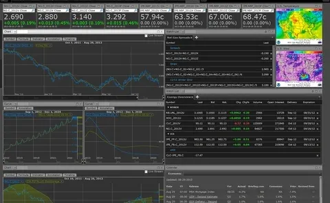

## Table of Contents

## What is a Logical Information Machine?

A Logical Information Machine, or LIM, is a computer system designed to process and analyze information using logical rules. It works by taking in data, applying logical operations to it, and then producing results based on those operations. Think of it like a smart calculator that can handle more complex tasks than just simple math.

LIMs are used in many fields, like science, business, and education, to help solve problems and make decisions. For example, a scientist might use a LIM to analyze data from an experiment, while a business might use one to figure out the best way to manage their resources. By using logical rules, LIMs can help people make sense of large amounts of information and find patterns or solutions that might be hard to see otherwise.

## How do Logical Information Machines differ from traditional computers?

Logical Information Machines (LIMs) and traditional computers both process information, but they do it in different ways. Traditional computers are like general helpers that can do many different tasks, from running games to sending emails. They use a set of instructions called programs to do these tasks. LIMs, on the other hand, are more specialized. They are designed to work with information using specific logical rules, kind of like a very smart calculator that focuses on solving problems using logic.

The main difference is in how they handle information. Traditional computers follow a step-by-step process based on the programs they are running. They can switch between tasks easily and do things like saving files or playing music. LIMs, however, are more focused on analyzing data and making decisions based on logical rules. They are better at finding patterns in large sets of data or solving complex problems that require a lot of logical thinking. So, while traditional computers are great for everyday tasks, LIMs are more specialized tools for specific types of logical work.

## What are the basic components of a Logical Information Machine?

A Logical Information Machine, or LIM, has a few main parts that help it work. The first part is the input system, which takes in information. This could be data from a computer file, numbers from a sensor, or anything else that the LIM needs to process. The second part is the processing unit, which uses logical rules to analyze the information. This is where the LIM does its thinking, trying to find patterns or solve problems based on the rules it knows.

The third part of a LIM is the memory, which stores both the information it's working on and the logical rules it uses. The memory helps the LIM remember what it's doing and keep track of its progress. The last part is the output system, which gives the results of the LIM's work. This could be a report, a decision, or just a simple answer to a question. Together, these parts let the LIM take in information, think about it logically, and then share what it has figured out.

## Can you explain the concept of logic gates in the context of Logical Information Machines?

Logic gates are like tiny decision makers inside a Logical Information Machine. They take in information, which is usually in the form of electrical signals that can be either on or off, and then they make a decision based on simple rules. These rules are like the basic building blocks of logic, such as "if both signals are on, then the output is on," or "if either signal is on, then the output is on." By combining these simple rules, logic gates can help the machine figure out more complex problems.

In a Logical Information Machine, logic gates work together to process information. Imagine each gate as a little worker that does a small part of the job. When you put many of these workers together, they can handle bigger tasks. For example, a group of logic gates might work together to compare numbers or find patterns in data. By using these gates, the machine can make decisions and solve problems using logic, which is what makes it so useful for tasks that need careful thinking.

## What programming languages are commonly used to operate Logical Information Machines?

Logical Information Machines often use programming languages that are good at handling logic and data. Two common languages for this are Prolog and Lisp. Prolog is great for working with rules and facts, which is perfect for a machine that needs to solve problems using logic. It lets you write programs that look a lot like logical statements, making it easier to tell the machine what to do. Lisp, on the other hand, is known for its ability to handle symbolic data, which is useful when you need to process and analyze information in a more flexible way.

Besides Prolog and Lisp, languages like Python and Java are also used, but usually with special libraries or tools that help them work with logic. Python, for example, can be used with libraries like PySWIP, which lets you use Prolog-like logic within Python programs. Java can be used with tools like Jess, which is a rule engine that helps with logical processing. These languages and tools make it easier to program Logical Information Machines, allowing them to handle complex tasks and solve problems in a logical way.

## How do Logical Information Machines process and store data?

Logical Information Machines take in data through their input system. This data can come from many places, like computer files or sensors. Once the data is in, the machine starts working on it. The processing unit uses logical rules to think about the data. It's like a smart calculator that looks for patterns or solves problems. The machine might compare numbers, check if certain conditions are true, or follow a set of logical steps to figure things out.

After the Logical Information Machine processes the data, it needs a place to keep it. That's where the memory comes in. The memory stores both the data the machine is working on and the logical rules it uses. This helps the machine remember what it's doing and keep track of its progress. When the machine is done thinking, it uses its output system to share the results. This could be a report, a decision, or just a simple answer to a question. By processing and storing data this way, Logical Information Machines can help solve complex problems using logic.

## What are some common applications of Logical Information Machines?

Logical Information Machines are used in many areas where people need to solve problems or make decisions based on data. In science, these machines help researchers analyze data from experiments. For example, a scientist might use a Logical Information Machine to find patterns in data about the weather or to study how different chemicals react with each other. In business, these machines can help companies figure out the best way to manage their resources or predict how much of a product they will sell. They look at sales data, customer information, and other numbers to make smart decisions.

In education, Logical Information Machines can help teachers and students learn about logic and problem-solving. Students might use these machines to solve math problems or to learn how to program using logical rules. In healthcare, these machines can help doctors and nurses make decisions about patient care. They can look at a patient's medical history and test results to suggest the best treatment. By using logical rules to process and analyze data, Logical Information Machines help people in many different fields make sense of complex information and find solutions to their problems.

## How does the architecture of a Logical Information Machine enhance its efficiency?

The architecture of a Logical Information Machine is designed to make it good at processing information using logic. It has an input system that takes in data, a processing unit that uses logical rules to think about the data, memory to store both the data and the rules, and an output system to share the results. This setup helps the machine work quickly and efficiently because each part has a specific job. The processing unit can focus on applying logical rules without worrying about other tasks, which makes it faster at solving problems.

The memory part of the architecture is also important for efficiency. It keeps the data and rules ready for the processing unit to use, so the machine doesn't have to search for information every time it needs it. This means the machine can work on big sets of data without slowing down. By having a clear and focused design, the Logical Information Machine can handle complex tasks and solve problems quickly and effectively.

## What are the limitations of Logical Information Machines compared to other computing systems?

Logical Information Machines are great at solving problems using logic, but they have some limits compared to other computers. One big limit is that they are not as good at doing many different tasks at the same time. Traditional computers can run games, send emails, and do other things all at once, but Logical Information Machines focus on one logical task at a time. This means they might not be the best choice for everyday use where you need to do lots of different things.

Another limit is that Logical Information Machines need clear rules to work well. If the rules are not clear or if the problem is too complicated, they can get stuck or give wrong answers. Other computers, like those that use [artificial intelligence](/wiki/ai-artificial-intelligence), can sometimes guess or learn from examples, but Logical Information Machines need exact rules. This makes them less flexible when dealing with new or unexpected problems.

## Can you discuss any recent advancements in the development of Logical Information Machines?

Recently, there have been some cool new ideas in making Logical Information Machines better. One big change is using them with other types of computers, like those that use artificial intelligence. This mix helps Logical Information Machines handle problems that are not so clear-cut. For example, they can now learn from examples and make guesses when the rules are not perfect, making them more flexible and useful for more types of work.

Another new thing is that Logical Information Machines are getting better at handling big sets of data. They can now process and think about more information at the same time, which makes them faster and more helpful for tasks like looking at data from science experiments or figuring out business plans. These advancements mean that Logical Information Machines can now solve even bigger and more complex problems than before.

## How do Logical Information Machines contribute to artificial intelligence and machine learning?

Logical Information Machines help artificial intelligence and [machine learning](/wiki/machine-learning) by giving them a way to think about problems using clear rules. These machines are good at solving problems step-by-step, which is useful for AI systems that need to make decisions based on logic. For example, an AI might use a Logical Information Machine to figure out the best move in a game or to decide how to sort information. By using logical rules, the AI can make smart choices and learn from the results.

In machine learning, Logical Information Machines can help by making the learning process more clear and organized. They can take in data, apply logical rules to it, and then help the machine learning system understand patterns or make predictions. This makes the learning process more reliable because the machine follows a set of rules instead of just guessing. By working together, Logical Information Machines and machine learning can solve complex problems and make better decisions.

## What future developments can we expect in the field of Logical Information Machines?

In the future, Logical Information Machines are likely to become even better at working with other types of computers, like those that use artificial intelligence. This will make them more flexible and able to handle problems that are not so clear-cut. They might be able to learn from examples and make guesses when the rules are not perfect, which will make them useful for more types of work. Imagine a Logical Information Machine that can help a doctor make a diagnosis by looking at a patient's symptoms and medical history, even if the information is not complete.

Another big change we might see is that Logical Information Machines will get even better at handling big sets of data. They will be able to process and think about more information at the same time, making them faster and more helpful for tasks like analyzing data from science experiments or figuring out business plans. This means they could help solve even bigger and more complex problems than they can now. For example, they might be used to predict weather patterns or to help manage traffic in a city by looking at lots of data all at once.

## References & Further Reading

[1]: ["Advances in Financial Machine Learning"](https://www.amazon.com/Advances-Financial-Machine-Learning-Marcos/dp/1119482089) by Marcos Lopez de Prado

[2]: ["Machine Learning for Algorithmic Trading"](https://github.com/stefan-jansen/machine-learning-for-trading) by Stefan Jansen

[3]: ["Quantitative Trading: How to Build Your Own Algorithmic Trading Business"](https://www.amazon.com/Quantitative-Trading-Build-Algorithmic-Business/dp/1119800064) by Ernest P. Chan

[4]: Bergstra, J., Bardenet, R., Bengio, Y., & Kégl, B. (2011). ["Algorithms for Hyper-Parameter Optimization."](https://dl.acm.org/doi/10.5555/2986459.2986743) Advances in Neural Information Processing Systems 24.

[5]: ["Evidence-Based Technical Analysis: Applying the Scientific Method and Statistical Inference to Trading Signals"](https://www.amazon.com/Evidence-Based-Technical-Analysis-Scientific-Statistical/dp/0470008741) by David Aronson