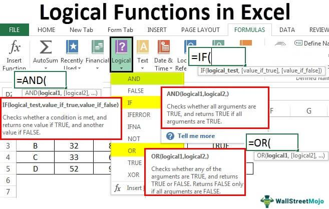

Algorithmic trading, commonly known as algo trading, employs sophisticated computer programs to execute trades based on a predefined set of instructions. This approach has significantly transformed financial markets, enabling trades to be carried out at speeds and frequencies that are infeasible for human traders. By harnessing algorithms, trading decisions can be made in fractions of a second, allowing for the exploitation of market inefficiencies and reduction in manual errors.

Logical Information Machines (LIM) are integral to the framework of algorithmic trading, providing efficient data management and comprehensive analytics. These platforms deliver structured data solutions, which are vital for analyzing large volumes of both historical and real-time data. The ability of LIM to mimic human logic and establish intricate connections between diverse datasets plays a critical role in the development of trading strategies that leverage detailed market insights.



In this article, we examine the integration of logical information machines within algorithmic trading systems and their substantial impact on market dynamics. As financial markets continue to evolve, the sophistication and reactivity of trading strategies supported by LIM are instrumental in shaping the future of trading, where data-driven decisions become standard practice.

## Table of Contents

## What Are Logical Information Machines?

Logical Information Machines (LIM) are sophisticated technological platforms designed for the efficient storage, analysis, and retrieval of vast amounts of data. These systems have gained prominence in [algorithmic trading](/wiki/algorithmic-trading), where they are utilized to manage extensive volumes of historical and real-time data. The core functionality of LIMs lies in their ability to process and synthesize information rapidly, providing a robust framework for identifying trading opportunities in financial markets.

One of the defining features of LIMs is their usage of technology that emulates human logical reasoning. This approach allows LIMs to establish intricate connections between diverse datasets, thereby generating actionable insights that are not immediately apparent through conventional data analysis methods. By leveraging such technology, LIMs enable traders to uncover patterns and correlations within the market data that can inform trading strategies.

Moreover, the architecture of LIMs is designed to handle the complexity and dynamism of contemporary financial markets. They facilitate a seamless integration of various types of data, ranging from structured financial reports to unstructured social media feeds, and process them efficiently to provide a coherent analytical output. This capability is critical in environments where milliseconds can determine the success or failure of a trade.

In essence, Logical Information Machines serve as an essential tool in algorithmic trading, offering traders an edge through advanced data analytics and logical processing capabilities. Their ability to convert raw data into meaningful insights significantly enhances the decision-making process, fostering the development of more sophisticated and effective trading algorithms.

## Importance of LIM in Algorithmic Trading

Logical Information Machines (LIM) are vital in algorithmic trading due to their ability to process vast quantities of data rapidly. This high-speed data processing capability is crucial for traders who need to execute trades based on minute fluctuations in the market. The speed at which LIM can analyze data ensures that trading strategies can react to market changes almost instantaneously, minimizing latency and maximizing trade efficiency.

The complex analytical processes that LIM facilitate allow traders to develop sophisticated trading strategies, enhancing decision-making. By integrating large and diverse data sets, LIM can reveal patterns that may not be immediately apparent through conventional analysis. This advanced analytics capability enables traders to craft strategies that are more precise and tailored, based on comprehensive data insights rather than speculative assumptions.

Additionally, LIM supports the [backtesting](/wiki/backtesting) of trading strategies, a critical component for refining algorithms to maximize profitability. Backtesting involves running these strategies against historical market data to evaluate their effectiveness. LIM excels in this area by efficiently managing and processing historical data for thorough backtesting. This process supports traders in identifying weaknesses and strengths within their strategies, allowing for adjustments and optimizations before actual market implementation. The more reliable and efficient the backtesting process, the better traders can anticipate market conditions and improve their strategies to enhance their decision-making and outcomes.

## Benefits of Using LIM in Algo Trading

Logical Information Machines (LIM) in algorithmic trading provide significant benefits across various dimensions due to their computational and data handling capabilities. These advantages can be categorized into enhanced efficiency, improved accuracy, and scalability.

Enhanced Efficiency: LIM ensures that data integration and retrieval processes are both prompt and reliable. This efficiency is crucial for algorithmic trading, where time-sensitive decisions and rapid trade executions are paramount. With the ability to process and analyze vast datasets almost instantaneously, LIM allows for the swift implementation of trading strategies, offering a competitive edge to traders. The automation of these processes alleviates the psychological pressures and cognitive loads often faced by human traders, ensuring consistent operational tempo.

Accuracy: One of the critical advantages of using LIM is the reduction of manual input errors. In financial markets, even minor inaccuracies can lead to significant financial discrepancies. By automating data handling, LIM minimizes the risk of human error. Moreover, LIM eliminates emotional trading behaviors—decisions influenced by fear, greed, or other psychological factors. This emotional neutrality leads to consistent strategy adherence and an objective approach to trading based solely on data-driven insights.

Scalability: LIM excels in handling growing data volumes from multiple markets, enabling traders to engage in comprehensive analysis across diverse asset classes. As financial markets generate an ever-increasing amount of data from various sources, LIM's scalable architecture can integrate and process this information effectively. Such scalability is vital for traders looking to expand their strategies across different geographical locations and market sectors. With LIM, analysts and traders can seamlessly adapt to changing market conditions, capturing a holistic view of global financial environments.

These benefits underline the transformative role of Logical Information Machines in advancing algorithmic trading. By leveraging their efficiency, accuracy, and scalability, traders can optimize performance and maintain resilience in dynamic market landscapes.

## Challenges and Limitations

Despite its advantages, the integration of Logical Information Machines (LIM) in algorithmic trading comes with its own set of challenges and limitations. One of the primary concerns is the initial setup cost, which can be substantial. Implementing a LIM system requires significant investment in technology infrastructure, including powerful servers capable of handling large datasets, specialized software for data analytics, and robust security measures to protect sensitive financial information. Moreover, the system's continuous operation in a rapidly changing market necessitates regular updates and maintenance, further adding to the financial burden.

Another challenge is the inherent limitation of algorithms based on historical data. While algorithms can analyze vast amounts of past market data to identify patterns and predict future trends, they cannot foresee unprecedented events or shifts in market dynamics that diverge from historical norms. This reliance on past data may lead to inaccurate predictions during conditions of high market [volatility](/wiki/volatility-trading-strategies) or when new economic variables come into play. For instance, during financial crises or geopolitical events, models based solely on historical data might fail to adapt quickly enough to provide reliable trading signals.

In addition, algorithmic systems rely heavily on mathematical models, which are simplifications of complex market behaviors. These models may not always capture the full range of factors affecting market prices, leading to suboptimal trading decisions. The challenge is particularly pronounced in dealing with non-linear relationships and chaotic market conditions, where small changes in input variables can result in significant variations in outcomes.

Moreover, there is a need for skilled personnel to manage and interpret the data processed by LIMs. This includes data scientists, algorithm developers, and traders who understand both the technological and financial aspects of the system. Finding and retaining such talent poses its own challenges, contributing to operational complexities in deploying LIM systems effectively in algorithmic trading environments.

Overall, while the benefits of integrating Logical Information Machines into algorithmic trading are evident, addressing these challenges is crucial for optimizing their effectiveness and ensuring sustainable operations in the financial markets.

## Future of Logical Information Machines in Market Trading

As markets continue to evolve, the use of Logical Information Machines (LIM) in trading is expected to become more pervasive. The integration of LIM with [artificial intelligence](/wiki/ai-artificial-intelligence) (AI) and [machine learning](/wiki/machine-learning) (ML) technologies presents a significant opportunity to enhance the predictive capabilities of algorithmic trading systems. These technologies can surpass traditional statistical methods by leveraging large datasets to uncover complex patterns and correlations that are not immediately obvious.

For instance, machine learning models can be trained using historical market data to predict future price movements. By incorporating LIM's data processing capabilities, these models can access and analyze extensive datasets in real-time, adjusting trading strategies dynamically. This synergy can significantly improve the accuracy of predictions, enabling traders to respond swiftly to market changes.

Moreover, expected advancements in LIM technology could democratize access to high-performance computational resources. Currently, high-frequency trading systems often require substantial infrastructure investments, limiting their use to large financial institutions. However, with improvements in LIM, smaller firms and individual traders might access similar resources without prohibitive costs. This democratization could lead to a more inclusive market environment, where a broader spectrum of participants can engage in sophisticated trading.

This evolution can be modeled with Python to simulate trading strategies based on predicted market conditions. For example:

```python
import pandas as pd
from sklearn.ensemble import RandomForestRegressor

# Sample data loading
data = pd.read_csv('market_data.csv')

# Feature selection and target variable setting
features = data[['indicator1', 'indicator2', 'indicator3']]
target = data['price_next_hour']

# Train-test split
train_features, test_features, train_target, test_target = train_test_split(features, target, test_size=0.2, random_state=42)

# Model initialization and training
model = RandomForestRegressor(n_estimators=100, random_state=42)
model.fit(train_features, train_target)

# Prediction
predictions = model.predict(test_features)

# Evaluation of model performance
print(f'Prediction Accuracy: {model.score(test_features, test_target) * 100:.2f}%')
```

This code snippet demonstrates how machine learning can be integrated with high-frequency data processing capabilities provided by LIM, thus empowering traders with tools to make informed decisions. As technology advances, such integrations are likely to become standard practice, reshaping the landscape of market trading.

## Conclusion

Logical Information Machines (LIM) serve as a cornerstone in the framework of contemporary algorithmic trading, offering capabilities that significantly enhance data handling and analysis. By efficiently processing expansive datasets, LIMs enable the extraction of actionable insights that drive effective trading strategies. This proficiency in managing information flow is reshaping how financial markets operate, bridging human logic with machine efficiency to improve the accuracy and speed of trade executions.

As technological advancements continue to unfold, the integration of LIM with emerging technologies like artificial intelligence and machine learning is anticipated to further enhance their effectiveness in trading applications. These integrations are likely to augment predictive analytics, offering traders more robust tools to navigate complex market environments. Consequently, as algorithmic models become more sophisticated, LIMs are expected to facilitate a shift towards more data-centric trading paradigms. This shift will likely democratize access to advanced trading solutions, empowering a broader spectrum of market participants with enhanced decision-making capabilities supported by comprehensive data insights. Thus, LIMs are poised to play an increasingly critical role in steering the future of algorithmic trading towards deeper reliance on data-driven decision-making processes.

## References & Further Reading

[1]: ["Advances in Financial Machine Learning"](https://www.amazon.com/Advances-Financial-Machine-Learning-Marcos/dp/1119482089) by Marcos Lopez de Prado

[2]: ["Machine Learning for Algorithmic Trading"](https://github.com/stefan-jansen/machine-learning-for-trading) by Stefan Jansen

[3]: ["Quantitative Trading: How to Build Your Own Algorithmic Trading Business"](https://www.amazon.com/Quantitative-Trading-Build-Algorithmic-Business/dp/1119800064) by Ernest P. Chan

[4]: Bergstra, J., Bardenet, R., Bengio, Y., & Kégl, B. (2011). ["Algorithms for Hyper-Parameter Optimization."](https://dl.acm.org/doi/10.5555/2986459.2986743) Advances in Neural Information Processing Systems 24.

[5]: ["Evidence-Based Technical Analysis: Applying the Scientific Method and Statistical Inference to Trading Signals"](https://www.amazon.com/Evidence-Based-Technical-Analysis-Scientific-Statistical/dp/0470008741) by David Aronson