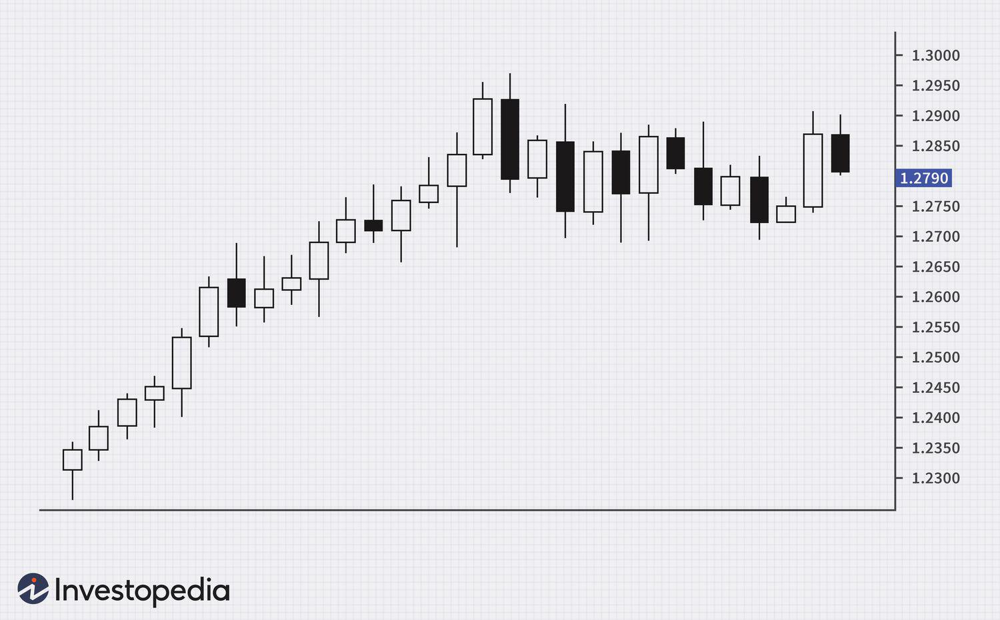

In the evolving landscape of financial markets, the integration of technology and methodical strategies is paramount. As industries continue to innovate, the alignment of logical methods across seemingly disparate fields has shown potential in enhancing system efficiencies. This article examines the principles of stop placement within transportation planning and its relevance to algorithmic trading, suggesting that solutions in one domain may inform strategies in another.

Logical stop placement in transportation involves determining optimal stopping points to minimize transit delays and maximize route efficiency. These principles resonate with the world of algorithmic trading, where strategic exit points are formulated to manage risk and preserve capital. Through this exploration, we aim to uncover how understanding the synergy between these practices can foster more streamlined operations.



In our review, various strategies will be outlined to ensure effective stop placement, each designed to optimize performance, whether it be reducing congestion in public transport networks or safeguarding investments in financial markets. This investigation offers insights into both conceptual and practical methodologies, highlighting shared analytical tools like data modeling and predictive algorithms that support decision-making.

Moreover, the cross-industry examination not only emphasizes immediate applications but also sheds light on long-term benefits, such as increased reliability and financial viability. By leveraging advanced technologies and logical frameworks, sectors can significantly enhance their operational efficacy, paving the way for sustainable growth and stability.

Through this article, we embark on a journey exploring the logical methods of stop placement and their beneficial impact across industries, illustrating the importance of strategic planning in the modern landscape.

## Table of Contents

## The Concept of Stop Placement

Stop placement is an essential strategy in optimizing both transportation networks and trading systems, as it functions as predetermined decision points intended to manage risk and improve operational efficiency. 

In transportation planning, stop placement is crucial in minimizing travel delays and ensuring route efficiency. Proper placement of stops can alleviate congestion and enhance the reliability of transport services. By analyzing traffic patterns, demand forecasts, and geographical data, transportation planners are able to devise strategies that lead to optimal stop locations. These strategies often involve the utilization of route optimization algorithms and simulation tools. For instance, algorithms like the Clarke-Wright Savings Algorithm can be employed to determine the most efficient route by addressing factors such as passenger pickup and drop-off points to reduce total travel time and operating costs.

Conversely, stop placement in trading refers to the pre-set levels at which trades are automatically exited to limit potential losses or secure profits. This is commonly known as setting stop-loss orders or take-profit levels in the financial markets. The rationale behind these stops is deeply grounded in risk management, providing traders with a safety net to prevent excessive financial loss in volatile markets. For example, a stop-loss order could be set at a certain percentage below the purchase price of a security, effectively capping the potential loss and allowing the trader to make more informed decisions. This process can be automated using [algorithmic trading](/wiki/algorithmic-trading) systems that operate based on predefined parameters and market data analysis. Strategies differ greatly, such as setting a fixed percentage stop-loss or using more dynamic approaches like the Average True Range (ATR) to adjust based on market [volatility](/wiki/volatility-trading-strategies).

Understanding the principles of stop placement has significant implications for both sectors. In transportation, effective stop placement ensures smooth and reliable service delivery, directly impacting passenger satisfaction and operational costs. In trading, the careful designation of stop levels is pivotal in safeguarding investments and maintaining favorable profit margins. As such, it is evident that stop placement, whether in public transit or financial markets, plays a critical role in enhancing efficiency and mitigating potential risks.

## Transportation Planning: Logical Methods

Logical stop placement in transportation planning requires a comprehensive understanding of several dynamic factors. Primarily, it involves analyzing traffic patterns, demand forecasts, and geographical data to determine the most effective locations for stops. Traffic patterns offer insights into congestion points and peak travel times, which are crucial for minimizing delays and enhancing route efficiency. By studying these patterns, planners can strategically place stops to reduce travel time and maximize the use of transport resources.

Demand forecasts play a vital role in understanding passenger flow and ensuring that stops are placed where they will be most utilized. By predicting passenger volumes at different times and locations, planners can prioritize stops that cater to high-demand areas, thereby optimizing service levels and meeting user needs effectively.

Geographical data adds another layer of information, helping to select stop locations that are accessible and convenient for passengers. This involves assessing the physical layout of an area, including road networks, land use, and topography, to ensure that stops are within reasonable walking distances and can be easily integrated into the existing transport infrastructure.

To manage these complex data sets, transportation systems increasingly rely on sophisticated computational tools. Route optimization algorithms are employed to analyze multiple scenarios and identify the best stop placement strategies under varying conditions. These algorithms take into account factors such as travel time, distance, and cost, enabling planners to devise routes that enhance passenger flow and reduce operational expenses.

Simulation tools further augment this process by allowing planners to model and test different stop placement strategies before implementation. These tools simulate real-world conditions, assessing the potential impacts on travel times, congestion, and overall service reliability. By providing a virtual environment for experimentation, simulation tools facilitate informed decision-making and help avoid costly mistakes.

For example, a Python-based simulation might involve generating a series of potential stop locations and evaluating their performance using traffic and demand data. This could be implemented using a combination of libraries such as NumPy for data manipulation and SimPy for process-based discrete-event simulation:

```python
import numpy as np
import simpy

# Example of a simple simulation of stop placement strategy
def passenger_flow(env, transit_system, stop_locations):
    for stop in stop_locations:
        yield env.timeout(np.random.exponential(1))
        transit_system.append(stop)

# Initialize environment and data
env = simpy.Environment()
transit_system = []
stop_locations = np.random.choice(range(100), size=10, replace=False)

# Run simulation
env.process(passenger_flow(env, transit_system, stop_locations))
env.run(until=100)

print(f"Optimal stop locations assessed: {transit_system}")
```

The ultimate objective of logical stop placement in transportation planning is to bolster the operational efficiency and reliability of networks. By employing data-driven methodologies and leveraging technology, transport systems can better meet the demands of modern urban environments and enhance the overall passenger experience.

## Algorithmic Trading and Stop Placement

In algorithmic trading, stop placement functions as a pivotal risk management tool, ensuring trades are exited automatically at predetermined levels. This approach utilizes technology and data to limit losses and protect profits, essential in the fast-paced and often volatile financial markets.

One fundamental strategy is the Hard Stop, which involves setting a fixed price point where a trade will be closed. This method is straightforward and offers simplicity and consistency. However, it may not account for market fluctuations, as the stop level remains static regardless of changing conditions.

Another technique is the Average True Range (ATR) percentage method. The ATR, a technical analysis indicator, measures market volatility by decomposing the entire range of an asset's price for a given period. By setting stops based on a percentage of the ATR, traders can dynamically adjust their risk tolerance according to market volatility. This method is especially useful in adapting to unpredictable market behavior:

```python
import talib
import numpy as np

# Example Python code to calculate ATR and set a stop-loss level.
def calculate_atr_stop(prices, stop_percentage):
    high, low, close = prices['high'], prices['low'], prices['close']
    atr = talib.ATR(high, low, close, timeperiod=14)  # 14-day ATR
    stop_level = close - (atr[-1] * stop_percentage / 100)
    return stop_level

prices = {'high': np.array(...), 'low': np.array(...), 'close': np.array(...)}
stop_percentage = 5  # 5% of ATR
stop_level = calculate_atr_stop(prices, stop_percentage)
```

Indicator Stops utilize technical indicators, such as moving averages or Bollinger Bands, to determine stop levels. These dynamic tools can incorporate trend-following approaches that adjust based on market conditions. For example, a moving average crossover could serve as a signal for adjusting stop levels, aligning with broader market trends and [momentum](/wiki/momentum).

Choosing the appropriate stop placement strategy hinges on several factors, including the trader's risk appetite and prevailing market conditions. Conservative traders may prefer more rigid stop levels like the Hard Stop, while those tolerant of higher risk might opt for dynamic strategies such as ATR% or Indicator Stops.

Algorithmic trading extensively leverages data analysis and pattern recognition to set stop-loss points effectively. By analyzing historical price data and identifying market trends, algorithms can optimize stop placement to enhance trading performance. This integration of technology and data-driven insights is key to successful algorithmic trading strategies, allowing for more informed decision-making and improved risk management in financial markets.

## Strategy Comparison

Both transportation planning and algorithmic trading leverage data and technology in stop placement strategies, although their goals differ. Transportation systems prioritize efficiency and passenger satisfaction by strategically determining stop points along routes to minimize delays and optimize passenger flow. Algorithmic trading, meanwhile, focuses on mitigating financial losses by setting precise [exit](/wiki/exit-strategy) points, known as stop-loss orders, in financial markets to automatically limit losses or secure profits.

1. **Objectives in Stop Placement**:
   - In transportation, the primary objective is to ensure timely and efficient movement of passengers. This involves reducing wait times and maintaining reliable service schedules, which in turn improves overall passenger satisfaction. Efficient stop placement can result from analyzing factors such as traffic patterns, passenger demand, and geographical constraints.
   - Conversely, trading strategies aim to manage financial risk. Stop placement in trading is about deciding at what price point a trader should exit a position to prevent excessive loss or to lock in gains. This requires a thorough understanding of market trends, volatility, and trader risk tolerance.

2. **Dynamic Adjustments**:
   - Both industries utilize dynamic adjustments in their methods. In transportation, this could mean adjusting bus stop locations or service frequencies based on real-time passenger data and traffic conditions. For instance, machine learning algorithms can predict peak usage times and suggest optimal stop sequences.
   - In trading, dynamic adjustments involve modifying stop-loss levels based on market volatility and price movements. Techniques such as the Average True Range (ATR) are often employed, where stop levels are set based on the average volatility of an asset. The formula $\text{ATR} = \frac{1}{n}\sum_{i=1}^{n} (\max(\text{High}_i - \text{Low}_i, |\text{High}_i - \text{Close}_{i-1}|, |\text{Low}_i - \text{Close}_{i-1}|))$ is used to calculate this volatility measure, which then informs dynamic stop adjustment.

3. **Smart Technologies and Adaptive Strategies**:
   - The deployment of smart technologies further enables adaptive stop placement strategies in both fields. In transportation, technologies such as GPS tracking and real-time analytics allow systems to detect delays and optimize routes dynamically. Advanced simulation tools can model different scenarios to evaluate stop placement strategies' impacts before implementation.
   - In trading, smart technologies such as algorithmic models and artificial intelligence (AI) analyze market data to provide insights on potential price movements. These technologies can automate the adjustment of stop levels by interpreting complex datasets and identifying patterns beyond human capability.

Despite their different objectives, both industries illustrate the critical role of data-driven stop placement strategies. The shared reliance on technological developments and adaptable methodologies highlights the importance of precise, informed decision-making in navigating the complexities of modern transportation systems and financial markets.

## Conclusion

The convergence of logical methods for stop placement in both transportation and trading underscores the importance of strategic planning in efficiently managing systems and mitigating risks. Both sectors harness technological advancements and data analytics to optimize performance, highlighting the crucial role of data-driven decision-making.

In transportation planning, the application of sophisticated algorithms and data analysis plays a vital role in determining optimal stop points. These improvements lead to enhanced passenger flow and operational efficiency, demonstrating that data-centric strategies can improve service reliability and resource management. For instance, by analyzing traffic patterns and demand forecasts, transportation systems can adapt in real-time, ensuring smoother operations and increased customer satisfaction.

Similarly, in algorithmic trading, the integration of comprehensive data analysis and adaptive strategies enables traders to manage their portfolios effectively. The deployment of various stop-loss strategies, such as the Hard Stop or ATR %, empowers traders to navigate volatile markets while minimizing potential losses. The automation of these processes through algorithmic systems allows for swift and precise execution, crucial in the fast-paced trading environment.

As markets and infrastructures evolve, the continuous refinement of stop placement strategies remains essential. Both industries benefit from advances in [machine learning](/wiki/machine-learning) and predictive analytics, enabling more sophisticated modeling and forecasting capabilities. This ongoing evolution ensures that systems remain robust and adaptive to changing conditions, aligning with broader goals of sustainability and resilience.

In conclusion, the strategic application of logical methods via technological and analytical tools in stop placement is vital for achieving higher efficiency and fostering sustainable growth. By unifying approaches across industries, stakeholders can create more resilient and integrated systems, ultimately promoting stability and operational excellence.

## References & Further Reading

[1]: Bergstra, J., Bardenet, R., Bengio, Y., & Kégl, B. (2011). ["Algorithms for Hyper-Parameter Optimization."](https://papers.nips.cc/paper/4443-algorithms-for-hyper-parameter-optimization) Advances in Neural Information Processing Systems 24.

[2]: ["Advances in Financial Machine Learning"](https://www.amazon.com/Advances-Financial-Machine-Learning-Marcos/dp/1119482089) by Marcos Lopez de Prado

[3]: ["Evidence-Based Technical Analysis: Applying the Scientific Method and Statistical Inference to Trading Signals"](https://books.google.com/books/about/Evidence_Based_Technical_Analysis.html?id=jbD47VkOHAEC) by David Aronson

[4]: ["Machine Learning for Algorithmic Trading"](https://github.com/stefan-jansen/machine-learning-for-trading) by Stefan Jansen

[5]: ["Quantitative Trading: How to Build Your Own Algorithmic Trading Business"](https://www.amazon.com/Quantitative-Trading-Build-Algorithmic-Business/dp/1119800064) by Ernest P. Chan