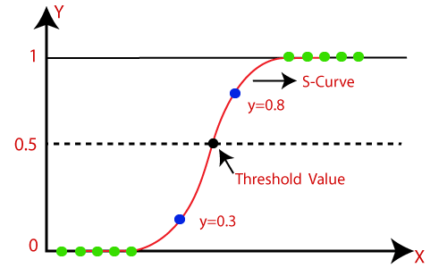

## Table of Contents

## What is logistic regression and how does it differ from linear regression?

Logistic regression is a type of statistical model used to predict the probability of a binary outcome, like whether an email is spam or not. It works by taking in several input variables and using them to calculate a probability that falls between 0 and 1. The key part of logistic regression is the logistic function, or sigmoid function, which transforms the linear combination of inputs into a probability. The formula for the logistic function is $$P(Y=1) = \frac{1}{1 + e^{-z}}$$, where $$z$$ is the linear combination of the input features.

Linear regression, on the other hand, is used to predict a continuous outcome, like the price of a house based on its size and location. It works by finding the best-fitting straight line through the data points, which means it can predict values that can be any number, not just between 0 and 1. The formula for linear regression is $$y = \beta_0 + \beta_1x_1 + \beta_2x_2 + ... + \beta_nx_n$$, where $$y$$ is the predicted value, $$\beta_0$$ is the intercept, and $$\beta_1, \beta_2, ..., \beta_n$$ are the coefficients of the input features $$x_1, x_2, ..., x_n$$.

The main difference between logistic and linear regression is the type of output they produce. Logistic regression outputs a probability, which is useful for classification tasks, while linear regression outputs a continuous value, which is useful for prediction tasks. Additionally, logistic regression uses a non-linear transformation (the sigmoid function) to ensure the output is always between 0 and 1, whereas linear regression directly uses the linear combination of inputs without any transformation.

## What types of problems can logistic regression be used to solve?

Logistic regression is great for problems where you need to make a yes or no decision. For example, it can help doctors predict if a patient has a disease based on their symptoms and test results. It's also used in marketing to guess if someone will buy a product or not, based on their past behavior and demographic information. In finance, logistic regression can predict if a loan applicant will default on a loan or not.

Another common use of logistic regression is in spam detection for emails. By looking at the words and patterns in an email, logistic regression can calculate the probability that the email is spam. If this probability is high enough, the email can be marked as spam. This method is also used in fraud detection, where it helps to identify if a transaction is likely to be fraudulent based on various transaction details.

Logistic regression works by using the logistic function, or sigmoid function, to transform the input features into a probability. The formula for this is $$P(Y=1) = \frac{1}{1 + e^{-z}}$$, where $$z$$ is a linear combination of the input features. This transformation ensures that the output is always between 0 and 1, making it perfect for binary classification tasks.

## How does the logistic function (sigmoid function) work in logistic regression?

The logistic function, also known as the sigmoid function, is what makes logistic regression work. It takes a number and turns it into a probability that's between 0 and 1. In logistic regression, we start with a bunch of input features, like a patient's age and blood pressure. We combine these features in a special way to get a number called $$z$$. This $$z$$ is a linear combination of the input features, just like in linear regression. But instead of using $$z$$ directly, we put it into the sigmoid function to get our final probability. The formula for the sigmoid function is $$P(Y=1) = \frac{1}{1 + e^{-z}}$$. This formula makes sure that no matter what $$z$$ is, the output will always be between 0 and 1.

When we use the sigmoid function, it helps us interpret the output as a probability. If $$z$$ is a big positive number, the sigmoid function will give us a number close to 1, meaning the event is very likely to happen. If $$z$$ is a big negative number, the sigmoid function will give us a number close to 0, meaning the event is very unlikely to happen. If $$z$$ is around 0, the sigmoid function will give us a number around 0.5, meaning the event is equally likely to happen or not. This way, logistic regression can help us make decisions based on how likely something is to happen.

## What is the logistic regression equation and how is it used to make predictions?

Logistic regression uses a special equation to turn a bunch of input numbers into a probability. The main part of this equation is called the logistic function, or sigmoid function. It takes a number called $$z$$ and turns it into a probability between 0 and 1. The formula for the logistic function is $$P(Y=1) = \frac{1}{1 + e^{-z}}$$. The $$z$$ in this formula is a mix of all the input numbers, like a patient's age and blood pressure, combined in a special way. This combination is done using weights, which are numbers that show how important each input is. The formula for $$z$$ is $$z = \beta_0 + \beta_1x_1 + \beta_2x_2 + ... + \beta_nx_n$$, where $$\beta_0$$ is a starting number, and $$\beta_1, \beta_2, ..., \beta_n$$ are the weights for each input $$x_1, x_2, ..., x_n$$.

To make a prediction, you first calculate $$z$$ using the input numbers and their weights. Then, you put $$z$$ into the logistic function to get a probability. For example, if you're trying to predict if a patient has a disease, you might use their age, blood pressure, and other health data as inputs. You combine these inputs with their weights to get $$z$$, and then use the logistic function to turn $$z$$ into a probability. If this probability is high enough, like above 0.5, you might say the patient has the disease. If it's low, like below 0.5, you might say they don't have the disease. This way, logistic regression helps make decisions based on how likely something is to happen.

## How do you interpret the coefficients in a logistic regression model?

In logistic regression, the coefficients, also called weights, tell us how much each input feature affects the final prediction. Each coefficient is a number that shows how important that feature is. For example, if we're predicting if someone will buy a product, the coefficient for their income might be positive, meaning higher income makes it more likely they'll buy. The formula for the logistic regression model is $$z = \beta_0 + \beta_1x_1 + \beta_2x_2 + ... + \beta_nx_n$$, where $$\beta_0$$ is the starting number, and $$\beta_1, \beta_2, ..., \beta_n$$ are the coefficients for each input feature $$x_1, x_2, ..., x_n$$. The sign of the coefficient (positive or negative) shows if the feature makes the outcome more or less likely, and the size of the coefficient shows how strong the effect is.

To understand the impact of a coefficient better, we can look at the odds ratio. The odds ratio is calculated as $$e^{\beta_i}$$, where $$\beta_i$$ is the coefficient for a specific feature. If the odds ratio is greater than 1, it means the feature increases the odds of the outcome happening. If it's less than 1, it means the feature decreases the odds. For example, if the coefficient for age is 0.1, the odds ratio would be $$e^{0.1} \approx 1.105$$, meaning for every one-unit increase in age, the odds of the outcome increase by about 10.5%. This way, the coefficients in logistic regression help us see which features matter most and how they affect our predictions.

## What is the role of the cost function in logistic regression and how is it optimized?

The cost function in logistic regression helps us figure out how good our model is at making predictions. It measures the difference between what the model predicts and what actually happens. In logistic regression, we use a special kind of cost function called the log loss or binary cross-entropy. The formula for the cost function is $$J(\theta) = -\frac{1}{m} \sum_{i=1}^m [y_i \log(h_\theta(x_i)) + (1 - y_i) \log(1 - h_\theta(x_i))]$$ where $$m$$ is the number of training examples, $$y_i$$ is the actual outcome, and $$h_\theta(x_i)$$ is the predicted probability. The goal is to make this cost as small as possible, which means our predictions are getting closer to the real outcomes.

To make the cost function smaller, we use a method called optimization. One common way to do this is with gradient descent. This method works by taking small steps in the direction that reduces the cost. We calculate the gradient, which shows how the cost changes when we change the model's coefficients a little bit. Then, we update the coefficients to move in the direction that makes the cost go down. The formula for updating the coefficients using gradient descent is $$\theta_j := \theta_j - \alpha \frac{\partial}{\partial \theta_j} J(\theta)$$ where $$\alpha$$ is the learning rate, which controls how big the steps are. By repeating this process many times, the model learns to make better predictions, and the cost function gets smaller and smaller.

## What are common methods for evaluating the performance of a logistic regression model?

To evaluate how well a logistic regression model works, we often use something called the confusion matrix. This is a table that shows how many times the model guessed right and wrong. It has four parts: true positives (when the model said yes and it was right), true negatives (when the model said no and it was right), false positives (when the model said yes but it was wrong), and false negatives (when the model said no but it was wrong). From this matrix, we can calculate useful numbers like accuracy, which is the total number of correct guesses divided by all guesses, and precision, which is the number of true positives divided by the total number of times the model said yes. Another important number is recall, also called sensitivity, which is the number of true positives divided by the total number of actual yes cases. There's also the F1 score, which is a mix of precision and recall, calculated as $$F1 = 2 \times \frac{\text{precision} \times \text{recall}}{\text{precision} + \text{recall}}$$. These numbers help us see if our model is good at telling the difference between yes and no.

Another way to check the model's performance is by looking at the ROC curve, which stands for Receiver Operating Characteristic curve. This curve shows how well the model can tell the difference between positive and negative outcomes at different thresholds. We plot the true positive rate (which is the same as recall) against the false positive rate. The area under this curve, called AUC (Area Under the Curve), tells us how good the model is. If the AUC is close to 1, the model is very good at telling the difference. If it's close to 0.5, the model is no better than guessing randomly. We can also use cross-validation, where we split the data into different parts and train the model on some parts while testing it on others. This helps us see if the model works well on different sets of data and not just the one it was trained on.

## How can you handle multicollinearity in logistic regression?

Multicollinearity happens when two or more input features in your logistic regression model are closely related to each other. This can make it hard for the model to figure out which feature is really causing the outcome. For example, if you're trying to predict if someone will buy a product and you use both their income and the size of their house as inputs, these two features might be related because people with higher incomes often have bigger houses. This can make the model's coefficients hard to understand and less reliable.

To deal with multicollinearity, you can try a few things. One way is to remove some of the related features. For example, if income and house size are closely related, you might choose to use only one of them in your model. Another way is to use something called regularization. This is a method that adds a penalty to the model's coefficients to keep them from getting too big. There are two common types of regularization: L1 (Lasso) and L2 (Ridge). L1 regularization can make some coefficients zero, which is like removing those features from the model. L2 regularization makes all the coefficients smaller but doesn't remove any. You can add regularization to logistic regression by changing the cost function to include a penalty term, like this: $$J(\theta) = -\frac{1}{m} \sum_{i=1}^m [y_i \log(h_\theta(x_i)) + (1 - y_i) \log(1 - h_\theta(x_i))] + \lambda \sum_{j=1}^n \theta_j^2$$ for L2 regularization, where $$\lambda$$ is a number that controls how strong the penalty is.

## What are some techniques for dealing with imbalanced data in logistic regression?

When you have imbalanced data in logistic regression, it means that one outcome happens a lot more often than the other. For example, if you're trying to predict if a credit card transaction is fraudulent, most transactions are not fraudulent, so your data will have a lot more "not fraud" cases than "fraud" cases. This can make your model think that the best guess is always "not fraud," which isn't helpful. To fix this, you can use a technique called oversampling. This means you make more copies of the less common outcome (like "fraud") so that both outcomes are about the same in number. Another way is undersampling, where you remove some of the more common outcome (like "not fraud") to balance the data. Both methods help the model learn from both outcomes equally.

Another technique is to use something called class weights. This means you tell the model to pay more attention to the less common outcome. In logistic regression, you can do this by changing the cost function to give more weight to the less common outcome. The formula for the cost function with class weights is $$J(\theta) = -\frac{1}{m} \sum_{i=1}^m w_i [y_i \log(h_\theta(x_i)) + (1 - y_i) \log(1 - h_\theta(x_i))]$$ where $$w_i$$ is the weight for each example, and you make the weight bigger for the less common outcome. This way, the model tries harder to get the less common outcome right. You can also use a method called SMOTE (Synthetic Minority Over-sampling Technique), which creates new, similar examples of the less common outcome to balance the data. All these methods help make your logistic regression model better at predicting both outcomes, even when the data is imbalanced.

## How does regularization work in logistic regression and when should it be used?

Regularization in logistic regression is a way to stop the model from getting too complicated. When a model is too complicated, it might work really well on the data it was trained on but not so well on new data. This is called overfitting. Regularization helps by adding a penalty to the model's coefficients, which are the numbers that show how important each input feature is. This penalty makes the coefficients smaller, so the model doesn't rely too much on any one feature. There are two common types of regularization: L1 (Lasso) and L2 (Ridge). L1 regularization can make some coefficients zero, which is like removing those features from the model. L2 regularization makes all the coefficients smaller but doesn't remove any. The formula for the cost function with L2 regularization is $$J(\theta) = -\frac{1}{m} \sum_{i=1}^m [y_i \log(h_\theta(x_i)) + (1 - y_i) \log(1 - h_\theta(x_i))] + \lambda \sum_{j=1}^n \theta_j^2$$ where $$\lambda$$ is a number that controls how strong the penalty is.

You should use regularization in logistic regression when you think your model might be overfitting. This can happen if you have a lot of input features or if some of your features are closely related to each other, which is called multicollinearity. Regularization helps the model be simpler and work better on new data. To decide if you need regularization, you can try training your model with and without it and see which one works better on a separate set of data that the model hasn't seen before. This is called validation. If the model with regularization works better on the validation data, then you should use it. Regularization is a powerful tool that can make your logistic regression model more reliable and useful.

## What are the assumptions of logistic regression and how can you check if they are met?

Logistic regression has a few important assumptions that need to be met for the model to work well. The first assumption is that the relationship between the input features and the log odds of the outcome is linear. This means that if you take the log of the odds of the outcome happening, it should change in a straight line as the input features change. Another assumption is that the observations are independent of each other, meaning that one observation doesn't affect another. The third assumption is that there should be little to no multicollinearity among the input features, which means the features shouldn't be too closely related to each other. Finally, logistic regression assumes that the outcome variable is binary, meaning it can only be one of two values, like yes or no.

To check if these assumptions are met, you can use a few different methods. For the linearity assumption, you can create a plot of the log odds against each input feature and see if the relationship looks straight. If it doesn't, you might need to transform your input features or add interaction terms to make the relationship linear. To check for independence, you need to think about how your data was collected and make sure that one observation doesn't influence another. For multicollinearity, you can calculate something called the Variance Inflation Factor (VIF) for each input feature. If the VIF is high, it means there's a lot of multicollinearity, and you might need to remove some features or use regularization. The binary outcome assumption is easy to check; just make sure your outcome variable only has two possible values. By checking these assumptions, you can make sure your logistic regression model is reliable and works well.

## How can logistic regression be extended to handle multiclass classification problems?

Logistic regression can be extended to handle multiclass classification problems using two main methods: one-vs-rest (OvR) and multinomial logistic regression. In the one-vs-rest approach, you create a separate logistic regression model for each class. For example, if you're classifying types of fruits into apples, bananas, and oranges, you would train three models: one to predict if a fruit is an apple, one to predict if it's a banana, and one to predict if it's an orange. Each model treats its class as the positive outcome and all other classes as the negative outcome. To classify a new fruit, you run it through all three models and pick the class with the highest probability. The formula for the probability in each OvR model is $$P(Y=k) = \frac{1}{1 + e^{-(\beta_{k0} + \beta_{k1}x_1 + \beta_{k2}x_2 + ... + \beta_{kn}x_n)}}$$ where $$k$$ is the class being predicted.

Multinomial logistic regression, on the other hand, extends logistic regression to directly handle multiple classes. Instead of creating separate models, you have one model with multiple sets of coefficients, one set for each class. The model calculates the probability of each class using the softmax function, which ensures that the probabilities for all classes add up to 1. The formula for the probability of class $$k$$ in multinomial logistic regression is $$P(Y=k) = \frac{e^{(\beta_{k0} + \beta_{k1}x_1 + \beta_{k2}x_2 + ... + \beta_{kn}x_n)}}{\sum_{j=1}^K e^{(\beta_{j0} + \beta_{j1}x_1 + \beta_{j2}x_2 + ... + \beta_{jn}x_n)}}$$ where $$K$$ is the total number of classes. To classify a new example, you choose the class with the highest probability. Both methods can effectively handle multiclass problems, but multinomial logistic regression is often preferred because it directly models the relationships between all classes.