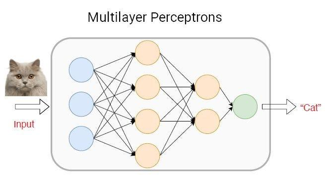

## Table of Contents

## What are logits in the context of machine learning?

Logits are the raw, unprocessed outputs of a neural network before they are turned into probabilities. Think of them as the scores that a model assigns to different classes or outcomes. In a classification task, for instance, each class gets a logit value, which represents how likely the model thinks that class is the correct one. These values can be any real number, positive or negative, and they are usually passed through a softmax function to convert them into probabilities that sum up to one.

To understand logits better, consider a simple example. Suppose you have a model that classifies images of animals into three categories: cats, dogs, and birds. After processing an image, the model might output logits like [2.3, -1.2, 0.5]. These numbers are the logits for cats, dogs, and birds, respectively. To get the final probabilities, you would apply the softmax function to these logits. The softmax function, $$ \text{softmax}(x_i) = \frac{e^{x_i}}{\sum_{j} e^{x_j}} $$, would transform the logits into probabilities that add up to one, making it easier to interpret the model's predictions.

## How do logits relate to probabilities in a neural network?

Logits are the raw numbers that a neural network outputs before they are turned into probabilities. Think of them as scores that the network gives to different choices. For example, if you're trying to guess what animal is in a picture, the network might give a high score (logit) to "cat" if it thinks the picture shows a cat. These scores can be any number, positive or negative.

To turn these logits into probabilities, we use a special math trick called the softmax function. The softmax function takes the logits and makes them into numbers between 0 and 1 that add up to 1. This way, we can say things like "there's a 70% chance this is a cat." The formula for the softmax function is $$ \text{softmax}(x_i) = \frac{e^{x_i}}{\sum_{j} e^{x_j}} $$. This formula takes each logit, makes it positive with the exponential function, and then divides it by the sum of all the exponentials of the logits. This turns the raw scores into nice, easy-to-understand probabilities.

## Can you explain the mathematical definition of a logit?

In simple terms, a logit is the raw output of a neural network before it is turned into a probability. Imagine you're trying to guess what's in a picture. The neural network gives a score to each possible answer, like "cat" or "dog." These scores are the logits. They can be any number, positive or negative, and they show how strongly the network thinks each answer is correct.

To turn these logits into probabilities that add up to 1, we use a function called softmax. The softmax function takes each logit and makes it positive using the exponential function, then divides it by the sum of all the exponentials of the logits. The formula for the softmax function is $$ \text{softmax}(x_i) = \frac{e^{x_i}}{\sum_{j} e^{x_j}} $$. This way, we can say things like "there's a 70% chance this is a cat" based on the logits the neural network gives us.

## Why are logits important in classification tasks?

Logits are important in classification tasks because they are the raw scores that a neural network gives to each possible class before they are turned into probabilities. Imagine you're trying to guess what's in a picture. The neural network gives a score to each possible answer, like "cat" or "dog." These scores, or logits, can be any number, positive or negative. They tell us how strongly the network thinks each answer is correct. This raw output is crucial because it captures the model's confidence in its predictions before any transformation.

To turn these logits into probabilities that add up to 1, we use a function called softmax. The softmax function takes each logit and makes it positive using the exponential function, then divides it by the sum of all the exponentials of the logits. The formula for the softmax function is $$ \text{softmax}(x_i) = \frac{e^{x_i}}{\sum_{j} e^{x_j}} $$. This way, we can say things like "there's a 70% chance this is a cat" based on the logits the neural network gives us. By understanding logits, we can better interpret and fine-tune the neural network's performance in classification tasks.

## How are logits used in logistic regression?

In logistic regression, logits are used to model the probability of a binary outcome, like yes or no. Imagine you're trying to predict if it will rain today. The logistic regression model takes in some data, like humidity and temperature, and gives you a number called the logit. This logit represents how likely the model thinks it will rain. If the logit is high, the model thinks rain is more likely, and if it's low, the model thinks rain is less likely.

To turn this logit into a probability that makes sense, we use the sigmoid function. The sigmoid function squashes the logit into a number between 0 and 1, which we can interpret as a probability. The formula for the sigmoid function is $$ \text{sigmoid}(x) = \frac{1}{1 + e^{-x}} $$. So, if the logit is 0, the sigmoid function will give you a probability of 0.5, meaning there's a 50% chance of rain. If the logit is very high, the probability will be close to 1, meaning rain is almost certain. This way, logits help us make predictions in logistic regression by turning raw scores into understandable probabilities.

## What is the difference between logits and softmax?

Logits are the raw numbers that a neural network gives out before they are turned into probabilities. Imagine you're trying to guess what's in a picture. The neural network gives a score to each possible answer, like "cat" or "dog." These scores are the logits. They can be any number, positive or negative, and they show how strongly the network thinks each answer is correct. Logits are important because they capture the model's confidence in its predictions before any transformation.

Softmax is a function that turns these logits into probabilities that add up to 1. It takes each logit, makes it positive using the exponential function, and then divides it by the sum of all the exponentials of the logits. The formula for the softmax function is $$ \text{softmax}(x_i) = \frac{e^{x_i}}{\sum_{j} e^{x_j}} $$. This way, we can say things like "there's a 70% chance this is a cat" based on the logits the neural network gives us. So, while logits are the raw scores, softmax helps us interpret these scores as probabilities.

## How do you convert logits to probabilities?

Logits are the raw numbers that a neural network outputs before they are turned into probabilities. Imagine you're trying to guess what's in a picture. The neural network gives a score to each possible answer, like "cat" or "dog." These scores, called logits, can be any number, positive or negative. They show how strongly the network thinks each answer is correct. To turn these logits into probabilities that add up to 1, we use a special function called softmax.

The softmax function takes each logit, makes it positive using the exponential function, and then divides it by the sum of all the exponentials of the logits. This way, we can say things like "there's a 70% chance this is a cat" based on the logits the neural network gives us. The formula for the softmax function is $$ \text{softmax}(x_i) = \frac{e^{x_i}}{\sum_{j} e^{x_j}} $$. This formula helps us turn the raw scores into nice, easy-to-understand probabilities.

## In what ways can logits impact the performance of a model?

Logits are the raw numbers that a neural network gives out before they are turned into probabilities. They are important because they show how confident the model is in its predictions. If the logits are very different from each other, it means the model is sure about its guess. But if the logits are close together, it means the model is not so sure. This can affect how well the model works. If the model is too sure about its guesses when it should not be, it might make more mistakes. On the other hand, if the model is not sure enough, it might not be good at picking the right answer.

To turn logits into probabilities, we use the softmax function. The softmax function takes each logit, makes it positive with the exponential function, and then divides it by the sum of all the exponentials of the logits. The formula for the softmax function is $$ \text{softmax}(x_i) = \frac{e^{x_i}}{\sum_{j} e^{x_j}} $$. This helps us understand the model's predictions better. If the softmax turns the logits into probabilities that are too spread out, it might mean the model is not good at telling the difference between the choices. If the probabilities are too focused on one choice, it might mean the model is too sure and could be wrong sometimes. By looking at the logits and how they turn into probabilities, we can see how well the model is doing and make it better.

## Can logits be negative, and if so, what does that imply?

Logits can indeed be negative. In a neural network, logits are the raw scores given to different choices before they are turned into probabilities. Imagine you're trying to guess what's in a picture. The neural network gives a score to each possible answer, like "cat" or "dog." These scores, or logits, can be any number, positive or negative. A negative logit just means the model thinks that choice is less likely than if the logit were positive or zero.

A negative logit doesn't mean the model is wrong; it just shows the model's confidence level. To turn these logits into probabilities, we use the softmax function. The softmax function takes each logit, makes it positive using the exponential function, and then divides it by the sum of all the exponentials of the logits. The formula for the softmax function is $$ \text{softmax}(x_i) = \frac{e^{x_i}}{\sum_{j} e^{x_j}} $$. This way, even negative logits can be turned into probabilities that make sense.

## How do different activation functions affect logits in neural networks?

Activation functions in neural networks change the way logits are created and used. Think of logits as the raw numbers a neural network gives before turning them into probabilities. Different activation functions can make these logits bigger or smaller, or even change them from positive to negative. For example, if you use a ReLU (Rectified Linear Unit) activation function, it will make any negative logits zero. This can be good because it makes the model simpler, but it can also make the model miss some important details if those negative logits were useful.

Another common activation function is the sigmoid function, which squashes logits into numbers between 0 and 1. The formula for the sigmoid function is $$ \text{sigmoid}(x) = \frac{1}{1 + e^{-x}} $$. This can be useful in the last layer of a neural network if you're doing something like binary classification, where you want to say "yes" or "no." But if you use sigmoid in the middle layers, it can make the logits smaller, which might make it harder for the network to learn. So, choosing the right activation function is important because it affects how the logits behave and how well the model works.

## What are some common misconceptions about logits?

One common misconception about logits is that they are the same as probabilities. Logits are the raw scores that a neural network gives out before they are turned into probabilities. They can be any number, positive or negative. Probabilities, on the other hand, are numbers between 0 and 1 that add up to 1. To turn logits into probabilities, we use a special function called softmax. The formula for the softmax function is $$ \text{softmax}(x_i) = \frac{e^{x_i}}{\sum_{j} e^{x_j}} $$. So, while logits help us figure out how confident the model is, they are not the final probabilities we use to make decisions.

Another misconception is that negative logits mean the model is wrong. Negative logits just mean the model thinks that choice is less likely than if the logit were positive or zero. They are still useful because they show the model's confidence level. For example, if you're trying to guess what's in a picture, a negative logit for "cat" just means the model thinks it's less likely to be a cat than if the logit were positive. The softmax function can turn even negative logits into probabilities that make sense, so they are an important part of how neural networks work.

## How can advanced techniques like temperature scaling modify the behavior of logits?

Temperature scaling is a way to change how logits work in a neural network. Imagine logits as scores that the network gives to different choices before turning them into probabilities. Temperature scaling lets us make these scores more or less spread out by using a number called the temperature. If the temperature is high, the scores become more even, making the model less sure about its guesses. If the temperature is low, the scores become more different, making the model more sure about its guesses. This can help make the model's predictions better by adjusting how confident it is.

To use temperature scaling, we change the softmax function a little bit. The new formula for the softmax with temperature scaling is $$ \text{softmax}(x_i / T) = \frac{e^{x_i / T}}{\sum_{j} e^{x_j / T}} $$, where \( T \) is the temperature. If \( T \) is bigger than 1, the model's predictions become softer and more spread out. If \( T \) is smaller than 1, the predictions become sharper and more focused. By choosing the right temperature, we can make the model more accurate and reliable.