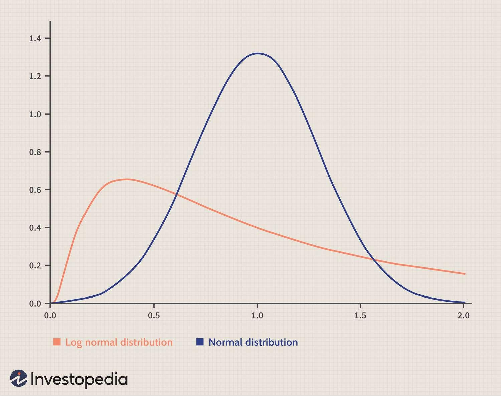

## Table of Contents

## What is a normal distribution?

A normal distribution, also known as a Gaussian distribution or bell curve, is a type of statistical distribution that appears as a symmetrical, bell-shaped curve when graphed. This curve is centered around the mean, which is the average of all the data points. In a normal distribution, the majority of the data points fall close to the mean, and the number of data points decreases as you move further away from the mean in either direction. This distribution is commonly used in statistics because many natural phenomena, like heights or test scores, tend to follow this pattern.

The normal distribution is important because it helps us make predictions and understand data. For example, if you know the average height of a group of people and the data follows a normal distribution, you can predict how many people are likely to be taller or shorter than average. The standard deviation, which measures the spread of the data, is also key in a normal distribution. A small standard deviation means the data points are closely clustered around the mean, while a large standard deviation means the data is more spread out. This makes the normal distribution a useful tool for many fields, including science, finance, and psychology.

## What is a lognormal distribution?

A lognormal distribution is a type of statistical distribution where the logarithm of the values follows a normal distribution. This means if you take the log of all the numbers in your data set, they will look like they follow a bell-shaped curve. Lognormal distributions are useful because they can model data that cannot be negative and often has a long tail on the right side, meaning there are some very high values.

You might see lognormal distributions in real life when looking at things like income, house prices, or the time it takes to complete a task. These things can't be negative, and often there are a few very high values that make the average much higher than what most people experience. So, if you're studying these kinds of data, a lognormal distribution can help you understand and predict them better.

## How does a normal distribution differ from a lognormal distribution?

A normal distribution and a lognormal distribution are two different ways to describe how numbers are spread out. In a normal distribution, the numbers make a bell-shaped curve when you draw them on a graph. The middle of the bell is where the average of the numbers is, and most of the numbers are close to this average. The numbers can be positive or negative and they spread out evenly on both sides of the average. This kind of distribution is good for things like test scores or people's heights, where the numbers are usually spread out in a balanced way.

On the other hand, a lognormal distribution is different because it's used when you have numbers that can't be negative and often have some very high values. If you take the log (or logarithm) of these numbers, they will look like they follow a normal distribution. So, a lognormal distribution is good for things like income or house prices, where you don't have negative values and there might be a few very high numbers. The shape of a lognormal distribution is not symmetrical like a normal distribution; it's skewed to the right, meaning it has a long tail on the right side where the high values are.

In simple terms, if you have data that can be negative and spreads out evenly around an average, you might use a normal distribution. But if your data can't be negative and has some very high values, a lognormal distribution might be a better fit. Both distributions help us understand and predict how numbers behave, but they are used for different kinds of data.

## What are the key characteristics of a normal distribution?

A normal distribution is a special way to describe how numbers are spread out. When you draw it on a graph, it looks like a bell shape. This bell shape is centered around the average of all the numbers, which we call the mean. Most of the numbers are close to this mean, and as you move away from the mean, there are fewer numbers. The numbers can be positive or negative, and they spread out evenly on both sides of the mean. This even spread is important because it means the distribution is symmetrical, meaning the left side of the bell looks the same as the right side.

Another key thing about a normal distribution is the standard deviation. This tells us how spread out the numbers are around the mean. If the standard deviation is small, it means the numbers are close together around the mean. If it's big, the numbers are more spread out. In a normal distribution, about 68% of the numbers fall within one standard deviation of the mean, about 95% fall within two standard deviations, and about 99.7% fall within three standard deviations. This pattern helps us predict where most of the numbers will be and understand the data better.

## What are the key characteristics of a lognormal distribution?

A lognormal distribution is a way to describe numbers that can't be negative and often have some very high values. It's different from a normal distribution because if you take the log (or logarithm) of the numbers in a lognormal distribution, they will look like they follow a normal distribution. This means the lognormal distribution is not symmetrical like a normal distribution; it's skewed to the right. This means the graph of a lognormal distribution has a long tail on the right side where the high values are. This shape is good for things like income, house prices, or the time it takes to complete a task, where you don't have negative values and there might be a few very high numbers.

The key thing about a lognormal distribution is that the average (or mean) is usually higher than what most people experience because of those high values on the right side. For example, if you're looking at incomes, a few people might earn a lot of money, which pulls the average up, even though most people earn less. The spread of the numbers, which we call the standard deviation, also matters in a lognormal distribution. A small standard deviation means the numbers are more tightly packed together, while a large standard deviation means they are more spread out. This helps us understand and predict how numbers behave in situations where you have a lot of small values and a few very large ones.

## In what scenarios is a normal distribution typically used?

A normal distribution is used a lot when you want to understand things like test scores or people's heights. These are things where most numbers are close to the middle, and you don't see a lot of really high or really low numbers. Imagine you're looking at the test scores of a big group of students. Most students will get scores around the average, with fewer students getting really high or really low scores. This makes a bell shape on a graph, and it's easy to predict how many students will score above or below the average.

Another place where you might use a normal distribution is in science or manufacturing, where you're measuring things that should be the same but might have small differences. For example, if you're making screws, most of them will be the right size, but a few might be a little bigger or smaller. This kind of data fits well with a normal distribution because it's balanced around the middle. So, if you know the average size of the screws and how much they vary, you can predict how many screws will be too big or too small.

## In what scenarios is a lognormal distribution typically used?

A lognormal distribution is often used when you're looking at things that can't be negative and where there are a few very high numbers. For example, if you're studying people's incomes, most people might earn around the same amount, but there are always a few who earn a lot more. This makes the average income higher than what most people earn. A lognormal distribution helps us understand and predict these kinds of situations because it fits well with data that has a long tail on the right side, where the high values are.

Another place where you might use a lognormal distribution is when you're looking at things like house prices or the time it takes to complete a task. These things can't be negative, and often there are a few very high values that make the average much higher than what most people experience. For instance, if you're studying how long it takes people to finish a project, most people might finish in about the same time, but a few might take much longer. A lognormal distribution helps us see how these numbers are spread out and predict how many people will take longer than average.

## How can you transform a lognormal distribution to a normal distribution?

To change a lognormal distribution into a normal distribution, you need to take the logarithm of all the numbers in your data set. When you do this, the numbers will start to look like they follow a normal distribution, which is a bell-shaped curve. This works because a lognormal distribution is defined as one where the logarithm of the values follows a normal distribution. So, by taking the log, you're making the data fit the pattern of a normal distribution.

This transformation is useful because it lets you use the tools and methods that work with normal distributions on data that originally follows a lognormal distribution. For example, if you're studying people's incomes, which often follow a lognormal distribution, taking the log of the incomes can help you see the data in a new way. You can then use the bell-shaped curve to predict things like how many people earn above or below the average, which is easier to do with a normal distribution.

## What are the mathematical formulas for the probability density functions of normal and lognormal distributions?

The probability density function (PDF) for a normal distribution is given by the formula: f(x) = (1 / (σ * sqrt(2 * π))) * exp(-((x - μ)^2) / (2 * σ^2)). Here, x is the value you're looking at, μ is the mean or average of all the values, σ is the standard deviation which tells us how spread out the values are, and exp is the exponential function. This formula makes a bell-shaped curve on a graph, with the peak at the mean and the spread determined by the standard deviation.

The probability density function for a lognormal distribution is a bit different. It's given by the formula: f(x) = (1 / (x * σ * sqrt(2 * π))) * exp(-((ln(x) - μ)^2) / (2 * σ^2)). In this formula, x is still the value you're looking at, but now it has to be positive because lognormal distributions can't have negative values. μ and σ are still the mean and standard deviation, but they are for the logarithm of x, not x itself. ln(x) means the natural logarithm of x, and exp is the exponential function. This formula makes a curve that's not symmetrical like a normal distribution; it's skewed to the right, with a long tail where the high values are.

## How do the means and variances of normal and lognormal distributions relate to each other?

In a normal distribution, the mean, which we call μ, is the average of all the numbers. It's right in the middle of the bell-shaped curve. The variance, which we call σ^2, tells us how spread out the numbers are around the mean. The bigger the variance, the more spread out the numbers are. If you know the mean and variance of a normal distribution, you can predict where most of the numbers will be. For example, about 68% of the numbers will be within one standard deviation (the square root of the variance) of the mean.

In a lognormal distribution, things are a bit different. The mean and variance you use are for the logarithm of the numbers, not the numbers themselves. So, if you have a set of numbers that follow a lognormal distribution, you take the log of each number, find the mean and variance of those logs, and then use those to understand the original numbers. The mean of the lognormal distribution, which we call the geometric mean, is not the same as the arithmetic mean you'd get if you just added up all the numbers and divided by how many there are. Instead, it's the exp(μ + σ^2/2), where μ and σ^2 are the mean and variance of the logarithms. The variance of the lognormal distribution is related to the variance of the logarithms by the formula (exp(σ^2) - 1) * exp(2μ + σ^2). This means the spread of the numbers in a lognormal distribution depends on both the mean and variance of the logarithms.

## What statistical tests can be used to determine if a dataset follows a normal or lognormal distribution?

To check if a dataset follows a normal distribution, you can use a few different tests. One common test is the Shapiro-Wilk test. This test looks at your data and gives you a number called a p-value. If this p-value is small (usually less than 0.05), it means your data probably doesn't follow a normal distribution. Another test you can use is the Kolmogorov-Smirnov test, which compares your data to what a perfect normal distribution would look like. If the test shows a big difference, then your data might not be normal. You can also use visual checks, like drawing a histogram of your data or making a Q-Q plot, to see if it looks like a bell-shaped curve.

To see if a dataset follows a lognormal distribution, you first take the logarithm of all your numbers. Then, you can use the same tests you'd use for a normal distribution on these logarithms. So, you could use the Shapiro-Wilk test or the Kolmogorov-Smirnov test on the logs of your data. If the p-value from these tests is small, it means the logarithms of your data don't follow a normal distribution, so your original data probably doesn't follow a lognormal distribution. Like with normal distributions, you can also use visual checks. Draw a histogram or a Q-Q plot of the logarithms of your data to see if they look like a bell-shaped curve. If they do, then your original data might follow a lognormal distribution.

## How do the central limit theorem and the multiplicative central limit theorem apply to normal and lognormal distributions respectively?

The central limit theorem is a big idea in statistics that says if you take a lot of samples from any kind of data and find the average of each sample, those averages will start to look like they follow a normal distribution. This is really useful because it means that even if your original data doesn't look like a bell-shaped curve, the averages of samples from it will. So, if you're studying things like test scores or the heights of people, which often follow a normal distribution, the central limit theorem helps you understand and predict them better. It's like a magic trick that turns all sorts of data into something you can work with easily.

The multiplicative central limit theorem is similar but works with a different kind of data. It says that if you take a lot of samples from data where you multiply the numbers together instead of adding them, and you look at the product of each sample, those products will start to look like they follow a lognormal distribution. This is helpful when you're studying things like income or house prices, which often can't be negative and have some very high values. By understanding the multiplicative central limit theorem, you can see how these kinds of data behave and make better predictions about them. It's like the central limit theorem but for data that grows by multiplying instead of adding.

## What is Understanding Normal Distribution?

Normal distribution, a cornerstone of probability theory, is widely recognized as the bell curve due to its distinctive shape. It is defined by its symmetric curve, which is centered around the mean. Most values in a normally distributed dataset aggregate around a central peak, tapering off equally on both sides. Mathematically, the probability density function (PDF) of a normal distribution is expressed as:

$$

f(x | \mu, \sigma^2) = \frac{1}{\sqrt{2 \pi \sigma^2}} e^{-\frac{(x - \mu)^2}{2 \sigma^2}} 
$$

where $\mu$ represents the mean and $\sigma^2$ denotes the variance. This distribution is pivotal for various statistical analyses, enabling a thorough understanding of the likelihood of different outcomes.

In finance, the normal distribution is frequently employed to model overall market returns and the performance of individual securities. This model assumes that financial returns are symmetrically distributed around the mean, helping investors predict the average performance of an asset. However, it's important to note that real-world financial returns can deviate from a normal distribution due to market anomalies and events that produce fat tails and skewness.

A key aspect of normal distribution in finance is the application of standard deviation, a measure of the [dispersion](/wiki/dispersion-trading) of data points in a dataset. The standard deviation is instrumental in assessing the risk and expected returns of an investment. It is a gauge of market [volatility](/wiki/volatility-trading-strategies)—investments with higher standard deviations are considered riskier, as their returns are more spread out from the mean. This metric allows investors to quantify risk and construct portfolios that align with their risk tolerance.

Here is a basic example in Python to visualize a normal distribution and calculate the standard deviation of financial returns:

```python
import numpy as np
import matplotlib.pyplot as plt

# Generate random data following a normal distribution
mean = 0
std_dev = 1
data = np.random.normal(mean, std_dev, 1000)

# Plot the normal distribution
plt.figure(figsize=(8, 5))
plt.hist(data, bins=30, density=True, alpha=0.6, color='g')

# Plot the PDF
xmin, xmax = plt.xlim()
x = np.linspace(xmin, xmax, 100)
p = np.exp(-0.5*((x - mean)/std_dev)**2) / (std_dev * np.sqrt(2 * np.pi))
plt.plot(x, p, 'k', linewidth=2)
title = "Normal Distribution (mean = 0, std dev = 1)"
plt.title(title)
plt.show()

# Calculate standard deviation
calculated_std_dev = np.std(data)
print(f"Calculated Standard Deviation: {calculated_std_dev}")
```

In summary, the normal distribution plays a crucial role in financial contexts by providing a framework to understand market behaviors and assess investment risks. Despite real-world deviations from normality, its simplicity and mathematical properties make it an invaluable tool for financial analysis.

## What is Exploring Lognormal Distribution?

A lognormal distribution differs from the symmetric bell-shaped normal distribution by its asymmetric or right-skewed nature. This characteristic arises because the natural logarithm of a lognormally distributed variable follows a normal distribution. This transformation ensures that values remain positive, which is essential for accurately modeling phenomena such as asset prices that cannot be negative. In particular, stock prices, which tend to grow exponentially over time, align well with the properties of a lognormal distribution.

The lognormal distribution's right tail accommodates substantial positive price changes, which are common in financial markets. This makes it particularly useful for modeling the behavior of stock prices and is integral in derivative pricing, especially options. The Black-Scholes model, a cornerstone of option pricing theory, assumes lognormality of asset prices to ensure that option prices reflect realistic market behaviors.

A significant aspect of the lognormal distribution is the geometric mean, a key measure for understanding compounded growth. Unlike the arithmetic mean used in normal distributions, the geometric mean is calculated using the nth root of the product of n values. This reflects the cumulative effect of investment returns, where reinvestment leads to exponential growth. For instance, if returns are modeled by a lognormal distribution, the geometric mean provides a more accurate depiction of long-term growth.

For practitioners aiming to implement lognormal distributions in financial modeling, understanding its mathematical formulation is crucial. If $Y$ is a lognormal random variable, then $\ln(Y)$ is normally distributed. Mathematically, if $Y$ follows a lognormal distribution, we express it as:

$$
Y = e^{X}
$$

where $X \sim N(\mu, \sigma^2)$ is a normally distributed variable with mean $\mu$ and variance $\sigma^2$. Python can be used to model this transformation, enabling simulations and option pricing calculations. Here is a simple code snippet to visualize a lognormal distribution using Python:

```python
import numpy as np
import matplotlib.pyplot as plt

# Parameters for the normal distribution
mean, sigma = 0, 0.1

# Lognormal distribution from normal
s = np.random.lognormal(mean, sigma, 1000)

# Plot the histogram
plt.hist(s, bins=50, density=True, alpha=0.6, color='b')
plt.title('Lognormal Distribution Histogram')
plt.xlabel('Stock Prices')
plt.ylabel('Probability Density')
plt.show()
```

This snippet generates a lognormal distribution with a specified mean and standard deviation, representing stock prices. The histogram visually demonstrates the pronounced skew and long tail of the lognormal distribution, affirming its suitability in financial contexts.

## What are the key differences between normal and lognormal distributions?

Normal and lognormal distributions represent two distinct statistical models that are fundamental to financial modeling, primarily due to their different characteristics and applications. One of the main differences lies in their symmetry. The normal distribution is symmetric, featuring a bell-shaped curve that contains both negative and positive values. Conversely, the lognormal distribution is right-skewed, implying that it only includes positive values and has a longer tail on the right side.

The suitability of these distributions depends on the nature of the financial phenomena being modeled. The normal distribution is often associated with processes where changes are additive, such as returns in a stable market environment. It is advantageous for modeling variables that can theoretically take on any real value, such as changes in interest rates or currency exchange rates.

In contrast, the lognormal distribution is more appropriate for modeling phenomena where growth is multiplicative, which is common in financial contexts such as stock prices. Stocks cannot fall below zero, and their price changes are often proportional rather than fixed, leading to exponential growth over time. This characteristic makes the lognormal distribution ideal for stock price modeling and option pricing, where compounding factors play a crucial role.

Selecting the correct distribution model is essential for achieving accuracy in financial analyses, aiding in portfolio management, risk assessment, and derivative pricing. Employing the wrong model can lead to significant miscalculations, affecting overall strategy outcomes. Therefore, understanding the intricacies and applications of each distribution type is critical for financial professionals seeking to enhance their analytical capabilities and decision-making processes.

Consider the probability density functions for each distribution:

- The normal distribution is defined by the formula:
$$
  f(x| \mu, \sigma^2) = \frac{1}{\sqrt{2\pi\sigma^2}} e^{-\frac{(x-\mu)^2}{2\sigma^2}}

$$

  where $\mu$ is the mean and $\sigma^2$ is the variance.

- The lognormal distribution is described by the formula:
$$
  f(x|\mu, \sigma^2) = \frac{1}{x\sigma\sqrt{2\pi}} e^{-\frac{(\ln(x)-\mu)^2}{2\sigma^2}}

$$

  where $\mu$ and $\sigma^2$ denote the mean and variance of the variable's natural logarithm.

In practical terms, the choice between normal and lognormal distributions should be driven by the specific characteristics of the financial data and the nature of the economic realities being modeled. By aligning the choice of distribution with these factors, traders and financial analysts can improve the reliability and effectiveness of their analyses and predictions.

## References & Further Reading

[1]: Hull, J. C. (2017). ["Options, Futures, and Other Derivatives."](https://www.semanticscholar.org/paper/Options%2C-Futures%2C-and-Other-Derivatives-Hull/89bdee500c8623864fc9eb7a471546aa713acc44) Pearson.

[2]: Black, F., & Scholes, M. (1973). ["The Pricing of Options and Corporate Liabilities."](https://www.cs.princeton.edu/courses/archive/fall09/cos323/papers/black_scholes73.pdf) Journal of Political Economy, 81(3), 637-654.

[3]: Shreve, S. E. (2004). ["Stochastic Calculus for Finance I & II."](https://archive.org/details/stochasticcalcul0000shre) Springer Finance.

[4]: Jorion, P. (2007). ["Value at Risk: The New Benchmark for Managing Financial Risk."](https://link.springer.com/article/10.1007/s11408-007-0057-3) McGraw-Hill.

[5]: Wilmott, P. (2006). ["Paul Wilmott Introduces Quantitative Finance."](https://www.amazon.com/Paul-Wilmott-Quantitative-Finance-Set/dp/0470018704) John Wiley & Sons.