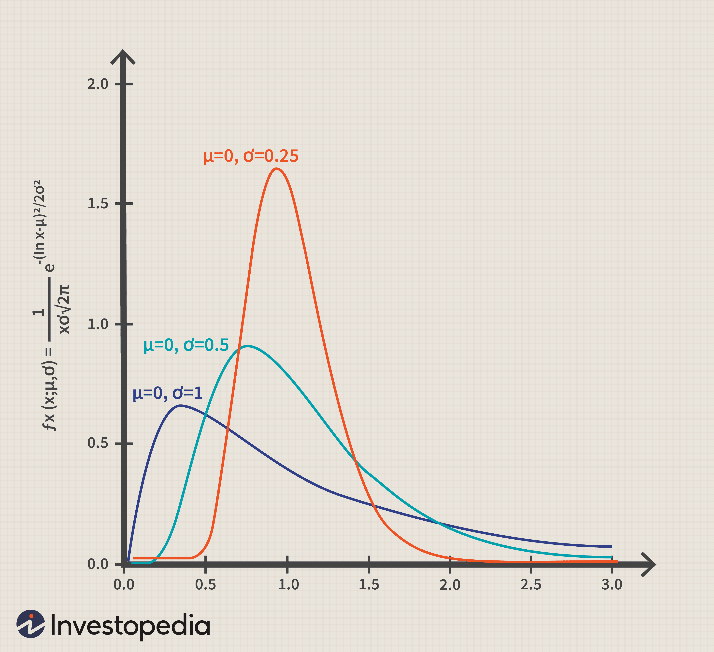

Understanding statistical frameworks is essential for making informed decisions in investing and finance. Among these frameworks, the normal and lognormal distributions are particularly important for modeling and predicting financial outcomes. The normal distribution, often represented as a bell curve, is a fundamental concept in probability theory that helps assess risk and expected returns. It is frequently used to model market returns and individual security performance due to its symmetric nature centered around a mean value. 

On the other hand, the lognormal distribution is characterized by its asymmetry and right-skewness, making it suitable for modeling asset prices that cannot fall below zero and tend to grow exponentially. This makes it particularly useful for understanding stock price dynamics and option pricing in finance.



These statistical models are not just theoretical constructs; they have practical applications, particularly in algorithmic trading. By incorporating these models, traders can refine their strategies and enhance their risk management capabilities. Through this understanding, they gain the ability to anticipate market behaviors and respond effectively to market changes.

Exploring these foundational concepts allows market participants to navigate the complex dynamics of financial markets with greater precision and confidence. The normal and lognormal distributions thus provide critical insights that underpin successful trading strategies and informed investment decision-making.

## Table of Contents

## Understanding Normal Distribution

Normal distribution, a cornerstone of probability theory, is widely recognized as the bell curve due to its distinctive shape. It is defined by its symmetric curve, which is centered around the mean. Most values in a normally distributed dataset aggregate around a central peak, tapering off equally on both sides. Mathematically, the probability density function (PDF) of a normal distribution is expressed as:

$$

f(x | \mu, \sigma^2) = \frac{1}{\sqrt{2 \pi \sigma^2}} e^{-\frac{(x - \mu)^2}{2 \sigma^2}} 
$$

where $\mu$ represents the mean and $\sigma^2$ denotes the variance. This distribution is pivotal for various statistical analyses, enabling a thorough understanding of the likelihood of different outcomes.

In finance, the normal distribution is frequently employed to model overall market returns and the performance of individual securities. This model assumes that financial returns are symmetrically distributed around the mean, helping investors predict the average performance of an asset. However, it's important to note that real-world financial returns can deviate from a normal distribution due to market anomalies and events that produce fat tails and skewness.

A key aspect of normal distribution in finance is the application of standard deviation, a measure of the [dispersion](/wiki/dispersion-trading) of data points in a dataset. The standard deviation is instrumental in assessing the risk and expected returns of an investment. It is a gauge of market [volatility](/wiki/volatility-trading-strategies)—investments with higher standard deviations are considered riskier, as their returns are more spread out from the mean. This metric allows investors to quantify risk and construct portfolios that align with their risk tolerance.

Here is a basic example in Python to visualize a normal distribution and calculate the standard deviation of financial returns:

```python
import numpy as np
import matplotlib.pyplot as plt

# Generate random data following a normal distribution
mean = 0
std_dev = 1
data = np.random.normal(mean, std_dev, 1000)

# Plot the normal distribution
plt.figure(figsize=(8, 5))
plt.hist(data, bins=30, density=True, alpha=0.6, color='g')

# Plot the PDF
xmin, xmax = plt.xlim()
x = np.linspace(xmin, xmax, 100)
p = np.exp(-0.5*((x - mean)/std_dev)**2) / (std_dev * np.sqrt(2 * np.pi))
plt.plot(x, p, 'k', linewidth=2)
title = "Normal Distribution (mean = 0, std dev = 1)"
plt.title(title)
plt.show()

# Calculate standard deviation
calculated_std_dev = np.std(data)
print(f"Calculated Standard Deviation: {calculated_std_dev}")
```

In summary, the normal distribution plays a crucial role in financial contexts by providing a framework to understand market behaviors and assess investment risks. Despite real-world deviations from normality, its simplicity and mathematical properties make it an invaluable tool for financial analysis.

## Exploring Lognormal Distribution

A lognormal distribution differs from the symmetric bell-shaped normal distribution by its asymmetric or right-skewed nature. This characteristic arises because the natural logarithm of a lognormally distributed variable follows a normal distribution. This transformation ensures that values remain positive, which is essential for accurately modeling phenomena such as asset prices that cannot be negative. In particular, stock prices, which tend to grow exponentially over time, align well with the properties of a lognormal distribution.

The lognormal distribution's right tail accommodates substantial positive price changes, which are common in financial markets. This makes it particularly useful for modeling the behavior of stock prices and is integral in the realm of derivative pricing, especially options. The Black-Scholes model, a cornerstone of option pricing theory, assumes lognormality of asset prices to ensure that option prices reflect realistic market behaviors.

A significant aspect of the lognormal distribution is the geometric mean, a key measure for understanding compounded growth. Unlike the arithmetic mean used in normal distributions, the geometric mean is calculated using the nth root of the product of n values. This reflects the cumulative effect of investment returns, where reinvestment leads to exponential growth. For instance, if returns are modeled by a lognormal distribution, the geometric mean provides a more accurate depiction of long-term growth.

For practitioners aiming to implement lognormal distributions in financial modeling, understanding its mathematical formulation is crucial. If $Y$ is a lognormal random variable, then $\ln(Y)$ is normally distributed. Mathematically, if $Y$ follows a lognormal distribution, we express it as:

$$
Y = e^{X}
$$

where $X \sim N(\mu, \sigma^2)$ is a normally distributed variable with mean $\mu$ and variance $\sigma^2$. Python can be used to model this transformation, enabling simulations and option pricing calculations. Here is a simple code snippet to visualize a lognormal distribution using Python:

```python
import numpy as np
import matplotlib.pyplot as plt

# Parameters for the normal distribution
mean, sigma = 0, 0.1

# Lognormal distribution from normal
s = np.random.lognormal(mean, sigma, 1000)

# Plot the histogram
plt.hist(s, bins=50, density=True, alpha=0.6, color='b')
plt.title('Lognormal Distribution Histogram')
plt.xlabel('Stock Prices')
plt.ylabel('Probability Density')
plt.show()
```

This snippet generates a lognormal distribution with a specified mean and standard deviation, representing stock prices. The histogram visually demonstrates the pronounced skew and long tail of the lognormal distribution, affirming its suitability in financial contexts.

## Key Differences Between Normal and Lognormal Distributions

Normal and lognormal distributions represent two distinct statistical models that are fundamental to financial modeling, primarily due to their different characteristics and applications. One of the main differences lies in their symmetry. The normal distribution is symmetric, featuring a bell-shaped curve that contains both negative and positive values. Conversely, the lognormal distribution is right-skewed, implying that it only includes positive values and has a longer tail on the right side.

The suitability of these distributions depends on the nature of the financial phenomena being modeled. The normal distribution is often associated with processes where changes are additive, such as returns in a stable market environment. It is advantageous for modeling variables that can theoretically take on any real value, such as changes in interest rates or currency exchange rates.

In contrast, the lognormal distribution is more appropriate for modeling phenomena where growth is multiplicative, which is common in financial contexts such as stock prices. Stocks cannot fall below zero, and their price changes are often proportional rather than fixed, leading to exponential growth over time. This characteristic makes the lognormal distribution ideal for stock price modeling and option pricing, where compounding factors play a crucial role.

Selecting the correct distribution model is essential for achieving accuracy in financial analyses, aiding in portfolio management, risk assessment, and derivative pricing. Employing the wrong model can lead to significant miscalculations, affecting overall strategy outcomes. Therefore, understanding the intricacies and applications of each distribution type is critical for financial professionals seeking to enhance their analytical capabilities and decision-making processes.

Consider the probability density functions for each distribution:

- The normal distribution is defined by the formula:
$$
  f(x| \mu, \sigma^2) = \frac{1}{\sqrt{2\pi\sigma^2}} e^{-\frac{(x-\mu)^2}{2\sigma^2}}

$$

  where $\mu$ is the mean and $\sigma^2$ is the variance.

- The lognormal distribution is described by the formula:
$$
  f(x|\mu, \sigma^2) = \frac{1}{x\sigma\sqrt{2\pi}} e^{-\frac{(\ln(x)-\mu)^2}{2\sigma^2}}

$$

  where $\mu$ and $\sigma^2$ denote the mean and variance of the variable's natural logarithm.

In practical terms, the choice between normal and lognormal distributions should be driven by the specific characteristics of the financial data and the nature of the economic realities being modeled. By aligning the choice of distribution with these factors, traders and financial analysts can improve the reliability and effectiveness of their analyses and predictions.

## Applications in Algorithmic Trading

In [algorithmic trading](/wiki/algorithmic-trading), the normal and lognormal distributions serve as fundamental tools for modeling and predicting market behavior. These statistical models assist traders in refining their strategies by providing crucial insights into various financial phenomena.

The normal distribution is frequently utilized for risk assessment, aiding traders in calculating the probability and impact of potential losses or gains. This distribution's properties allow for the effective evaluation of market volatilities and the expected variability in asset returns. For example, the standard deviation, a key measure derived from the normal distribution, helps traders understand the volatility of an asset. If $X$ represents the returns of a stock, then $X \sim N(\mu, \sigma^2)$ indicates that returns $X$ follow a normal distribution with mean $\mu$ and variance $\sigma^2$. This mathematical framework enables traders to apply probabilistic measures to risk management by estimating likely variations in asset prices.

Conversely, the lognormal distribution is instrumental in price modeling, essential for options pricing and strategy [backtesting](/wiki/backtesting). Since stock prices are constrained to positive values, their proportional changes are often modeled as following a lognormal distribution. If the logarithm of a random variable $Y$ is normally distributed, i.e., $\ln(Y) \sim N(\mu, \sigma^2)$, then $Y$ follows a lognormal distribution. This property makes the lognormal distribution appropriate for modeling stock prices, which include multiplicative effects such as compound interest. The Black-Scholes model, a renowned method for pricing options, uses the lognormal property of stock prices to determine options' fair value.

Algorithmic models utilize these distributions to automate trading strategies and enhance precision in execution. By incorporating statistical parameters into trading algorithms, such as those that predict price movements or determine optimal trade execution timing, traders can systematically exploit market inefficiencies. Python, a popular programming language for algorithmic trading, allows easy implementation and testing of such strategies. A simple code snippet to simulate returns might look like this:

```python
import numpy as np

def simulate_returns(mean=0.05, std_dev=0.2, days=252):
    return np.random.normal(mean / days, std_dev / np.sqrt(days), days)

returns = simulate_returns()
```

Employing these distributions effectively can lead to better risk-adjusted returns and optimized trading algorithms. Understanding the practical application of both normal and lognormal statistical models empowers traders to build robust systems that react adeptly to market conditions, ultimately enhancing their competitive edge in financial markets.

## Statistical Tools and Techniques

Statistical tools play a pivotal role in evaluating and validating distribution models within financial contexts. Among these tools, Maximum Likelihood Estimation (MLE) is fundamental for estimating parameters of a given distribution, thus offering reliable insights useful in risk assessments. MLE works by finding parameter values that maximize the likelihood function, enabling the model to best explain or fit the data. Here is a basic example in Python illustrating MLE for a normal distribution:

```python
import numpy as np
from scipy.stats import norm

# Sample data
data = np.array([2, 4, 5, 7, 10])

# Maximum Likelihood Estimation for normal distribution
mean, std_dev = norm.fit(data)
print(f"Estimated Mean: {mean}, Estimated Standard Deviation: {std_dev}")
```

Quantile-Quantile (Q-Q) plots serve as a visual evaluation tool, comparing the empirical quantiles of data against the theoretical quantiles of a distribution. This allows for the assessment of how well the data aligns with the chosen theoretical model. A straight line on a Q-Q plot implies the data fits the distribution well.

Bootstrapping is another critical technique, offering a method to test the robustness and sensitivity of statistical models. It involves resampling the dataset with replacement to create many simulated samples. This allows for the estimation of the sampling distribution of a statistic without the assumption of normality. In the context of algorithmic trading, bootstrapping helps in stress-testing models against different market conditions.

These statistical tools—MLE, Q-Q plots, and bootstrapping—not only enhance the understanding of distribution characteristics but are also instrumental in executing comprehensive risk evaluations. By integrating these tools, analysts can improve the accuracy and reliability of financial models, which ultimately translates to more informed decision-making in trading strategies.

## Conclusion

Understanding normal and lognormal distributions is crucial for effectively navigating the financial markets and developing robust trading strategies. These statistical models provide distinct insights into market behavior, enabling traders and investors to make well-informed decisions. The normal distribution, with its symmetrical properties, is particularly useful for risk assessment and analyzing portfolio returns. By assessing the probability and impact of potential gains and losses, traders can strategize more efficiently. In contrast, the lognormal distribution, which accounts for the asymmetric nature and exponential growth of asset prices, is invaluable for modeling stock prices and option valuations.

Utilizing these distributions in conjunction with practical trading insights helps to create more effective algorithmic models. By aligning statistical models with real-world trading scenarios, traders can refine their strategies and enhance decision-making processes. As financial markets continue their trend of rapid evolution, an in-depth understanding of these distributions remains an indispensable asset for traders and analysts, ensuring they remain competitive and adept in the complexities of market fluctuation.

For a concrete implementation of such distributions, consider the Python code examples below demonstrating the normal and lognormal distribution functions using the `numpy` and `matplotlib` libraries:

```python
import numpy as np
import matplotlib.pyplot as plt

# Generate data for normal distribution
mu, sigma = 0, 0.1  # mean and standard deviation
s = np.random.normal(mu, sigma, 1000)

# Generate data for lognormal distribution
shape, scale = 0.1, 1
s2 = np.random.lognormal(mean=shape, sigma=scale, size=1000)

# Plot both distributions
fig, ax = plt.subplots(1, 2, figsize=(12, 5))
ax[0].hist(s, bins=30, density=True, alpha=0.6, color='g')
ax[0].set_title('Normal Distribution')
ax[1].hist(s2, bins=30, density=True, alpha=0.6, color='b')
ax[1].set_title('Lognormal Distribution')

plt.show()
```

This code provides a visual representation of the differences between normal and lognormal distributions, helping traders and analysts better comprehend these important statistical tools.

## FAQs

**What is the major difference between normal and lognormal distributions in financial contexts?**

The primary distinction between normal and lognormal distributions lies in their data symmetry and the type of financial phenomena they model. Normal distribution is symmetrical, allowing for both positive and negative values, making it suitable for modeling returns, which can be both upward and downward. In contrast, lognormal distribution is right-skewed and only takes positive values, making it ideal for asset prices, which cannot be negative. This characteristic of lognormal distribution aligns well with the nature of stock prices that compound over time and have a lower bound at zero.

**Why is the lognormal distribution preferred for modeling stock prices?**

Stock prices are typically modeled with a lognormal distribution because they are the result of compounding returns. Mathematically, if returns are normally distributed, then stock prices, being the exponential accumulation of these returns, follow a lognormal distribution. The formula for a lognormal distributed variable is $X = e^Y$, where $Y$ is normally distributed. This accurately reflects the reality that while prices can grow exponentially, they cannot decline below zero, capturing the multiplicative nature of financial growth.

**Can these distributions be applied to predict returns accurately?**

While these distributions aid in modeling and understanding market behaviors, predicting returns with high accuracy is inherently uncertain due to market volatility and unforeseen events. Normal distribution is often used to estimate expected returns and assess risk via standard deviation. However, real market returns may exhibit fat tails, indicating the presence of extreme events, which a standard normal distribution might not fully capture. Lognormal distribution is more about modeling price movements rather than directly predicting returns, particularly for short-term forecasting; hence, traders might incorporate other models alongside these distributions to improve predictive accuracy.

**How do these statistical models impact the valuation of derivatives?**

Derivatives pricing heavily relies on the statistical characterization of underlying asset behaviors. The Black-Scholes model, a fundamental model for pricing options, assumes that the log returns of the underlying asset follow a normal distribution, thus implying that the asset prices themselves follow a lognormal distribution. This assumption simplifies the calculation of options pricing, though it may not fully account for market realities such as volatility smiles and jumps in stock prices. Adjustments to these models are often necessary to account for deviations from the assumptions under real market conditions.

**What common pitfalls should traders be aware of when using lognormal distribution models?**

One of the common pitfalls is the assumption that price movements are always continuous and perfectly lognormally distributed, which might not hold in real markets due to factors like sudden geopolitical events or financial crises, leading to jumps or discontinuities. Another pitfall is overlooking the effects of extreme tail events (e.g., market crashes), as lognormal distributions might underestimate these due to assuming finite variance. Traders should incorporate robust risk management practices and consider alternative or hybrid models that account for such tail risks and market anomalies to avoid misleading assessments when relying on lognormal distributions alone.

## References & Further Reading

[1]: Hull, J. C. (2017). ["Options, Futures, and Other Derivatives."](https://www.semanticscholar.org/paper/Options%2C-Futures%2C-and-Other-Derivatives-Hull/89bdee500c8623864fc9eb7a471546aa713acc44) Pearson.

[2]: Black, F., & Scholes, M. (1973). ["The Pricing of Options and Corporate Liabilities."](https://www.cs.princeton.edu/courses/archive/fall09/cos323/papers/black_scholes73.pdf) Journal of Political Economy, 81(3), 637-654.

[3]: Shreve, S. E. (2004). ["Stochastic Calculus for Finance I & II."](https://archive.org/details/stochasticcalcul0000shre) Springer Finance.

[4]: Jorion, P. (2007). ["Value at Risk: The New Benchmark for Managing Financial Risk."](https://link.springer.com/article/10.1007/s11408-007-0057-3) McGraw-Hill.

[5]: Wilmott, P. (2006). ["Paul Wilmott Introduces Quantitative Finance."](https://www.amazon.com/Paul-Wilmott-Quantitative-Finance-Set/dp/0470018704) John Wiley & Sons.