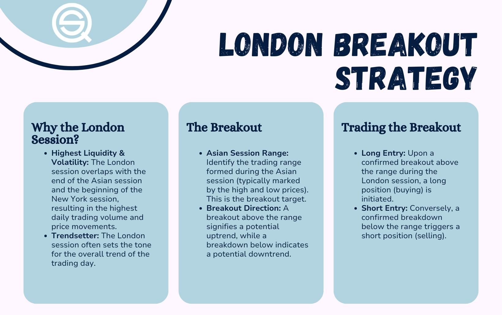

## Table of Contents

## What is the London Breakout Strategy?

The London Breakout Strategy is a trading method used in the forex market. It focuses on the time when the London market opens, which is one of the busiest trading times. Traders using this strategy look for big price movements that happen right after the London market starts. They believe that the market will keep moving in the same direction as the initial big move.

To use this strategy, traders set specific price levels before the London market opens. These levels are based on the highest and lowest prices from the previous day. When the market opens, traders watch if the price breaks above the high or below the low of these levels. If it does, they enter a trade in that direction, hoping to profit from the continued movement. This strategy is popular because it can lead to big profits if the market moves as expected.

## How does the London Breakout Strategy work?

The London Breakout Strategy is a way to trade in the forex market that focuses on the time when the London market opens. This time is very busy because many people are trading, which can cause big price movements. Traders using this strategy try to take advantage of these big moves. They do this by setting certain price levels before the London market opens. These levels are based on the highest and lowest prices from the day before.

When the London market opens, traders watch the price closely. If the price goes above the high level set from the day before, they buy. If it goes below the low level, they sell. They believe that the price will keep moving in the same direction as the initial big move. This strategy can lead to big profits if the market moves as expected, but it also has risks if the market doesn't move the way traders think it will.

## What are the key components of the London Breakout Strategy?

The London Breakout Strategy is all about trading when the London market opens. This time is busy because lots of people are trading, which can make prices move a lot. Traders use this strategy to try to make money from these big price moves. They do this by setting two important price levels before the market opens. These levels are the highest and lowest prices from the day before. Traders watch these levels closely when the market opens.

When the London market starts, traders look to see if the price goes above the high level or below the low level they set. If the price goes above the high, they buy. If it goes below the low, they sell. They think the price will keep moving in the same direction as the first big move. This strategy can make a lot of money if the market moves the way traders expect. But it can also be risky if the market doesn't move as predicted.

## When is the best time to apply the London Breakout Strategy?

The best time to use the London Breakout Strategy is right when the London market opens. This usually happens at 8:00 AM GMT. This time is special because many traders start working, making the market very active. Big price movements often happen then, which is what the strategy tries to use to make money.

Before the market opens, traders set two important price levels. These are the highest and lowest prices from the day before. When the market opens, traders watch to see if the price goes above the high or below the low. If it does, they trade in that direction, hoping the price will keep moving that way.

## What markets are suitable for the London Breakout Strategy?

The London Breakout Strategy works best in the forex market. This is because the forex market is very active when the London session starts. Many currency pairs see big price movements at this time, which is what the strategy tries to use to make money. Traders look at currency pairs like EUR/USD, GBP/USD, and USD/JPY because these are very popular and have a lot of trading activity during the London session.

The strategy can also be used in other markets that are open during the London session, like stocks and commodities. But it works best in markets that have high liquidity and big price movements when London opens. Traders need to be careful because the strategy might not work as well in markets with less activity or different trading hours.

## How can beginners identify potential breakout levels using this strategy?

Beginners can identify potential breakout levels for the London Breakout Strategy by first looking at the highest and lowest prices from the previous trading day. These two levels are important because they help set the boundaries for where the price might break out when the London market opens. Before the market opens at 8:00 AM GMT, beginners should find these levels on their trading charts. The highest price from the day before is called the resistance level, and the lowest price is the support level.

Once the London market opens, beginners should watch the price closely. If the price goes above the resistance level, it's a sign to buy because it might keep going up. If the price drops below the support level, it's a sign to sell because it might keep going down. Beginners need to be quick and ready to enter a trade when the price breaks through these levels. It's also important to set a stop-loss order to limit any potential losses if the market doesn't move as expected.

## What are common entry and exit signals in the London Breakout Strategy?

In the London Breakout Strategy, entry signals are all about watching the price when the London market opens. Traders look at the highest and lowest prices from the day before. When the market opens at 8:00 AM GMT, if the price goes above the highest price from the day before, that's a signal to buy. If the price goes below the lowest price from the day before, that's a signal to sell. These signals tell traders that a big move might be starting, and they want to join in to make money.

Exit signals in this strategy are about knowing when to get out of a trade. Traders often set a target price to take profits, which could be a certain number of pips away from the entry point. They also set a stop-loss order to limit losses if the price moves against them. Sometimes, traders will exit a trade if the price starts to move back towards the breakout level, showing that the big move might be over. It's important for traders to have a clear plan for both entering and exiting trades to manage their risk and potential rewards.

## How can risk management be integrated into the London Breakout Strategy?

Risk management is very important when using the London Breakout Strategy. Traders can manage their risk by setting a stop-loss order right after they enter a trade. A stop-loss order helps limit losses if the price moves against them. For example, if a trader buys because the price broke above the high from the day before, they might set a stop-loss just below that high. This way, if the price goes back down, they won't lose too much money. Traders can also decide how much of their money they want to risk on each trade, usually a small percentage of their total trading account, to keep their overall risk low.

Another way to manage risk is by setting a target for taking profits. Traders can decide on a specific price level where they will close their trade and take their profits. This level could be a certain number of pips away from where they entered the trade. By setting both a stop-loss and a profit target, traders can have a clear plan for each trade. This helps them know exactly when to get out, whether they are making money or losing it. Good risk management is key to using the London Breakout Strategy successfully and keeping losses small while trying to make profits.

## What are the advantages of using the London Breakout Strategy?

The London Breakout Strategy has several advantages that make it popular among traders. One big advantage is that it's simple to understand and use. Traders just need to look at the highest and lowest prices from the day before and watch what happens when the London market opens. This makes it easy for beginners to start trading without needing to learn a lot of complicated stuff. Another advantage is that the London market is very busy when it opens, which often leads to big price movements. Traders can make good profits if they catch these moves at the right time.

Another benefit of the London Breakout Strategy is that it can be used with other trading methods. Traders can add things like technical indicators or other strategies to make their trading even better. This flexibility means traders can adjust the strategy to fit their own style and the market conditions. Also, because the strategy focuses on a specific time, traders can plan their trades around the London market opening, which helps them stay organized and disciplined.

## What are the potential pitfalls and how can they be avoided?

One big problem with the London Breakout Strategy is that it can lead to false breakouts. This happens when the price goes above the high or below the low from the day before, but then it quickly turns around and goes the other way. Traders can lose money if they enter a trade based on a false breakout. To avoid this, traders should wait for the price to move a bit more past the breakout level before entering a trade. They can also use other signs, like technical indicators, to make sure the breakout is real before trading.

Another pitfall is that the market can be unpredictable. Even if the price breaks out, it might not keep moving in the same direction. This can lead to losses if the price goes against the trader's position. To manage this risk, traders should always use a stop-loss order to limit how much they can lose on each trade. They should also not risk too much money on one trade and should be ready to accept that not every trade will be a winner. By being careful and using good risk management, traders can avoid big losses and keep trading safely.

## How can the London Breakout Strategy be optimized for different time frames?

The London Breakout Strategy can be used on different time frames, like short-term or long-term charts. For short-term trading, like on a 5-minute or 15-minute chart, traders need to be quick. They should watch the price closely when the London market opens and be ready to enter a trade as soon as the price breaks the high or low from the day before. This can lead to quick profits, but it's also riskier because the price can change fast. Traders can use shorter stop-loss and profit targets to manage their risk better on these short time frames.

For long-term trading, like on a 1-hour or 4-hour chart, the strategy can be less stressful. Traders don't need to watch the market as closely and can take more time to decide when to enter a trade. They might wait for the price to move more past the breakout level to make sure it's a real move and not a false breakout. On longer time frames, traders can set wider stop-loss and profit targets because the price moves more slowly. This can lead to bigger profits, but it also means waiting longer for the trade to work out. By adjusting the strategy to fit different time frames, traders can find what works best for them.

## What advanced techniques can be used to enhance the effectiveness of the London Breakout Strategy?

One way to make the London Breakout Strategy work better is to use technical indicators. These are tools that help traders see what the market might do next. For example, traders can use the Relative Strength Index (RSI) or the Moving Average Convergence Divergence (MACD) to check if the market is strong or weak. If the price breaks out and the RSI shows the market is not overbought or oversold, it could be a good sign to enter a trade. Another tool is the Average True Range (ATR), which helps set stop-loss and profit targets based on how much the price usually moves. By combining these indicators with the breakout levels, traders can make better decisions and avoid false breakouts.

Another advanced technique is to use multiple time frames. Traders can look at both short-term and long-term charts to get a better view of the market. For example, they might use a 1-hour chart to see the overall trend and a 5-minute chart to find the best time to enter a trade. This way, they can make sure the breakout fits with the bigger picture. Traders can also use other strategies, like trend lines or chart patterns, to confirm the breakout. By looking at the market from different angles, traders can increase their chances of making successful trades and managing their risk better.

## What is Risk Management in the London Breakout Strategy?

Effective risk management is crucial for successfully executing the London Breakout Strategy, as the London session is characterized by heightened volatility. This volatility, while offering opportunities for significant gains, also poses increased risks. Traders must employ stringent risk management techniques to safeguard their capital and ensure long-term sustainability. Here are the key components of risk management in this strategy:

1. **Position Sizing**: It is vital to limit the amount of capital at risk on each trade. A prudent approach is to risk only 1-2% of your total trading capital per trade. This method helps prevent significant losses that could deplete your account during a series of losing trades. The calculation for position size can be expressed as:
$$
   \text{Position Size} = \frac{\text{Trading Capital} \times \text{Risk Percentage}}{\text{Stop Loss (in pips)}}

$$

   For example, if the trading capital is $10,000$ and the trader decides to risk $1\%$ or $100$, with a stop loss of $50$ pips, the position size would be:
$$
   \text{Position Size} = \frac{10,000 \times 0.01}{50} = 2 \text{ lots}

$$

2. **Stop-Loss Orders**: Implementing stop-loss orders is a fundamental risk management practice. Stop-loss orders automatically close a position when the market moves against you by a predetermined amount, limiting potential losses. It is essential to set stop-loss levels based on volatility or technical indicators like support and resistance levels to avoid being stopped out prematurely. 

   In Python, setting a stop-loss order might involve complex trading platform APIs, but here's a simplified conceptual example:

   ```python
   def set_stop_loss(entry_price, stop_loss_pips, direction):
       if direction == "buy":
           stop_loss_price = entry_price - stop_loss_pips * pip_value
       elif direction == "sell":
           stop_loss_price = entry_price + stop_loss_pips * pip_value
       return stop_loss_price

   pip_value = 0.0001 # Example value for currency pair with USD as the quote currency
   entry_price = 1.1500
   stop_loss_pips = 50
   direction = "buy"
   stop_loss = set_stop_loss(entry_price, stop_loss_pips, direction)
   ```

3. **Continuous Monitoring and Adjustment**: As trades progress, continually monitor positions and adjust stop-loss levels to lock in profits as the market moves in favor. This strategy, known as a "trailing stop," can help maximize gains while protecting against reversals. A trailing stop moves the stop-loss level closer to the current market price as the trade becomes profitable.

   The implementation of a trailing stop could be illustrated as:

   ```python
   def trailing_stop(entry_price, current_price, trail_amount_pips):
       new_stop_loss = max((current_price - trail_amount_pips * pip_value), entry_price)
       return new_stop_loss

   current_price = 1.1550
   trail_amount_pips = 20
   new_stop_loss = trailing_stop(entry_price, current_price, trail_amount_pips)
   ```

By incorporating these risk management strategies, traders can help ensure that they capitalize on the opportunities presented by the London Breakout Strategy while minimizing potential downsides. This balance of risk and reward is fundamental to sustainable trading success.

## References & Further Reading

[1]: Pardo, R. (2008). ["The Evaluation and Optimization of Trading Strategies."](https://onlinelibrary.wiley.com/doi/book/10.1002/9781119196969) Wiley Trading.

[2]: Aldridge, I. (2013). ["High-Frequency Trading: A Practical Guide to Algorithmic Strategies and Trading Systems."](https://www.wiley.com/en-us/High+Frequency+Trading%3A+A+Practical+Guide+to+Algorithmic+Strategies+and+Trading+Systems%2C+2nd+Edition-p-9781118343500) Wiley Trading.

[3]: Bulkowski, T. N. (2005). ["Encyclopedia of Chart Patterns."](https://books.google.com/books/about/Encyclopedia_of_Chart_Patterns.html?id=zZAsEAAAQBAJ) Wiley Trading.

[4]: Murphy, J. J. (1999). ["Technical Analysis of the Financial Markets: A Comprehensive Guide to Trading Methods and Applications."](https://www.amazon.com/Technical-Analysis-Financial-Markets-Comprehensive/dp/0735200661) New York Institute of Finance.

[5]: Taylor, S. J. (2005). ["Asset Price Dynamics, Volatility, and Prediction."](https://www.jstor.org/stable/j.ctt7t66m) Princeton University Press.