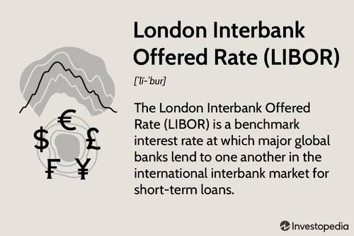

The London Interbank Offered Rate (LIBOR) was once the predominant benchmark interest rate used by global banks when lending to one another. Established in the late 20th century, LIBOR served as a critical component in the financial markets by providing a standardized, transparent rate indicative of the cost at which major banks could obtain unsecured funding from each other. Its widespread adoption meant that it became the interest rate reference for trillions of dollars in financial products, including mortgages, loans, and derivatives.

Historically, LIBOR has played a pivotal role in financial markets by influencing the pricing of financial instruments and determining the interest payments on existing contracts. The calculation of LIBOR involved a panel of leading banks submitting their estimated borrowing costs for five major currencies across seven different maturities, adding up to 35 distinct rates each business day. This process, while influential, was marred by controversy and manipulation, notably highlighted in the LIBOR scandal of 2012, which revealed the susceptibility of the rate to manipulation and questioned its reliability. 



The phaseout of LIBOR in 2023 marked the end of its dominance as the benchmark rate, driven by the need for more dependable and robust alternatives. The Secured Overnight Financing Rate (SOFR) has emerged as the preferred replacement, offering a transaction-based rate derived from overnight loans collateralized by U.S. Treasury securities. This transition not only affects market participants' existing contracts and systems but also necessitates a reconsideration of financial strategies.

The shift from LIBOR to alternative benchmarks like SOFR also impacts technological aspects of finance, such as algorithmic trading. Algorithmic trading, which heavily relies on accuracy and consistency of financial benchmarks, must adjust its pricing models and trading strategies to accommodate these new benchmarks. This transition presents both challenges and opportunities for innovation in designing financial products and strategies.

Overall, the end of LIBOR marks a significant shift in the global financial landscape, emphasizing the continuous evolution of financial markets and the sustained need for reliable benchmarks that can withstand scrutiny and adapt to changing market dynamics.

## Table of Contents

## Understanding LIBOR

The London Interbank Offered Rate (LIBOR) historically served as a critical benchmark interest rate within the global financial system, representing the average rate at which leading banks could obtain short-term loans from one another in the interbank market. Established in the late 20th century, LIBOR rose to prominence due to its authoritative nature and wide adoption, influencing a multitude of financial instruments worldwide.

LIBOR was originally calculated and published for five major currencies, namely the U.S. Dollar (USD), Euro (EUR), British Pound Sterling (GBP), Japanese Yen (JPY), and Swiss Franc (CHF). For each currency, LIBOR was determined across seven different maturities: overnight, one week, and one, two, three, six, and twelve months. This structure produced a total of 35 distinct LIBOR rates disseminated to the public each business day. These rates were subsequently used to underpin a wide array of financial products.

In the context of financial instruments, LIBOR played a pivotal role by providing reference rates for an extensive range of products. Mortgages, corporate loans, and a variety of derivative products, such as [interest rate](/wiki/interest-rate-trading-strategies) swaps, options, and futures, were commonly indexed to LIBOR. These instruments collectively accounted for trillions of dollars in global financial contracts, making LIBOR a fundamental component in the fabric of financial markets.

The methodology of deriving LIBOR involved submissions by a select panel of banks, which estimated the rate at which they could borrow from other banks. Once the submissions were collected, the highest and lowest numbers were discarded, and the remaining rates were averaged to produce the daily LIBOR rate for each currency and maturity. This mechanism, while initially celebrated for its simplicity, later faced criticism for its susceptibility to manipulation, particularly as seen in the LIBOR scandal of 2012.

Ultimately, LIBOR's influence was deeply entrenched in both consumer-level and institutional financial agreements, underscoring its historical significance in shaping monetary relationships across borders and impacting financial stability.

## The Calculation and Use of LIBOR

LIBOR, the London Interbank Offered Rate, was determined daily using a structured approach known as the Waterfall Methodology. This multi-tiered process was essential to ensure the rate accurately reflected the cost of unsecured interbank borrowing. The methodology comprised three primary levels, beginning with actual transaction data, which served as the most reliable source of input. If recent transaction data was insufficient, the next step involved using data from similar transactions adjusted for current market conditions. As a last resort, expert judgment from contributing banks was used, leveraging their knowledge and market insights to estimate rates.

The application of LIBOR extended across a diverse range of financial instruments. One of the primary uses was in the sector of interest rate swaps, where two parties exchanged floating interest payments linked to LIBOR for fixed-rate payments, a practice pivotal for managing interest rate risk. Furthermore, LIBOR served as a critical index in the pricing of futures and options, where contracts obligated or provided the right to buy or sell financial instruments at set prices on future dates. These derivatives relied heavily on LIBOR to establish expected forward rates.

In the commercial product domain, LIBOR was extensively employed in the creation of floating rate certificates of deposit (CDs). In these, the interest payments fluctuated with LIBOR movements, providing a mechanism for issuers to adjust to changing market conditions while offering potentially higher returns for investors in a rising rate environment. Similarly, syndicated loans, which involved multiple lenders joining to fund a single borrower, often pegged their interest payments to LIBOR. This standardization allowed borrowers to predict their debt servicing costs more accurately and financiers to synchronize lending terms across international borders.

Overall, LIBOR's integral role in financial markets was underscored by its use in hedging, investment, and credit instruments worldwide, reflecting its expansive influence before its phaseout.

## Impact of the LIBOR Scandal

In 2012, the financial world was rocked by revelations that several major banks had been manipulating the London Interbank Offered Rate (LIBOR), a crucial benchmark for short-term interest rates worldwide. This manipulation involved submitting false estimates of borrowing costs to influence the LIBOR rate, thereby affecting the pricing of a vast array of financial products, including mortgages, student loans, and complex derivatives contracts. By tweaking their submissions, banks sought either to project financial strength or to profit from their derivatives positions, leading to distorted market signals and undermining trust in financial benchmarks.

The scandal prompted a serious response from regulators and resulted in significant legal and financial repercussions for the institutions involved. Banks such as Barclays, UBS, and the Royal Bank of Scotland faced hefty fines, totaling billions of dollars, for their roles in manipulating the LIBOR rates. These penalties were part of broader settlements that included prohibitions on future misconduct and commitments to stronger internal controls.

Beyond the financial penalties, the LIBOR scandal catalyzed extensive regulatory changes. Financial regulators globally took steps to strengthen oversight and enhance the transparency of benchmark rate-setting processes. The UK’s Financial Conduct Authority (FCA), for instance, overhauled the way LIBOR was calculated, moving from a system based heavily on judgment to one grounded in observable market transactions. Efforts were made to diversify the sources of benchmark rates through alternative rates, and reforms targeted improving the resilience of financial benchmarks against manipulation.

The fallout from the manipulation scandal heightened scrutiny of other financial benchmarks as well. Regulators examined the robustness of indices beyond LIBOR, leading to a global reassessment of benchmark dependencies in financial markets. As trust in LIBOR eroded, a clear directive emerged to transition towards more reliable benchmarks, eventually culminating in the decision to phase out LIBOR completely in favor of alternatives like the Secured Overnight Financing Rate (SOFR).

This scandal thus had a profound and lasting impact, not only in terms of immediate financial consequences but also in reshaping the regulatory landscape and operational methodologies governing financial benchmarks. The legacy of the LIBOR scandal persists, reflecting the crucial importance of integrity and transparency in maintaining the stability and trust in global financial systems.

## The Transition from LIBOR to SOFR

The transition from LIBOR to the Secured Overnight Financing Rate (SOFR) marked a pivotal change in the global financial landscape, primarily driven by the unreliability of LIBOR. LIBOR's methodology, based on estimated borrowing rates rather than actual transactions, left room for manipulation and inaccuracies, as underscored by the 2012 LIBOR scandal. In contrast, SOFR is grounded in actual overnight repurchase agreement (repo) transactions, reflecting a more secure and robust benchmark.

SOFR, published by the Federal Reserve Bank of New York, represents the cost of borrowing cash overnight collateralized by Treasury securities. This repo market-based rate reduces the scope for manipulation, enhances transparency, and ensures alignment with real-world market conditions. Unlike LIBOR, which was available in multiple currencies, SOFR is currently concentrated on U.S. dollar-denominated instruments.

Transitioning from LIBOR to SOFR posed several challenges, including the adaptation of financial contracts. LIBOR was deeply embedded across financial products and systems. Its phaseout required renegotiation and amendment of contracts, particularly those without adequate fallback provisions. Key to this effort was amending trillions of dollars in loans, bonds, and derivatives to reference SOFR or include fallback provisions that activate upon LIBOR's cessation.

Regulatory frameworks and industry bodies, such as the Alternative Reference Rates Committee (ARRC), played crucial roles in facilitating this transition. They published guidelines and recommended best practices for amending contracts and developing robust fallback language. The complexities of derivatives markets, governed by agreements like the ISDA Master Agreement, required particular attention to transition mechanisms.

Moreover, systems and technology infrastructure had to evolve to accommodate SOFR's characteristics, such as its daily publication and the need for overnight compounding. Financial institutions invested in updating their systems to handle these nuances, ensuring compliance and operational continuity.

In conclusion, the shift from LIBOR to SOFR required a concerted effort from regulators, industry bodies, and market participants. While challenges were substantial, the transition laid the groundwork for more resilient financial markets. With SOFR's transactional basis, the industry now relies on a benchmark reflecting genuine funding costs, essential for accurate pricing and risk management.

## Algorithmic Trading and Financial Benchmarks

Algorithmic trading plays a critical role in modern financial markets, leveraging computer algorithms to execute trades at speeds and frequencies that human traders cannot match. These algorithms often rely on financial benchmarks like LIBOR (London Interbank Offered Rate) and its successor, SOFR (Secured Overnight Financing Rate), to inform pricing and strategic decisions.

LIBOR, before its phaseout, was a widely used benchmark across various financial products, including derivatives, mortgages, and loans. Algorithmic traders used LIBOR as a reference rate to price instruments and devise strategies. However, with the transition from LIBOR to SOFR, significant changes in [algorithmic trading](/wiki/algorithmic-trading) practices have been necessary.

The transition from LIBOR to SOFR affects algorithmic trading in several ways. Firstly, the fundamental differences between LIBOR and SOFR need to be incorporated into algorithms. LIBOR, being forward-looking, included a risk component, reflecting the credit risk in unsecured interbank lending. In contrast, SOFR is a secured, overnight rate based on actual transactions in the U.S. Treasury repurchase market, devoid of any credit risk premium. This distinction requires algorithmic models to adjust in order to correctly price securities and manage risk.

For example, when transitioning from LIBOR to SOFR, the pricing of interest rate swaps must account for these differences. The conversion formula typically involves adding a spread adjustment to the SOFR rate to equate it to historical LIBOR benchmarks.

In Python, a simple adjustment for converting a LIBOR-based calculation to SOFR could look like:

```python
def adjust_rate(libor_rate, sofr_rate, spread):
    return sofr_rate + spread

# Example
libor_rate = 0.02  # 2% LIBOR rate
sofr_rate = 0.01   # 1% SOFR rate
spread = 0.0026    # Spread adjustment

adjusted_rate = adjust_rate(libor_rate, sofr_rate, spread)
print(f"The adjusted rate is: {adjusted_rate:.4f}")
```

Moreover, algorithmic trading strategies that depend significantly on interest rate benchmarks must adapt to new patterns of [volatility](/wiki/volatility-trading-strategies) and [liquidity](/wiki/liquidity-risk-premium) inherent in SOFR. As SOFR is based on transaction volumes rather than reported bank estimates, its data reflects real-time market conditions, posing both challenges and opportunities for algorithmic designs. The increased transparency and robustness of SOFR-related data require recalibration of volatility models and risk management tools used in trading algorithms.

The dynamic nature of SOFR, arising from its basis in actual market transactions, introduces new considerations for the timing and execution of trades. Algorithms must be optimized to address these variations, ensuring strategies remain effective under the new benchmark.

In conclusion, the shift from LIBOR to SOFR has profound implications for algorithmic trading. It necessitates adaptations in trading algorithms to accommodate the intrinsic differences between these benchmarks, ensuring accurate pricing, effective risk management, and strategic coherence in a rapidly evolving financial landscape.

## Future of Financial Benchmarks

The conclusion of the London Interbank Offered Rate (LIBOR) era has prompted a shift towards alternative financial benchmarks that are expected to provide more stable and transparent references for interest rates. Key among these alternatives are the Secured Overnight Financing Rate (SOFR), the Euro Interbank Offered Rate (EURIBOR), and Ameribor. Each of these benchmarks carries unique characteristics and implications for the financial industry.

The Secured Overnight Financing Rate (SOFR) is based on transactions in the Treasury repurchase market. It is a broad measure of the cost of borrowing cash overnight collateralized by Treasury securities. Unlike LIBOR, which incorporated some degree of subjective input from banks, SOFR is grounded in an observable market with a large [volume](/wiki/volume-trading-strategy) of transactions, offering robust and transparent rate determinations. The transition to SOFR requires substantial adjustments from financial institutions, particularly in terms of updating contract valuations and risk management systems to accommodate this new rate's volatility and structure, since it is an overnight rate without maturities beyond a single day.

EURIBOR, which stands for Euro Interbank Offered Rate, continues to serve as a critical benchmark in the Eurozone. Unlike LIBOR, EURIBOR reflects the average interest rates at which Eurozone banks offer to lend unsecured funds to other banks in the euro wholesale money market. While the usage of EURIBOR persists, it has undergone a reform process to enhance its reliability as a benchmark, resulting in its continued relevance in the interbank lending sphere.

Ameribor is a lesser-known but increasingly significant benchmark within the United States, especially for small to midsize banks. Based on actual interbank loan transactions executed on the American Financial Exchange, Ameribor offers an alternative reflective of the costs of interbank lending for smaller institutions. This specificity can provide a more pertinent reference point compared to traditional benchmarks that might not capture the nuances of smaller bank operations.

Understanding the implications of these benchmarks is crucial for financial institutions, traders, and regulators. Financial institutions must ensure their systems are updated to accommodate new benchmarks like SOFR, assessing potential impacts on their hedging strategies and risk management frameworks. Traders need to adapt their trading strategies accordingly, taking into account the characteristics and movements of these rates. Regulators play a critical role in overseeing the transition, ensuring that the new benchmarks are implemented smoothly across markets and that they maintain transparency and integrity to prevent the pitfalls experienced under LIBOR.

The shift from LIBOR to a range of benchmarks underscores the necessity for adaptability and vigilance in the financial industry. It offers opportunities to enhance market stability and transparency while also demanding careful consideration of the impacts on existing financial architectures and practices. As the transition progresses, the lessons learned may set precedents for the development and implementation of future financial benchmarks.

## Conclusion

The conclusion of the LIBOR era signifies a pivotal transformation within the financial sector, characterized by both challenges and opportunities. LIBOR's discontinuation underscores the necessity for financial markets to transition towards more reliable and transparent benchmarks like the Secured Overnight Financing Rate (SOFR). This transition is not merely a regulatory compliance issue but represents a fundamental shift in how benchmark interest rates are established and utilized across financial products.

Algorithmic trading, heavily reliant on benchmarks for developing pricing models and trading strategies, must now adapt to the nuances of SOFR and other emerging benchmarks. As SOFR is based on actual overnight transactions in the U.S. Treasury repurchase agreement (repo) market, it introduces a more stable and secure reference point compared to the judgment-based LIBOR. This transition necessitates recalibrating algorithms, data models, and risk management frameworks to ensure accurate and compliant trading operations.

The change from LIBOR to alternative benchmarks like SOFR also highlights the broader, ongoing evolution of financial markets. It emphasizes the increasing demand for robust, transaction-based benchmarks that enhance market integrity and transparency. This evolution invites industry participants to innovate, requiring the development of new financial products and tools designed to leverage the characteristics of new benchmarks.

Overall, while the retirement of LIBOR poses significant adjustments, it also offers the financial industry a moment to enhance resilience, transparency, and trustworthiness in market operations. The adaptation to new benchmarks represents both a challenge to be managed and an opportunity to improve the way financial markets function globally.

## References & Further Reading

[1]: Mackenzie, M. (2013). ["The Story of the LIBOR Scandal."](https://www.cfr.org/backgrounder/understanding-libor-scandal) Financial Times.

[2]: Duffie, D., & Stein, J. C. (2015). ["Reforming LIBOR and other Financial Market Benchmarks."](https://www.aeaweb.org/articles?id=10.1257/jep.29.2.191) The Journal of Economic Perspectives, 29(2), 191-212.

[3]: Schweizer, J., & Theissen, K. (2020). ["The Transition from LIBOR to Alternative Benchmark Rates: The Practical Implications and What Market Participants Have to Consider."](https://en.wikipedia.org/wiki/Nativity_of_Jesus) American Law and Economics Review.

[4]: ["The Secured Overnight Financing Rate (SOFR)"](https://www.newyorkfed.org/markets/reference-rates/sofr) by the Federal Reserve Bank of New York

[5]: Sommerville, D. (2020). ["What is SOFR and How Does It Affect Financial Markets?"](https://www.forbes.com/advisor/investing/secured-overnight-financing-rate-sofr/) Forbes.

[6]: Title 17 Code of Federal Regulations (CFR), Part 242: [Regulation of Alternative Benchmark Submissions](https://www.ecfr.gov/current/title-17)

[7]: ["Algorithmic Trading: Winning Strategies and their Rationale"](https://onlinelibrary.wiley.com/doi/pdf/10.1002/9781118676998.fmatter) by Ernie Chan

[8]: Snider, C. A., & Youle, T. (2014). ["The Fix is In: Detecting Portfolio Driven Manipulation of the LIBOR."](https://papers.ssrn.com/sol3/papers.cfm?abstract_id=2189015) Journal of Industrial Economics.