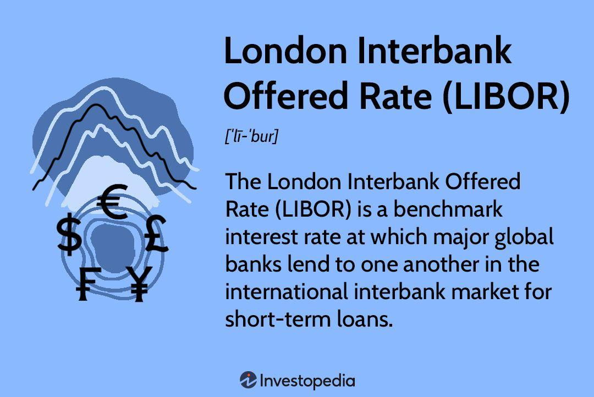

## Table of Contents

## What is the London Interbank Offered Rate (LIBOR)?

The London Interbank Offered Rate, or LIBOR, is a benchmark interest rate at which major banks lend to each other in the London interbank market. It is used as a reference rate for a wide range of financial products, including loans, mortgages, and derivatives. LIBOR is calculated for five currencies and seven different maturities, ranging from overnight to one year, and is published daily.

LIBOR plays a crucial role in the global financial system because it helps set the price of many financial transactions. For example, if you have a loan or a mortgage that uses LIBOR as a reference rate, the interest you pay can change based on the LIBOR rate. However, due to issues with manipulation and declining usage, LIBOR is being phased out and will be replaced by alternative reference rates in many countries.

## How is LIBOR calculated?

LIBOR is calculated by taking the average interest rate that a group of big banks say they would charge to lend money to other big banks. Every day, these banks report the rates they think they would have to pay to borrow money from other banks. These rates are for different amounts of time, like overnight, one week, one month, up to one year, and for different currencies like the US dollar, the euro, and the British pound.

A company called the ICE Benchmark Administration (IBA) collects these rates. They throw out the highest and lowest rates to avoid any strange numbers, then they average the rest. This average becomes the LIBOR rate for that day. Because it's used all over the world for setting prices on loans and other financial products, even small changes in LIBOR can have a big impact.

## Who administers LIBOR?

LIBOR is administered by the ICE Benchmark Administration, or IBA for short. This company is in charge of collecting the rates from big banks and figuring out the LIBOR rate every day.

IBA makes sure that the process is fair and accurate. They do this by taking the rates the banks report, getting rid of the highest and lowest ones, and then averaging the rest. This way, the LIBOR rate is a good reflection of what banks think they would pay to borrow money from each other.

## What are the different tenors of LIBOR?

LIBOR has different time periods, or tenors, that it measures. These tenors are how long the money is borrowed for. The tenors for LIBOR are overnight, one week, one month, two months, three months, six months, and one year. This means that banks report what they think they would pay to borrow money for each of these time periods.

Each of these tenors is important because different financial products might use different ones. For example, a short-term loan might use the one-week or one-month rate, while a longer-term loan might use the six-month or one-year rate. This helps make sure that the interest rates for these products match the time they are borrowed for.

## Why is LIBOR important in financial markets?

LIBOR is important in financial markets because it is used as a benchmark to set the interest rates for many different kinds of loans and financial products. When banks, businesses, or even people borrow money, the interest they pay can be based on LIBOR. For example, if you have a loan or a mortgage that uses LIBOR, the [interest rate](/wiki/interest-rate-trading-strategies) you pay can go up or down depending on what LIBOR is doing. This makes LIBOR a key part of the global financial system because it affects how much people and businesses have to pay to borrow money.

Another reason LIBOR is important is that it helps set the price for many financial products, like bonds and derivatives. These are complex financial tools that big investors and companies use to manage risk or make investments. Because LIBOR is used as a reference rate for these products, even small changes in LIBOR can have a big impact on their value. This means that LIBOR influences not just everyday borrowing but also the bigger financial markets where a lot of money is moved around.

## How has LIBOR been used in financial products?

LIBOR has been used in many financial products because it helps set the interest rates for these products. For example, when people take out loans or mortgages, the interest they pay can be based on LIBOR. This means if LIBOR goes up, the interest rate on their loan goes up too, and if LIBOR goes down, their interest rate goes down. This is important for things like home loans, car loans, and business loans, where the interest rate can change over time.

LIBOR is also used in more complex financial products like bonds and derivatives. Big investors and companies use these products to manage risk or make investments. For example, a bond might have its interest rate tied to LIBOR, so the bond's value can change based on what LIBOR does. Derivatives, which are like bets on how interest rates will change, also use LIBOR as a reference. This makes LIBOR a big deal in the financial world because it affects a lot of money moving around in markets.

## What are the alternatives to LIBOR?

Because of problems with LIBOR, like banks sometimes trying to cheat by reporting wrong rates, many countries are moving to new ways to set interest rates. In the United States, the new rate is called the Secured Overnight Financing Rate, or SOFR. SOFR is based on real transactions in the market, making it harder for anyone to mess with it. In the UK, the new rate is called the Sterling Overnight Index Average, or SONIA. SONIA is also based on actual deals in the market and is seen as a more honest way to set rates.

These new rates are different from LIBOR because they use real data from what's happening in the market, not just what banks say they would charge. This makes them more reliable and fair. Many countries are working on their own new rates, like the Euro Short-Term Rate (€STR) in the Eurozone and the Tokyo Overnight Average Rate (TONAR) in Japan. These new rates are being used more and more in loans, mortgages, and other financial products to replace LIBOR as it gets phased out.

## What led to the decision to phase out LIBOR?

The decision to phase out LIBOR came about because there were big problems with how it was being used. Some banks were found cheating by reporting false rates to make more money or to look better to others. This made people lose trust in LIBOR because it wasn't showing the real cost of borrowing money between banks. Also, fewer banks were using LIBOR, which made it harder to keep it accurate and reliable.

Because of these issues, financial regulators around the world decided it was time to find new ways to set interest rates. They wanted rates that were based on real transactions in the market, not just what banks said they would charge. This led to the creation of new rates like SOFR in the US and SONIA in the UK, which are seen as more honest and reliable. These new rates are slowly taking over from LIBOR in loans, mortgages, and other financial products.

## How is the transition from LIBOR to alternative rates being managed?

The transition from LIBOR to alternative rates is being managed carefully by financial regulators and banks around the world. They are working together to make sure that the change happens smoothly and that everyone understands what's going on. This means they are updating rules and guidelines to help people and businesses switch over to the new rates. They are also talking to banks, investors, and companies to make sure they are ready for the change. This includes making new financial products that use the new rates instead of LIBOR.

There are also special groups set up to help with the transition. These groups give advice and help solve problems that come up during the switch. They make sure that the new rates like SOFR in the US and SONIA in the UK are being used correctly. Banks and other financial companies are also working on changing their systems and contracts to use these new rates. This is a big job, but everyone is working together to make sure it happens without causing too much trouble.

## What are the implications of LIBOR's discontinuation for existing contracts?

When LIBOR stops being used, it can cause problems for existing contracts that use LIBOR as their interest rate. These contracts could be for loans, mortgages, or other financial products. If LIBOR is no longer available, the interest rate on these contracts could change in ways that people did not expect. This might mean people have to pay more or less interest than they thought they would. To deal with this, many contracts are being changed to use new rates like SOFR or SONIA instead of LIBOR. This helps make sure the contracts keep working even after LIBOR is gone.

The process of changing existing contracts to use new rates can be tricky. Banks and other financial companies have to look at each contract and figure out how to switch it over. This can take a lot of time and work. Sometimes, they might need to talk to the people who have the contracts to agree on the changes. Regulators are also helping by giving rules and advice on how to make these changes smoothly. The goal is to make sure that everyone understands what is happening and that the transition does not cause too much trouble for anyone.

## How can financial institutions prepare for the end of LIBOR?

Financial institutions can prepare for the end of LIBOR by first understanding all the contracts they have that use LIBOR. They need to look at loans, mortgages, and other financial products to see how they will be affected when LIBOR stops. Then, they should start changing these contracts to use new rates like SOFR or SONIA. This means talking to the people who have these contracts and agreeing on how to switch to the new rates. It's also important for banks to update their computer systems and rules to work with the new rates, so everything keeps running smoothly.

Another way financial institutions can get ready is by training their staff about the new rates. They need to make sure everyone understands how SOFR, SONIA, and other new rates work and how they are different from LIBOR. This helps the staff explain the changes to customers and handle the transition well. Banks should also keep up with the rules and guidelines from regulators, who are helping to make sure the switch from LIBOR goes smoothly. By doing all these things, financial institutions can make sure they are ready for when LIBOR ends and avoid big problems.

## What are the potential impacts of LIBOR's phase-out on global financial markets?

The end of LIBOR could shake up the global financial markets a lot. Many loans, mortgages, and other financial products use LIBOR to set their interest rates. When LIBOR stops, these products will have to switch to new rates like SOFR or SONIA. This change might cause the interest rates on these products to go up or down in ways people did not expect. This could be confusing and might lead to disagreements or even legal fights over how to handle the switch. It's a big deal because it affects a lot of money and a lot of people around the world.

On the other hand, the move away from LIBOR could make financial markets safer and more honest. LIBOR had problems with banks cheating by reporting false rates. The new rates are based on real deals in the market, so they are harder to mess with. This means people can trust these new rates more. Even though the transition might be tough, it could lead to a better and more reliable way of setting interest rates in the long run. Financial institutions and regulators are working hard to make sure the change happens as smoothly as possible, but it's still a big challenge for the global financial system.

## References & Further Reading

[1]: Mackenzie, M. (2013). ["The Story of the LIBOR Scandal."](https://www.cfr.org/backgrounder/understanding-libor-scandal) Financial Times.

[2]: Duffie, D., & Stein, J. C. (2015). ["Reforming LIBOR and other Financial Market Benchmarks."](https://www.aeaweb.org/articles?id=10.1257/jep.29.2.191) The Journal of Economic Perspectives, 29(2), 191-212.

[3]: Schweizer, J., & Theissen, K. (2020). ["The Transition from LIBOR to Alternative Benchmark Rates: The Practical Implications and What Market Participants Have to Consider."](https://en.wikipedia.org/wiki/Nativity_of_Jesus) American Law and Economics Review.

[4]: ["The Secured Overnight Financing Rate (SOFR)"](https://www.newyorkfed.org/markets/reference-rates/sofr) by the Federal Reserve Bank of New York

[5]: Sommerville, D. (2020). ["What is SOFR and How Does It Affect Financial Markets?"](https://www.forbes.com/advisor/investing/secured-overnight-financing-rate-sofr/) Forbes.

[6]: Title 17 Code of Federal Regulations (CFR), Part 242: [Regulation of Alternative Benchmark Submissions](https://www.ecfr.gov/current/title-17)

[7]: ["Algorithmic Trading: Winning Strategies and their Rationale"](https://onlinelibrary.wiley.com/doi/pdf/10.1002/9781118676998.fmatter) by Ernie Chan

[8]: Snider, C. A., & Youle, T. (2014). ["The Fix is In: Detecting Portfolio Driven Manipulation of the LIBOR."](https://papers.ssrn.com/sol3/papers.cfm?abstract_id=2189015) Journal of Industrial Economics.