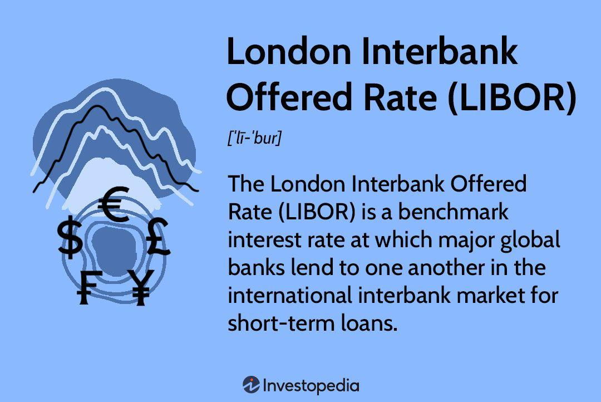

## Table of Contents

## What is the London Interbank Offered Rate (LIBOR)?

The London Interbank Offered Rate, or LIBOR, is a benchmark interest rate that shows the average rate at which major banks in London can borrow money from each other. It's used for short-term loans, usually lasting from overnight to one year. LIBOR is important because it helps set interest rates for many financial products like loans, mortgages, and credit cards around the world.

However, LIBOR has faced some problems. In the past, some banks were found to be manipulating the rate for their own benefit. This led to a big scandal and a loss of trust in LIBOR. Because of these issues, financial regulators decided to stop using LIBOR by the end of 2021. They are now moving to new benchmark rates that are seen as more reliable and harder to manipulate.

## How is LIBOR calculated?

LIBOR is calculated by taking the average interest rate that a group of big banks in London say they would charge to lend money to other banks. Every day, these banks report the rates they think they would have to pay if they borrowed money from other banks. The rates are reported for different lengths of time, like overnight, one week, one month, up to one year, and in different currencies, like US dollars, euros, and pounds.

Once the banks report their rates, the highest and lowest rates are removed to avoid any extreme numbers messing up the average. The remaining rates are then averaged to come up with the LIBOR rate for that day. This process is done by the Intercontinental Exchange (ICE), which took over managing LIBOR in 2014.

## Who administers LIBOR?

LIBOR is managed by the Intercontinental Exchange (ICE). They took over this job in 2014. ICE is a big company that runs financial markets and provides data to help people make decisions about money.

Every day, ICE collects information from big banks in London about the rates they think they would have to pay to borrow money. They then use this information to calculate LIBOR. They do this by averaging the rates after removing the highest and lowest ones to make sure the final number is fair.

## Why is LIBOR important in financial markets?

LIBOR is really important in financial markets because it helps set the interest rates for a lot of different financial products. Things like loans, mortgages, and credit cards often use LIBOR as a starting point to figure out how much interest to charge. This means that when LIBOR goes up or down, it can affect how much people and businesses have to pay for borrowing money all around the world.

Even though LIBOR is being phased out because of past problems with banks manipulating the rate, it has been a key part of the financial system for a long time. It's used in contracts worth trillions of dollars, so changes to LIBOR can have big effects on the economy. That's why moving away from LIBOR to new, more reliable rates is a big deal and needs to be done carefully.

## What currencies does LIBOR cover?

LIBOR covers several different currencies. This means it helps set interest rates for loans and other financial products in these currencies. The main currencies that LIBOR deals with are the US dollar, the euro, the British pound, the Japanese yen, and the Swiss franc.

Each day, banks report the rates they think they would have to pay to borrow money in these currencies. These rates are then used to calculate the LIBOR for each currency. This way, LIBOR can help set fair interest rates for financial products all around the world, not just in one country.

## How often is LIBOR published?

LIBOR is published every business day. This means it comes out Monday through Friday, except on holidays when banks are closed. The rates are calculated and released in the morning, so people and businesses can use them right away.

Because LIBOR is used to set interest rates for many financial products, it's important that it's updated often. This daily update helps keep the rates fair and up-to-date with what's happening in the market.

## What are the different maturities for LIBOR rates?

LIBOR rates come in different lengths of time, which we call maturities. These maturities range from very short, like overnight, to longer periods, like one year. The different maturities help banks and other people in the financial world choose the right length of time for their loans and other financial products.

The specific maturities for LIBOR are overnight, one week, one month, two months, three months, six months, and one year. Each of these maturities has its own rate, which is calculated every day. This way, whether someone needs money for a short time or a longer time, there's a LIBOR rate that fits their needs.

## How has LIBOR been used in financial products?

LIBOR has been used in many different financial products to help set the interest rates people have to pay. For example, when someone takes out a loan or a mortgage, the [interest rate](/wiki/interest-rate-trading-strategies) might be based on LIBOR plus a little extra. This means if LIBOR goes up, the interest rate on the loan goes up too. LIBOR is also used for things like credit cards and student loans, helping to decide how much interest people have to pay on these as well.

Because LIBOR is used in so many financial products, it affects a lot of people and businesses around the world. Companies use LIBOR to set rates for things like corporate loans and bonds. Even some savings accounts and investments use LIBOR to figure out how much interest they will pay or earn. This makes LIBOR really important, but it also means that any problems with LIBOR, like when banks were found to be manipulating it, can have big effects on the economy.

## What are the controversies surrounding LIBOR?

LIBOR has been at the center of a big controversy because some banks were found to be cheating by changing the rates they reported. This happened around the time of the 2008 financial crisis. Banks were reporting lower rates to make themselves look healthier than they were, and some traders were also trying to move the rates to make money from bets they had made. This cheating was a big deal because LIBOR is used to set interest rates for lots of loans and other financial products around the world.

The scandal made people lose trust in LIBOR. It led to huge fines for the banks involved and even jail time for some people. Because of this, financial regulators decided to stop using LIBOR by the end of 2021. They are now moving to new benchmark rates that are seen as more reliable and harder to manipulate. This change is a big deal because LIBOR was used in contracts worth trillions of dollars, so switching to new rates needs to be done carefully to avoid messing up the economy.

## What led to the decision to phase out LIBOR?

The decision to phase out LIBOR came after a big scandal where banks were found to be cheating by changing the rates they reported. This happened around the 2008 financial crisis. Banks were reporting lower rates to make themselves look better, and some traders were also trying to move the rates to make money from bets they had made. This cheating made people lose trust in LIBOR because it's used to set interest rates for lots of loans and other financial products around the world.

Because of the scandal, financial regulators decided to stop using LIBOR by the end of 2021. They wanted to move to new benchmark rates that are seen as more reliable and harder to manipulate. This change is important because LIBOR was used in contracts worth trillions of dollars, so switching to new rates needs to be done carefully to avoid messing up the economy.

## What is replacing LIBOR and how does it differ?

LIBOR is being replaced by new benchmark rates that are more reliable and harder to manipulate. For the US dollar, the main replacement is the Secured Overnight Financing Rate (SOFR). SOFR is based on actual transactions in the market for borrowing and lending money overnight, using US Treasury securities as collateral. This makes SOFR more transparent and less likely to be manipulated because it's based on real data instead of banks' guesses.

Other countries are also moving to their own new rates. In the UK, the replacement for LIBOR is the Sterling Overnight Index Average (SONIA), which is also based on actual transactions. These new rates are different from LIBOR because they use real data from the market, making them more trustworthy. The switch to these new rates is a big change, but it's important to make sure the financial system works fairly and honestly.

## How should financial institutions prepare for the transition away from LIBOR?

Financial institutions need to get ready for the change from LIBOR to new rates like SOFR and SONIA. They should start by looking at all their loans, contracts, and other financial products that use LIBOR. They need to figure out how these will be affected by the switch and update them to use the new rates. This might mean changing the terms of loans or talking to customers about the new rates. It's also important to update their computer systems and software to work with the new rates, so everything runs smoothly.

It's also a good idea for financial institutions to train their staff about the new rates. This way, everyone knows what's happening and can help customers understand the changes. They should also keep an eye on what's happening in the market and follow the rules set by regulators to make sure they're doing everything right. By getting ready early and planning carefully, financial institutions can make the switch from LIBOR to the new rates easier for everyone involved.

## References & Further Reading

[1]: ["Understanding Alternative Reference Rates"](https://www.traditiondata.com/market-education/what-are-alternative-reference-rates/) - Bank of England's overview and guidance on transitioning from LIBOR to SONIA.

[2]: ["The Transition from LIBOR: What It Means for Future Financial Contracts"](https://www.wfw.com/articles/libor-transition-what-why-when-how/) - Federal Reserve's insights into the shift to SOFR and its implications.

[3]: Bowman, D., & Mahoney, J. (2020). ["SOFR Academy: Understanding SOFR and its Implications for Financial Markets."](https://pubmed.ncbi.nlm.nih.gov/33030926/) Federal Reserve Bank of New York.

[4]: ["The End of Libor: Transitioning to a Safer World"](https://www.jpmorgan.com/insights/markets/libor/the-global-move-away-from-LIBOR) - Investopedia's explanation of the effects of LIBOR's phase-out on global finance.

[5]: Duffie, D., & Stein, J. (2015). ["Reforming LIBOR and Other Financial Market Benchmarks"](https://scholar.harvard.edu/files/stein/files/libor_duffie_stein_jep_2015.pdf) - Working paper examining reforms of major financial benchmarks after manipulation concerns.