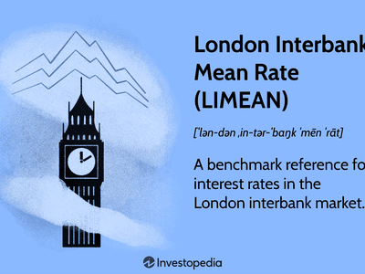

The London Interbank Offered Rate (LIBOR) has historically been a fundamental benchmark in the financial world, serving as a critical reference point for interbank lending rates. Since its inception in 1986 by the British Bankers' Association, LIBOR has been utilized extensively to price a variety of financial products, including mortgages and loans. Its calculation, which was originally based on the self-reported borrowing costs from leading banks for five major currencies over seven different maturities, provided a versatile tool for global financial markets.

Despite its key role, LIBOR's reputation and reliability were tarnished by a manipulation scandal. This scandal involved several top banks, which were found to have manipulated LIBOR submissions to benefit their trading positions or to appear financially healthier. The revelations of this misconduct led to significant fines for the involved institutions and placed LIBOR under intense regulatory scrutiny. Consequently, this undermined confidence in LIBOR as a transparent and reliable financial benchmark.



The deficiencies exposed in LIBOR's methodology prompted a call for reform, favoring benchmarks grounded in real transaction data rather than subjective estimations. This evolution culminated in the global financial community's concerted efforts to replace LIBOR with more robust alternatives. Among these, the Secured Overnight Financing Rate (SOFR) has emerged as a favored choice, particularly in the United States, starting in 2023.

This article examines LIBOR's historical role and its profound influence, particularly on algorithmic trading, which demands precise benchmarks for effective strategy development. With the transition to new benchmarks such as SOFR, algorithms must adapt, influencing the financial industry's approach to trading strategies.

In closing, the article will address the broader implications of these changes across the financial landscape, underscoring the necessity for stakeholders to adapt to maintain market competitiveness. As these new benchmarks take root, ensuring transparency, stability, and trust in financial markets remains a priority for all involved.

## Table of Contents

## LIBOR as a Financial Benchmark

The London Interbank Offered Rate (LIBOR) was introduced by the British Bankers' Association in 1986 to standardize the benchmark for pricing syndicated loans and [interest rate](/wiki/interest-rate-trading-strategies) swaps. It was calculated across five major currencies—namely the US Dollar (USD), British Pound (GBP), Euro (EUR), Japanese Yen (JPY), and Swiss Franc (CHF)—and across seven different maturities ranging from overnight to one year. This multi-currency and multi-maturity approach made LIBOR an incredibly versatile tool for global financial markets, facilitating consistent reference points for a variety of financial instruments.

Despite its vital role, LIBOR's credibility was severely undermined following reports of manipulation by several banks. Investigations revealed that banks were self-reporting their interest rates, which led to instances of rate tampering to benefit traders’ portfolios. This resulted in significant fines and increased regulation as authorities sought to address the weaknesses in the benchmark framework. The manipulation scandal underscored a fundamental flaw in LIBOR's methodology: reliance on estimates rather than actual transaction data. This prompted a concerted effort to transition towards financial benchmarks grounded in empirical market activity to ensure both reliability and transparency.

The global financial community began seeking alternatives, leading to the development of new benchmarks like the Secured Overnight Financing Rate (SOFR) in the United States, the Sterling Overnight Index Average (SONIA) in the United Kingdom, and the Euro Short-Term Rate (€STR) in Europe. These benchmarks are based on observable transactions, making them less susceptible to manipulation and more reflective of actual market conditions. The transition from LIBOR is aimed at enhancing market integrity by adopting these more robust financial benchmarks.

## Impact on Algorithmic Trading

Algorithmic trading, which automates decision-making in financial markets, relies heavily on benchmarks like the London Interbank Offered Rate (LIBOR) for a range of operations including strategy development, risk assessment, and hedging. LIBOR provided a stable framework that traders used to evaluate the cost of interbank lending. However, with its phased out transition to new benchmarks like the Secured Overnight Financing Rate (SOFR), traders face the challenge of adapting their systems to integrate these new references.

The transition requires a comprehensive understanding of the unique characteristics of alternative benchmarks. For instance, the SOFR is based on overnight loans secured by U.S. Treasury securities, reflecting actual market transactions unlike LIBOR's methodology, which involved estimates by major banks. This transition presents both opportunities and challenges for algorithmic traders. One crucial aspect is assessing the [volatility](/wiki/volatility-trading-strategies) and [liquidity](/wiki/liquidity-risk-premium) of these new rates. SOFR, being backward-looking, exhibits lower volatility compared to LIBOR, which was subject to manipulation due to its reliance on estimations rather than real transactions.

Algorithmic traders must ensure their systems remain competitive by revising their algorithms to accommodate these new benchmarks. In practice, this involves recalibrating models to reflect the nuances of SOFR and similar benchmarks. An intrinsic part of modeling involves addressing differences in volatility. While LIBOR's future prediction often involved speculation, SOFR's past-only reflection of transactions offers a more predictable, albeit backward-looking, nature. 

The transparency of these new benchmarks contributes significantly to the robustness required in [algorithmic trading](/wiki/algorithmic-trading) strategies. Markets can expect fewer instances of rate manipulation, leading to a stable trading environment. For example, the Python snippet below demonstrates a basic method to integrate historical SOFR data in a trading algorithm for analyzing trends:

```python
import pandas as pd
import numpy as np

# Load SOFR historical data
sofr_data = pd.read_csv('sofr_data.csv')
sofr_data['Date'] = pd.to_datetime(sofr_data['Date'])
sofr_data.set_index('Date', inplace=True)

# Compute rolling average to smooth out volatility
sofr_data['Rolling_Mean'] = sofr_data['Rate'].rolling(window=30).mean()

# Visualize rolling mean
sofr_data['Rolling_Mean'].plot(title='30-Day Rolling Mean of SOFR', ylabel='Rate')

# Identify upward trend signals
trading_signals = np.where(sofr_data['Rate'] > sofr_data['Rolling_Mean'], 1, -1)
sofr_data['Signal'] = trading_signals
```

Incorporating SOFR data into algorithms requires continuous updates to ensure alignment with market trends. Effective usage involves not only historical data analysis but also a dynamic approach to modify algorithms as benchmarks evolve.

Ensuring competitive edge in markets post-LIBOR transition will depend on traders’ ability to adapt swiftly to these changing benchmarks. The reliability and transparency of SOFR offer a potentially stabilizing force that could offset the initial challenges faced during this transition. Traders who successfully integrate new benchmarks into their algorithms will likely benefit from more predictable and consistent performance in their trading strategies.

## Transition to New Benchmarks

The global transition from the London Interbank Offered Rate (LIBOR) to alternative benchmarks represents a concerted effort to enhance the reliability and transparency of financial markets. This transition involves the substitution of LIBOR with regional alternatives such as the Secured Overnight Financing Rate (SOFR) in the U.S., Sterling Overnight Index Average (SONIA) in the UK, and the Euro Short-Term Rate (€STR) in Europe. These changes are crucial in addressing the flaws and vulnerabilities exposed by the manipulation scandals associated with LIBOR.

Financial institutions worldwide face significant challenges in updating contracts, systems, and risk models to incorporate these new benchmarks. Existing financial agreements frequently reference LIBOR, necessitating extensive modifications to accommodate alternative rates. This process entails detailed revisions of legal documentation, recalibration of risk assessment models, and the integration of new data sources within trading systems. Many institutions have established dedicated transition teams to manage these intricate updates effectively.

Regulatory bodies across different regions are actively involved in facilitating a smooth transition by providing comprehensive frameworks and guidelines. For example, authorities such as the Financial Conduct Authority (FCA) in the UK and the Federal Reserve in the U.S. have issued timelines and best practices for adopting the new benchmarks. These regulatory frameworks aim to minimize disruptions in financial markets and ensure that the transition is systematic, minimizing potential economic impacts.

The success of the new benchmarks is heavily dependent on market acceptance and the ability of financial systems to adapt to the changes. Adoption by market participants, including banks, asset managers, and trading firms, is crucial for establishing these rates as robust alternatives to LIBOR. Market liquidity, transparency, and historical data availability are pivotal factors influencing the acceptance and efficient use of these new benchmarks. 

The transition timelines and strategies vary significantly across regions, influenced by local regulatory guidelines and prevailing market conditions. For instance, the U.S. Federal Reserve has been actively promoting SOFR and provided a clear cessation timeline for USD LIBOR. Similarly, the Bank of England has emphasized the transition to SONIA, with specific dates outlined for the transition. Each regional approach reflects distinct financial landscapes and regulatory philosophies, necessitating tailored strategies and cooperation among international financial bodies.

In conclusion, the move from LIBOR to new benchmarks like SOFR, SONIA, and €STR is part of a broader effort to fortify the integrity of the global financial system. While challenges exist, particularly in contract renegotiation and system updates, the overarching goal is to foster a more transparent and reliable benchmark framework. Markets' acceptance and adaptation will critically determine the success of these benchmarks in establishing a durable replacement for LIBOR.

## Future Outlook for Financial Benchmarks

The future of financial benchmarks is inextricably linked to the need for greater transparency and reliability, driven by the establishment of models based on actual transactions. This shift is a direct response to the shortcomings of the London Interbank Offered Rate (LIBOR), particularly the issues that arose from its dependency on self-reported data. As such, the new financial benchmarks, such as the Secured Overnight Financing Rate (SOFR), are anchored in real transaction data, presenting a more robust framework for financial systems globally.

Ongoing efforts focus on educating market participants about the benefits and implications of these new benchmarks. Regulatory bodies and industry organizations are actively disseminating information to ensure comprehensive adoption. This educational initiative is crucial as stakeholders ranging from banks to individual traders must understand the operational changes required in financial contracts and the pricing of instruments.

For algorithmic traders, staying abreast of these developments is imperative. As benchmarks evolve, traders need to align their strategies with current market norms. New benchmarks, characterized by different volatility and liquidity profiles compared to LIBOR, demand adjustments in algorithms to maintain profitability and competitiveness in trading operations. This adaptation is fundamental to addressing risks and exploiting opportunities presented by the transition.

The phase-out of LIBOR and the concurrent introduction of new benchmarks pave the way for innovation in financial products and tools. Market participants are likely to witness a surge in the development of derivatives and hedging instruments tailored to the characteristics of the new rates. This period of transition offers fertile ground for creating financial solutions that leverage the improved transparency and reliability of the new benchmarks.

As financial ecosystems continue to evolve, the role of benchmarks remains pivotal in ensuring market stability and maintaining confidence among investors and institutions. Transparent and reliable benchmarks serve as the foundation of trust in the financial markets, influencing everything from interest rates on consumer loans to corporate finance strategies.

In conclusion, the future of financial benchmarks promises a more transparent, stable, and trustworthy financial landscape. This evolution not only addresses the past pitfalls associated with LIBOR but also sets the stage for a resilient global financial system capable of adapting to future challenges and opportunities.

## Conclusion

The transition from the London Interbank Offered Rate (LIBOR) to alternative financial benchmarks such as the Secured Overnight Financing Rate (SOFR) signifies a momentous transformation in financial benchmarks. This shift has profound implications for global markets and trading strategies that have long relied on LIBOR.

Stakeholders across the financial landscape must adopt a proactive approach to navigate these changes effectively. This includes reassessing and updating financial contracts, risk management strategies, and trading algorithms to align with new, more transparent benchmarks. By doing so, these entities can unlock new opportunities presented by alternative rates and maintain resilience and competitiveness in an evolving market environment.

The move away from LIBOR is expected to usher in an era of enhanced transparency, stability, and trust in global financial systems. New benchmarks rooted in actual market transactions—such as SOFR, the Sterling Overnight Index Average (SONIA), and the Euro Short-Term Rate (€STR)—aim to mitigate the manipulation risks previously associated with LIBOR. As these benchmarks gain market acceptance, they are likely to form a more robust foundation for financial activities.

Ultimately, the phase-out of LIBOR and the rise of new benchmarks set the stage for a more stable and reliable financial landscape. As financial ecosystems adapt, stakeholders who engage with the emerging benchmarks proactively will be well-positioned to thrive in this new environment. The future of financial benchmarks promises a transformative enhancement in the integrity and efficiency of global financial markets.

## References & Further Reading

[1]: ["Understanding Alternative Reference Rates"](https://www.traditiondata.com/market-education/what-are-alternative-reference-rates/) - Bank of England's overview and guidance on transitioning from LIBOR to SONIA.

[2]: ["The Transition from LIBOR: What It Means for Future Financial Contracts"](https://www.wfw.com/articles/libor-transition-what-why-when-how/) - Federal Reserve's insights into the shift to SOFR and its implications.

[3]: Bowman, D., & Mahoney, J. (2020). ["SOFR Academy: Understanding SOFR and its Implications for Financial Markets."](https://pubmed.ncbi.nlm.nih.gov/33030926/) Federal Reserve Bank of New York.

[4]: ["The End of Libor: Transitioning to a Safer World"](https://www.jpmorgan.com/insights/markets/libor/the-global-move-away-from-LIBOR) - Investopedia's explanation of the effects of LIBOR's phase-out on global finance.

[5]: Duffie, D., & Stein, J. (2015). ["Reforming LIBOR and Other Financial Market Benchmarks"](https://scholar.harvard.edu/files/stein/files/libor_duffie_stein_jep_2015.pdf) - Working paper examining reforms of major financial benchmarks after manipulation concerns.