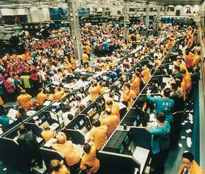

The London International Financial Futures and Options Exchange (LIFFE) is one of the foremost platforms for trading financial derivatives. Established to facilitate the exchange of futures and options contracts, LIFFE has played a significant role in shaping the landscape of financial trading. Futures and options are pivotal in modern finance, allowing market participants to hedge risks, speculate on future price movements, and achieve diversification in their investment portfolios. These contracts offer solutions to manage volatility and uncertainty in various markets, thus underscoring their importance.

Algorithmic trading has revolutionized financial markets by utilizing computer algorithms to execute trades at speeds and frequencies far exceeding human capabilities. This method of trading is crucial in today's markets for optimizing trading strategies, enhancing market efficiency, and providing liquidity. The intersection of algorithmic trading with exchanges like LIFFE is particularly noteworthy because it signifies a technological advancement in trading futures and options.

This article aims to explore LIFFE, its offered financial instruments, and the integral role of algorithmic trading. Understanding how LIFFE operates and interacts with algorithmic trading is essential for comprehending the broader financial market mechanisms. The interplay between these elements highlights a shift towards more technologically driven and efficient market operations. As financial markets continue to evolve, grasping the nuances of these interconnections becomes vital for traders, investors, and policymakers alike.

## Table of Contents

## Understanding LIFFE: A Brief History

The London International Financial Futures and Options Exchange (LIFFE) was established in 1982 to provide a marketplace for trading financial futures and options. The exchange aimed to offer a platform for the burgeoning financial derivatives market, which was rapidly gaining traction as a tool for risk management and speculative opportunities. Initially, LIFFE facilitated trading in futures contracts on UK Government bonds but quickly expanded its offerings to include other financial instruments.

Over the years, LIFFE reached several significant milestones in its development. In 1984, it introduced options contracts, broadening its product range. The 1990s were particularly transformative for LIFFE, as it transitioned from open outcry trading to electronic trading systems. This shift was crucial for accommodating increased trading volumes and improving market efficiency. By 1999, LIFFE had fully embraced electronic trading with the launch of its LIFFE CONNECT® platform, which provided high-speed access to the market.

A notable development in LIFFE's history was its merger with the Paris Bourse, Amsterdam Exchange, and Brussels Exchange in 2002, forming Euronext, a pan-European exchange. This merger enabled LIFFE to expand its market presence and integrate with a broader range of financial markets. The creation of Euronext was part of a larger trend of consolidation among global exchanges during this period, aiming to unify trading platforms and increase competitive advantage in the international financial landscape.

In its current status, LIFFE, integrated into Euronext's framework, remains a prominent player in the global financial market. It continues to offer a wide range of financial derivatives, including short-term [interest rate](/wiki/interest-rate-trading-strategies) futures, equity index futures, and options, catering to an international clientele. LIFFE's integration into the larger Euronext group has fortified its position by leveraging technological advancements and a wider network of market participants. The exchange's significance is underscored by its role in providing [liquidity](/wiki/liquidity-risk-premium) and risk management solutions, making it an essential component of the modern financial ecosystem.

## Financial Options and Futures: Key Concepts

Financial options and futures are essential components of modern financial markets, offering investors and traders a variety of strategies for hedging, speculation, and managing risk. Understanding these instruments is crucial for effectively navigating platforms like the London International Financial Futures and Options Exchange (LIFFE).

### Financial Options: Definitions and Types

Financial options are derivative instruments that give the holder the right, but not the obligation, to buy or sell an asset at a predetermined price before or at its expiration. The two primary types of options are "call options" and "put options." A call option provides the holder the right to purchase an asset, while a put option gives the right to sell an asset.

Options can be further categorized based on their style, such as "European options," which can only be exercised at expiration, and "American options," which can be exercised at any time before or at expiration. Another category includes "exotic options," which have more complex structures and payoff profiles, such as Asian options or barrier options.

### Understanding Futures: How They Work and Their Purposes

Futures contracts are agreements to buy or sell an asset at a future date at a predetermined price. Unlike options, futures obligate the parties to execute the trade upon the contract's expiration. Futures are typically standardized and traded on exchanges, which facilitates liquidity and transparency.

They serve various purposes, including hedging, where individuals or companies use futures to mitigate risk against price fluctuations, and speculation, where traders exploit price movements to achieve profit. Additionally, futures can be used for portfolio diversification and leverage, allowing investors to control a larger position with a smaller initial margin.

### Differences and Similarities Between Options and Futures

While both options and futures are derivatives that derive their value from an underlying asset, they have notable differences. The key distinction lies in the obligation; options provide the right without the obligation, whereas futures come with an obligation to fulfill the contract terms.

Moreover, pricing and risk profiles differ. Options have a premium paid upfront, representing their maximum potential loss, whereas future contracts require margin deposits and entail potentially unlimited risk. However, both instruments are used for hedging and speculation and can be part of sophisticated trading strategies.

Both options and futures contribute to market efficiency by enabling price discovery, improving liquidity, and allowing a transfer of risk between market participants.

### How LIFFE Facilitates Trading in These Financial Instruments

LIFFE has been pivotal in the standardization and electronic trading of financial options and futures. It offers a wide array of such contracts across different asset classes, including commodities, interest rates, and equities. LIFFE's state-of-the-art technological infrastructure supports high-speed trading, ensuring efficient execution and settlement of trades.

Moreover, LIFFE provides comprehensive market data and analysis tools, enabling traders to make informed decisions. By maintaining a robust regulatory framework and risk management systems, LIFFE ensures market integrity and participant protection.

Overall, LIFFE plays a crucial role in offering diverse trading opportunities and facilitating market access to a broad range of participants, from institutional investors to individual traders.

## Algorithmic Trading in Financial Markets

Algorithmic trading refers to the use of computer algorithms to automate trading processes, executing orders based on pre-defined criteria such as timing, price, or [volume](/wiki/volume-trading-strategy). This form of trading allows for the rapid execution of orders far beyond human capabilities, leveraging mathematical models and data analysis to optimize outcomes.

Over recent years, [algorithmic trading](/wiki/algorithmic-trading) has evolved significantly, driven by advancements in technology and access to data. High-frequency trading ([HFT](/wiki/high-frequency-trading-strategies)) has emerged as a subset of algorithmic trading, characterized by extremely high-speed trade execution and short holding periods. The increased availability of historical and real-time market data, advancements in computational power, and integration of [machine learning](/wiki/machine-learning) techniques have all contributed to the sophistication of algorithmic systems. Financial markets now witness a substantial portion of trading volume attributed to algorithmic transactions.

The advantages of using algorithms in trading, especially for futures and options, are notable. Algorithms can process vast amounts of information at speeds incomprehensible to human traders, thus facilitating the identification of [arbitrage](/wiki/arbitrage) opportunities and execution of complex strategies that would otherwise be infeasible. Additionally, algorithmic trading can minimize market impact by strategically breaking up large orders and executing them incrementally. This capacity is particularly beneficial in derivatives markets like futures and options, where timing and precision are crucial.

However, algorithmic trading also presents a set of challenges and risks. One significant concern is the potential for market [volatility](/wiki/volatility-trading-strategies), as algorithms can contribute to rapid price movements, evident in phenomena such as the "flash crash." Errors in algorithm design, often referred to as "glitches," can exacerbate market instability. Furthermore, the opacity of proprietary algorithms complicates regulatory oversight, posing a risk for market manipulation.

Moreover, algorithmic trading relies heavily on technology infrastructure; thus, system failures or connectivity issues can lead to significant financial losses. As algorithms become more prevalent, the competitive advantage may diminish, with more sophisticated strategies required to maintain an edge. The reliance on historical data for model training can lead to inaccuracies if market conditions shift unexpectedly, revealing the limitations of algorithmic predictions.

In conclusion, while algorithmic trading offers significant efficiencies and strategic advantages in futures and options markets, it also necessitates robust risk management and compliance with evolving regulatory frameworks to mitigate its inherent challenges.

## LIFFE and Algo Trading: A Perfect Combination

Algorithmic trading on the London International Financial Futures and Options Exchange (LIFFE) involves using computer algorithms to automatically execute trading strategies at speeds and frequencies beyond human capabilities. This practice benefits from the exchange's sophisticated technological infrastructure, which supports seamless execution and high-frequency trading activities.

### Technological Infrastructure Supporting Algo Trading at LIFFE

The technological backbone of LIFFE that facilitates algorithmic trading is primarily built around high-speed data transmission and advanced order processing systems. LIFFE utilizes cutting-edge trading platforms capable of handling large volumes of transactions with low latency. These platforms are designed to support direct market access (DMA), enabling traders to execute orders directly on the exchange without intermediary interference. The use of co-location services allows traders to place their servers in proximity to LIFFE's trading engines, reducing transmission time and further increasing execution speed. This is crucial for algorithmic traders, who often rely on millisecond responses to market movements.

Additionally, LIFFE integrates advanced Application Programming Interfaces (APIs) that allow traders to connect custom-built algorithms to the exchange's trading platform. This fosters a flexible environment where traders can implement complex quantitative strategies with ease.

### Case Studies of Successful Algorithmic Trading Operations on LIFFE

Several instances highlight the success of algorithmic trading on LIFFE. For example, [quantitative trading](/wiki/quantitative-trading) firms have implemented market-making algorithms that have significantly improved their execution efficiency. These algorithms continuously quote buy and sell prices for futures and options, maintaining a balance between supply and demand. By doing so, they help to narrow bid-ask spreads and improve market liquidity.

Another case involves [statistical arbitrage](/wiki/statistical-arbitrage) strategies employed by hedge funds, which identify and exploit pricing inefficiencies between correlated securities traded on LIFFE. By rapidly executing offsetting trades based on these inefficiencies, the algorithms capitalize on transient price discrepancies, resulting in profits.

### Impact of Algo Trading on LIFFE's Liquidity and Trading Volume

Algorithmic trading has had a profound impact on LIFFE's liquidity and trading volume. The continuous presence of algorithmic market makers has enhanced liquidity by ensuring there are always counterparties available for those looking to enter or [exit](/wiki/exit-strategy) positions. This increase in liquidity generally results in tighter bid-ask spreads, lower trading costs, and an overall more efficient market.

Moreover, the surge in trading volume attributable to algorithmic trading contributes to increased market activity, which can improve price discovery and more accurately reflect market sentiment. This heightened activity may be reflected in increased day-to-day volatility, although it usually leads to a more robust and responsive market environment.

Overall, the synergy between LIFFE's advanced technological infrastructure and the capabilities of algorithmic trading has not only fostered greater efficiency and liquidity but also transformed the trading arena into a dynamic and competitive landscape.

## Regulatory Considerations and Challenges

The regulatory framework governing trading on the London International Financial Futures and Options Exchange (LIFFE) is comprehensive, aimed at ensuring orderly and transparent market operations while protecting investors. LIFFE is part of Euronext, which is regulated by the Financial Conduct Authority (FCA) in the United Kingdom and adheres to the Markets in Financial Instruments Directive II (MiFID II) in the European context. MiFID II is crucial as it standardizes trading practices across EU member states, enhancing transparency and introducing robust reporting requirements for transactions.

Algorithmic trading, which involves the use of computer algorithms to execute trading decisions rapidly, is significantly impacted by these regulatory measures. The FCA and MiFID II stress the importance of maintaining market integrity and preventing manipulative trading practices, such as spoofing and layering, that can distort market prices. As such, algorithmic traders on LIFFE must comply with stringent requirements, including testing algorithms to ensure they do not disrupt market stability and monitoring algorithms' performance in real-time.

One of the primary challenges faced by algorithmic traders in terms of regulatory compliance is the need to establish systems that can quickly adapt to changing regulations. This involves substantial investment in compliance infrastructure and ongoing audits to ensure software adheres to regulatory standards. Additionally, there is the complexity of maintaining the audit trails required by regulators, which necessitates robust data storage and management systems.

In response to these challenges and the dynamic nature of technological advancements, several initiatives have been undertaken to update regulatory policies. For instance, the establishment of RegTech (Regulatory Technology) solutions assists traders and firms in efficiently managing compliance obligations through automation and improved analytical tools. These technologies offer advantages such as real-time monitoring and reporting, reducing the risk of non-compliance.

Furthermore, regulators are increasingly recognizing the benefits of algorithmic trading, such as enhanced liquidity and reduced transaction costs. As a result, there is an ongoing dialogue between regulatory bodies and market participants to refine regulations in ways that foster innovation without compromising market integrity. Changes within policies are also anticipated to be more adaptive to the rapid pace of emerging technologies, including [artificial intelligence](/wiki/ai-artificial-intelligence) and machine learning, which are beginning to play a more substantial role in trading strategies.

In summary, while regulations significantly guide algorithmic trading activities on LIFFE, requiring diligence and robust compliance systems, advancements in technology and collaborative regulatory evolution hold promise for more efficient regulatory adherence in the future.

## Future Trends in LIFFE and Algorithmic Trading

The London International Financial Futures and Options Exchange (LIFFE) continues to be an influential player as it adapts to evolving financial landscapes. Algorithmic trading, known for its ability to execute complex strategies at unmatched speeds, is anticipated to drive significant changes at LIFFE. 

Researchers and industry experts forecast that algorithmic trading at LIFFE will increasingly leverage cutting-edge technologies such as artificial intelligence (AI) and machine learning. These technologies can enhance predictive models, optimize trade execution, and allow for more sophisticated data analysis. Algorithms powered by AI can analyze vast datasets to identify patterns and trends, potentially increasing the accuracy of trading decisions. Machine learning can further automate the process by learning from historical data to improve strategies dynamically. An example of a machine learning model that could be useful in trading is the recurrent [neural network](/wiki/neural-network) (RNN), which is adept at sequence prediction due to its ability to retain memory of previous computations.

Regulatory frameworks will also shape the trajectory of algorithmic trading on platforms like LIFFE. Potential changes include enhanced scrutiny over algorithmic strategies to prevent market manipulation and ensure transparency. Such regulations might require more rigorous testing and validation of algorithms before deployment, ensuring compliance with market standards. The introduction of regulatory sandboxes could allow for the controlled experimentation of new trading technologies while maintaining oversight.

For traders and investors, these advancements present worthwhile opportunities. LIFFE's advanced infrastructure, coupled with these emerging technologies, could enable participants to devise innovative trading strategies that are more responsive to market conditions. By leveraging algo trading and the sophisticated tools available, traders might gain competitive advantages in execution efficiency and risk management.

In summary, the future of LIFFE and algorithmic trading promises a fusion of technology and regulation that could redefine trading dynamics, offering ample room for strategic innovation and growth.

## Conclusion

The London International Financial Futures and Options Exchange (LIFFE) remains a pivotal institution in the global financial markets. Its role as a hub for trading futures and options provides traders with essential tools for managing risk and speculating on price movements. The ability to leverage these financial instruments makes LIFFE a cornerstone for ensuring market efficiency and liquidity, attracting participants from various sectors worldwide.

Algorithmic trading has indisputably transformed the financial trading landscape, introducing speed, efficiency, and precision. By relying on sophisticated algorithms, traders can execute orders at a speed and volume impractical for human traders. This transformation has optimized trading strategies and enhanced market liquidity, allowing for more seamless and efficient price discovery.

Understanding LIFFE and algorithmic trading is strategically significant for any modern trader or investor. This knowledge allows participants to better navigate the complexities of today's markets and to adapt to their rapid evolution. As algorithmic trading strategies become more prevalent, traders adept at leveraging these technologies will be well-positioned to capitalize on market opportunities.

For traders seeking to remain competitive, embracing innovative technologies is no longer optional but a necessity. Technologies such as artificial intelligence and machine learning offer the potential to analyze vast amounts of data quickly, thereby identifying patterns and trends that were previously inaccessible. By integrating these advanced capabilities into their trading strategies, traders can enhance their decision-making processes, ensuring they remain at the forefront of developments within LIFFE and the broader financial market landscape.

## References & Further Reading

[1]: Mackenzie, D. (2005). ["An Engine, Not a Camera: How Financial Models Shape Markets."](https://academic.oup.com/mit-press-scholarship-online/book/20588) MIT Press.

[2]: Lopez de Prado, M. (2018). ["Advances in Financial Machine Learning."](https://www.amazon.com/Advances-Financial-Machine-Learning-Marcos/dp/1119482089) Wiley.

[3]: Chan, E. (2008). ["Quantitative Trading: How to Build Your Own Algorithmic Trading Business."](https://github.com/ftvision/quant_trading_echan_book) Wiley Finance.

[4]: Dunis, C., Laws, J., & Hudson, R. (2003). ["Applied Quantitative Methods for Trading and Investment."](https://onlinelibrary.wiley.com/doi/book/10.1002/0470013265) Wiley.

[5]: Aronson, D. R. (2007). ["Evidence-Based Technical Analysis: Applying the Scientific Method and Statistical Inference to Trading Signals."](https://onlinelibrary.wiley.com/doi/book/10.1002/9781118268315) Wiley Trading.

[6]: Jansen, S. (2018). ["Machine Learning for Algorithmic Trading: Predictive Models to Extract Signals from Market and Alternative Data for Systematic Trading Strategies with Python."](https://github.com/stefan-jansen/machine-learning-for-trading) Packt Publishing.

[7]: Raghunathan, V. et al. (2011). ["Algorithmic Trading and Computational Finance."](https://onlinelibrary.wiley.com/doi/full/10.1111/j.1540-6261.2010.01624.x) Amsterdam Business School.

[8]: Aldridge, I. (2013). ["High-Frequency Trading: A Practical Guide to Algorithmic Strategies and Trading Systems."](https://onlinelibrary.wiley.com/doi/pdf/10.1002/9781119203803.fmatter) Wiley.

[9]: Hasbrouck, J. (2007). ["Empirical Market Microstructure: The Institutions, Economics, and Econometrics of Securities Trading."](https://academic.oup.com/book/52241) Oxford University Press.