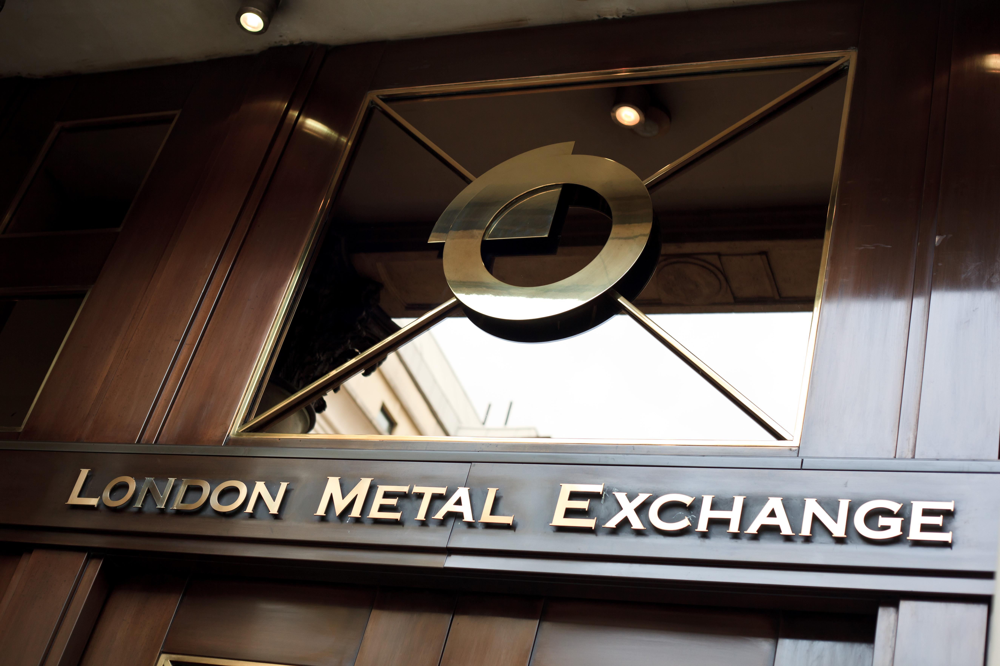

The London Metal Exchange (LME) is an essential component of the global commodities market, where it specializes in the trading of metal futures and options. Established in 1877, the LME has grown to become the largest market for these transactions globally. Its long history underscores its continuing importance and resilience in the continuously evolving financial environment. Over the years, the LME has witnessed numerous technological advancements that have shaped its trading processes. One of the most significant developments has been the rise of algorithmic trading, which leverages advanced algorithms to optimize the execution of trades.

Algorithmic trading represents a transformative shift, allowing trades to be executed with enhanced accuracy and speed. This development has particular significance for the LME, given its focus on futures and options. The integration of such technologies has enabled traders to manage risks more effectively and to pursue more sophisticated trading strategies. As the trade of metals becomes increasingly digital, the implications of algorithmic trading become even more significant, influencing not only trade execution but also market behavior and participation.

This article will explore the LME's history, detailing its journey from a traditional trading platform to one that incorporates modern, digital methodologies. Additionally, this exploration will highlight the evolving impact of algorithmic trading, particularly its effects on liquidity, market dynamics, and the broader trend towards automation within the financial markets. Through this, we aim to understand how the LME continues to adapt in order to maintain its leadership position in the commodities sector, balancing its rich history with the need to embrace technological advancements.

## Table of Contents

## History of the London Metal Exchange

The London Metal Exchange (LME) has a rich and storied history, with its origins linked to the broader development of metal trading in London. Metal trading activities at the Royal Exchange, which dates back to 1571, can be considered the initial stages of what would eventually become the LME. This institution played a crucial role in facilitating the trading of various commodities, including metals, during a time when London was emerging as a hub for global trade.

The official establishment of the LME occurred in 1877, marking a significant milestone in the history of metal trading. The introduction of standardized metal contracts at this time provided a framework for more systematic and organized trading, helping to reduce uncertainties and risks associated with the trade. This establishment enabled the LME to become a cornerstone institution for the global metals market.

A key feature of the LME's historical trading methods is 'ring trading', which can be traced back to the early 18th century at the Jerusalem Coffee House. This form of trading involved traders gathering in a physical ring, using open outcry to make trades. This method was central to the operation of the LME for decades and is one of the factors that distinguished it from other exchanges.

Over the years, the LME has undergone numerous changes and adaptations. One of the most notable events in its recent history was the acquisition by Hong Kong Exchanges and Clearing (HKEX) in 2012. This acquisition marked a new era for the LME, integrating it more closely with Asian markets and highlighting the globalization of commodity trading.

Despite various challenges, such as recent lawsuits over nickel trades, the LME has shown resilience and flexibility. These legal battles underscore ongoing issues within the commodities market, including price [volatility](/wiki/volatility-trading-strategies) and trading regulations. However, the LME remains an integral part of metal trading, continuing to serve as a benchmark for pricing and a venue for risk management in the metals industry.

Through its evolution, the LME has maintained its status as the largest exchange of its kind in the world, continually adapting to technological advancements and market demands while balancing its historical legacy with modern developments.

## Trading Metals on the LME

The London Metal Exchange (LME) employs a diverse array of trading methods designed to cater to different trader preferences and to maintain robust market operations. These methods include open outcry, electronic trading, and telephone systems. The open outcry system, also known as 'ring trading,' is a traditional method that remains a hallmark of the LME. The trading floor or 'ring' is arranged in such a way that brokers participate in intense five-minute trading sessions for each metal contract. This method provides an unparalleled trading experience that relies on verbal communication and the quick relay of orders.

Despite the unique characteristics of ring trading, the convenience and efficiency of electronic trading via the LME Select platform have gradually shifted the trend towards digital transactions. LME Select facilitates electronic access for market participants globally and is instrumental for executing trades rapidly and with precision. The electronic trading platform supports futures and options contracts for a variety of base and precious metals, thus broadening the reach and appeal of the LME's offerings.

In addition to these methods, trading can also be conducted through telephone systems, offering another layer of flexibility for participants. This method aids in ensuring that traders have access to real-time market data and can respond quickly to fluctuations within the metal markets.

The LME's trading activities are focused on futures and options contracts, which serve both hedgers and speculators in the market. Futures contracts enable market participants to lock in prices for metals at a predetermined future date, providing a measure of risk control. Conversely, options contracts offer the right, but not the obligation, to trade at pre-set conditions, providing a strategic opportunity for risk management and speculation.

The gradual shift towards electronic trading is fueled by technological advancements that offer increased accessibility and reduced transaction times. Despite these shifts, the physical trading floor remains operational, preserving the tradition and legacy of the LME's open outcry system. This dual mode of operation reflects the LME's commitment to serving diverse trading preferences while advancing towards contemporary, digital trading solutions.

## The Role of Algorithmic Trading

Algorithmic trading has brought a significant transformation to the trading practices on the London Metal Exchange (LME), fundamentally altering how trades are executed. At its core, [algorithmic trading](/wiki/algorithmic-trading) employs sophisticated algorithms to automate the trading process, enabling traders to perform high-frequency trades with remarkable accuracy and speed. This practice proves invaluable for both hedgers—who aim to reduce risk by taking offsetting positions—and speculators, who seek to capitalize on market movements for profit. 

One of the primary advantages of algorithmic trading is its ability to manage and execute trades with precision. Algorithms can process vast amounts of market data almost instantaneously, allowing traders to respond to market moves quicker than human capability. This capability is crucial in a fast-paced environment like the LME, where metal prices can fluctuate rapidly due to geopolitical factors, economic indicators, or changes in supply and demand dynamics.

The incorporation of [artificial intelligence](/wiki/ai-artificial-intelligence) (AI) and [machine learning](/wiki/machine-learning) into algorithmic trading has further optimized trading strategies. These technologies enable algorithms to learn from historical data and market patterns, improving their predictive accuracy over time. For example, machine learning models can be trained to identify complex patterns in price movements, thus enhancing the strategy's ability to predict future price actions and make informed trading decisions.

The transition to algorithmic trading is part of a larger trend toward greater automation and digitization in financial markets. This trend is driven by the need for efficiency and the desire to minimize human error in trading activities. Automated systems can function around the clock, providing continuous market monitoring and execution capabilities that are not feasible through manual methods alone.

In summary, algorithmic trading on the LME enhances trade execution by leveraging technology to provide accuracy, speed, and efficiency. It empowers market participants to better manage risks and exploit trading opportunities through advanced data analysis and predictive modeling. As financial markets continue to embrace technological advancements, algorithmic trading is set to play an increasingly central role.

## Impact of Algorithmic Trading on the LME

Algorithmic trading has revolutionized the way the London Metal Exchange (LME) operates, significantly increasing both [liquidity](/wiki/liquidity-risk-premium) and market depth. The use of sophisticated algorithms allows trades to be executed with remarkable speed and precision, enhancing the efficiency of markets. As traders execute large volumes of small orders, the liquidity is improved, thus promoting smoother price discovery and reducing bid-ask spreads. This enhanced liquidity ensures that large trades can be made without substantially affecting the market price, a crucial aspect for a commodity exchange dealing with high-value transactions [1].

The increasing reliance on algorithms has brought about a demand for stringent regulatory measures to ensure fair and transparent trading. Regulatory bodies are tasked with overseeing the implementation of algorithms that execute trades, ensuring they adhere to established market rules, and do not engage in manipulative practices. The Financial Conduct Authority (FCA) in the UK, among others, plays a critical role in overseeing algorithmic trading on the LME, thus protecting the integrity of the market [2].

Digital trading platforms have further facilitated a more global participation in metal trading. The transition to electronic systems means markets are accessible to a wider audience, breaking down geographical barriers that once limited participation. This democratization of access allows for increased competition and a more diverse array of market participants, ranging from individual traders to large hedge funds and institutional investors.

Despite these advantages, algorithmic trading also introduces potential risks. One of the key concerns is the occurrence of flash crashes, where rapid, automated trades can lead to sudden and significant drops in asset prices within minutes or even seconds. Such events highlight the volatility that algorithmic systems can introduce to the market, raising questions about the stability of relying heavily on automated systems. Moreover, the speed and complexity of algorithmic trades can potentially outpace human decision-making, increasing the risk of unforeseen consequences during periods of market stress.

To mitigate these risks, continuous adaptation and technological innovation are essential. Improvements in electronic market interfaces, the development of more sophisticated risk management tools, and the employment of techniques such as circuit breakers that temporarily halt trading during extreme volatility are some measures being implemented. The integration of artificial intelligence and machine learning can also aid in refining algorithms for better decision-making, thus ensuring a balance between rapid trade execution and market stability.

In summary, while algorithmic trading offers significant advantages for the LME, including increased efficiency, liquidity, and global participation, it also necessitates robust regulatory frameworks to mitigate associated risks. Continuous technological advancement is pivotal in navigating the challenges posed by automated trading, ensuring the longevity and resilience of the LME as a central hub for metal trading.

### References
1. Harris, L. (2003). *Trading and Exchanges: Market Microstructure for Practitioners*. Oxford University Press.
2. FCA. (n.d.). Algorithmic trading compliance in wholesale markets. Retrieved from the Financial Conduct Authority official website.

## Conclusion

The London Metal Exchange (LME) stands as a key institution in the global commodities market, consistently adapting to technological progress while acknowledging its historical roots. Algorithmic trading has emerged as a powerful force in influencing the future landscape of trading on the LME. By leveraging advanced algorithms, traders can achieve rapid execution speeds, enhance precision, and optimize risk management strategies.

The LME's journey is characterized by a delicate balance between upholding longstanding trading traditions and integrating modern technology. Traditional practices, such as "ring trading," coexist alongside electronic trading platforms, highlighting the Exchange's commitment to preserving its unique heritage while embracing the benefits of digital transformation. This dual approach enables traders and institutions to navigate new methodologies and seize emerging opportunities within a rapidly evolving market environment.

As the digitalization of financial markets continues, the LME is positioned to maintain its status as a preeminent leader in the commodities sector. The Exchange's ability to blend innovation with its legacy ensures that it remains relevant and competitive. Moving forward, the LME's ongoing commitment to technological integration and adaptation is likely to reinforce its pivotal role in the industry, offering robust trading solutions that cater to a diverse, global clientele.

## References & Further Reading

[1]: Harris, L. (2003). [*Trading and Exchanges: Market Microstructure for Practitioners*](https://www.amazon.com/Trading-Exchanges-Market-Microstructure-Practitioners/dp/0195144708). Oxford University Press.

[2]: FCA. (n.d.). [Algorithmic trading compliance in wholesale markets](https://www.fca.org.uk/publications/multi-firm-reviews/algorithmic-trading-compliance-wholesale-markets). Retrieved from the Financial Conduct Authority official website.

[3]: Bergstra, J., Bardenet, R., Bengio, Y., & Kégl, B. (2011). ["Algorithms for Hyper-Parameter Optimization."](https://proceedings.neurips.cc/paper/2011/file/86e8f7ab32cfd12577bc2619bc635690-Paper.pdf) Advances in Neural Information Processing Systems 24.

[4]: Lopez de Prado, M. (2018). [*Advances in Financial Machine Learning*](https://www.amazon.com/Advances-Financial-Machine-Learning-Marcos/dp/1119482089). Wiley.

[5]: Chan, E. P. (2008). [*Quantitative Trading: How to Build Your Own Algorithmic Trading Business*](https://github.com/ftvision/quant_trading_echan_book). Wiley.

[6]: Jansen, S. (2020). [*Machine Learning for Algorithmic Trading*](https://github.com/stefan-jansen/machine-learning-for-trading). Packt Publishing.