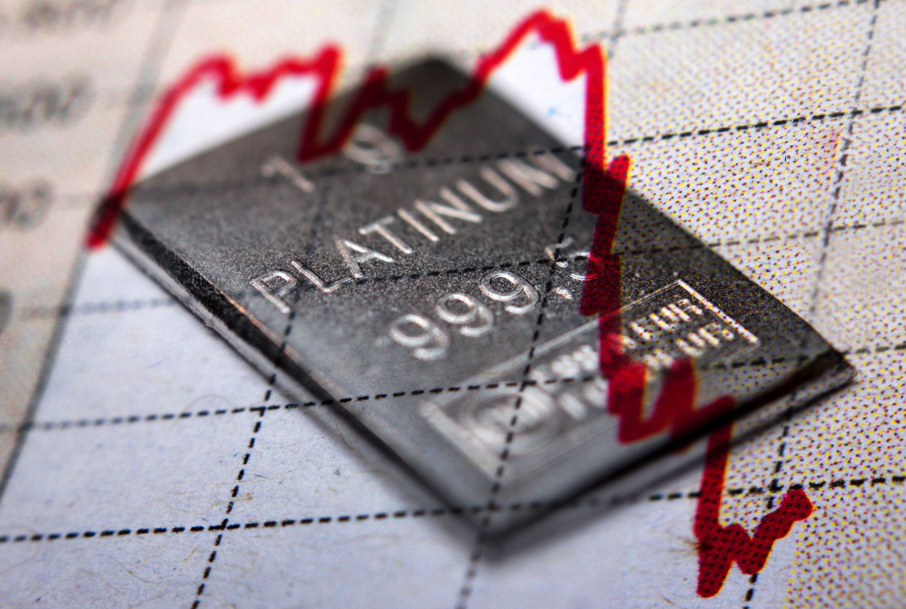

The London Metal Exchange (LME) is an integral part of the global commodities market, specializing in the trading of base and precious metals. Established in 1877, it provides a structured environment for the trading of complex financial instruments such as futures, options, and other derivatives. As a pivotal institution in the metals market, LME sets the benchmark for metal prices worldwide, influencing industries ranging from manufacturing to technology.

Historically, the LME has been a critical venue for managing price risk associated with metal commodities. Its open outcry trading system, electronic trading platform LME Select, and telephone-based trading exemplify its adaptable approach to transaction execution. These methodologies facilitate both physical deliveries and financial transactions, underscoring the Exchange's comprehensive role.



Metals traded at the LME, including aluminum, copper, nickel, zinc, and lead, are essential to various industrial applications. More recently, LME has ventured into precious metals such as gold and silver and incorporated specialty metals like cobalt. This diversification aligns with the growing demand from sectors such as electric vehicle manufacturing and renewable energy.

The emergence of algorithmic trading (algo trading) represents a significant shift in the LME's trading landscape. Algo trading leverages complex algorithms to automate decision-making processes, enhancing speed and precision. This technology-driven approach has transformed market dynamics by improving liquidity, optimizing trade execution, and minimizing human error.

This article highlights the continued importance of the London Metal Exchange within the global commodities market. By examining the evolution of trading methods and the integration of algo trading, readers will understand how technological advancements are redefining the industry. Current trends and innovations will further shape metal trading at the LME, ensuring its enduring relevance in the commodities sector.

## Table of Contents

## Understanding the London Metal Exchange

The London Metal Exchange (LME) stands as a pivotal institution in the global metals market, renowned for its extensive history and crucial role in pricing and trading a diverse range of metals. Established in 1877, the LME has evolved into one of the world's largest and oldest commodities exchanges, acting as a benchmark for global metal prices. 

Traders at the LME engage in futures and options trading, primarily focusing on metals such as aluminum, copper, zinc, lead, and nickel. These contracts enable participants to hedge against price fluctuations, manage risk, and capitalize on investment opportunities. The LME's capacity to facilitate price discovery for these metals is essential for manufacturers, investors, and industries reliant on raw materials.

The LME employs three distinct trading methods to serve the varied needs of market participants. Open outcry, a traditional form of trading, occurs in the iconic trading ring, where traders physically execute transactions through vocal bids and offers. This method maintains the exchange's historic charm and continues to attract stakeholders who value face-to-face negotiation.

In response to the digital evolution of markets, the LME introduced electronic trading via its LME Select platform. This system offers a more accessible and efficient means of trading, allowing participants to execute transactions quickly and with greater precision. The electronic platform enhances market transparency and [liquidity](/wiki/liquidity-risk-premium), crucial for modern trading dynamics.

Additionally, the LME provides a telephone trading system, which acts as an intermediary option between open outcry and electronic trading. This method supports traders in executing transactions when other avenues may not be preferable or available, thereby ensuring continuous market operation.

A vital aspect of the LME's infrastructure is its warehouse receipt repository services. This facet facilitates the physical delivery of metals, in tandem with financial trading activities. By storing metals in a network of approved warehouses globally, the LME provides assurance regarding the quality and quantity of traded goods. Traders can opt for physical delivery upon contract maturity, an essential feature for those requiring actual metal commodities for production and manufacturing processes.

In summary, the London Metal Exchange's comprehensive structure supports a wide array of trading activities, underpinning global metal markets through its diverse trading methods and robust infrastructure. Its role in price setting, risk management, and facilitating both financial and physical transactions cements its status as a cornerstone of the commodities trading landscape.

## Key Metals Traded at the London Metal Exchange

The London Metal Exchange (LME) is renowned for its focus on a core group of base metals, which are crucial for various industrial applications. Among these, aluminum, copper, nickel, zinc, and lead serve as the foundation of the exchange's trading activities.

**Base Metals:**

1. **Aluminum**: Widely used in the construction, transportation, and packaging industries due to its lightweight and corrosion-resistant properties, aluminum is a key commodity on the LME. The exchange provides a platform for both buyers and sellers to hedge against price volatility in the global aluminum market.

2. **Copper**: An essential component in electrical wiring, plumbing, and telecommunications, copper's conductive properties have made it a fundamental metal for modern infrastructure. The LME offers futures contracts on copper, aiding industries in managing supply chain risks.

3. **Nickel**: Primarily used in stainless steel production, nickel is also integral to the manufacturing of batteries, especially within the burgeoning electric vehicle (EV) sector. The LME facilitates trading in nickel to allow producers and consumers to hedge against price fluctuations.

4. **Zinc**: As an important material for galvanization, zinc is employed to protect steel from rusting, which is vital in construction and automotive applications. The LME supports zinc trading, helping stabilize prices in these industries.

5. **Lead**: Utilized in batteries, particularly in automotive and backup power systems, lead remains a significant metal in the LME's portfolio. Its trading ensures that industries reliant on lead have a mechanism to manage price risk effectively.

**Expansion to Precious Metals:**

The LME has extended its reach beyond base metals by incorporating precious metals such as gold and silver. This expansion is facilitated through platforms like LMEprecious, which provides a structured market for price risk management in these commodities.

**Incorporation of Specialty Metals:**

In recent years, the exchange has broadened its range to include specialty metals such as cobalt and molybdenum. These metals are increasingly important, particularly in the context of EV batteries and industrial catalysts. Cobalt is essential for high-performance battery applications, supporting the shift towards renewable energy and clean transportation. Molybdenum enhances strength and heat resistance in steel and chemical applications.

**Strategic Importance:**

The metals traded on the LME are vital for numerous sectors, offering companies a mechanism for strategic hedging and investment. Through this diverse portfolio, the LME not only supports traditional industries but also caters to emerging technological sectors, reinforcing its position as a global benchmark for metal prices.

## The Role of Algo Trading in the LME

Algo trading, or [algorithmic trading](/wiki/algorithmic-trading), has significantly transformed trading practices within the London Metal Exchange (LME). By leveraging sophisticated algorithms, algo trading automates decision-making processes, enhancing speed and efficiency across trading platforms like LME Select. This technological advancement enables traders to respond rapidly to market dynamics, capturing fleeting opportunities that might otherwise be missed in traditional trading methods.

A primary advantage of algo trading is its ability to minimize human error. Traditional trading is prone to biases and emotional decisions, but algorithmic strategies rely on logical frameworks and data-driven insights. This systematic approach allows traders to implement complex strategies designed to take advantage of minor market fluctuations. For instance, by using statistical [arbitrage](/wiki/arbitrage) techniques, traders can exploit pricing inefficiencies across different contracts or execution venues.

The infrastructure required for algo trading is both robust and demanding. Unlike conventional trading, algorithmic strategies necessitate high-speed computing capabilities and advanced data analytics. Participants must develop and maintain a sophisticated technological ecosystem capable of processing large volumes of data in real time. This involves leveraging high-frequency trading ([HFT](/wiki/high-frequency-trading-strategies)) setups and ensuring low-latency connections to the LME trading platforms.

An example Python snippet for a simple moving average crossover strategy might look like this:

```python
import numpy as np
import pandas as pd

def moving_average_crossover_strategy(prices, short_window, long_window):
    signals = pd.DataFrame(index=prices.index)
    signals['price'] = prices
    signals['short_mavg'] = prices.rolling(window=short_window, min_periods=1).mean()
    signals['long_mavg'] = prices.rolling(window=long_window, min_periods=1).mean()
    signals['signal'] = 0
    signals['signal'][short_window:] = np.where(
        signals['short_mavg'][short_window:] > signals['long_mavg'][short_window:], 1, 0
    )
    signals['positions'] = signals['signal'].diff()
    return signals

# Example usage
prices = pd.Series([100, 102, 104, 101, 107, 109, 111, 105, 108, 112])
strategy_signals = moving_average_crossover_strategy(prices, short_window=3, long_window=5)
```

This script identifies potential buy and sell signals based on the crossover of short-term and long-term moving averages of metal prices. Such strategies underscore the importance of data analytics in refining trading decisions within the algo trading framework.

In conclusion, algo trading within the LME offers several advantages, including minimization of human error, implementation of complex trading strategies, and agility in market response. These benefits underscore its revolutionary impact on trading decisions, fostering precision and sustained engagement in the metal trading market.

## Advantages of Algo Trading in Metal Markets

Algorithmic trading (algo trading) in metal markets offers significant benefits by enhancing liquidity and improving price discovery. These algorithms facilitate a high [volume](/wiki/volume-trading-strategy) of transactions within short periods, thereby increasing market efficiency. The rapid execution of numerous trades within seconds or milliseconds ensures that the markets remain liquid, allowing traders to enter and [exit](/wiki/exit-strategy) positions with minimal price disruption.

One of the key advantages of algo trading is the consistency it brings to strategy execution, minimizing the impact of emotional trading decisions that can affect market outcomes. Human traders may be subject to biases and psychological factors that influence their decisions, leading to inconsistency. In contrast, algorithms operate based on predefined rules, executing trades systematically without subjective interference.

Algo trading also enables traders to backtest their strategies against historical market data. This involves running the algorithm on past data to evaluate its effectiveness and optimize its parameters for better performance in future market conditions. Backtesting helps traders identify potential flaws and adjust strategies accordingly, making them more robust and adaptive to market changes.

Additionally, algo trading is instrumental in risk management. By setting predetermined entry and exit points, algorithms can automate the process of buying and selling, reducing exposure to market [volatility](/wiki/volatility-trading-strategies). This precision ensures that trades are executed within desired risk levels, protecting traders from unexpected adverse market movements.

These advantages collectively contribute to a more stable and efficient trading environment. Algo trading's ability to process vast amounts of data quickly and execute complex strategies reliably positions it as a transformative tool in the metal markets, driving both operational efficiency and strategic decision-making.

## Challenges and Considerations

Transitioning to algorithmic trading in commodities at the London Metal Exchange (LME) poses several challenges that necessitate comprehensive consideration and strategic planning. Firstly, the adoption of algorithmic trading systems requires a substantial investment in technology infrastructure and domain expertise. This involves not only the procurement of advanced hardware and software solutions but also the hiring and training of highly skilled professionals who are proficient in both financial markets and algorithm development.

One of the primary challenges faced in algorithmic trading is market volatility. Markets can exhibit sudden price changes that may outpace the response capability of pre-programmed algorithms. This necessitates continuous refinement and adaptation of the algorithms to enhance their responsiveness to such fluctuations. A potential approach to address this issue is the implementation of [machine learning](/wiki/machine-learning) models that can adapt to changing market conditions dynamically. For instance, using Python's scikit-learn library, one might develop a model to predict price movements and adjust trading strategies accordingly:

```python
from sklearn.ensemble import RandomForestRegressor
import numpy as np

# Example: Training a model to predict price movements
X_train = np.array([...])  # Feature set
y_train = np.array([...])  # Target variable (e.g., price changes)

model = RandomForestRegressor(n_estimators=100, random_state=42)
model.fit(X_train, y_train)

# Predicting future price movements
X_test = np.array([...])  # New feature set
predictions = model.predict(X_test)
```

In addition to technical challenges, privacy concerns and regulatory considerations are critical when implementing algorithmic strategies. The LME, like other financial markets, is subject to stringent regulatory frameworks, and algorithmic errors can lead to significant financial consequences. Regulatory bodies demand transparency and accountability, requiring firms to maintain detailed logs and audit trails of algorithmic decisions. This means algorithms must be designed with compliance in mind, ensuring that trading practices adhere to legal and ethical guidelines.

Moreover, the high-speed nature of algorithmic trading can amplify errors, leading to substantial financial losses. Therefore, it is essential to periodically validate and update trading algorithms to ensure their effectiveness and accuracy in different market conditions. This involves stress testing algorithms under various simulated scenarios to identify potential weaknesses and deploy necessary corrections. For sustained success, market participants must be proactive in monitoring and upgrading their algorithmic systems, ensuring they are aligned with both technological advancements and evolving market dynamics. 

Understanding these considerations is vital for any entity looking to integrate algorithmic trading into their operations at the LME, balancing the benefits with the complexities and risks involved.

## Conclusion

The London Metal Exchange (LME) continues to play a crucial role in global metal trading, adapting to the demands of modern market dynamics. The integration of algorithmic trading represents a significant strategic shift, reflecting the increasing reliance on technology to enhance trading operations in the commodity sector. By incorporating algorithmic solutions, market participants can achieve greater speed, efficiency, and precision in executing trades, all of which are essential in the fast-paced and volatile metals market.

Nonetheless, the challenge for future market participants lies in effectively balancing innovative algorithmic methodologies with established traditional trading practices. While technology offers numerous advantages, it is imperative that traders remain vigilant, adapting to new innovations while maintaining a firm grasp on foundational trading strategies. Such a balanced approach ensures that advancements in technology complement rather than replace the core principles of metal trading.

As algorithmic trading methodologies continue to advance, they hold the promise of further enhancing trading efficiency and improving risk management. With continuous evolution, algorithmic trading is poised to significantly influence the metal trading landscape, enabling market participants to navigate complexities with heightened effectiveness. By leveraging cutting-edge technological advancements, the LME and its participants are well-positioned to shape the future of metal trading, ensuring that this vital marketplace remains at the forefront of global commodity trading.

## References & Further Reading

[1]: Bergstra, J., Bardenet, R., Bengio, Y., & Kégl, B. (2011). ["Algorithms for Hyper-Parameter Optimization."](https://proceedings.neurips.cc/paper/2011/file/86e8f7ab32cfd12577bc2619bc635690-Paper.pdf) Advances in Neural Information Processing Systems 24.

[2]: ["Advances in Financial Machine Learning"](https://www.amazon.com/Advances-Financial-Machine-Learning-Marcos/dp/1119482089) by Marcos Lopez de Prado

[3]: ["Evidence-Based Technical Analysis: Applying the Scientific Method and Statistical Inference to Trading Signals"](https://www.amazon.com/Evidence-Based-Technical-Analysis-Scientific-Statistical/dp/0470008741) by David Aronson

[4]: ["Machine Learning for Algorithmic Trading"](https://github.com/stefan-jansen/machine-learning-for-trading) by Stefan Jansen

[5]: ["Quantitative Trading: How to Build Your Own Algorithmic Trading Business"](https://www.amazon.com/Quantitative-Trading-Build-Algorithmic-Business/dp/1119800064) by Ernest P. Chan

[6]: Fenton-O'Creevy, M., Nicholson, N., Soane, E., & Willman, P. (2003). ["Trading on illusions: Unrealistic perceptions of control and trading performance."](https://psycnet.apa.org/record/2003-05283-003) Journal of Occupational and Organizational Psychology, 76(1), 53-68.

[7]: ["Inside the Metal Exchange"](https://www.youtube.com/watch?v=Mic1Q0oVfgM) by Jessie Schreer

[8]: Domowitz, I., & Steil, B. (1999). ["Automation, Trading Costs, and the Structure of the Trading Services Industry."](https://www.nomurafoundation.or.jp/en/wordpress/wp-content/uploads/2014/09/19971011_Ian_Domowitz_-_Benn_Steil.pdf) Review of Financial Studies, 12(1), 51-92.

[9]: Pirrong, S. C. (1995). ["Metals Markets and the U.S. Economy: A Report."](https://www.cambridge.org/core/books/commodity-price-dynamics/9C67EFBF989C2B5A8E9B8D8E12843476) Cato Institute.