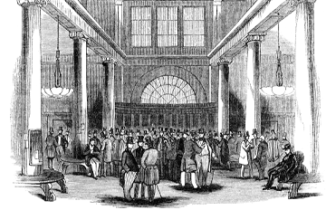

## Table of Contents

## What is the London Stock Exchange and when was it founded?

The London Stock Exchange is a place where people buy and sell shares of companies. It is one of the biggest stock exchanges in the world. People from all over the world can trade stocks, bonds, and other financial products there.

It was founded a long time ago, in 1801. Before that, people used to trade stocks in coffee houses in London. The London Stock Exchange helped make trading more organized and easier for everyone.

## What were the initial purposes and functions of the London Stock Exchange?

When the London Stock Exchange was first set up in 1801, its main purpose was to make trading stocks easier and more organized. Before that, people would meet in coffee houses to buy and sell shares. This was often chaotic and hard to keep track of. The new exchange gave traders a specific place to meet, which made everything more orderly. It also helped to set standard rules for how trading should happen, which made it fairer for everyone.

Another important function of the London Stock Exchange from the start was to help companies raise money. Companies could sell shares to the public, and people could buy these shares if they believed the company would do well. This gave companies the money they needed to grow and start new projects. At the same time, it gave people a chance to invest their money and possibly make a profit. So, the exchange played a big role in helping the economy grow by connecting companies with investors.

## How has the location of the London Stock Exchange changed over time?

The London Stock Exchange started in coffee houses, mainly Jonathan's Coffee House in the late 1600s. This was where people would meet to trade stocks and bonds. In 1773, they moved to a building called the New Jonathan's Coffee House, which was on Threadneedle Street. This building was later renamed the Stock Exchange.

In 1801, the London Stock Exchange officially became its own organization and moved into a new building on Capel Court, still near Threadneedle Street. It stayed there for a long time, over 150 years. In 1972, the exchange moved to a new building on Old Broad Street. This building was bigger and more modern. The latest move happened in 2004, when the London Stock Exchange moved to Paternoster Square, where it is today. Each move helped the exchange grow and keep up with changes in technology and trading.

## What significant technological advancements have impacted the London Stock Exchange?

The London Stock Exchange has seen many big changes because of technology. One of the most important was the introduction of electronic trading. Before, people had to be at the exchange to trade stocks. But in the 1980s, the exchange started using computers to trade. This made trading much faster and easier. People could trade from anywhere, not just at the exchange. This change helped the London Stock Exchange grow and reach more people around the world.

Another big technological advancement was the introduction of high-frequency trading. This is when computers make thousands of trades in just a few seconds. It started becoming popular in the 2000s. High-frequency trading made the market move very quickly and changed how trading works. It also brought new challenges, like making sure the market stays fair for everyone. These technological changes have made the London Stock Exchange a leader in the world of finance.

## Can you describe the major mergers and acquisitions involving the London Stock Exchange?

The London Stock Exchange has gone through a few big changes by merging with other companies or buying them. One of the biggest was in 2007 when it merged with Borsa Italiana, which is the Italian stock exchange. This merger made the London Stock Exchange Group bigger and stronger. It helped the group offer more services and reach more people in Europe. Another important move was in 2013 when the London Stock Exchange Group bought a company called LCH.Clearnet. LCH.Clearnet helps make sure trades are safe and secure. This purchase helped the group offer even more services to its customers.

In 2015, the London Stock Exchange Group made another big move by merging with the Frankfurt Stock Exchange, which is called Deutsche Boerse. This was supposed to create a huge European stock exchange, but it didn't happen in the end because of some problems with rules and competition. However, the London Stock Exchange Group kept growing. In 2021, they bought a company called Refinitiv, which gives financial data and news to people all over the world. This made the London Stock Exchange Group even bigger and helped them offer even more services to people who trade stocks and other financial products.

## What role did the London Stock Exchange play during major economic events like the Great Depression?

During the Great Depression, which started in 1929, the London Stock Exchange played a big role in showing how bad things were. When the stock market in the United States crashed, it affected markets all over the world, including the London Stock Exchange. Prices of stocks in London dropped a lot, and many people lost a lot of money. The exchange was a place where people could see how bad the economy was getting. It was also a place where people tried to sell their stocks to get some money back, but it was hard because nobody wanted to buy.

The London Stock Exchange also tried to help during the Great Depression. They made some rules to try and keep the market from getting too crazy. For example, they stopped trading for a little while to give people time to calm down. They also worked with the government to try and help the economy get better. Even though the exchange couldn't fix everything, it was important in showing what was happening and trying to help.

## How has the regulatory environment of the London Stock Exchange evolved?

The regulatory environment of the London Stock Exchange has changed a lot over time. In the beginning, the rules were pretty simple. The exchange made its own rules to keep trading fair and organized. But as the economy grew and more people started trading, the government got more involved. In the 1980s, the UK government made big changes to how the financial markets worked. They passed laws like the Financial Services Act, which set up new rules to protect investors and make sure the market was fair. This meant the London Stock Exchange had to follow these new rules and work closely with the government to make sure everything was done right.

Later on, the regulatory environment became even stricter. After the financial crisis in 2008, governments around the world, including the UK, made even more rules to try and stop big problems from happening again. The Financial Conduct Authority (FCA) and the Prudential Regulation Authority (PRA) were set up to watch over the financial markets, including the London Stock Exchange. These organizations made sure that the exchange followed all the rules and that companies listed on the exchange were honest about their finances. Today, the London Stock Exchange has to follow a lot of rules to keep the market safe and fair for everyone.

## What are some of the most notable companies that have been listed on the London Stock Exchange?

Some of the most famous companies that have been listed on the London Stock Exchange are big names that many people know. One of them is BP, which is a huge oil and gas company. Another is HSBC, a big bank that works all over the world. There's also GlaxoSmithKline, which makes medicines and helps people stay healthy. These companies are important because they show how the London Stock Exchange helps big businesses grow and do well.

Other notable companies include Royal Dutch Shell, another giant in the oil and gas industry, and Unilever, which makes lots of everyday products like food and cleaning supplies. Vodafone, a big phone and internet company, is also listed on the exchange. These companies being on the London Stock Exchange shows how it's a place where different kinds of businesses can come to get money from investors and help the economy grow.

## How does the London Stock Exchange contribute to the global financial market?

The London Stock Exchange plays a big role in the global financial market by helping companies from all over the world raise money. When a company wants to grow or start new projects, it can sell shares on the exchange. People and other companies from around the world can buy these shares, giving the company the money it needs. This helps the global economy grow because it connects companies with investors who want to make their money grow.

The exchange also helps the world's financial markets work smoothly. It uses new technology to make trading fast and easy. People can trade stocks, bonds, and other financial products from anywhere in the world. This makes the market more connected and helps money move around the world more easily. By setting rules and working with other exchanges, the London Stock Exchange helps keep the global market fair and safe for everyone.

## What are the key indices associated with the London Stock Exchange and what do they represent?

The London Stock Exchange has some important indices that people use to understand how the market is doing. The FTSE 100 is one of the most famous ones. It shows how the 100 biggest companies on the exchange are doing. If the FTSE 100 goes up, it means these big companies are doing well, and if it goes down, it means they're not doing as well. The FTSE 100 is often used to see how the UK economy is doing because these big companies are a big part of it.

Another important index is the FTSE 250. This one looks at the next 250 biggest companies after the FTSE 100. These companies are a bit smaller but still very important. The FTSE 250 can give people a good idea of how the rest of the UK economy, outside of the very biggest companies, is doing. Together, the FTSE 100 and FTSE 250 make up the FTSE 350, which gives a broader picture of the market.

There's also the FTSE All-Share, which includes almost all the companies listed on the London Stock Exchange. It gives people the fullest view of how the whole market is doing. These indices help investors and people who follow the market understand trends and make decisions about where to put their money.

## How has the London Stock Exchange adapted to Brexit and what are the ongoing implications?

The London Stock Exchange has had to make some changes because of Brexit. Brexit means the UK left the European Union, and this changed some of the rules about trading. The exchange had to make sure it could still work well with companies and investors from Europe. They did things like setting up new systems to follow the new rules and making sure they could keep trading smoothly. They also worked to keep the exchange attractive to companies from around the world, even with the changes.

The ongoing implications of Brexit for the London Stock Exchange are still being figured out. Some companies have moved their main offices to other places in Europe to make sure they can still do business easily there. This might mean less business for the London Stock Exchange. But the exchange is also trying to attract more companies from outside Europe to list their shares there. This could help make up for any business they lose. Overall, the London Stock Exchange is working hard to stay a big and important part of the world's financial markets, even with the changes Brexit has brought.

## What future trends and innovations are expected to influence the London Stock Exchange?

The London Stock Exchange is likely to see a lot of changes in the future because of new technology and trends. One big trend is the use of [artificial intelligence](/wiki/ai-artificial-intelligence) (AI) and [machine learning](/wiki/machine-learning). These technologies can help the exchange make trading faster and more accurate. They can also help find patterns in the market that people might miss. Another trend is the growth of sustainable investing. More and more people want to invest in companies that are good for the environment and society. The London Stock Exchange might start new ways to help these investors find the right companies to invest in.

Another important innovation is blockchain technology. Blockchain can make trading safer and more transparent. It can also help with things like settling trades faster. The London Stock Exchange is already looking at how to use blockchain to improve its services. Also, as more people around the world start trading, the exchange might need to work even harder to stay connected with global markets. This could mean more partnerships with other exchanges and new ways to make trading easier for people from different countries.

## References & Further Reading

[1]: Michie, R. C. (1999). ["The London Stock Exchange: A History."](https://archive.org/details/londonstockexcha0000mich) Oxford University Press.

[2]: Harris, L. (2003). ["Trading and Exchanges: Market Microstructure for Practitioners."](https://academic.oup.com/book/52292) Oxford University Press.

[3]: Gomber, P., Arndt, B., Lutat, M., & Uhle, T. (2011). ["High-Frequency Trading."](https://papers.ssrn.com/sol3/papers.cfm?abstract_id=1858626) Springer.

[4]: MacKenzie, D. (2018). ["Material Signals: A Historical Sociology of High-Frequency Trading."](https://www.semanticscholar.org/paper/Material-Signals%3A-A-Historical-Sociology-of-MacKenzie/a3347764ea03c35bddbc703940a907c6e52f6f6b) Social Forces.

[5]: Moosa, I. A. (2014). ["The Myth of Too Big To Fail."](https://link.springer.com/book/10.1057/9780230295056) Palgrave Macmillan.

[6]: Waters, R. (2019). ["The Big Bang of 1986: A Revolution in UK Financial Markets."](https://en.wikipedia.org/wiki/Big_Bang_(financial_markets)) Financial Times.