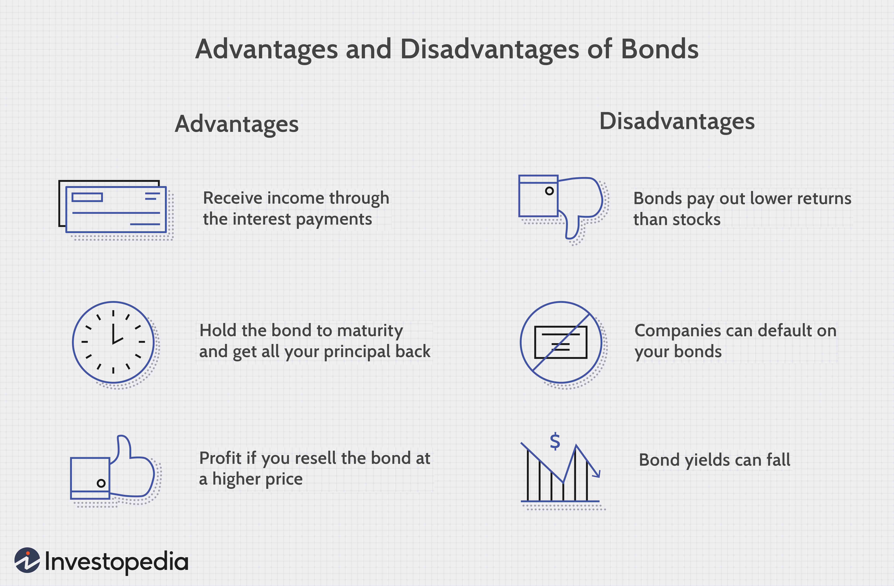

Fixed income securities, particularly bonds, play a crucial role in investment portfolios by providing stability and consistent returns. They are instrumental in offsetting the volatility typically associated with equities, thereby serving as a balancing component in diversified portfolios. The predictable income streams from fixed income securities stem from regular interest payments and the return of principal upon maturity, making them particularly appealing to conservative investors. Such investors often prioritize capital preservation and predictable yields, finding long bonds an attractive option for consistent, long-term income.

Bond investments continue to appeal to those seeking structured returns over a longer horizon, often aligning with financial goals that prioritize stability over aggressive growth. Bonds are seen as a shield against market volatility, serving not only individual investors but also institutional bodies including pension funds and insurance companies. Their inclusion in a portfolio can smooth out fluctuations caused by equity market downturns, stabilizing overall portfolio returns.



In recent years, the advent of algorithmic trading has significantly impacted bond markets, enhancing efficiency and precision in trading activities. Algorithmic trading utilizes computer algorithms to execute trades at optimal speeds and prices, processing large volumes of data far beyond human capacity. This tech-driven approach has increased market liquidity and reduced the cost of trading in bond markets. By automating the process, algorithmic trading can identify market trends and execute trades with improved accuracy and reduced latency.

The intersection of fixed income securities, bond investment, and algorithmic trading is reshaping the traditional landscapes of investing. Algorithms are now capable of predicting market movements through sophisticated models, including machine learning, further refining bond trading strategies. This evolution in technology, coupled with the conservative nature of bond investing, highlights a dynamic shift toward more computational approaches in finance.

This article aims to explore the interaction between fixed income securities, traditional bond investment strategies, and the emerging role of algorithmic trading. By examining these areas, the article will shed light on how they collectively influence modern investment practices, optimize returns, and manage risks in today's evolving financial markets.

## Table of Contents

## Understanding Fixed Income Securities

Fixed income securities are financial instruments that obligate the issuer to make fixed payments over a specified period. The most common type of fixed income security is a bond. Bonds are debt instruments where the investor loans money to an entity (government, corporation, etc.) under predefined terms. The issuer of the bond agrees to pay back the principal sum on a specific date, known as the maturity date, and usually at fixed or variable interest rates over the bond's term. These periodic interest payments are known as coupon payments.

Bonds play a critical role in diversifying investment portfolios. They are widely regarded as less volatile than equities, offering a predictable stream of income and typically viewed as safer, especially in the cases of government bonds. As a result, bonds are an effective tool for mitigating risk. By including bonds in a portfolio, investors can balance out more volatile asset classes, reducing the overall portfolio risk through diversification.

Different types of bonds cater to varying investor needs and risk profiles.

1. **Government Bonds**: These are issued by national governments and are considered one of the safest investments due to the backing by the government's creditworthiness. They offer relatively lower yields compared to other bonds due to their lower risk. U.S. Treasury bonds are a prime example.

2. **Municipal Bonds**: Issued by states, municipalities, or counties, these bonds often provide tax-free interest income, making them attractive to those in higher tax brackets. They carry a slightly higher risk than government bonds but still offer good stability.

3. **Corporate Bonds**: These are issued by corporations to raise capital for business activities. They usually provide higher yields than government bonds due to the higher default risk associated with corporations.

4. **High-Yield (Junk) Bonds**: These bonds offer the highest yields due to their lower credit ratings, indicating a higher risk of default. They are typically used by investors willing to take on more risk for the potential of higher returns.

Long bonds, which have longer maturity dates, appeal to investors seeking stability and predictable income over extended periods. These bonds are especially attractive in environments with declining interest rates, as they lock in higher yields for longer durations. However, the trade-off is [interest rate](/wiki/interest-rate-trading-strategies) risk, as the price of long bonds is more sensitive to changes in interest rates. Overall, bonds, with their diverse types and tenors, provide investors with a flexible toolkit to achieve various investment objectives while managing risk effectively.

## Bond Investment Strategies

Bond investment strategies are fundamental for investors seeking to optimize their portfolios in terms of risk and return. Among traditional strategies, buy-and-hold and laddering are commonly utilized to achieve different investment goals.

Buy-and-hold is a strategy where investors purchase bonds and hold them until maturity, regardless of fluctuations in the market. This approach is favored by conservative investors who prioritize stability and predictable income. The principal goal is to secure the fixed interest payments over time and recover the bond's face value at maturity. This strategy minimizes transaction costs and reduces exposure to market [volatility](/wiki/volatility-trading-strategies).

Laddering is a strategy that involves purchasing bonds with different maturities. The primary advantage of this strategy is to provide [liquidity](/wiki/liquidity-risk-premium) at regular intervals, thereby mitigating the reinvestment risk associated with fluctuating interest rates. By staggering the maturity dates, investors can reinvest the proceeds from maturing bonds into new bonds, potentially at higher rates if interest rates have risen. This strategy provides a blend of flexibility and income stability.

Balancing risk and return through portfolio diversification is crucial in bond investments. Diversification across different types of bonds—such as government, municipal, corporate, and high-yield (junk) bonds—allows investors to manage risk effectively. Each bond type has distinct risk and return characteristics. For instance, government bonds are typically considered low-risk but offer lower yields, while corporate bonds might offer higher yields but come with added credit risk.

Interest rates and bond yields play a significant role in shaping investment strategies. Bond prices are inversely related to interest rates; when interest rates rise, bond prices tend to fall, and vice versa. This dynamic requires investors to be vigilant about interest rate movements. Yield, which represents a bond's return, is influenced by interest rates and the bond's remaining time to maturity. Investors often analyze the yield curve, a graph depicting bond yields across different maturities, to inform their strategy decisions.

Challenges in bond investment include interest rate risk and credit risk. Interest rate risk refers to the potential for bond prices to decrease due to rising interest rates, which can erode the value of a bond portfolio. Credit risk involves the possibility that the bond issuer will default on its obligations, affecting the bond's yield and the principal repayment. Investors need to assess the creditworthiness of issuers, which can be facilitated by credit rating agencies providing ratings based on the issuer's financial health.

In summary, bond investment strategies require careful consideration of risk, return, and the influences of interest rates. By employing strategies like buy-and-hold and laddering, alongside diversification across bond types, investors can optimize their portfolios to achieve a balance between stability and growth potential.

## Algorithmic Trading in Bond Markets

Algorithmic trading in bond markets involves the use of computerized systems to execute trades based on predefined criteria and strategies. These algorithms analyze vast amounts of data to make trading decisions with high precision and speed, providing several advantages over traditional manual trading methods.

**Definition and Benefits**

Algorithmic trading employs automated systems to execute orders, thereby eliminating the need for human intervention in real-time decision-making. This method significantly reduces the time lag in order execution, which is particularly advantageous in markets as dynamic as those for fixed income securities. One crucial benefit of [algorithmic trading](/wiki/algorithmic-trading) is its ability to minimize the emotional biases that often affect human traders, leading to more consistent and objective trading outcomes. Moreover, algorithms can handle complex calculations and execute trades faster than a human trader, effectively enhancing efficiency.

**Data Processing for Precision and Speed**

Algorithms in bond markets are designed to process large datasets compiled from a variety of sources, including historical price data, current market prices, economic indicators, and financial news. This data-driven approach allows for the optimization of trading strategies. For instance, an algorithm might analyze historical bond yield data using statistical models to predict future price movements. By leveraging [machine learning](/wiki/machine-learning) techniques, these systems can identify patterns and correlations in the data, which can inform more accurate forecasting models.

A simple example in Python might be:

```python
import pandas as pd
from sklearn.ensemble import RandomForestRegressor

# Load historical bond yield data
data = pd.read_csv('bond_yield_data.csv')

# Features for training
X = data[['economic_indicator_1', 'economic_indicator_2', 'market_trend']]
y = data['bond_price']

# Training the model
model = RandomForestRegressor()
model.fit(X, y)

# Predict future bond prices
future_data = pd.DataFrame({
    'economic_indicator_1': [value1],
    'economic_indicator_2': [value2],
    'market_trend': [value3]
})
predicted_price = model.predict(future_data)
```

**Impact on Market Liquidity and Efficiency**

Algorithmic trading has a significant impact on market liquidity and efficiency. By facilitating quicker and more numerous transactions, these systems help maintain liquidity, ensuring that buy and sell orders are matched promptly without causing drastic price swings. The increased liquidity provided by algorithmic trading strategies can narrow bid-ask spreads, making the market more efficient and potentially lowering costs for all participants. Furthermore, algorithms can respond to market imbalances and exploit [arbitrage](/wiki/arbitrage) opportunities, promoting a more balanced and fair trading ecosystem.

**Predictive Analytics and Machine Learning**

The integration of predictive analytics and machine learning in algorithmic trading has revolutionized the development of trading models. These advanced techniques allow traders to build predictive models that can adapt to new information and changing market conditions. Machine learning algorithms can continuously learn from fresh data, refining their predictions over time. For example, a machine learning model might use sentiment analysis on financial news to predict its impact on bond prices. This ability to adapt and optimize based on the latest data ensures that trading strategies remain robust and effective.

In summary, algorithmic trading in bond markets enhances the precision, speed, and efficiency of trading activities. The integration of sophisticated data processing methods and machine learning techniques continues to refine these systems, offering the potential for improved market performance and new strategies in fixed income securities trading.

## Challenges and Risks in Algorithmic Trading

Algorithmic trading in bond markets has significantly transformed the landscape by increasing trading efficiency and precision. However, the adoption of this technology introduces several challenges and risks that participants must navigate carefully.

One main risk associated with algorithmic trading in bond markets is technical glitches. These can arise from errors in the algorithmic code, malfunctioning hardware, or network issues, leading to substantial financial losses or market disruptions. For example, in August 2012, Knight Capital Group experienced a software glitch that resulted in a $440 million loss in just 45 minutes. To mitigate such risks, thorough testing and risk management protocols are crucial before deploying algorithms in live trading environments.

Regulatory considerations also play a critical role in structuring algorithmic trading practices in bond markets. Regulatory bodies such as the Securities and Exchange Commission (SEC) in the United States have established guidelines to ensure market stability and investor protection. These regulations often emphasize the importance of compliance with market rules, real-time monitoring of algorithmic trades, and maintaining detailed logs for audit purposes. Compliance ensures that trading activities align with legal standards, mitigating the risk of legal repercussions and fostering transparent market practices.

Ethical implications arise from the potential for algorithmic trading to create market manipulation or unfair trading advantages. The opaque nature of some algorithms can lead to the exploitation of market inefficiencies, raising concerns about market fairness. Transparency in trading practices is vital to uphold ethical standards. This can include disclosing algorithmic strategies to regulatory bodies or implementing safeguards against manipulative behavior.

To enhance the robustness of trading algorithms and mitigate risks, several strategies can be employed. Regular stress testing models under various market scenarios can help identify potential weaknesses. Employing machine learning techniques, such as anomaly detection, can improve the algorithm's ability to react to unforeseen market conditions. Here's an example of using Python to implement an anomaly detection model:

```python
from sklearn.ensemble import IsolationForest

# Sample market data
market_data = [[1.0, 2.3, 3.7], [2.1, 1.8, 3.9], ...]

# Initialize Isolation Forest model
model = IsolationForest(contamination=0.1, random_state=0)

# Fit the model with the market data
model.fit(market_data)

# Predict anomalies
anomalies = model.predict(market_data)

# Identify anomaly indices
anomaly_indices = [i for i, val in enumerate(anomalies) if val == -1]
```

Moreover, incorporating robust risk management frameworks to monitor real-time market behavior and implementing circuit breakers can prevent substantial losses during extreme volatility. By striking a balance between innovation and caution, traders can harness the benefits of algorithmic trading while safeguarding against its inherent challenges.

## Future Trends in Bond Investment and Algorithmic Trading

The landscape of bond investment and algorithmic trading is experiencing significant shifts, driven by emerging trends and technological advancements. One notable trend is the increasing focus on sustainable investment bonds, which are designed to finance projects with positive environmental and social impacts. These bonds are gaining traction as investors become more conscious of environmental, social, and governance ([ESG](/wiki/esg-investing)) factors, responding to the global push towards sustainability [1]. The demand for green bonds, in particular, has been growing, providing a means for investors to contribute to sustainability goals while seeking returns.

Technological advancements are playing a crucial role in transforming bond trading practices. The integration of blockchain technology, for example, offers the potential for increased transparency and efficiency in bond issuance and trading processes. Smart contracts can automate various steps, reducing costs and eliminating intermediaries [2]. In addition, advancements in data analytics and computational power are enabling the development of more complex algorithms capable of processing vast datasets for precise trading decisions.

Predictive analytics and machine learning are anticipated to further revolutionize fixed income trading by enhancing the ability to forecast market movements and identify opportunities. As algorithms become more sophisticated, traders can use these tools to evaluate patterns and generate insights that inform decision-making. For instance, machine learning models can analyze historical data to predict interest rate changes, aiding in the development of dynamic investment strategies that adapt to market conditions.

Despite the automation and innovation in trading systems, human oversight remains crucial. The future role of humans will likely focus on overseeing algorithmic processes to ensure they align with strategic investment goals and ethical standards. As markets become increasingly automated, the potential for systemic risks and ethical concerns grows, necessitating a balanced approach that combines technological prowess with human intuition and ethical considerations.

Overall, the future of bond investment and algorithmic trading is poised for continual evolution, with sustainability, technology, and human oversight serving as key drivers. These factors will shape how investors navigate the complexities of the bond market, emphasizing the importance of adaptability and foresight in investment strategies.

### References
1. Climate Bonds Initiative. (2022). "Green Bonds Market Summary."
2. Nakamoto, S. (2008). "Bitcoin: A Peer-to-Peer Electronic Cash System."

## Conclusion

The conclusion of the discussion around bond investment and algorithmic trading highlights the dynamic relationship between these two elements, which are integral to modern financial markets. Bonds, known for providing stability and reliable returns, serve as a cornerstone in diversified portfolios. Their appeal extends particularly to conservative investors who value predictability and long-term yield. Algorithmic trading, on the other hand, has revolutionized how bond markets operate by enhancing trading efficiency and accuracy.

Algorithmic trading's potential to transform the fixed income market is substantial. Through the use of complex algorithms, traders process enormous datasets at unprecedented speeds, allowing for precise trading and improved market liquidity. These sophisticated systems bolster the efficiency of trading operations and decrease transaction costs, ultimately benefiting investors by improving return prospects. Moreover, the integration of predictive analytics and machine learning within these algorithms foresees a future where trading strategies are not only more efficient but also adaptive to market trends.

Investor strategies must evolve in tandem with these advancements. While algorithmic trading offers significant advantages, it also necessitates a deep understanding of its mechanisms and the associated risks. Technical glitches, regulatory concerns, and ethical considerations present challenges that require careful management. Therefore, informed strategies are critical for investors aiming to navigate the evolving landscape of bond markets and capitalize on algorithmic trading's benefits.

In conclusion, the interplay between bond investment and algorithmic trading underscores a fundamental shift in financial market dynamics. As algorithms become increasingly integral to trading operations, the fixed income market stands on the brink of significant transformation. Investors must remain informed and vigilant, leveraging technology's potential while acknowledging the responsibilities and risks it entails. A strategic approach will be essential for maximizing returns and ensuring prudent investment practices in an automated financial world.

## References & Further Reading

### References & Further Reading

For a comprehensive understanding of fixed income securities, particularly bonds, consider the following resources:

1. **"Fixed Income Analysis" by Frank J. Fabozzi**: This book offers an in-depth examination of fixed income markets, covering the fundamentals and more complex aspects of bond investment. It's an invaluable resource for understanding different bond types, yields, and the role of bonds in a diversified portfolio.

2. **"The Bond Book: Everything Investors Need to Know About Treasuries, Municipals, and Corporate Bonds" by Annette Thau**: This guide is ideal for both novice and seasoned investors, providing a thorough overview of bonds and their value for investment portfolios.

For insights into algorithmic trading and its application in financial markets, explore these resources:

1. **"Algorithmic Trading and DMA: An Introduction to Direct Access Trading Strategies" by Barry Johnson**: This text outlines the mechanics behind algorithmic trading and offers practical guidance on developing trading strategies.

2. **"Advances in Financial Machine Learning" by Marcos Lopez de Prado**: This book bridges the gap between machine learning and financial trading. It provides a clear introduction to the most effective quantitative trading strategies applying machine learning.

3. **"Python for Finance: Mastering Data-Driven Finance" by Yves Hilpisch**: This resource focuses on using Python to build automated trading strategies, including algorithmic trading systems.

For those interested in the evolving dynamics of the bond market, consider the following literature and case studies:

1. **"The Handbook of Fixed Income Securities" edited by Frank J. Fabozzi**: This comprehensive guide covers the latest trends in fixed income securities, providing insights into market developments and investment strategies.

2. **Research Papers by BIS (Bank for International Settlements)**: The BIS publishes numerous research papers and analytical reports on bond market trends, trading practices, and regulatory considerations.

3. **"Modern Principles of Economics" by Tyler Cowen and Alex Tabarrok**: While not exclusively about bonds, this textbook provides a broad understanding of economic principles that influence financial markets, including the bond market.

These materials collectively offer a robust foundation for anyone looking to deepen their knowledge of fixed income securities, bond investment strategies, and the impact of algorithmic trading on financial markets.