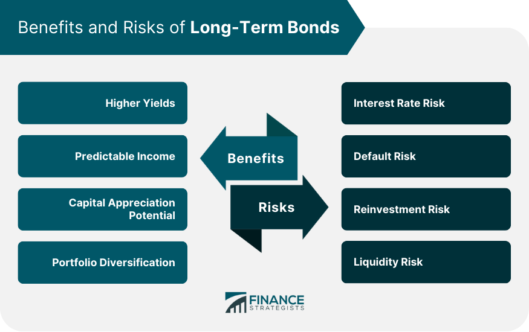

## Table of Contents

## What is a long bond?

A long bond is a type of bond that has a long time until it matures. Usually, this means the bond will last for more than 10 years before the issuer has to pay back the money they borrowed. People like long bonds because they can give steady income over a long time. Governments and big companies often issue these bonds to borrow money for a long time.

Long bonds can be good or bad, depending on what you want. If you want a safe place to keep your money for a long time and get regular payments, long bonds might be good for you. But, if interest rates go up, the value of your long bond can go down. This is because new bonds will pay more interest, making your old bond less attractive to others. So, it's important to think about interest rates and how long you want to keep your money in the bond before you buy one.

## How does a long bond function in the financial market?

In the financial market, a long bond works like a promise from the issuer, usually a government or a big company, to pay back the money they borrowed after a long time, often more than 10 years. They also pay interest to the people who buy the bonds regularly, like every six months. This interest is a way for the issuer to say thank you for lending them money. People and institutions buy long bonds because they want a safe place to put their money and get regular payments over many years.

Long bonds can affect the financial market in big ways. When lots of people want to buy long bonds, their prices go up and the interest rates they offer might go down. If fewer people want them, the prices can go down and the interest rates might go up. This is important because the interest rates on long bonds can show what people think about the economy. If people think the economy will do well, they might not want long bonds as much because they can make more money in other ways. But if they think the economy might have problems, they might buy more long bonds because they are safer.

## What are the typical maturities of long bonds?

Long bonds usually have maturities that last for a long time. Most long bonds have maturities of 10 years or more. Some common examples are bonds that last for 20 or 30 years. These are called "long-term" bonds because they take a long time to reach the date when the money borrowed needs to be paid back.

The length of time until a long bond matures can affect how much interest it pays. Bonds that take longer to mature usually pay more interest. This is because people who buy these bonds are lending their money for a longer time, so they want more money in return. Governments and big companies use these long bonds to borrow money for big projects that they will pay back over many years.

## Who are the primary issuers of long bonds?

The primary issuers of long bonds are governments and big companies. Governments, like the U.S. government, issue long bonds to borrow money for big projects or to run the country. These bonds are called government bonds or treasury bonds. They are seen as very safe because the government can usually pay back the money it borrows.

Big companies also issue long bonds. They do this to get money for big projects or to grow their business. These bonds are called corporate bonds. They might not be as safe as government bonds because companies can have problems paying back their loans. But, they often pay more interest to make up for the extra risk.

## What are the key features of long bonds?

Long bonds are a type of bond that takes a long time to mature, usually more than 10 years. They are issued by governments and big companies to borrow money for a long time. When you buy a long bond, you lend money to the issuer, and they promise to pay you back after many years. They also pay you interest regularly, like every six months, as a way to thank you for lending them your money. This interest is important because it gives you a steady income over the life of the bond.

The length of time until a long bond matures can affect how much interest it pays. Bonds that take longer to mature usually offer higher interest rates. This is because you are lending your money for a longer time, so you expect more money in return. Long bonds can be a good choice if you want a safe place to keep your money for a long time and get regular payments. But, they can also be risky because if interest rates go up, the value of your long bond can go down. This happens because new bonds will pay more interest, making your old bond less attractive to others.

## How do long bonds differ from short-term and intermediate-term bonds?

Long bonds, short-term bonds, and intermediate-term bonds are all types of bonds, but they have different times until they mature. Long bonds take a long time to mature, usually more than 10 years. They are good for people who want to keep their money safe for a long time and get regular payments. Short-term bonds mature in a short time, usually less than 5 years. They are good for people who want their money back soon and don't want to take a lot of risk. Intermediate-term bonds fall in the middle, with maturities between 5 and 10 years. They are good for people who want a balance between getting their money back and [earning](/wiki/earning-announcement) interest.

The main difference between these bonds is how long you have to wait to get your money back. Long bonds usually pay more interest because you are lending your money for a longer time. But, they can be riskier because if interest rates go up, the value of your long bond can go down. Short-term bonds pay less interest because you get your money back sooner. They are less risky because they are not as affected by changes in interest rates. Intermediate-term bonds offer a middle ground, with a bit more interest than short-term bonds but less risk than long bonds.

## What are the advantages of investing in long bonds?

Investing in long bonds has some good things about it. One big advantage is that they give you a steady income over a long time. When you buy a long bond, the issuer, like a government or a big company, pays you interest regularly, often every six months. This can be really helpful if you want money coming in without having to do anything. Also, long bonds are often seen as safe places to keep your money. Governments, especially, are good at paying back their loans, so their long bonds are very secure.

Another advantage of long bonds is that they can help you plan for the future. Because they last a long time, usually more than 10 years, you can count on them for money you'll need way down the road, like when you retire. Plus, long bonds usually pay more interest than short-term bonds because you're lending your money for a longer time. This means you can earn more money over the years. So, if you're okay with waiting a long time to get your money back, long bonds can be a good choice.

## What are the disadvantages or risks associated with long bonds?

One big risk with long bonds is that their value can go down if interest rates go up. When new bonds come out that pay more interest, people might not want to buy your old long bond as much. This makes your bond less valuable. If you need to sell your long bond before it matures, you might get less money back than you expected. This can be a problem if you need your money sooner than you thought.

Another risk is that long bonds tie up your money for a long time. Usually, long bonds last more than 10 years, and you can't get your money back until they mature. If you need your money before then, you might have to sell the bond at a lower price. Also, if the company or government that issued the bond has problems, they might not be able to pay you back. This is less likely with government bonds, but it can happen with corporate bonds. So, it's important to think about how long you can wait to get your money back and how safe the issuer is before you buy a long bond.

## How do interest rate changes impact the value of long bonds?

When interest rates go up, the value of long bonds usually goes down. This happens because new bonds that are issued will pay more interest. If you have an old long bond that pays less interest than the new ones, people won't want to buy it as much. So, if you need to sell your long bond before it matures, you might have to sell it for less money than you paid for it. This is called [interest rate](/wiki/interest-rate-trading-strategies) risk, and it's a big thing to think about when you buy long bonds.

On the other hand, when interest rates go down, the value of long bonds usually goes up. This is because your old long bond now pays more interest than the new ones being issued. People will want to buy your bond more, so you can sell it for more money if you need to. But, you have to remember that you might not get to enjoy this higher value if you hold onto the bond until it matures. The issuer will still pay you back the amount they promised at the start, no matter what happens to interest rates.

## What role do long bonds play in a diversified investment portfolio?

Long bonds can be an important part of a diversified investment portfolio. They help spread out the risk because they are different from other kinds of investments like stocks or short-term bonds. When you have long bonds in your portfolio, you get a steady income over a long time. This can be really helpful if you want money coming in regularly without having to worry about it. Also, long bonds are often seen as safe places to keep your money, especially if they are issued by a government.

But, long bonds also come with some risks that you need to think about. One big risk is that if interest rates go up, the value of your long bonds can go down. This means if you need to sell your long bonds before they mature, you might get less money back than you expected. So, it's important to balance the safety and steady income of long bonds with the risk of losing value if interest rates change. By having a mix of long bonds, short-term bonds, and other investments, you can make your portfolio more stable and better able to handle different situations in the market.

## How can one assess the credit quality of long bonds?

To assess the credit quality of long bonds, you need to look at the issuer's ability to pay back the money they borrowed. Credit rating agencies like Moody's, Standard & Poor's, and Fitch help with this. They give bonds a grade, like AAA, AA, A, and so on. AAA is the best and means the bond is very safe. Lower grades mean the bond is riskier. These agencies look at things like the issuer's financial health, how much debt they have, and their history of paying back loans on time.

Another way to assess the credit quality is to do your own research. You can look at the issuer's financial statements to see how much money they make and how much debt they have. You can also read news about the issuer to see if they are doing well or if they have problems. If the issuer is a company, you might want to know about their business and how they are doing in their industry. If it's a government, you might want to know about the country's economy and how well they manage their money. By putting together information from credit rating agencies and your own research, you can get a good idea of the credit quality of a long bond.

## What advanced strategies can be used to manage a portfolio of long bonds?

One advanced strategy for managing a portfolio of long bonds is called laddering. With laddering, you buy long bonds that mature at different times. For example, you might buy some bonds that mature in 10 years, some in 20 years, and some in 30 years. This way, you get money back at different times. When a bond matures, you can use the money to buy a new long bond. This helps you manage the risk of interest rates changing because you're not stuck with all your money in bonds that mature at the same time. It also gives you a steady flow of money as different bonds mature.

Another strategy is called duration management. Duration is a measure of how sensitive a bond's price is to changes in interest rates. Long bonds usually have a higher duration, which means their prices can go up or down a lot when interest rates change. By choosing long bonds with different durations, you can balance out the risk. If you think interest rates will go up, you might want to have some long bonds with shorter durations. If you think interest rates will go down, you might want more long bonds with longer durations. This way, you can try to make the most money while managing the risk of interest rate changes.

A third strategy is active trading. With this strategy, you buy and sell long bonds based on what you think will happen with interest rates and the economy. If you think interest rates will go up, you might sell some of your long bonds before their value goes down too much. If you think interest rates will go down, you might buy more long bonds to take advantage of the higher prices. This strategy can be riskier because it depends a lot on your guesses about the future. But, if you're good at predicting what will happen, it can help you make more money from your long bonds.

## References & Further Reading

#