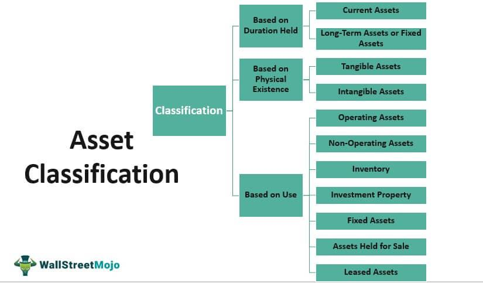

In the ever-evolving landscape of finance and investment, long-dated assets and algorithmic trading have emerged as pivotal components. Long-dated assets refer to investments with a maturity period extending beyond ten years, such as 30-year government bonds, long-term corporate bonds, and certain types of mortgage-backed securities. These assets are significant for their ability to provide stable, long-term returns and are typically favored by institutional investors like pension funds and insurance companies for their portfolio-stabilizing properties.

Algorithmic trading, on the other hand, utilizes computer algorithms to execute trading orders efficiently and is increasingly relevant in modern financial markets. By using precise mathematical models, algorithmic trading enhances accuracy, speed, and decision-making capabilities in executing trades, which minimizes manual errors and optimizes costs.



This article explores the interplay between long-dated investments and algorithmic trading strategies. By examining their interaction, the article provides insights into various financial assets, elucidating the role of these strategies in enhancing portfolio management. Through an understanding of different investment types and strategies, investors can leverage the potential benefits of algorithmic trading to manage risks and capitalize on opportunities presented by long-dated assets. This synthesis of strategies is aimed at optimizing financial returns while acknowledging the significance of informed decision-making in contemporary financial markets.

## Table of Contents

## Understanding Long-Dated Assets

Long-dated assets refer to financial instruments with extended maturities, often exceeding ten years. They play a crucial role in financial markets due to their ability to provide stable and predictable cash flows over long periods, which is particularly beneficial for certain types of investors. These assets are characterized by their long-term horizon and include instruments such as 30-year bonds, mortgages, and municipal bonds.

A 30-year bond is a debt security issued for a term of 30 years, providing periodic interest payments to investors until maturity, when the principal is repaid. These bonds are often issued by governments, corporations, and municipalities and are prized for their ability to offer fixed income over a lengthy period, making them attractive to investors seeking long-term stability.

Mortgages are another example of long-dated assets. They are loans secured by real property, usually residential or commercial real estate, and have long repayment periods, often spanning 15 to 30 years. The mortgage-backed securities market, which includes Residential Mortgage-Backed Securities (RMBS) and Commercial Mortgage-Backed Securities (CMBS), allows investors to gain exposure to this asset class with the added benefit of relatively predictable cash flows.

Municipal bonds are issued by state and local governments to finance public projects and infrastructure. These bonds are often long-dated, with maturities stretching from 10 to 30 years. The interest income from municipal bonds is typically exempt from federal taxes, and sometimes state and local taxes as well, making them a tax-efficient investment option.

Long-dated assets are integral to institutional portfolios, particularly those of entities like pension funds and insurance companies. These institutions have long-term liabilities, making the matching of asset durations with future obligations crucial for financial stability and risk management. By investing in long-dated assets, these organizations can better align their asset and liability duration, effectively managing [interest rate](/wiki/interest-rate-trading-strategies) risk while ensuring that they can meet future payout obligations.

In summary, long-dated assets are significant for their ability to provide stable, long-term cash flows, which support the financial goals of institutional investors such as pension funds and insurance entities. The extended duration of these assets makes them essential components for long-term financial planning and efficient portfolio management.

## Types of Long-Dated Financial Assets

Long-dated financial assets extend over an extended time horizon, typically beyond ten years, and are integral to the stability and growth prospects of investment portfolios. Among these, various market instruments serve the needs of institutional investors such as pension funds, insurance companies, and sovereign wealth funds.

Residential Mortgage-Backed Securities (RMBS) and Commercial Mortgage-Backed Securities (CMBS) represent securitized pools of mortgages sold to investors. RMBS are backed by residential properties, while CMBS are supported by commercial real estate. Their attractive feature is the steady flow of cash payments generated from mortgage interest and principal repayments, offering a predictable income stream. However, they also bear prepayment risk, as borrowers might refinance or repay the mortgages earlier than anticipated, particularly in a declining interest rate environment.

Treasury Bonds are long-term, fixed-interest government securities with maturities typically ranging from 10 to 30 years. These bonds are highly valued for their credit safety, as they are backed by the U.S. government. The interest rate or coupon rate is paid semi-annually, offering stable returns over time. Municipal Bonds, issued by state and local governments, finance public projects like schools, highways, and hospitals. They often [carry](/wiki/carry-trading) tax advantages, such as federal tax exemption on the interest income, providing appeal to investors in higher tax brackets.

Investing in long-dated assets presents specific risks, notably duration risk and interest rate risk. Duration risk arises from the sensitivity of bond prices to changes in interest rates. The formula for duration (D) is given by:

$$
D = \frac{\sum_{t=1}^{n} \left( \frac{t \times C_t}{(1 + y)^t} \right) + \frac{n \times M}{(1 + y)^n}}{B}
$$

where $t$ is the time period, $C_t$ is the cash flow at time $t$, $y$ is the yield, $M$ is the maturity value, and $B$ is the current bond price. As duration increases, so does the volatility of the bond's price in response to interest rate changes, making long-dated bonds more susceptible to price fluctuations when interest rates shift.

Interest rate risk is inherent in long-dated securities, as a rise in interest rates typically leads to a decline in bond prices. This risk is particularly pertinent to bonds with long maturities, as the lengthy time horizon amplifies the effect of changing rates on the present value of future cash flows. Investors must weigh the benefits of steady income against the potential for capital depreciation in a rising rate market, adjusting their strategies to balance these factors effectively.

## Investment Types and Strategies

In the context of long-dated assets, investment types and strategies must be carefully crafted to align with the extended time horizons and unique characteristics of such assets. Long-dated assets, which may include instruments like 30-year bonds and certain types of mortgage-backed securities, require strategies that effectively manage risks such as duration risk and interest rate fluctuations.

One fundamental strategy for managing long-dated assets is liability matching. This approach, commonly adopted by pension funds and insurance companies, involves aligning the timings of asset cash flows with future liabilities. For example, a pension fund might aim to ensure that the maturity value and interest payments from long-dated bonds coincide with the fund's projected outflows related to beneficiaries' pensions. This reduces reinvestment risk and helps safeguard assets against interest rate [volatility](/wiki/volatility-trading-strategies).

Diversification also plays a crucial role in managing portfolios containing long-dated assets. By spreading investments across various asset classes, sectors, and geographical regions, investors can minimize the impact of a downturn in any single area. Diversification helps in balancing the portfolio's overall risk, especially when dealing with potential price volatility or credit risks associated with long-dated instruments.

Beyond traditional strategies, modern investment methods can further enhance portfolio performance. For instance, the use of derivatives such as interest rate swaps allows investors to manage exposure to interest rate changes more actively. Swaps can serve to adjust the duration of a portfolio by exchanging future cash flows, which may help stabilize returns as interest rates fluctuate.

Additionally, modern approaches like [factor](/wiki/factor-investing) investing and smart beta strategies offer sophisticated ways to achieve targeted returns. Factor investing involves building portfolios based on quantifiable characteristics, such as value, growth, or volatility, which are expected to drive returns. Smart beta strategies, on the other hand, combine elements of passive and active management, aiming to outperform traditional market-cap weighted index funds while maintaining cost efficiency.

An investor today may also consider integrating environmental, social, and governance ([ESG](/wiki/esg-investing)) factors within their investment framework. ESG investing accounts for the non-financial attributes of assets, appealing to investors interested in sustainable and socially responsible investments. Long-dated assets can be aligned with ESG criteria to attract investors focused on long-term environmental and social value.

In summary, investment types and strategies for long-dated assets encompass traditional risk management techniques, like liability matching and diversification, as well as innovative tools like derivatives, factor investing, and ESG considerations. These strategies are designed to navigate the complexities of long-term investment horizons and optimize financial outcomes while mitigating associated risks.

## Algorithmic Trading: Introduction and Types

Algorithmic trading refers to the use of computer algorithms to manage the trading process, automating the decision-making and transaction execution tasks traditionally handled by human traders. It plays an increasingly significant role in financial markets, providing enhanced efficiency and the ability to handle large volumes of trades with precision. As algorithms are designed to analyze vast amounts of financial data at high speeds, they are capable of executing trades faster and more accurately than human traders, thereby minimizing manual errors.

Several types of [algorithmic trading](/wiki/algorithmic-trading) strategies are employed within the financial markets. One prevalent strategy is trend-following, which involves executing trades based on the detection of emerging price trends. This strategy simplifies the analysis for traders by focusing on price movements without the necessity for predictive modeling of asset behavior.

Arbitrage is another common algorithmic trading strategy. It exploits price differentials of the same asset across different markets, purchasing the asset in a market where the price is lower and simultaneously selling it in a market where the price is higher. The speed and precision of algorithmic trading make it ideal for capturing these fleeting opportunities.

Mean reversion strategies operate on the assumption that asset prices will eventually revert to their historical average. Algorithms continuously analyze price movements and identify situations where the current price deviates significantly from the long-term average, executing trades to capitalize on expected corrections.

The technological backbone of algorithmic trading is sophisticated software capable of processing complex algorithms and financial models in real-time. This software often integrates [machine learning](/wiki/machine-learning) and [artificial intelligence](/wiki/ai-artificial-intelligence) to optimize algorithms and adapt to evolving market conditions. By leveraging technology, algorithmic trading systems can make decisions and execute trades at speeds that are unattainable for human traders, reducing latency and improving overall market efficiency. Additionally, these systems are designed to operate with minimal human intervention, providing a safeguard against human error while enabling traders to execute high-frequency trades and manage large-scale portfolio adjustments effectively.

## Application of Algo Trading in Long-Term Investments

Algorithmic trading has become a significant element in the strategic management of long-dated asset portfolios. By utilizing sophisticated algorithms, traders can efficiently manage large sets of data pertaining to long-dated assets and execute trades with precision. This not only enhances the efficiency of portfolio management but also improves risk management and decision-making processes.

One of the primary benefits of algorithmic trading in managing long-dated assets is increased efficiency. Algorithms are programmed to analyze market conditions and execute trades at optimal times. This automation reduces the time taken to process trades and minimizes the chance of errors that can occur with manual trading. By processing large volumes of data at higher speeds, algorithms can evaluate historical price trends, interest rate changes, and other economic indicators more swiftly than human traders.

Risk management is another crucial advantage of incorporating algorithms into long-term investment strategies. Algorithms can be designed to implement risk management techniques like stop-loss orders and dynamic hedging, helping in the automatic diversification of portfolios or adjusting them according to market conditions. For instance, an algorithm may identify a downturn in the bond market and automatically liquidate a portion of long-dated Treasury bonds to mitigate potential losses.

Improved decision-making processes are facilitated by algorithms' ability to factor in multiple variables simultaneously and forecast future market conditions based on historical patterns and current economic data. Algorithms can utilize predictive modeling to identify profitable opportunities in long-dated assets, such as spotting [arbitrage](/wiki/arbitrage) opportunities in the pricing of municipal bonds compared to their underlying interest rates.

Examples of long-term investment strategies where algorithmic trading proves beneficial include trend-following strategies and mean-reversion strategies. In trend-following, algorithms are programmed to identify and capitalize on the continuing movement in asset prices. For example, if the price of a 30-year Treasury bond is trending upwards due to declining interest rates, an algorithm could execute a buy order to capitalize on the expected price appreciation.

Mean-reversion strategies, another common algorithmic approach, operate under the assumption that the price of an asset will revert to its average over time. In long-dated asset markets, an algorithm might identify when the yield on municipal bonds deviates from historical averages and execute trades based on the anticipated return to mean levels.

Python, a popular language in algorithmic trading, offers libraries like `pandas` for data manipulation and `numpy` for numerical operations, enabling traders to backtest their strategies before deployment. For example:

```python
import pandas as pd
import numpy as np

# Sample data for backtesting
data = pd.read_csv('bond_prices.csv')
data['SMA50'] = data['Price'].rolling(window=50).mean()
data['SMA200'] = data['Price'].rolling(window=200).mean()

# Implementing a simple moving average crossover strategy
def strategy(row):
    if row['SMA50'] > row['SMA200']:
        return 'Buy'
    elif row['SMA50'] < row['SMA200']:
        return 'Sell'
    else:
        return 'Hold'

data['Signal'] = data.apply(strategy, axis=1)
```

By integrating algorithmic trading into long-dated asset management, investors can achieve a finely-tuned balance of efficiency, risk management, and strategic decision-making, optimizing their long-term financial returns while navigating market complexities.

## Challenges and Considerations

Algorithmic trading has revolutionized the financial markets by enabling high-speed and high-frequency trading operations. However, it also presents its own set of challenges, including technical failures and market impacts. Technical failures can arise from software bugs, hardware malfunctions, or connectivity issues, potentially leading to significant financial losses. An example of such failure was the Knight Capital incident in 2012, where a software glitch resulted in a $440 million loss in just 45 minutes, underscoring the risks associated with relying heavily on technology without adequate safeguards.

Market impact is another crucial consideration. Large trades executed by algorithms can lead to price distortions, impacting market stability. This can be particularly problematic in less liquid markets, where large orders can significantly move prices. To mitigate these issues, algorithms often incorporate tactics such as order slicing—breaking large orders into smaller, less conspicuous parts—to minimize their footprint in the market.

Regulatory compliance is vital for firms employing algorithmic trading strategies. Financial authorities worldwide impose stringent rules to prevent market abuse and ensure fair trading practices. For instance, in the United States, the Securities and Exchange Commission (SEC) requires firms to follow regulations that ensure operational transparency and risk management in automated trading. Non-compliance can result in severe penalties, making it imperative for firms to align their algorithmic trading systems with regulatory standards.

Ongoing monitoring and optimization of trading algorithms are essential to adapt to changing market conditions. Market dynamics, such as volatility and [liquidity](/wiki/liquidity-risk-premium), can shift quickly, necessitating real-time adjustments in trading strategies. Algorithms need to be regularly updated and stress-tested to ensure they perform optimally under various market scenarios. Additionally, incorporating machine learning techniques can enable algorithms to learn from market data and improve their decision-making capabilities over time. 

In conclusion, while algorithmic trading offers substantial benefits in terms of efficiency and execution speed, it also presents challenges that require careful management. Technical robustness, regulatory compliance, and continuous optimization form the pillars of a successful algorithmic trading strategy. By addressing these considerations, traders and investors can better harness the potential of algorithmic trading while minimizing associated risks.

## Conclusion

In summarizing the critical aspects discussed, it is evident that long-dated assets and algorithmic trading are integral to contemporary financial strategies. Long-dated assets, such as 30-year bonds and mortgage-backed securities, play a crucial role in institutional portfolios by providing steady income streams and hedging against liabilities. Their strategic importance to entities like pension funds and insurance companies underscores the value of long-term financial planning. The characteristics of these assets, coupled with inherent risks such as duration risk and interest rate fluctuations, necessitate careful consideration and management.

On the other hand, algorithmic trading, with its various strategies like trend-following and arbitrage, has revolutionized the way financial markets operate. Its capacity to execute trades swiftly and accurately reduces manual errors and enhances decision-making. The integration of algorithmic trading into managing long-dated asset portfolios offers significant advantages, including efficiency, optimized risk management, and improved portfolio performance.

The synergy between long-dated asset strategies and algorithmic trading holds significant potential for optimizing financial returns. This combination allows for more sophisticated portfolio management techniques, aiding investors in maximizing their profits while mitigating risks. Investors are encouraged to explore these modern approaches, acknowledging the need for ongoing adaptation to market conditions and regulatory compliance. However, the inherent risks and technical challenges associated with algorithmic trading must be carefully managed to fully realize its benefits. Overall, embracing these strategies thoughtfully can lead to enhanced financial outcomes in an ever-evolving financial landscape.

## References & Further Reading

[1]: Bergstra, J., Bardenet, R., Bengio, Y., & Kégl, B. (2011). ["Algorithms for Hyper-Parameter Optimization."](https://dl.acm.org/doi/10.5555/2986459.2986743) Advances in Neural Information Processing Systems 24.

[2]: ["Advances in Financial Machine Learning"](https://www.amazon.com/Advances-Financial-Machine-Learning-Marcos/dp/1119482089) by Marcos Lopez de Prado

[3]: ["Evidence-Based Technical Analysis: Applying the Scientific Method and Statistical Inference to Trading Signals"](https://www.amazon.com/Evidence-Based-Technical-Analysis-Scientific-Statistical/dp/0470008741) by David Aronson

[4]: ["Machine Learning for Algorithmic Trading"](https://github.com/stefan-jansen/machine-learning-for-trading) by Stefan Jansen

[5]: ["Quantitative Trading: How to Build Your Own Algorithmic Trading Business"](https://www.amazon.com/Quantitative-Trading-Build-Algorithmic-Business/dp/1119800064) by Ernest P. Chan