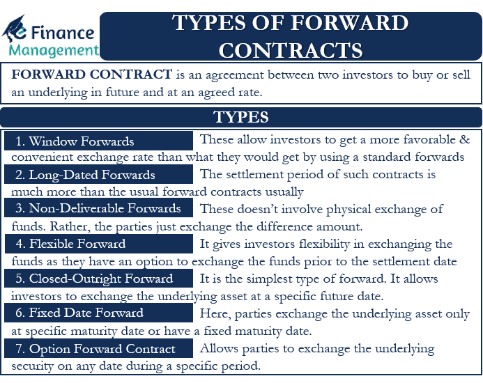

## Table of Contents

## What is a long-dated forward contract?

A long-dated forward contract is a type of agreement where two parties agree to buy or sell an asset at a specific price on a future date that is far away. This date can be several years in the future, unlike regular forward contracts which usually have shorter time frames. The asset can be anything from commodities like oil or wheat, to financial instruments like currencies or stocks.

These contracts are useful for businesses and investors who want to plan ahead and manage risks over a long period. For example, a company might use a long-dated forward contract to lock in the price of a raw material they need, protecting themselves from future price changes. This helps them budget and plan their finances more effectively, knowing the cost of their inputs well in advance.

## How does a long-dated forward contract differ from a regular forward contract?

A long-dated forward contract and a regular forward contract are similar because they both involve an agreement to buy or sell an asset at a set price on a future date. The main difference is the length of time until that future date. A regular forward contract usually lasts for a short period, like a few months. In contrast, a long-dated forward contract can last for several years.

Because of the longer time frame, long-dated forward contracts are used for planning far into the future. For example, a company might use a long-dated forward contract to secure the price of a key material they will need years from now. This helps them avoid price changes and plan their budget more accurately. Regular forward contracts, on the other hand, are better for shorter-term needs and don't offer the same level of long-term security.

## What are the typical uses of long-dated forward contracts?

Long-dated forward contracts are often used by businesses to plan for the future. They help companies lock in prices for important materials they will need years down the road. For example, an airline might use a long-dated forward contract to buy jet fuel at a set price several years in advance. This way, they can protect themselves from big price jumps and plan their budget more easily.

These contracts are also useful for investors who want to manage risks over a long period. By agreeing on a price now for an asset they will buy or sell in the future, investors can avoid the uncertainty of price changes. This can be especially helpful for things like commodities or currencies, where prices can be very unpredictable. Using long-dated forward contracts, investors can make more stable plans and reduce their financial risks.

## What are the key components of a long-dated forward contract?

A long-dated forward contract has a few key parts that make it work. The first part is the asset, which is what the contract is about. This could be something like oil, wheat, or even a currency. The second part is the price, which is agreed upon when the contract is made. This is the price at which the asset will be bought or sold in the future. The third part is the date, which is far in the future, often years away. This is when the buyer and seller will actually trade the asset at the agreed-upon price.

The other important parts of a long-dated forward contract include the buyer and the seller. The buyer agrees to buy the asset on the future date, while the seller agrees to sell it. Both parties have to follow the contract, which means they have to do what they promised on the date they agreed on. This helps both the buyer and the seller plan for the future because they know what the price will be and when they will need to trade the asset.

## How is the price determined in a long-dated forward contract?

The price in a long-dated forward contract is decided when the contract is made. It is based on what people think the price of the asset will be in the future. This can depend on things like how much of the asset is available, how much people want it, and what is happening in the world that might change its price. Both the buyer and the seller agree on this price, hoping it will be good for them when the time comes to trade the asset.

Setting the price for a long-dated forward contract can be tricky because it is hard to predict what will happen years from now. People use information they have now and their best guesses about the future to decide on the price. Sometimes, they might also look at other similar contracts or use special models to help them figure out a fair price. This way, both the buyer and the seller feel comfortable with the agreement they make.

## What are the risks associated with long-dated forward contracts?

Long-dated forward contracts come with some risks because they last for a long time. One big risk is that the price of the asset might change a lot before the contract ends. If the price goes up a lot, the seller might lose money because they have to sell at the lower price they agreed on. If the price goes down a lot, the buyer might lose money because they have to buy at the higher price they agreed on. This can be hard to predict because so many things can change over several years.

Another risk is that one of the people in the contract might not be able to do what they promised. This is called counterparty risk. If the buyer or seller can't pay or deliver the asset when the time comes, the other person can lose money. This risk is bigger with long-dated forward contracts because so much can happen over a long time. Companies and investors need to think about these risks and maybe use other ways to protect themselves, like having a backup plan or working with someone they trust.

## How can counterparty risk be managed in long-dated forward contracts?

Counterparty risk in long-dated forward contracts can be managed by choosing a reliable partner. This means working with someone who has a good history of keeping their promises. Companies can check a partner's financial health and past deals to make sure they are trustworthy. They might also use credit ratings or get advice from experts to help pick a good partner. By doing this, they lower the chance that the other person won't be able to do what they promised.

Another way to manage counterparty risk is by using a third party, like a bank or a clearinghouse, to help with the contract. This third party can make sure both sides follow the rules and can step in if something goes wrong. They can also hold money or assets as a kind of promise that the deal will happen. This makes the contract safer for both the buyer and the seller because there is someone else watching over the deal.

## What are the accounting implications of entering into a long-dated forward contract?

When a company enters into a long-dated forward contract, it has to think about how to show it in their financial records. They need to keep track of the contract's value over time because it can change a lot. If the value of the asset in the contract goes up or down, the company has to write down this change in their records. This can affect how much profit or loss they report. They might also need to show the contract as an asset or a liability on their balance sheet, depending on whether they expect to make or lose money from it.

Another thing to think about is how the company plans to use the long-dated forward contract. If they are using it to protect themselves from price changes, they might be able to use special accounting rules called hedge accounting. This can help them show a more stable picture of their finances. But if they are using the contract to make money from price changes, they have to follow different rules. These rules can make their profits or losses look more up and down. Either way, they need to make sure they are following the right accounting rules for their situation.

## How do long-dated forward contracts affect financial reporting?

When a company enters into a long-dated forward contract, it affects their financial reporting because they have to keep track of the contract's value over time. The value of the asset in the contract can go up or down, and the company needs to report these changes in their financial statements. This means they might show more profit or loss depending on how the asset's price changes. They also need to decide if the contract should be shown as an asset or a liability on their balance sheet. This depends on whether they expect to make or lose money from the contract when it comes time to trade the asset.

The way the company plans to use the long-dated forward contract also matters for financial reporting. If they are using it to protect themselves from price changes, they might be able to use special accounting rules called hedge accounting. These rules help them show a more stable picture of their finances by smoothing out the ups and downs of the contract's value. But if they are using the contract to try to make money from price changes, they have to follow different rules. These rules can make their profits or losses look more up and down. Either way, it's important for the company to follow the right accounting rules to make sure their financial reports are accurate and clear.

## What are the tax considerations for long-dated forward contracts?

When a company enters into a long-dated forward contract, they need to think about how it affects their taxes. If they make money from the contract, they might have to pay taxes on that profit. The tax rules can be different depending on whether the company is using the contract to protect themselves from price changes or to try to make money from those changes. If it's for protection, the tax might be treated differently than if it's for making money. It's important for the company to know these rules so they can plan their taxes correctly.

The timing of when the company has to pay taxes on a long-dated forward contract can also be tricky. Usually, they don't have to pay taxes until they actually make or lose money from the contract. But sometimes, the tax rules might say they need to report gains or losses before the contract ends. This can happen if the value of the asset in the contract changes a lot. The company should work with a tax expert to make sure they are following all the rules and not missing any important tax deadlines.

## How do regulatory environments impact long-dated forward contracts?

Regulatory environments can have a big impact on long-dated forward contracts. Different countries have different rules about these contracts, and companies need to know and follow them. For example, some places might have strict rules about who can enter into these contracts or what kinds of assets can be used. These rules can make it harder or easier for companies to use long-dated forward contracts to plan for the future. If the rules are too strict, companies might not be able to use these contracts at all, which can affect their business plans.

Also, the rules can change over time, and this can be a problem for long-dated forward contracts because they last for many years. If a new rule comes into effect after a contract is made, it might change how the contract works or even make it invalid. Companies have to keep an eye on these changes and be ready to adjust their plans. This is why it's important for them to understand the regulatory environment and maybe even work with experts to make sure they are following all the rules.

## What advanced strategies can be employed using long-dated forward contracts?

Companies can use long-dated forward contracts to do some smart things with their money. One way is to use these contracts to make sure they have a steady supply of something they need, like oil or wheat, at a price they can afford. By locking in prices years in advance, they can plan their budgets better and avoid surprises. Another strategy is to use long-dated forward contracts to balance out risks in their business. For example, if a company knows they will need a lot of a certain material in the future, they can use these contracts to protect themselves from price changes. This way, they can focus on running their business without worrying too much about what might happen to prices.

Another advanced strategy is to use long-dated forward contracts to take advantage of what they think will happen in the future. If a company believes that the price of a certain asset will go up a lot, they can buy a long-dated forward contract now and sell the asset later at a higher price. This can help them make more money. On the other hand, if they think the price will go down, they can sell the asset now through a long-dated forward contract and buy it back later at a lower price. These kinds of strategies can be risky, but they can also lead to big rewards if the company's guesses about the future are right.

## What are Long-Dated Forward Contracts?

Long-dated forward contracts are financial instruments that possess maturities exceeding the conventional one-year period. These contracts are indispensable for entities aiming to manage long-term risk exposures, especially in markets characterized by significant [volatility](/wiki/volatility-trading-strategies). Industries such as energy, agriculture, and finance frequently employ long-dated forward contracts to hedge against price fluctuations over extended horizons.

In the energy sector, for instance, companies often face unpredictable shifts in commodity prices, which can significantly impact their long-term financial planning and operational stability. By engaging in long-dated forward contracts, these companies can lock in prices for future delivery of essential raw materials, thereby mitigating the risk of adverse price movements. For example, an energy company might secure a forward contract for [crude oil](/wiki/crude-oil), agreeing to purchase a specified amount at a predetermined price, set to be delivered two years later. This provides a cushion against future price surges which might occur due to geopolitical tensions or natural disasters.

The strategic utility of long-dated forwards extends beyond simple hedging. By aligning financial strategies with long-term business objectives, these contracts enable firms to stabilize cash flows and improve forecasting accuracy. This alignment is particularly vital for organizations that engage in capital-intensive projects, where financial predictability over numerous years can influence investment decisions and resource allocation.

Moreover, for traders and financial institutions, long-dated forwards represent opportunities to leverage market insights and apply advanced financial models to anticipate and respond to market dynamics. Given their extended duration, these contracts allow for the incorporation of sophisticated algorithms and predictive analytics aimed at optimizing trade outcomes and maximizing returns.

The mathematical representation of a forward contract's pricing mechanism typically involves the determination of the forward price, $F$, which can be calculated using: 

$$
F = S_0 \times (1 + r)^{T}
$$

Where:
- $S_0$ is the spot price of the asset at the initiation of the contract
- $r$ is the risk-free interest rate
- $T$ is the time to maturity in years

This formula underscores the role of critical economic variables in shaping the pricing landscape of long-dated forward contracts. By factoring in interest rates and market conditions, market participants can better assess financial exposure and make informed hedging or speculative decisions.

In conclusion, long-dated forward contracts are pivotal for firms and investors seeking to hedge against long-term uncertainties and align financial operations with strategic objectives over extended periods. Their capacity to manage risks in volatile markets makes them a valuable component of comprehensive risk management frameworks.

## References & Further Reading

[1]: Hull, J. C. (2017). ["Options, Futures, and Other Derivatives"](https://www.semanticscholar.org/paper/Options%2C-Futures%2C-and-Other-Derivatives-Hull/89bdee500c8623864fc9eb7a471546aa713acc44) (9th ed.). Pearson. 

[2]: Jarrow, R. A., & Turnbull, S. M. (1999). ["Derivative Securities"](https://archive.org/details/derivativesecuri0000jarr). South-Western College Publishing.

[3]: Dufour, A., & Engle, R. F. (2000). ["Time and the Price Impact of a Trade."](https://www.jstor.org/stable/222391) The Journal of Finance, 55(6), 2467–2498.

[4]: Narang, R. K. (2013). ["Inside the Black Box: A Simple Guide to Quantitative and High Frequency Trading"](https://onlinelibrary.wiley.com/doi/book/10.1002/9781118662717). Wiley.

[5]: De Prado, M. L. (2018). ["Advances in Financial Machine Learning"](https://www.amazon.com/Advances-Financial-Machine-Learning-Marcos/dp/1119482089). Wiley.

[6]: Kocherlakota, N. R. (1996). ["The Equity Premium: It's Still a Puzzle."](https://www.jstor.org/stable/2729409) Journal of Economic Literature, 34(1), 42-71.

[7]: J.P. Morgan and Reuters. (1996). ["RiskMetrics—Technical Document."](https://www.msci.com/documents/10199/5915b101-4206-4ba0-aee2-3449d5c7e95a) Morgan Guaranty Trust Co.