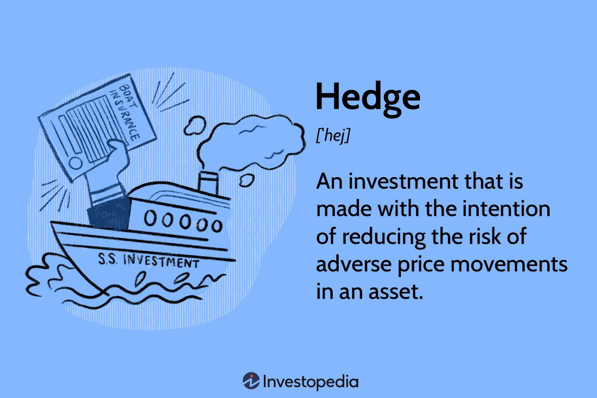

Understanding the dynamic world of investment can be daunting, especially with the variety of strategies available. Navigating through this complexity becomes essential for investors aiming to enhance their financial returns while mitigating risks. This article will explore two pivotal aspects of modern investing: long hedge strategies and algorithmic trading, offering investment examples to guide your decisions.

Long hedge strategies serve as a crucial tool for investors seeking protection against potential price increases in underlying assets. These strategies involve purchasing futures contracts to lock in prices, thereby managing volatility and ensuring cost stability. Historically, manufacturers and producers, such as those in the agricultural or airline industries, have utilized these strategies to manage future costs effectively.



Algorithmic trading, on the other hand, represents the technological evolution of trading, leveraging computer programs to execute trades with optimal speed and precision. This approach analyzes market data and executes transactions based on predefined criteria, resulting in reduced transaction costs and increased efficiency. The infusion of artificial intelligence and machine learning into algorithmic trading further enhances its sophistication and effectiveness.

By the end of this overview, you'll have a clear understanding of how long hedging integrates with other investment strategies. Additionally, we will highlight the role of algorithmic trading in enhancing investment strategies, offering insights into how these practices can be harmonized for improved risk management and investment performance. Together, these elements form a comprehensive framework to navigate the ever-evolving landscape of modern investing. Let's embark on this journey to elevate your investment knowledge and expertise.

## Table of Contents

## Understanding Long Hedge Strategies

A long hedge strategy is a method employed by investors to mitigate the risk associated with potential price increases of an underlying asset. This strategy involves the purchase of futures contracts, which are standardized agreements to buy or sell a particular asset at a predetermined price at a specified future date. By entering into a long hedge, investors secure a future purchase price, thus protecting themselves from the adverse effects of price volatility.

Investors typically utilize long hedges when they anticipate a rise in the price of the underlying asset. By locking in current prices, they hedge against potential cost increases that could impact profitability, especially when the asset forms a significant part of their cost structure. For instance, a coffee producer who anticipates a rise in coffee bean prices due to projected supply shortages may use a long hedge to stabilize purchase costs. Similarly, airlines may opt for long hedges on fuel to manage exposure to fluctuating fuel prices, ensuring budget stability.

The mechanisms and timeframes associated with long hedge strategies can vary. The choice of futures contracts depends on the expected duration of the price risk exposure. Typically, the maturity of futures aligns with the period during which the investor anticipates price [volatility](/wiki/volatility-trading-strategies). For example, a company expecting price increases over a six-month period might choose a futures contract with a similar maturity.

Long hedge strategies offer several benefits. Firstly, they provide a means to lock in prices, thus enabling budgetary certainty and planning accuracy. Secondly, they help reduce exposure to market volatility by ensuring that price increases do not adversely impact the financial position of the investor. Consequently, long hedges are crucial for manufacturers and producers who must manage future costs effectively.

These strategies are particularly significant for businesses with a dependence on raw materials, where input costs can be a major concern. By securing favorable purchase prices, companies can sustain competitive pricing for their goods and services, safeguard profit margins, and achieve greater financial stability. Overall, long hedges are an essential tool for strategic risk management in volatile markets.

## Investment Examples Utilizing Long Hedge Strategies

### Investment Examples Utilizing Long Hedge Strategies

**Example 1: Coffee Producer Stabilizing Costs**

In the volatile coffee market, price fluctuations can significantly impact a producer's bottom line. A coffee producer might employ a long hedge strategy to mitigate these risks. By purchasing coffee futures contracts, the producer locks in a price for coffee beans well in advance of the harvest season. This action provides a safeguard against potential price spikes, allowing the producer to stabilize costs and ensure more predictable financial planning. The formula used to compute the gain or loss of such a future contract is:

$$

\text{Gain/Loss} = (\text{Futures Price at Sale} - \text{Futures Price at Purchase}) \times \text{Contract Size} 
$$

Using these futures, the producer can budget effectively without the fear of adverse price movements, ensuring more stable profit margins.

**Example 2: Airline Hedging Fuel Prices**

Airlines face significant exposure to fuel price volatility, affecting their operating costs and profitability. To manage this risk, an airline might use long hedge strategies by securing futures contracts for aviation fuel, locking in prices for future delivery. For instance, if current prices are favorable, airlines can purchase futures contracts for fuel needed in subsequent months or years, thus insulating themselves from price increases. This strategy not only stabilizes operating costs but also enhances financial predictability, which is crucial for operational planning and pricing strategies.

**Example 3: Agricultural Industry Supply Chain Management**

Agricultural businesses, ranging from crop farmers to livestock producers, frequently leverage long hedging to protect against adverse price movements across their supply chain. For example, a livestock farmer concerned about rising feed costs can purchase futures contracts for grains such as corn or wheat. By securing these prices ahead of purchase, the farmer can protect against any future cost increases, ensuring stable expenditure on essential supplies. This approach also enables farmers to forecast profits more accurately and maintain competitiveness in the market.

### Illustrating Long Hedge Strategy Benefits

These examples underscore the practical benefits of long hedging in managing volatility and providing cost certainty. By employing futures contracts effectively, businesses can focus on operational efficiencies without being derailed by unexpected price hikes. Understanding the mechanisms of long hedging equips investors with the tools to implement such strategies in their portfolios, allowing for enhanced risk management and financial stability.

Aspiring investors can replicate these strategies by identifying costs and revenues susceptible to market volatility and using futures contracts to mitigate potential risks. The successful application of long hedges demonstrates their critical role in maintaining financial health across industries subject to unpredictable price swings.

## What is Hedging in Investment?

Hedging in investment is a strategy utilized to mitigate risk by taking offsetting positions in different markets or securities. Fundamentally, it seeks to protect investors from adverse price movements that could affect their primary investments. By adopting hedging techniques, investors aim to preserve capital and secure returns, even under volatile market conditions. 

There are various types of hedging strategies that cater to different market conditions and investment goals, with long, short, and synthetic hedges being particularly prevalent.

1. **Long Hedging**: This approach involves purchasing futures contracts or options to guard against potential price increases in an asset. Investors expecting a rise in an asset's price may use long hedges to lock in current prices, thereby insulating their portfolios from future increases. 

2. **Short Hedging**: Conversely, short hedging involves selling futures contracts to protect against potential price declines. This is particularly useful for investors with assets that may decrease in value, as it allows them to secure current prices and reduce the impact of a downturn.

3. **Synthetic Hedges**: These are created using a combination of derivatives, such as options and futures, to mimic the protections offered by traditional hedges. Synthetic hedging is advantageous for investors seeking to customize risk management strategies tailored to specific needs.

Understanding risk management and hedge effectiveness is crucial for investors employing these techniques. Proper risk assessment enables investors to determine the appropriateness of a hedge, while effectiveness measures ensure that the hedge adequately mitigates risk without incurring unnecessary costs.

A key debate in hedging strategies revolves around passive versus active hedging. Passive hedging typically involves maintaining a consistent hedge ratio, regardless of market conditions, to achieve a steady level of risk mitigation. This approach is simple and cost-effective but may not react swiftly to changing market dynamics. On the other hand, active hedging adjusts positions based on market conditions and forecasts, potentially offering more precise risk management. However, it requires constant monitoring and can be more expensive and complex to implement.

Hedging complements overall investment strategies by enhancing risk management, allowing investors to stabilize returns and safeguard against market volatility. By integrating hedging strategies, investors can achieve a more balanced risk-reward profile, aligning with their long-term financial objectives.

 to Algorithmic Trading

Algorithmic trading, often referred to as algo trading, is a method of executing trades using pre-programmed algorithms that consider a variety of variables including timing, price, and quantity. This trading method has transformed market operations by enabling transactions at unprecedented speeds and precision levels.

### Functionality of Algorithms in Trading

Algorithms employ complex calculations and utilize high-speed data analysis to interpret market conditions. These algorithms can analyze vast datasets within milliseconds, enabling them to exploit small price fluctuations that may be imperceptible to human traders. These programs are often designed to follow a set of predefined trading rules and criteria, such as moving averages or price levels. For example, a basic algorithm might be programmed to buy a stock if its price falls below its 50-day moving average and then sell it when the price exceeds the average.

```python
# Example of a simple algorithmic trading strategy using Python
def moving_average_strategy(data, short_window=50, long_window=200):
    # Calculate short and long-term moving averages
    data['Short_MA'] = data['Price'].rolling(window=short_window, min_periods=1).mean()
    data['Long_MA'] = data['Price'].rolling(window=long_window, min_periods=1).mean()

    # Generate buy/sell signals
    data['Signal'] = 0
    data['Signal'][short_window:] = np.where(data['Short_MA'][short_window:] > data['Long_MA'][short_window:], 1, 0)

    # Calculate position
    data['Position'] = data['Signal'].diff()

    return data

# Assuming the 'data' DataFrame contains a 'Price' column
# The function will add columns for Short_MA, Long_MA, and signals
```

### Benefits of Algorithmic Trading

The primary advantages of [algorithmic trading](/wiki/algorithmic-trading) include reduced transaction costs and enhanced market efficiency. By automating the trading process, traders can minimize human errors and emotional biases that often affect manual trading decisions. Additionally, algorithmic trading can execute orders more quickly and at better prices than is typically possible with human intervention, capitalizing on [arbitrage](/wiki/arbitrage) opportunities that arise due to market imbalances.

### Risks and Challenges

Despite its benefits, algorithmic trading also presents several risks and challenges. Technical failures, such as system crashes or data inaccuracies, can lead to substantial financial losses. Moreover, algorithms operating at [high frequency](/wiki/high-frequency-trading) can exacerbate market volatility, contributing to flash crashes. Another challenge is the potential for algorithms to unintentionally interact in ways that can create feedback loops, leading to unintended market consequences.

### Role of Artificial Intelligence and Machine Learning

Artificial intelligence (AI) and [machine learning](/wiki/machine-learning) (ML) are crucial in the evolution of algorithmic trading strategies. These technologies allow algorithms to learn from historical data, adapt to changing market conditions, and refine trading strategies over time. Machine learning models, such as neural networks, are capable of identifying complex patterns in market data that traditional algorithms might miss. These models can continuously optimize trading strategies by analyzing historical performance and adjusting to new information.

In summary, algorithmic trading uses computer programs to make trading decisions based on pre-established rules, providing significant benefits in terms of efficiency and cost. However, the complexity of these systems and their reliance on technology also introduce risks that must be managed carefully. The integration of AI and ML into algorithmic trading is further advancing the field, offering new opportunities for developing sophisticated trading strategies.

## How Algorithmic Trading Combines with Hedging Strategies

Algorithmic trading and hedging strategies form a powerful combination in financial markets, enhancing the ability to manage risk with precision and efficiency. By employing sophisticated algorithms, traders and investors can execute hedging strategies with optimal timing, reducing the time lag that might otherwise result from manual trading processes. This synergy allows for the immediate response to market movements, which is crucial in volatile environments.

Algorithmic trading enhances precision by using computer programs to analyze vast datasets and identify opportune moments to execute trades. These algorithms can be programmed with specific criteria based on real-time market conditions, historical data, and statistical models. This precision is particularly beneficial for hedging, as it allows for exact matching of hedge positions to offset potential losses from primary investments.

Incorporating algorithmic trading into hedging strategies offers significant advantages for hedge funds and institutional investors, who frequently use these techniques for risk management. For instance, a [hedge fund](/wiki/hedge-fund-trading-strategies) might develop an algorithm that continuously assesses its portfolio's risk exposure, automatically executing trades to mitigate potential losses. Such an approach minimizes human error and emotional bias, while also increasing the speed at which hedging positions are established or adjusted.

Technological innovations have greatly refined the effectiveness of algorithmic trading in hedging. Advances in machine learning and [artificial intelligence](/wiki/ai-artificial-intelligence) permit algorithms to learn from market behaviors and adapt to new patterns. By leveraging these innovations, traders can anticipate market shifts more accurately and adjust their hedging strategies in real-time. For example, a machine learning algorithm might detect an emerging pattern associated with an economic indicator, prompting automated hedging adjustments across a portfolio.

Looking forward, the integration of blockchain technology and smart contracts presents a promising frontier for algorithmic trading and hedging strategies. These technologies can enhance transparency and security, further improving trust and efficiency in executing hedging positions. Additionally, advancements in quantum computing hold the potential to exponentially increase the speed and complexity with which algorithms process data, potentially revolutionizing hedging capabilities.

In conclusion, the integration of algorithmic trading with hedging strategies offers a substantial enhancement in managing investment risks. As technology continues to evolve, the precision and adaptability of these systems will likely become an even more vital component of investment portfolios, enabling investors to navigate the complexities of financial markets with greater confidence and control.

## Conclusion

Long hedge strategies and algorithmic trading play crucial roles in crafting robust and dynamic investment portfolios. Long hedging aids risk management by allowing investors to purchase futures contracts, effectively locking in costs and reducing market volatility exposure. This approach proves invaluable for manufacturers, producers, and industries such as agro and aviation, enabling them to stabilize expenses and manage future costs effectively.

Algorithmic trading further refines this process by leveraging technology to execute trades with exceptional speed and precision. By incorporating predefined criteria and analyzing vast volumes of market data, algorithmic trading not only reduces transaction costs and increases efficiency but also enhances the execution timing of hedging strategies. This synergy is particularly advantageous for hedge funds and institutional investors who employ algorithms for superior risk management.

Integrating these strategies offers enhanced returns by optimizing risk management, a fundamental aspect of successful investing. The impact of technological advancements can't be overstated, as they transform traditional strategies, bringing about more precise and effective investment approaches. As technology continues to evolve, it’s vital for investors to remain proactive in learning and adapting, ensuring they can leverage these developments to their advantage.

In summary, the incorporation of long hedge strategies and algorithmic trading represents a significant evolution in investment practices. By embracing these techniques, investors have the opportunity to enhance portfolio performance, mitigate risks, and capitalize on the rapid advancements within the financial landscape. Continuing education and adaptation remain imperative for navigating the ever-changing world of investing.

## References & Further Reading

[1]: ["Advances in Financial Machine Learning"](https://www.amazon.com/Advances-Financial-Machine-Learning-Marcos/dp/1119482089) by Marcos Lopez de Prado

[2]: ["Machine Learning for Algorithmic Trading"](https://github.com/stefan-jansen/machine-learning-for-trading) by Stefan Jansen

[3]: ["Quantitative Trading: How to Build Your Own Algorithmic Trading Business"](https://www.amazon.com/Quantitative-Trading-Build-Algorithmic-Business/dp/1119800064) by Ernest P. Chan

[4]: Hull, J. C. (2017). ["Options, Futures, and Other Derivatives"](https://www.semanticscholar.org/paper/Options%2C-Futures%2C-and-Other-Derivatives-Hull/89bdee500c8623864fc9eb7a471546aa713acc44). Pearson.

[5]: Aronson, D. R. (2006). ["Evidence-Based Technical Analysis: Applying the Scientific Method and Statistical Inference to Trading Signals"](https://www.amazon.com/Evidence-Based-Technical-Analysis-Scientific-Statistical/dp/0470008741). Wiley.