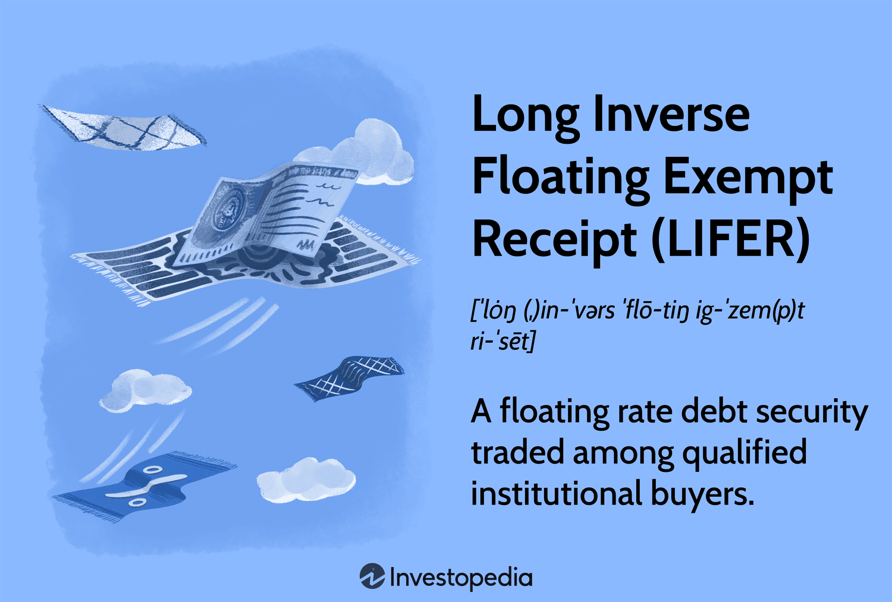

In the rapidly evolving world of finance, investment strategies and tools have become increasingly sophisticated, adapting to the dynamic nature of global markets. Among the significant developments in this landscape are financial instruments such as the Long Inverse Floating Exempt Receipt (LIFER) and algorithmic trading systems. Both have reshaped traditional investment paradigms by offering innovative ways to optimize returns and manage risks.

A Long Inverse Floating Exempt Receipt (LIFER) represents a unique type of inverse floater, which is designed to have its coupon rate move inversely to a benchmark interest rate. This characteristic makes LIFERs particularly appealing to investors who seek to hedge against fluctuating rate environments or achieve returns that differ from conventional fixed-income securities. Often tied to municipal structured finance, LIFERs can present lucrative opportunities for sophisticated investors who understand their nuanced behavior in relation to interest rate volatility.



Parallel to the emergence of complex financial instruments is the advent of algorithmic trading systems. These systems utilize computer algorithms to execute trades automatically and efficiently, based on predefined parameters. Algorithmic trading significantly enhances the speed and precision of transaction execution, enabling traders to capitalize on fleeting market inefficiencies and arbitrage opportunities. As such, it has become an essential tool in today’s fast-paced financial markets, accounting for a large proportion of trade volumes globally, particularly in Forex and equities.

Incorporating both LIFERs and algorithmic trading into a holistic investment approach can yield a synergistic effect. By integrating the two, investors can exploit the strategic advantages of each, potentially increasing returns while mitigating inherent risks. This article aims to explore the intersection of these financial tools, examining how their combination can forge robust investment strategies tailored to the modern financial landscape.

## Table of Contents

## Understanding Financial Instruments and LIFER

Financial instruments are an integral part of modern investment and financial management, forming the backbone for the diversification and optimization of portfolios. These instruments include a wide array of products such as stocks, bonds, options, and derivatives, each serving specific purposes and offering unique benefits and risks. While stocks represent ownership in a company and typically provide both capital gains and dividends, bonds are debt instruments wherein investors loan money to an entity in exchange for periodic interest payments and the return of the bond's face value upon maturity. Options give the holder the right, but not the obligation, to buy or sell an underlying asset at a predetermined price before a specified date. Derivatives derive their value from underlying assets and include instruments like futures and swaps, which are used for hedging or speculative purposes.

Among these financial instruments is the Long Inverse Floating Exempt Receipt (LIFER), a sophisticated type of inverse floater. Inverse floaters are a subclass of floating rate securities whose coupon payments adjust in the opposite direction to changes in a benchmark interest rate, such as the London Interbank Offered Rate (LIBOR) or the federal funds rate. This unique characteristic allows LIFERs to benefit from declining interest rates. Specifically, the coupon rate of a LIFER can be expressed as:

$$
\text{Coupon Rate} = K - (m \times \text{Reference Rate})
$$

where $K$ represents a constant fixed rate, and $m$ is the leveraging factor which amplifies the inverse movement relative to the benchmark rate.

LIFERs are predominantly linked to municipal structured finance, where they are issued by entities like municipalities or government entities. This linkage often provides certain tax advantages, making them especially enticing to sophisticated institutional investors who aim to optimize after-tax returns. Moreover, the inverse relationship between LIFERs' yields and interest rates enhances their attractiveness as a hedge against [interest rate](/wiki/interest-rate-trading-strategies) [volatility](/wiki/volatility-trading-strategies), particularly beneficial in a declining interest rate environment.

The appeal of LIFERs lies in their potential to offer higher yields when interest rates decrease, thus serving as an effective tool for leveraging market predictions concerning future interest rate movements. However, their complexity and the inherent risks involved necessitate a thorough understanding and strategic implementation within investment portfolios to fully leverage their benefits.

## Algorithmic Trading: A Modern Approach

Algorithmic trading involves the use of sophisticated computer programs to execute trades based on predetermined criteria, offering significant improvements in execution speed compared to manual trading. These algorithmic systems are designed to scan and analyze vast amounts of market data in fractions of a second, enabling them to identify and capitalize on [arbitrage](/wiki/arbitrage) opportunities and market inefficiencies. Algorithms use various strategies, such as [statistical arbitrage](/wiki/statistical-arbitrage), trend-following, and mean reversion, to determine optimal buy and sell points, aiming to maximize returns and minimize risks.

The process relies heavily on quantitative models, which might be constructed using complex mathematical formulas. For instance, algorithms might implement strategies based on moving averages, where a short moving average might be compared against a long moving average to generate trading signals:

```python
def moving_average(data, window_size):
    weights = np.repeat(1.0, window_size) / window_size
    return np.convolve(data, weights, 'valid')

# Example of generating a buy/sell signal
def generate_signal(data, short_window, long_window):
    short_ma = moving_average(data, short_window)
    long_ma = moving_average(data, long_window)
    signal = np.where(short_ma > long_ma, 1, 0)
    return signal
```

Algorithmic trading has become particularly prominent in major financial markets. According to a report by JP Morgan, it is estimated that more than 60% of equity trades and a substantial portion of foreign exchange (Forex) trade [volume](/wiki/volume-trading-strategy) are executed by algorithmic systems. This high level of automation has been driven by the need for greater speed and efficiency in handling large volumes of trades while reducing the possibility of human error.

One notable aspect of [algorithmic trading](/wiki/algorithmic-trading) lies in its ability to operate in high-frequency trading ([HFT](/wiki/high-frequency-trading-strategies)) environments, where speed is paramount. In HFT, algorithms can execute thousands of trades within milliseconds, profiting from small price differences between assets. High-frequency trading firms often maintain their competitive edge by co-locating their servers with exchange facilities, reducing latency and ensuring rapid trade execution.

In summary, the modern approach of algorithmic trading leverages technological advancements to optimize trade execution, making it a cornerstone of today's financial market infrastructure. This rapid progression in trading technology continues to reshape how trades are executed, analyzed, and managed across global markets.

## LIFER in Algorithmic Trading Strategies

The integration of financial instruments such as Long Inverse Floating Exempt Receipts (LIFERs) with algorithmic trading strategies can significantly enhance investment efficacy. LIFERs, with their distinctive inverse relationship to interest rates, present a structured opportunity for strategic deployment within algorithmic models, particularly those designed to anticipate interest rate fluctuations. By incorporating LIFERs, these models can aim to optimize risk-adjusted returns. 

Algorithmic trading, known for executing trades at high speeds across financial markets, is well-suited for exploiting the characteristics of LIFERs. These instruments adjust yields inversely to interest rate changes, thus offering potential advantages in the often volatile and unpredictable interest rate environments. For instance, a predictive algorithm might use historical and real-time data to forecast changes in interest rates. By aligning the trading strategy with the expected movements of LIFERs, an investor can hedge against interest rate risks more effectively.

In the context of high-frequency trading (HFT) or other advanced trading strategies, the unique properties of LIFERs can be fully leveraged. HFT typically capitalizes on minute price discrepancies at an incredibly fast pace. The swift adaptation of LIFERs’ yield in response to interest rate changes adds another layer of sophistication to these strategies. For example, a high-frequency trading algorithm might utilize the Python `pandas` library to analyze large datasets and quickly adjust LIFER positions in response to interest rate predictions:

```python
import pandas as pd
import numpy as np

# Example: Load historical interest rate data
interest_rate_data = pd.read_csv('interest_rates.csv')

# Calculate moving average to predict interest rate movement
interest_rate_data['Moving_Average'] = interest_rate_data['Rate'].rolling(window=5).mean()

# Predict direction: 1 for increase, -1 for decrease
interest_rate_data['Direction'] = np.where(interest_rate_data['Rate'] > interest_rate_data['Moving_Average'], 1, -1)

# Adjust LIFER strategy based on predicted direction
interest_rate_data['LIFER_Adjustment'] = -1 * interest_rate_data['Direction']  # Inverse relationship
```

In this example, the direction of interest rate movement guides the adjustment of LIFER positions, capitalizing on their inverse reaction to interest rates. By systematically incorporating LIFERs in such strategies, investors can create a robust shield against rate volatility, preserving portfolio stability while potentially enhancing returns.

However, practitioners should remain vigilant of the inherent complexities and risks involved in marrying these sophisticated tools with automated trading systems. Developing a profound understanding of LIFERs' behavior within dynamic financial environments is crucial for unlocking their full potential in algorithmic trading frameworks.

## Risks and Challenges

Algorithmic trading, despite its numerous advantages, faces several challenges that need to be carefully managed to ensure successful implementation. One prominent risk is market volatility, which can significantly influence the performance of algorithmic strategies. Sudden market shifts can lead to significant losses, especially if algorithms are not equipped to handle abrupt changes or if they rely on historical data that no longer reflects current conditions.

Execution risk is another critical challenge. This refers to the possibility that trades may not be executed at the desired prices or volumes due to latency or technical glitches. High-frequency trading, a subset of algorithmic trading, is particularly vulnerable to such risks given its dependence on executing numerous trades in milliseconds. Even minor delays or discrepancies can lead to substantial financial repercussions.

System outages pose an additional risk. These disruptions can occur due to server failures, connectivity issues, or software bugs, potentially resulting in halted trades and substantial financial losses. Consequently, robust infrastructure and contingency plans are essential to mitigate such risks.

Long Inverse Floating Exempt Receipts (LIFERs) present their own set of risks due to their complex nature. One significant risk is their high price volatility, as their coupon rates move inversely with benchmark interest rates. Predicting these benchmark interest rate movements is inherently challenging, requiring sophisticated models and access to timely economic data. Inaccurate predictions can lead to significant financial exposure and increased variability in portfolio returns.

Investors must adopt a comprehensive understanding of the financial dynamics and market impacts of both algorithmic trading and LIFERs. This involves continuously updating risk management strategies to account for evolving market conditions and potential technological changes. Education and expertise in these areas are pivotal to navigating the potential pitfalls associated with these advanced financial tools, ensuring that they are leveraged effectively and safely within investment portfolios.

## Future Prospects and Conclusion

As technology continues to push the boundaries of financial innovation, the role of algorithmic trading and complex financial instruments like Long Inverse Floating Exempt Receipts (LIFERs) is set for significant expansion. These tools offer a sophisticated approach to portfolio management, allowing investors to optimize investment strategies and adapt to market variables with agility.

The integration of LIFERs in algorithmic trading systems offers a bespoke method for managing interest rate risks. Given LIFER's inverse relationship to interest rates, these instruments can be embedded into predictive models that focus on interest rate movements. This assists in building strategies that are not only reactive but can also anticipate shifts, thereby improving risk-adjusted returns. Investors employing such advanced strategies are likely to see enhanced portfolio performance because the algorithms can mitigate risks that are typically associated with interest rate volatility.

Moreover, the further evolution of [artificial intelligence](/wiki/ai-artificial-intelligence) and [machine learning](/wiki/machine-learning) in financial markets will undoubtedly diversify the applications of both algorithmic trading and LIFERs. Machine learning models can analyze complex datasets to uncover patterns and predict market trends, which can be advantageous in the context of trading LIFERs. As these technologies grow more sophisticated, they promise to deliver more precise and timely trade executions, alongside the development of more nuanced investment products.

For investors aiming to harness the benefits of these advancements, technical literacy and adaptability are essential. Ensuring a thorough understanding of the dynamics underpinning LIFERs, alongside an appreciation of algorithmic trading's capabilities, will be essential in navigating the complexities of modern finance. Investors must stay current with technological advancements and regulatory changes that may impact market operations or introduce new layers of complexity.

In conclusion, the fusion of algorithmic trading with complex financial instruments like LIFERs presents an auspicious horizon for sophisticated investors seeking to bolster portfolio returns. By maintaining a forward-thinking approach and embracing technological innovations, investors can secure a dynamic edge in the ever-evolving financial landscape.

## References & Further Reading

[1]: Anand, A., & Venkatramanan, V. (2008). ["Explaining the features of inverse floaters through a case study: Indian Oil Exim Bonds"](https://www.sciencedirect.com/science/article/pii/S0026271424002087). North American Journal of Economics and Finance.

[2]: ["Algorithmic Trading and DMA: An Introduction to Direct Access Trading Strategies"](https://www.amazon.com/Algorithmic-Trading-DMA-introduction-strategies/dp/0956399207) by Barry Johnson

[3]: Gomber, P., Arndt, B., Lutat, M., & Uhle, T. (2011). ["High-Frequency Trading"](https://papers.ssrn.com/sol3/papers.cfm?abstract_id=1858626). Business & Information Systems Engineering.

[4]: Aldridge, I. (2013). ["High-Frequency Trading: A Practical Guide to Algorithmic Strategies and Trading Systems"](https://www.amazon.com/High-Frequency-Trading-Practical-Algorithmic-Strategies/dp/1118343506) Wiley Finance.

[5]: ["Interest Rate Markets: A Practical Approach to Fixed Income"](https://onlinelibrary.wiley.com/doi/book/10.1002/9781119200949) by Siddhartha Jha