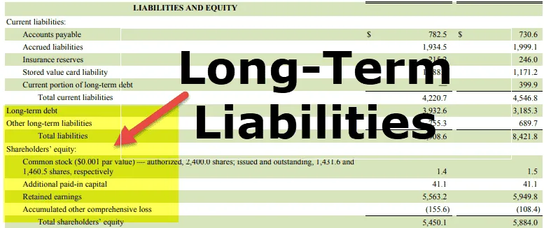

In the world of trading, strategies are essential for navigating the complexities of financial markets. One such intriguing strategy is the long jelly roll, which is primarily utilized in options trading. This article explores the concept of the long jelly roll, its construction, applications, and draws parallels between the methodical nature of jelly roll baking and the precision required in algorithmic trading.

The long jelly roll strategy is particularly relevant in today's trading environment, where the goal is to maximize profits while minimizing risks. This article will explain how this strategy can be effectively employed within modern algorithmic trading systems. Algorithmic trading, known for utilizing computer-driven models to execute trades at lightning speed, benefits from strategies like the long jelly roll. It allows traders to exploit pricing discrepancies in options markets without relying on the directional movement of underlying assets.



In addition to exploring how this strategy can fit into the algorithmic framework, we will thoroughly break down the components and market conditions that make the long jelly roll an attractive strategy for traders. This includes understanding market-neutral positioning and identifying arbitrage opportunities through price discrepancies in horizontal spreads.

Join us as we deep dive into the detailed mechanism of the long jelly roll strategy. We aim to uncover its potential applications and benefits, guiding both seasoned traders and newcomers in enhancing their trading strategies within today's dynamic financial landscapes. Whether you are a seasoned trader or a newcomer, understanding the intricacies of the long jelly roll can provide significant value in navigating the ever-evolving trading landscape. This examination will offer insights into achieving consistent returns while managing the inherent risks associated with options trading.

## Table of Contents

## What is a Long Jelly Roll?

A long jelly roll is an advanced options trading strategy designed to exploit arbitrage opportunities arising from price discrepancies in horizontal spreads. This strategy capitalizes on differences between the pricing of a calendar call spread and a calendar put spread, both structured around the same strike prices but with different expiration dates.

The traditional construction of the long jelly roll involves two key components:

1. **Long Calendar Call Spread**: This part of the strategy involves buying an option with a longer expiration date while simultaneously selling an option with a closer expiration date, both at the same strike price. The objective here is to benefit from the difference in time decay rates, known as 'theta', of the two call options, where the spread between these should ideally result in a positive cash flow.

2. **Short Calendar Put Spread**: Conversely, the short calendar put spread entails selling a put option with a longer expiration date and buying one with a shorter expiration. Similar to the call spread, the goal is to leverage the differential in time decay, thereby capturing any price inefficiencies.

Mathematically, the payoff of a jelly roll at expiration can be represented by the net gain from the combined calendar call and put spreads. Ideally, the spreads benefit from capturing the differential between the opposing theta values of the call and put options.

This strategy is particularly attractive because of its market-neutral positioning. It doesn't rely on forecasting price movements of the underlying asset, which makes it a suitable choice in non-volatile market conditions where options are often mispriced. The fundamental appeal of the jelly roll lies in its ability to offer traders a mechanism to exploit inefficiencies without the need for precise directional predictions.

An essential aspect of this strategy is the identification of suitable market conditions and precise execution to ensure that the captured [arbitrage](/wiki/arbitrage) is profitable. As with any arbitrage-focused method, success hinges on the timing and speed of execution, requiring traders to act swiftly to exploit fleeting price discrepancies.

## Constructing a Long Jelly Roll

Building a long jelly roll options strategy requires careful identification of market conditions and precise execution to capture the intended arbitrage opportunities. The initial step involves selecting a highly liquid underlying asset. Liquidity is key as it ensures tighter bid-ask spreads and more effective execution of the strategy.

Next, traders must identify two distinct expiration dates in the options chain where a price discrepancy between the option spreads is evident. This discrepancy forms the basis of potential profit in the long jelly roll strategy.

The construction of the strategy involves two main components:

1. **Long Calendar Spread**: This is implemented by buying a call option with a longer expiration date while simultaneously selling a call option at the same strike price but with a shorter expiration date. These positions create a spread that aims to benefit from the higher time decay (theta) of the short-term option relative to the long-term option.

2. **Short Calendar Spread**: Concurrently, a put option is sold with a longer expiration date and a put option is bought with a shorter expiration date, both at the same strike price. Like the call spread, this setup exploits the differential time decay between the two options.

The goal of the long jelly roll is to capitalize on the value difference arising from these different time decay rates. Time decay, or theta, measures the rate at which an option's price decreases as it approaches expiration. Thus, the strategy seeks to leverage the faster rate of decay of short-term options relative to their long-term counterparts to generate profits.

Precision in identifying and executing these spreads is paramount. Traders must closely monitor the time decay and implied [volatility](/wiki/volatility-trading-strategies) of the options involved. Any error in execution or misjudgment of the pricing differential could erode potential profits or lead to losses.

To facilitate calculations, one might implement a basic script to evaluate theta across different expiration dates. Here is a Python example leveraging options data:

```python
import numpy as np

# Sample data for option prices
option_prices_long = np.array([10, 12])  # Long expiration prices (call, put)
option_prices_short = np.array([8, 9])   # Short expiration prices (call, put)
days_to_expiration_long = 60
days_to_expiration_short = 30

# Calculate theta for each option
theta_long_call = (option_prices_long[0] - option_prices_short[0]) / (days_to_expiration_long - days_to_expiration_short)
theta_short_call = (option_prices_short[0] - option_prices_long[0]) / days_to_expiration_short
theta_long_put = (option_prices_long[1] - option_prices_short[1]) / (days_to_expiration_long - days_to_expiration_short)
theta_short_put = (option_prices_short[1] - option_prices_long[1]) / days_to_expiration_short

# Output theta values
print(f"Theta for long call: {theta_long_call}, Theta for short call: {theta_short_call}")
print(f"Theta for long put: {theta_long_put}, Theta for short put: {theta_short_put}")
```

This script evaluates the theta of options given different time horizons and can guide traders in selecting the optimal strikes and expirations for the long jelly roll. Overall, the success of the strategy hinges on the effective execution of these components, leveraging slight pricing inefficiencies while managing risk.

## Algorithmic Trading and Jelly Roll

Algorithmic trading, known for optimizing trading strategies through automated and data-driven decision-making, is particularly well-suited for employing the long jelly roll strategy. This options strategy hinges on identifying pricing inefficiencies and maintaining a market-neutral stance, making it compatible with algorithmic models designed specifically for arbitrage opportunities.

At its core, the long jelly roll strategy involves simultaneously establishing offsetting positions in calendar call and put spreads with identical strike prices but different expiration dates. This setup exploits discrepancies in the time decay, or "theta," of these options. Algorithmic trading systems are adept at quickly scanning through vast amounts of market data to identify these subtle pricing inefficiencies, which may not be easily noticeable through manual analysis.

The integration of algorithms in the execution of a long jelly roll strategy allows for real-time monitoring and rapid execution. Algorithms can be programmed to continuously scan for potential jelly roll opportunities by evaluating live market data for price discrepancies in option spreads. When a profitable opportunity is detected, the algorithm can execute trades swiftly, capitalizing on transient market conditions before they normalize.

Moreover, [machine learning](/wiki/machine-learning) and [artificial intelligence](/wiki/ai-artificial-intelligence) can enhance the robustness of this strategy by predicting future pricing inefficiencies through pattern recognition and statistical modeling. These technologies can improve the precision of identifying optimal entry and [exit](/wiki/exit-strategy) points, thus potentially increasing the profitability and reliability of implementing long jelly roll strategies.

However, there are inherent challenges and risks. Market conditions can change rapidly, leading to unexpected spikes in volatility that can adversely affect the spread prices involved in a jelly roll strategy. Additionally, the opportunities for mispricing are often small and require high-frequency, low-latency trading systems to effectively capture them. Algorithms must be meticulously designed and tested to ensure they can cope with various market scenarios and execute without significant delays.

Technological advancements, such as faster processing units and more efficient algorithms, can mitigate these challenges by enabling quicker analysis and execution. Automated risk management protocols can further enhance the strategy by setting predefined parameters for entering and exiting positions, thus reducing potential losses from unforeseen market shifts.

In conclusion, the synergy between [algorithmic trading](/wiki/algorithmic-trading) and the long jelly roll strategy offers traders an effective framework for exploiting market inefficiencies in options trading. With the aid of technology, traders can achieve more consistent returns while navigating the intricate dynamics of financial markets.

## Benefits and Risks of Long Jelly Roll

The long jelly roll strategy stands out for its unique capability to capitalize on market inefficiencies without depending on the precise directional movements of the underlying asset. This inherent market-neutral characteristic allows traders to exploit periods of stability and low volatility, settings in which option mispricing is more commonplace. By targeting these specific conditions, traders can secure profits through the calculated use of arbitrage principles.

One of the chief advantages of this approach is its detachment from the typical risks associated with directional trades. As it does not depend on predicting upward or downward price trends, it offers a distinct edge in scenarios where market movements are minimal. During such times, options can be inaccurately priced, providing lucrative opportunities for strategies like the long jelly roll, engineered to exploit these discrepancies.

Nonetheless, traders should remain cautious of the associated risks. A sudden uptick in market volatility can significantly alter the dynamics of the option spreads, potentially eroding profits or even leading to losses. This sensitivity arises because changes in volatility can affect the pricing and time decay (theta) dynamics differently across the calendar spreads involved in the strategy.

Moreover, the arbitrage opportunities presented by a long jelly roll are typically narrow. This requires precise execution and timing to capture the marginal value differences effectively. For instance, any inaccuracies in the selection of expiration dates, strike prices, or timing can adversely impact the strategy’s outcome.

To successfully manage these risks and maintain the strategy’s profitability, traders can implement several best practices:
1. **Volatility Monitoring:** Constantly monitor implied and historical volatility levels to anticipate and react swiftly to unexpected changes.
2. **Advanced Analytics:** Employ sophisticated financial modeling tools to better predict time decay and pricing deviations.
3. **Automation:** Use algorithmic trading systems to ensure timely and accurate execution, reducing human error in rapidly changing markets.

Through careful planning and execution, the long jelly roll strategy can be a powerful tool for traders aiming to navigate market inefficiencies, while mitigating risks associated with volatility and execution precision.

## Conclusion

The long jelly roll strategy emerges as both an advanced and accessible tool for traders aiming to exploit market inefficiencies. By leveraging the unique characteristics of options pricing, this technique allows for strategic positions that benefit from market conditions, particularly when mispricings occur. Its dual applicability in traditional and algorithmic trading underscores its versatility, offering traders the ability to enhance their strategies and maintain a competitive edge.

Despite its potential for low-risk profits, the strategy requires careful monitoring of market conditions and precise execution. The intricate balance of buying and selling options at strategic intervals demands a comprehensive understanding of options mechanics, particularly the impact of time decay and volatility on pricing. Such precision ensures that the arbitrage opportunities targeted by the long jelly roll are captured effectively, mitigating the inherent risks associated with mispricing.

For traders, whether seasoned or newcomers, mastering the intricacies of the long jelly roll offers significant value. It aids in navigating the complexities of today’s dynamic trading landscape, where market conditions can shift rapidly. The strategy serves as a reminder of the importance of adaptability and precision in executing trades.

In conclusion, with careful planning and strategic foresight, embracing the principles of the long jelly roll can indeed become a recipe for success. By systematically approaching this options strategy, traders can optimize their trading portfolios, achieving consistent returns and minimizing risks associated with market volatility.

## References & Further Reading

[1]: ["Option Volatility and Pricing: Advanced Trading Strategies and Techniques"](https://www.amazon.com/Option-Volatility-Pricing-Strategies-Techniques/dp/0071818774) by Sheldon Natenberg

[2]: ["Options, Futures, and Other Derivatives"](https://www.amazon.com/Options-Futures-Other-Derivatives-10th/dp/013447208X) by John C. Hull

[3]: ["Algorithmic Trading: Winning Strategies and Their Rationale"](https://books.google.com/books/about/Algorithmic_Trading.html?id=WAlFDwAAQBAJ) by Ernest P. Chan

[4]: ["Advances in Financial Machine Learning"](https://www.amazon.com/Advances-Financial-Machine-Learning-Marcos/dp/1119482089) by Marcos Lopez de Prado

[5]: ["Trading Volatility: Trading Volatility, Correlation, Term Structure and Skew"](https://www.amazon.com/Trading-Volatility-Correlation-Term-Structure/dp/1461108756) by Colin Bennett