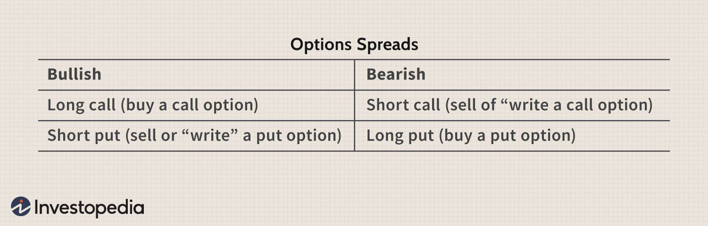

In the rapidly evolving world of finance, algorithmic trading has become a pivotal mechanism for executing trades with precision and speed. Algorithmic trading, often termed as algo trading, leverages computer programs to automate various execution strategies in the market. This approach allows traders to quickly respond to market fluctuations, optimizing the timing of trades, minimizing impact costs, and enhancing the overall efficacy of trading operations.

A crucial component within these strategies is the 'long leg,' which plays a significant role particularly in complex options trading. Options trading involves contracts that give buyers the right, but not the obligation, to buy or sell an underlying asset at a predetermined price before a specified date. The 'long leg' is the part of a strategy where a trader takes a buying position in options, betting on specific price movements to capitalize on favorable market conditions. In multi-leg strategies, the long leg can be paired with short positions, creating sophisticated combinations that aim to mitigate risks while maximizing returns.

This article will cover the concept of the long leg and its application in algorithmic trading. Through practical examples, we'll examine how traders can leverage long legs to refine their trading strategies, aiming for optimal returns while minimizing associated risks. The understanding of long legs is not just beneficial but essential whether you are a seasoned trader or new to the world of algorithmic trading.

In recent years, the dramatic shifts in market dynamics have underscored the importance of adopting advanced trading strategies like those involving long legs. By exploring long legs' role in trade execution, traders can develop a more nuanced approach to market interactions, effectively balancing volatility management and return optimization. This article aims to illuminate the potential of long legs in trading strategies, positioning traders to take advantage of both dynamic market conditions and periods of stability.

## Table of Contents

## What is a Long Leg?

A long leg in trading refers to the long position(s) a trader takes as part of an options strategy, specifically within a multi-leg derivatives framework. Within these strategies, a trader buys options contracts aiming to benefit from anticipated price movements in the underlying asset. 

Typically, long legs are integrated into a spread or combination strategy. For instance, they are commonly paired with short legs to form strategies like straddles, strangles, or spreads. The long leg involves the purchase of an option, which requires the payment of a premium. This provides the trader with the right, but not the obligation, to execute the option at a predetermined strike price before its expiration. This feature imparts a degree of protection, as it enables hedging against adverse price movements, potentially limiting losses if the market moves unfavorably.

By investing in a long leg, traders have the opportunity to capitalize on upward or downward shifts in asset prices, depending on whether they purchase call or put options. This strategic asset application is particularly well-suited to scenarios where significant market [volatility](/wiki/volatility-trading-strategies) is expected. Overall, the long leg's primary attraction lies in its ability to provide a flexible framework for managing risk while pursuing profit opportunities.

## Understanding Long Legs in Options Trading

A long leg in a multi-leg options strategy represents a purchase of an option, providing the trader the right, but not the obligation, to buy or sell the underlying asset at a specific strike price by a certain expiration date. This strategy aims to exploit predicted asset price movements with a controlled risk exposure. 

For instance, in a bull call spread, the trader buys a call option at a lower strike price, which constitutes the long leg, while simultaneously selling another call option at a higher strike price. This configuration seeks to capture gains from an upward price movement in the underlying asset. The purchased call option (long leg) enables the trader to benefit from any future rise in the asset's price, whereas the sold call option helps offset some of the cost, creating a cost-effective strategy with capped upside potential and limited downside risk.

Long legs are also utilized in strategies like straddles and strangles. A straddle involves purchasing both a call and a put option at the same strike price and expiration date. The strategy profits from significant movements in the price of the underlying asset, regardless of direction. A strangle, on the other hand, is similar but involves buying call and put options with different strike prices, offering flexibility and reduced upfront cost.

The profitability of a long leg hinges on the direction and magnitude of price movement. For a long call option, the key to profitability is that the asset's price rises significantly above the strike price plus the premium paid before expiration. Conversely, in a long put option, profitability requires the asset's price to decrease considerably below the strike price minus the premium within the same timeframe. The price sensitivity of long legs can be assessed using various option Greeks, such as Delta and Theta, which measure the rate of change in the option's price relative to price movement in the underlying asset and time decay, respectively.

By combining long legs with other option positions, traders can create intricate strategies that align with their market forecasts and risk tolerance. These multi-leg structures enable fine-tuning of potential returns and losses based on predicted market conditions, enhancing their ability to adapt to various financial scenarios.

## Examples of Long Legs in Algo Trading

Algorithmic trading utilizes long legs to automate and efficiently execute complex trading strategies. One prime example is the iron condor strategy. In this approach, long legs are instrumental in profiting from low volatility scenarios by establishing a range within which the underlying asset's price can fluctuate with minimal risk. This strategy involves selling an out-of-the-money call and put while simultaneously purchasing further out-of-the-money call and put options, thereby forming long legs. The long legs act to hedge the short positions, limiting potential losses if the asset's market price moves significantly beyond the expected range.

Another sophisticated strategy employing long legs is the calendar spread. In this strategy, traders buy and sell call or put options of the same strike price but with different expiration dates. By using long legs at staggered expiration dates, traders harness the effects of time decay to their advantage. The purchased options (long legs) tend to retain more value over time compared to options sold closer to expiry, allowing traders to potentially profit from the differential rate of time decay.

Algorithmic systems significantly enhance the deployment of long legs by automating these strategies. These systems can define specific market conditions, such as volatility levels or price thresholds, where long legs should be activated, optimizing the timing of trade entries and exits. For instance, algorithms can be programmed to initiate an iron condor when implied volatility is predicted to decrease, increasing the likelihood of profiting from stable market conditions.

Furthermore, [algorithmic trading](/wiki/algorithmic-trading) systems can simulate multiple market scenarios to evaluate the effectiveness of long legs before executing real trades. This simulation ability allows traders to backtest strategies over historical data, assessing potential outcomes under various hypothetical market conditions. By iteratively refining their algorithms with these insights, traders can enhance their strategic approach to include long legs, thus strengthening their risk management and optimizing returns.

Incorporating long legs into algorithmic trading frameworks provides a robust mechanism for executing advanced derivatives strategies, capitalizing on market inefficiencies, and managing risk effectively.

## Advantages of Using Long Legs in Algo Trading

Long legs in algorithmic trading provide sophisticated risk management capabilities, allowing traders to effectively hedge their positions. The inclusion of long legs in trading strategies enables the creation of diversified profit scenarios, offering flexibility in crafting multi-leg approaches such as condors and straddles. These strategies benefit from the varying payoff structures provided by long legs, enhancing the potential for profit across different market conditions.

The automation of long legs in algorithmic systems results in faster and more efficient order execution compared to manual trading. Algorithms can execute complex trading strategies with precision, minimizing slippage and taking advantage of optimal market conditions. This automation is crucial, especially in volatile markets where quick response times can significantly impact profitability.

Long legs also play a critical role in exploiting fleeting [arbitrage](/wiki/arbitrage) opportunities. Since arbitrage margins are often thin and available for a limited time, deploying long legs through algorithmic trading systems can be pivotal in capitalizing on these transient opportunities before they vanish from the market. Algorithmic systems can monitor multiple assets and execute trades simultaneously, ensuring that advantageous positions are secured.

Overall, the integration of long legs in algorithmic trading contributes to more robust and well-rounded trading strategies. By balancing risks and returns efficiently, traders can achieve a more stable performance over time. The use of long legs helps diversify exposure and optimize the risk-reward ratio, underscoring their value in a trader's arsenal. As technology continues to evolve, the capacity to leverage long legs effectively will remain a cornerstone of successful algorithmic trading strategies.

## Challenges and Considerations

While long legs in algorithmic trading strategies can provide considerable benefits, they also pose several challenges and considerations that traders must address to maintain profitability.

First, the primary cost associated with long legs is the premium paid to hold the option, which can directly impact overall profitability. This premium is the initial outlay that traders must overcome to generate profits from their option positions. Thus, the expectation of price movement must be significant enough to cover this cost and still result in a profitable trade.

Time decay, often represented by the Greek letter Theta (θ), is another critical [factor](/wiki/factor-investing). It refers to the erosion of an option's value as it approaches its expiration date. As time passes, options lose value, and if the anticipated price movement does not occur quickly, the option may expire worthless, resulting in a loss equivalent to the premium paid.

Additionally, implied volatility plays a significant role in the pricing of options and, consequently, long legs. Implied volatility reflects market expectations of future volatility and can greatly affect the premium of options. Traders must predict how implied volatility will change over the option's life. Higher implied volatility increases option premiums, while a drop can reduce the value of held options even if the underlying asset price remains stable.

Algorithmic strategies that incorporate long legs necessitate precise parameter settings. These parameters guide the algorithm in entering and exiting trades optimally. Inaccurate settings can lead to poor execution, failing to capitalize on profitable opportunities or exiting positions prematurely, thereby causing unintended losses.

Continuous monitoring and adjustment of algorithm parameters are essential as market conditions are dynamic and can shift rapidly. Algorithms should be regularly updated to align with current market trends and patterns, ensuring that trades remain relevant and responsive to market changes.

The design of sophisticated algorithms should also account for potential technical issues or market anomalies. Algorithms must have contingency measures to mitigate disruptions from unexpected technical failures or abnormal market movements. Implementing robust error-handling protocols and fail-safes is crucial to maintaining stability and reliability in trading operations.

Developers can use programming languages like Python to script and test trading algorithms. For example, using libraries such as NumPy or pandas, traders can simulate various market scenarios and measure the sensitivity of the portfolio to Theta and implied volatility, ensuring the algorithm's robustness against these factors.

Overall, while the implementation of long legs in algorithmic trading is advantageous, effective management of these challenges is essential to maximize benefits and minimize risks.

## Conclusion

Understanding and effectively implementing long legs in algorithmic trading brings about significant strategic advantages. Long legs offer unique opportunities to hedge risks and refine trading strategies, providing traders with leverage to adapt quickly to various market conditions. By utilizing advanced technology, traders can precisely execute these strategies, gaining an edge in managing price movements and volatility.

Despite some inherent challenges, such as the premium cost associated with long legs and the need for careful calibration of algorithmic parameters, the benefits often overshadow these limitations. Carefully planned strategies, which include long legs, can enhance a trader's ability to navigate unpredictable market events and mitigate potential losses. 

As financial markets become more sophisticated, traders who master the use of long legs will be well-equipped to capitalize on both volatility and stability. The effective use of long legs, supported by cutting-edge technology and precise algorithmic execution, not only enhances risk management capabilities but also optimizes returns by seizing market opportunities in real-time.

Looking forward, the future of trading will increasingly rely on innovative strategies like long legs, boosted by continuous advancements in algorithmic trading technologies. These innovations will empower traders to become more adept at navigating complex trading environments, exploiting both volatility and market stability, and ultimately leading to sustained profitability and strategic advantage.

## References & Further Reading

[1]: Bergstra, J., Bardenet, R., Bengio, Y., & Kégl, B. (2011). ["Algorithms for Hyper-Parameter Optimization."](https://dl.acm.org/doi/10.5555/2986459.2986743) Advances in Neural Information Processing Systems 24.

[2]: ["Advances in Financial Machine Learning"](https://www.amazon.com/Advances-Financial-Machine-Learning-Marcos/dp/1119482089) by Marcos Lopez de Prado

[3]: ["Evidence-Based Technical Analysis: Applying the Scientific Method and Statistical Inference to Trading Signals"](https://www.amazon.com/Evidence-Based-Technical-Analysis-Scientific-Statistical/dp/0470008741) by David Aronson

[4]: ["Machine Learning for Algorithmic Trading"](https://github.com/stefan-jansen/machine-learning-for-trading) by Stefan Jansen

[5]: ["Quantitative Trading: How to Build Your Own Algorithmic Trading Business"](https://www.amazon.com/Quantitative-Trading-Build-Algorithmic-Business/dp/1119800064) by Ernest P. Chan