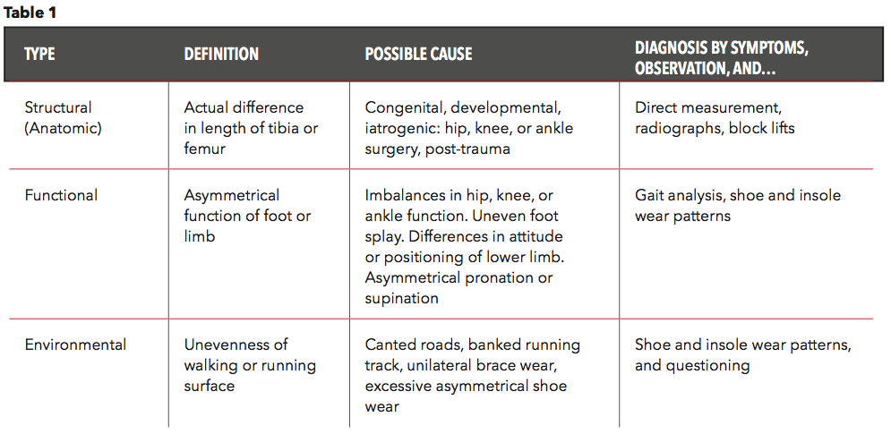

## Table of Contents

## What is the basic definition of 'long leg' in biology?

In biology, a 'long leg' usually refers to a type of leg structure found in certain animals. These legs are longer than average compared to the body size of the animal. Long legs help animals in many ways. For example, they can help animals run faster, jump higher, or reach food that is high up.

Many different animals have long legs. Some common examples include giraffes, ostriches, and certain types of insects like grasshoppers. Each of these animals uses their long legs differently. Giraffes use their long legs to reach leaves on tall trees, while ostriches use them to run quickly across the ground. Grasshoppers use their long legs to jump far distances.

## How does the length of legs vary among different species?

The length of legs can be very different among different species. This difference depends on what the animal needs to do to survive. For example, animals that need to run fast, like cheetahs, have long legs. These long legs help them take bigger steps and move quickly. On the other hand, animals that don't need to move fast, like turtles, have shorter legs. Their short legs are good for crawling slowly and staying safe in their shells.

Leg length can also change based on where the animal lives. Animals in open spaces, like the savanna, often have longer legs. This helps them see over tall grass and run away from danger. For example, gazelles have long legs for this reason. In contrast, animals in forests or jungles, like monkeys, might have shorter legs. Shorter legs help them climb trees and move around in tight spaces. So, the length of an animal's legs is closely related to its environment and lifestyle.

## What are the primary functions of long legs in animals?

Long legs in animals serve many important jobs. One big job is helping animals move quickly. Animals like cheetahs and ostriches use their long legs to run fast. This helps them catch food or get away from danger. Long legs also help some animals jump far. For example, kangaroos and grasshoppers use their long legs to make big jumps. This helps them move around their home and find food.

Another important job of long legs is reaching things that are far away or high up. Giraffes use their long legs to reach leaves on tall trees. This helps them eat food that other animals can't get. Long legs can also help animals see over tall grass or other things in their way. For example, gazelles use their long legs to see danger coming from far away. So, long legs help animals in many different ways to survive and live well.

## Can you explain how long legs contribute to an animal's survival?

Long legs help animals survive in many ways. One big way is by helping them move fast. Animals like cheetahs and ostriches use their long legs to run quickly. This helps them catch food or escape from danger. For example, a cheetah can use its long legs to chase down a gazelle for a meal. If a predator is chasing an ostrich, its long legs help it run away and stay safe. So, long legs are very important for animals that need to be fast.

Long legs also help animals reach things that are far away or high up. Giraffes, for example, use their long legs to reach leaves on tall trees. This means they can eat food that other animals can't get to. Long legs can also help animals see over tall grass or other things in their way. Gazelles use their long legs to stand tall and look out for danger. This way, they can see predators coming from far away and run away in time. So, long legs give animals a big advantage in finding food and staying safe.

## What are some common examples of animals with long legs?

Some animals with long legs are giraffes, ostriches, and cheetahs. Giraffes have very long legs that help them reach leaves on tall trees. This is important because they eat leaves that other animals can't get to. Ostriches also have long legs, which they use to run very fast. They can run away from danger and stay safe. Cheetahs have long legs too, and they use them to chase down their food. They can run very quickly and catch animals like gazelles.

Other animals with long legs include kangaroos and certain types of insects like grasshoppers. Kangaroos use their long legs to jump far. This helps them move around their home and find food. Grasshoppers also have long legs, and they use them to jump away from danger. Their long legs help them escape quickly when they need to. So, long legs are very helpful for many different animals.

## How do long legs affect an animal's movement and locomotion?

Long legs change how animals move and get around. Animals with long legs can take bigger steps. This means they can run faster and cover more ground with each step. For example, cheetahs use their long legs to run very quickly. They can catch food like gazelles because their long legs help them move fast. Ostriches also use their long legs to run away from danger. Their long legs help them take big steps and escape quickly.

Long legs also help animals jump far. Kangaroos and grasshoppers have long legs that they use to jump. Kangaroos can jump far to move around their home and find food. Grasshoppers use their long legs to jump away from danger. Their long legs help them escape quickly. So, long legs make animals better at running and jumping, which helps them survive.

## What evolutionary advantages do long legs provide?

Long legs give animals many good things that help them live better. One big help is that long legs let animals run fast. This is good for catching food or getting away from danger. For example, cheetahs use their long legs to chase down gazelles. Ostriches use their long legs to run away from predators. Being able to run fast helps these animals stay alive and safe.

Long legs also help animals reach things that are far away or high up. Giraffes use their long legs to reach leaves on tall trees. This means they can eat food that other animals can't get. Long legs can also help animals see over tall grass or other things in their way. Gazelles use their long legs to stand tall and look out for danger. This way, they can see predators coming from far away and run away in time. So, long legs give animals a big advantage in finding food and staying safe.

## How do long legs impact an animal's energy expenditure during movement?

Long legs can change how much energy an animal uses when it moves. Animals with long legs can take bigger steps, which means they can cover more ground with less effort. For example, a cheetah with long legs can run fast without using as much energy as an animal with shorter legs. This is because each step the cheetah takes covers a lot of ground, so it doesn't need to take as many steps to go the same distance. This can save energy, which is important for hunting or escaping from danger.

However, long legs can also use more energy in some situations. For example, when an animal is walking slowly, long legs might use more energy than short legs. This is because the long legs have to move a bigger distance with each step, even if the animal is going slowly. So, while long legs can be good for running fast and saving energy, they might use more energy when the animal is just walking around. It all depends on what the animal is doing and how it is moving.

## What biomechanical principles are involved in the function of long legs?

Long legs work because of some important biomechanical ideas. One big idea is leverage. Long legs act like long levers, which help animals take bigger steps and move faster. When an animal with long legs runs, it can use less energy to cover more ground. This is because the long leg can swing further with each step. Another important idea is the way muscles and tendons work together. The long legs have strong muscles and stretchy tendons that help store and release energy. This makes the animal's movements more efficient and powerful.

Another biomechanical principle is the way long legs affect balance and stability. Animals with long legs have a higher center of gravity, which can make them less stable when standing still. But when they are moving, this higher center of gravity can help them run faster and jump farther. The long legs also help with shock absorption. When an animal lands after a jump or a run, the long legs can bend and absorb the impact, which helps protect the animal's body. So, long legs use these biomechanical principles to help animals move better and use less energy.

## How do environmental factors influence the development of long legs in species?

Environmental factors can change how long an animal's legs grow. Animals living in open areas like savannas often have longer legs. This is because they need to run fast to catch food or escape from danger. For example, gazelles and ostriches have long legs that help them see over tall grass and run quickly. In these places, having long legs is a big help for survival. If the environment has lots of space and danger, animals with longer legs can live better and pass on their long leg genes to their babies.

In other places, like forests or jungles, animals might not need long legs. Here, the environment is full of trees and tight spaces. Animals like monkeys have shorter legs that help them climb and move around easily. Long legs would get in the way and make it hard to move in these crowded areas. So, the environment decides what kind of legs are best for an animal. Over time, animals change to fit their home, and this includes how long their legs grow.

## What are the latest research findings on the genetic basis of long leg development?

Scientists have been studying the genes that make animals have long legs. They found that some genes control how bones grow and how long legs get. For example, a gene called BMP (Bone Morphogenetic Protein) helps decide how long bones will be. If this gene works more, the legs can grow longer. Another gene, called FGFR3 (Fibroblast Growth Factor Receptor 3), can stop bones from growing too much. If this gene doesn't work right, it can lead to shorter legs. So, the balance between these genes is important for how long an animal's legs will be.

Researchers also found that other genes and how they work together can affect leg length. For example, genes that control how cells grow and divide can make legs longer or shorter. Studies on different animals, like mice and dogs, have shown that certain parts of their DNA can be linked to longer legs. These parts of DNA can turn on or off genes that help legs grow. As scientists learn more, they see that leg length is controlled by many genes working together, and it's not just one gene that decides everything.

## How can understanding long legs in animals be applied to robotics and biomechanical engineering?

Understanding how long legs work in animals can help people make better robots and machines. Scientists look at how animals like cheetahs and ostriches use their long legs to run fast and jump far. They use this information to design robots with long legs that can move quickly and efficiently. For example, a robot with long legs could be made to run fast in places like factories or disaster areas. By studying the muscles and tendons in animal legs, engineers can make robots that save energy and move smoothly, just like real animals.

In biomechanical engineering, knowing about long legs helps make better devices for people. For example, if someone needs a new leg because of an injury, engineers can use what they know about animal legs to make a better artificial leg. These artificial legs can be designed to help people walk or run more naturally. By copying how long legs work in animals, engineers can make devices that are strong, light, and use energy well. This can help people move better and do more things in their daily lives.

## References & Further Reading

[1]: Bergstra, J., Bardenet, R., Bengio, Y., & Kégl, B. (2011). ["Algorithms for Hyper-Parameter Optimization."](https://dl.acm.org/doi/10.5555/2986459.2986743) Advances in Neural Information Processing Systems 24.

[2]: ["Advances in Financial Machine Learning"](https://www.amazon.com/Advances-Financial-Machine-Learning-Marcos/dp/1119482089) by Marcos Lopez de Prado

[3]: ["Evidence-Based Technical Analysis: Applying the Scientific Method and Statistical Inference to Trading Signals"](https://www.amazon.com/Evidence-Based-Technical-Analysis-Scientific-Statistical/dp/0470008741) by David Aronson

[4]: ["Machine Learning for Algorithmic Trading"](https://github.com/stefan-jansen/machine-learning-for-trading) by Stefan Jansen

[5]: ["Quantitative Trading: How to Build Your Own Algorithmic Trading Business"](https://www.amazon.com/Quantitative-Trading-Build-Algorithmic-Business/dp/1119800064) by Ernest P. Chan