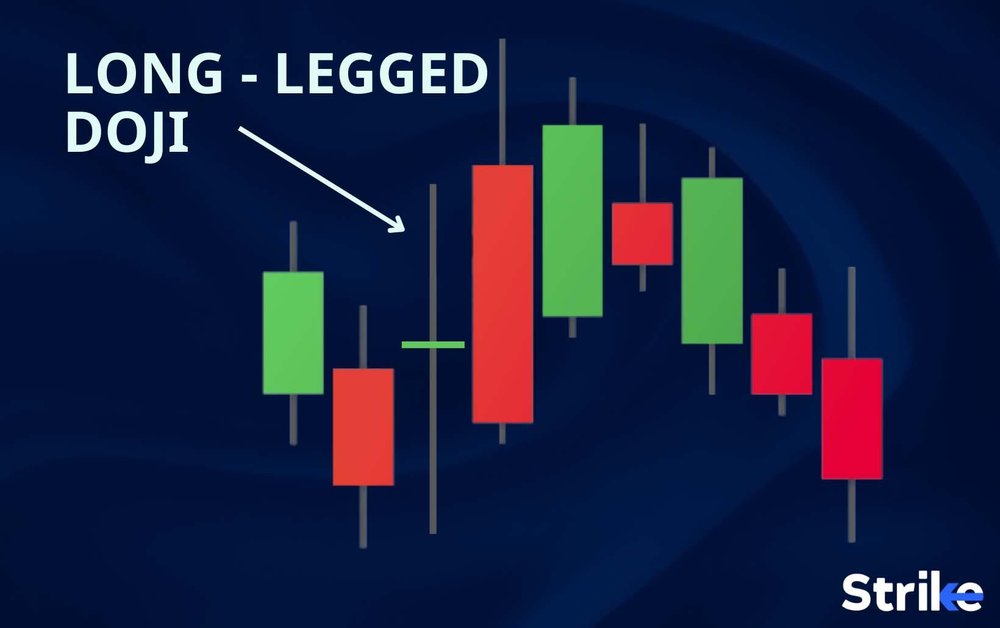

## Table of Contents

## What is a Long-Legged Doji candlestick pattern?

A Long-Legged Doji is a type of candlestick pattern you might see on a stock chart. It shows that the price of a stock went up and down a lot during the day, but ended up closing near where it started. The candlestick has a small body in the middle and long lines, called wicks or shadows, sticking out from the top and bottom. This pattern looks like a cross with long legs, which is why it's called a Long-Legged Doji.

This pattern can tell traders that the market is unsure about the stock's price. When you see a Long-Legged Doji, it means that buyers and sellers were fighting a lot during the day, but neither side won by the end. Traders often watch for this pattern because it might mean that the stock's price could change direction soon. It's a sign to be careful and think about what might happen next in the market.

## How does a Long-Legged Doji form on a price chart?

A Long-Legged Doji forms on a price chart when the price of a stock or asset moves a lot during the trading day but ends up closing near where it started. Imagine the price going up high and then dropping down low, but by the end of the day, it comes back to around the opening price. This creates a candlestick that looks like a cross with long legs, which is why it's called a Long-Legged Doji. The long lines sticking out from the top and bottom of the candlestick, called wicks or shadows, show how much the price moved up and down.

This pattern shows that there was a lot of fighting between buyers and sellers during the day, but neither side could take control by the end. The small body of the candlestick, which is the part between the opening and closing prices, is near the middle of the long wicks. This tells traders that the market is unsure and could be ready for a change in direction. Seeing a Long-Legged Doji on a chart is a signal to be careful and think about what might happen next with the stock's price.

## What does a Long-Legged Doji indicate about market sentiment?

A Long-Legged Doji shows that people trading the stock are feeling unsure. This candlestick pattern happens when the price goes up a lot and then down a lot during the day, but ends up closing near where it started. The long lines on the top and bottom of the candlestick tell us that there was a big fight between buyers and sellers. Neither side won by the end of the day, which means the market is kind of confused about what the stock is worth.

When traders see a Long-Legged Doji, they think the market might be getting ready to change direction. It's like a warning sign that says, "Watch out, something might happen soon." If the stock has been going up for a while and then you see this pattern, it might mean the price will start to go down. If the stock has been going down and then you see a Long-Legged Doji, it might mean the price will start to go up. Either way, it tells traders to be careful and think about what they should do next.

## Can you explain the difference between a Long-Legged Doji and a regular Doji?

A Long-Legged Doji and a regular Doji are both types of candlestick patterns that you can see on a price chart, but they look a bit different. A regular Doji has a small body in the middle, which means the opening and closing prices are very close to each other. The wicks, or lines above and below the body, can be short or long, but they don't stand out as much. A regular Doji shows that the price didn't move much during the day and ended up close to where it started.

On the other hand, a Long-Legged Doji also has a small body in the middle, but it has much longer wicks sticking out from the top and bottom. These long wicks mean that the price moved a lot during the day, going up high and down low, but it still closed near the opening price. The long legs make this Doji look like a cross with long legs, which is why it's called a Long-Legged Doji. This pattern shows a bigger fight between buyers and sellers than a regular Doji, suggesting more uncertainty in the market.

## In what types of markets (bullish, bearish, or neutral) is a Long-Legged Doji most commonly observed?

A Long-Legged Doji can be seen in all types of markets, whether they are going up (bullish), going down (bearish), or staying the same (neutral). This pattern shows that the price moved a lot during the day but ended up close to where it started. It tells traders that people are unsure about the price and that the market could be getting ready to change direction.

In a bullish market, a Long-Legged Doji might show up when the price has been going up for a while and traders start to think it might be too high. This could mean the price will start to go down soon. In a bearish market, the pattern might appear when the price has been falling and traders think it might be too low. This could mean the price will start to go up soon. In a neutral market, a Long-Legged Doji can show that traders are just confused about where the price should go next.

## How can traders use a Long-Legged Doji to make trading decisions?

Traders can use a Long-Legged Doji to help them decide what to do with their trades. When they see this pattern on a chart, it tells them that the market is unsure about the price of the stock. The long legs of the Doji show that the price went up and down a lot during the day but ended up close to where it started. This means there was a big fight between buyers and sellers, but neither side won. If the stock has been going up for a while and then a Long-Legged Doji appears, it might be a sign that the price could start to go down. Traders might think about selling their stock or getting ready to buy if the price drops.

In a market where the price has been falling, seeing a Long-Legged Doji could mean the price might start to go up. Traders might see this as a chance to buy the stock, hoping the price will rise. In a market that's not going up or down much, a Long-Legged Doji can show that traders are confused about the price. This might make traders want to wait and see what happens next before making a move. Overall, the Long-Legged Doji is a signal for traders to be careful and think about what might happen next with the stock's price.

## What are the potential entry and exit points when trading based on a Long-Legged Doji?

When traders see a Long-Legged Doji, they might think about entering a trade if the stock has been going up for a while. The Doji shows that the price went up and down a lot but ended near where it started. This could mean the price might start to go down soon. So, if traders think the price will drop, they might enter a trade by selling the stock or buying a put option. They would do this right after seeing the Long-Legged Doji, hoping to make money as the price falls. If the stock has been going down and then a Long-Legged Doji appears, traders might see it as a sign that the price could start to go up. In this case, they might enter a trade by buying the stock or a call option, hoping to profit as the price rises.

Deciding when to [exit](/wiki/exit-strategy) a trade after seeing a Long-Legged Doji depends on what happens next with the price. If traders entered a trade expecting the price to fall after a Long-Legged Doji in an upward trend, they might exit the trade when the price actually starts to drop. They could set a target price for how low they think it will go or use a stop-loss order to limit their losses if the price goes up instead. If traders entered a trade expecting the price to rise after a Long-Legged Doji in a downward trend, they might exit when the price starts to go up. Again, they could set a target for how high they think it will go or use a stop-loss to protect their money if the price falls. The key is to watch the price closely after seeing a Long-Legged Doji and be ready to act based on what happens next.

## Are there any specific time frames where a Long-Legged Doji is more reliable?

A Long-Legged Doji can be seen on different time frames like a minute, hour, day, or week chart. But it might be more reliable on longer time frames like daily or weekly charts. This is because longer time frames show bigger trends and more important changes in the market. When you see a Long-Legged Doji on a daily or weekly chart, it means a lot of trading happened over that time, and the market was really unsure about the price.

On shorter time frames like a minute or hour chart, a Long-Legged Doji might not be as important. The price can move up and down a lot in a short time, so seeing a Long-Legged Doji might just show normal trading action. But if you see this pattern on a longer time frame, it's a stronger sign that the market might be getting ready to change direction. So, traders often pay more attention to a Long-Legged Doji on daily or weekly charts when making their trading decisions.

## What are some common mistakes traders make when interpreting a Long-Legged Doji?

One common mistake traders make when they see a Long-Legged Doji is thinking it always means the price will change direction right away. A Long-Legged Doji just shows that the market is unsure, but it doesn't promise that the price will go up or down next. Traders might jump into a trade too quickly without waiting to see what happens after the Doji, and this can lead to losses if the price doesn't move as expected.

Another mistake is not looking at the bigger picture. Traders might focus too much on the Long-Legged Doji without checking the overall trend of the market. For example, if the stock has been going up for a long time and then a Long-Legged Doji appears, it might mean the price could start to go down. But if the stock is just moving sideways and not really going up or down, the Long-Legged Doji might not be as important. It's important to consider what's been happening with the price before and after seeing the Doji to make better trading decisions.

## How does the Long-Legged Doji interact with other technical indicators or patterns?

A Long-Legged Doji can work together with other technical indicators or patterns to give traders a better idea of what might happen next with the stock's price. For example, if a Long-Legged Doji shows up near a big support or resistance level, it might mean the price is about to change direction. Support is a price level where the stock tends to stop falling and start going up, and resistance is where it stops going up and starts to fall. If a Long-Legged Doji appears right at these levels, it can be a strong sign that the price will move away from that level soon.

Traders also look at other indicators like moving averages or the Relative Strength Index (RSI) when they see a Long-Legged Doji. A moving average is a line on the chart that shows the average price over a certain time, and it can help traders see the overall trend. If a Long-Legged Doji appears and the price is far away from a moving average, it might mean the price will move back toward that average. The RSI measures how fast the price is moving and if it's overbought or oversold. If a Long-Legged Doji shows up when the RSI is very high or very low, it could mean the price is ready to change direction. By looking at these other indicators along with the Long-Legged Doji, traders can make smarter trading decisions.

## Can you provide historical examples where a Long-Legged Doji significantly impacted market trends?

In early 2018, the stock of Apple Inc. showed a Long-Legged Doji on its daily chart. The stock had been going up for a while, but then this pattern appeared, showing that the price moved a lot during the day but ended up close to where it started. This Long-Legged Doji was a sign that traders were unsure about the stock's price. After seeing this pattern, the stock started to go down over the next few weeks. Traders who noticed the Long-Legged Doji and decided to sell their stock or buy put options might have made money as the price fell.

Another example happened with the S&P 500 index in late 2015. The index had been moving sideways for a while, and then a Long-Legged Doji appeared on the weekly chart. This pattern showed that the price went up and down a lot over the week but closed near the opening price. It was a sign that the market was unsure and could be getting ready to change direction. After the Long-Legged Doji, the S&P 500 started to go down for a few months. Traders who paid attention to this pattern and took action might have been able to protect their money or even make some profit from the falling prices.

## What advanced strategies can traders employ to enhance the effectiveness of trading with a Long-Legged Doji?

Traders can enhance their effectiveness when using a Long-Legged Doji by combining it with other technical indicators like moving averages and the Relative Strength Index (RSI). For example, if a Long-Legged Doji appears and the stock's price is far away from its moving average, it might be a sign that the price will move back toward that average. If the RSI shows that the stock is overbought or oversold when the Long-Legged Doji appears, it can strengthen the signal that the price might change direction soon. By looking at these other indicators along with the Long-Legged Doji, traders can make more informed decisions and increase their chances of making successful trades.

Another advanced strategy involves using [volume](/wiki/volume-trading-strategy) analysis when a Long-Legged Doji appears. High trading volume on the day of the Long-Legged Doji can confirm that the market is really unsure about the stock's price, making the pattern more significant. Traders can also look at the price action in the days following the Long-Legged Doji. If the price breaks out of the range set by the Doji's long legs in the next few days, it can be a strong signal to enter a trade. For example, if the price breaks below the low of the Doji after an uptrend, it might be a good time to sell or buy a put option. By paying attention to these extra details, traders can better use the Long-Legged Doji to guide their trading decisions.

## References & Further Reading

[1]: Nison, S. (1991). ["Japanese Candlestick Charting Techniques: A Contemporary Guide to the Ancient Investment Techniques of the Far East."](https://www.amazon.com/Japanese-Candlestick-Charting-Techniques-Contemporary/dp/0139316507) New York Institute of Finance.

[2]: Murphy, J.J. (1999). ["Technical Analysis of the Financial Markets: A Comprehensive Guide to Trading Methods and Applications."](https://www.amazon.com/Technical-Analysis-Financial-Markets-Comprehensive/dp/0735200661) New York Institute of Finance.

[3]: Pring, M.J. (2002). ["Technical Analysis Explained: The Successful Investor's Guide to Spotting Investment Trends and Turning Points."](https://www.amazon.com/Technical-Analysis-Explained-Fifth-Successful/dp/0071825177) McGraw-Hill.

[4]: Chan, E. (2009). ["Quantitative Trading: How to Build Your Own Algorithmic Trading Business."](https://github.com/ftvision/quant_trading_echan_book) John Wiley & Sons.

[5]: Aronson, D.R. (2007). ["Evidence-Based Technical Analysis: Applying the Scientific Method and Statistical Inference to Trading Signals."](https://www.amazon.com/Evidence-Based-Technical-Analysis-Scientific-Statistical/dp/0470008741) John Wiley & Sons.