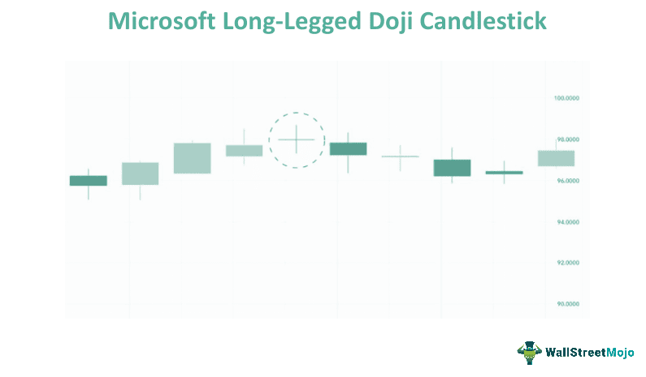

Understanding candlestick patterns is a fundamental aspect of technical analysis in trading, serving as vital tools for interpreting market sentiment and predicting future price movements. Among these patterns, the long-legged doji stands out due to its distinctive features and implications. Characterized by its long upper and lower shadows and minimal real body, this pattern signifies a balance between buying and selling pressures, resulting in market indecision.

The significance of the long-legged doji becomes even more pronounced in algorithmic trading, where automated systems analyze financial market data to execute trades. This pattern can be instrumental in predicting market trends and potential reversals, providing traders with opportunities to capitalize on changes in market dynamics.



This article explores the definition, characteristics, and implications of the long-legged doji candlestick pattern. It examines its utility in predicting market trends, its application across various financial markets, and its comparative effectiveness against other candlestick patterns. By understanding the intricacies of the long-legged doji, traders can enhance their technical analysis toolkit, potentially improving trading outcomes in both manual and algorithmic contexts.

## Table of Contents

## Understanding the Long-Legged Doji Candlestick Pattern

The long-legged doji is a candlestick pattern prominently identified by its long upper and lower shadows, often referred to as wicks, with a minimal or absent real body. This structure arises when the opening and closing prices of the trading period are nearly equal, indicating a stalemate between bullish and bearish forces within the market. The extended shadows suggest that throughout the trading session, there was significant upward and downward movement, but the forces ultimately balanced out by the session's close.

This pattern often emerges in environments marked by high volatility. Volatility can be quantified using metrics such as the standard deviation of price movements over a given period. High standard deviation in a time series of asset prices signifies greater volatility, setting the stage for formations like the long-legged doji. In Python, the volatility can be calculated as follows:

```python
import pandas as pd

# Assuming 'data' is a DataFrame with a 'Close' column representing closing prices
def calculate_volatility(data, window=20):
    data['Return'] = data['Close'].pct_change()
    data['Volatility'] = data['Return'].rolling(window=window).std() * (252**0.5)  # annualizing volatility
    return data['Volatility']
```

The significance of a long-legged doji in technical analysis primarily lies in its ability to signal potential trend reversals. However, the context in which it appears is critical in determining its reliability as an indicator. For instance, if this pattern surfaces during a prolonged uptrend or downtrend, it might suggest a forthcoming reversal or slowdown, implying that the existing trend's [momentum](/wiki/momentum) is weakening.

Yet, the interpretative power of the long-legged doji can vary significantly across different market conditions. In a trending market, it might act as a precursor to a reversal, whereas in a ranging market, it might merely denote continued indecision among traders. Hence, this pattern should ideally be analyzed alongside other technical indicators or patterns to derive meaningful insights into impending market movements.

## The Role of Long-Legged Doji in Technical Analysis

In technical analysis, the long-legged doji candlestick pattern serves as a significant indicator of market indecision. Characterized by its long upper and lower shadows and an almost negligible real body, this pattern emerges when the market's opening and closing prices are nearly identical. The stark shadows reflect a high level of [volatility](/wiki/volatility-trading-strategies) within the trading period, suggesting that neither buyers nor sellers were able to gain the upper hand decisively.

The importance of the long-legged doji amplifies when it appears within strong market trends, either bullish or bearish. In such contexts, this pattern might suggest an impending slowdown or a potential reversal in momentum. For instance, in a prolonged uptrend, the appearance of a long-legged doji could indicate that buying pressure is waning and market participants are increasingly uncertain about future price movements. Similarly, in a downtrend, it may signal that selling pressure is exhausting.

To make more reliable predictions, it is often beneficial to pair the long-legged doji with other technical indicators. One common approach is to use moving averages to confirm trends or reversals. For example, if a long-legged doji appears in conjunction with a crossover in moving averages, such as the 50-day moving average crossing below the 200-day moving average (a bearish signal), it can reinforce the probability of a trend reversal.

Another useful tool is the Relative Strength Index (RSI), which helps assess whether an asset is overbought or oversold. In a scenario where a long-legged doji forms in an overbought condition indicated by a high RSI value (typically above 70), it could further confirm a potential trend reversal to the downside. Similarly, a doji in an oversold market (RSI below 30) could imply an impending upward reversal.

Furthermore, incorporating [volume](/wiki/volume-trading-strategy) analysis can add another layer of confirmation. A long-legged doji accompanied by high trading volume may underscore the significance of the pattern, suggesting that the indecision among traders is substantial and that a significant price movement might occur in the following periods.

Here's a Python snippet demonstrating how these factors could be used together in an analysis:

```python
import talib
import pandas as pd

# Sample price data
data = {
    'open': [...],
    'high': [...],
    'low': [...],
    'close': [...],
    'volume': [...]
}

df = pd.DataFrame(data)

# Identify doji patterns
doji = talib.CDLDOJI(df['open'], df['high'], df['low'], df['close'])

# Calculate RSI
rsi = talib.RSI(df['close'], timeperiod=14)

# Calculate moving averages
ma50 = talib.SMA(df['close'], timeperiod=50)
ma200 = talib.SMA(df['close'], timeperiod=200)

# Define a strategy: Look for doji in overbought/oversold RSI conditions with a moving average crossover
signals = (doji != 0) & ((rsi > 70) | (rsi < 30)) & ((ma50 < ma200) | (ma50 > ma200))

# Print signals
print(df[signals])
```

This algorithm illustrates how one might automate the identification of long-legged dojis, supplementing them with RSI and moving average analysis to generate trading signals. Employing such multi-faceted approaches can enhance the role of long-legged dojis within a trader's technical analysis toolkit, increasing the likelihood of accurate market predictions.

## Utilizing Long-Legged Doji in Algorithmic Trading

In [algorithmic trading](/wiki/algorithmic-trading), the long-legged doji pattern functions as a key indicator employed in automated systems to anticipate market trends. The distinct formation of a long-legged doji, marked by lengthy shadows and a minimal body, signals market indecision and potential trend reversals. This pattern's occurrence can be programmed into trading algorithms to prompt specific actions aimed at exploiting potential reversals or shifts in market momentum.

The integration of the long-legged doji into algorithmic frameworks allows for systematic decision-making based on quantitative analysis. These algorithms can assess the occurrence of this pattern in real-time, triggering buy or sell orders aligned with predefined strategies. For instance, if a long-legged doji emerges following a pronounced upward trend, an algorithm may interpret this as a signal of a potential bearish reversal, thus executing sell orders or adjusting stop-loss levels.

The efficacy of these algorithms highly depends on rigorous [backtesting](/wiki/backtesting) using historical market data. Backtesting involves running trading algorithms on past data to evaluate their performance and reliability. By analyzing historical occurrences of long-legged doji patterns and the corresponding market movements, traders can optimize parameters, ensuring the algorithm's robustness in various market conditions. This process often requires statistical measures such as the Sharpe ratio or maximum drawdown to assess risk-adjusted returns and potential losses.

A typical algorithmic trading strategy utilizing the long-legged doji pattern might be implemented in Python as follows:

```python
import pandas as pd
import numpy as np

def detect_long_legged_doji(data):
    body = abs(data['Close'] - data['Open'])
    upper_shadow = data['High'] - np.maximum(data['Open'], data['Close'])
    lower_shadow = np.minimum(data['Open'], data['Close']) - data['Low']

    # Conditions for a long-legged doji
    condition = (body < 0.1 * (data['High'] - data['Low'])) & \
                (upper_shadow > body) & \
                (lower_shadow > body)
    return condition

# Example of applying the function on historical data
historical_data = pd.read_csv("market_data.csv")  # Assume this CSV contains 'Open', 'High', 'Low', 'Close' columns
historical_data['LongLeggedDoji'] = detect_long_legged_doji(historical_data)

# Backtesting
# Assume historical_data has a DateTime index and a 'Close' column
signals = historical_data[historical_data['LongLeggedDoji']]
positions = signals.index  # Get the index positions where a long-legged doji is detected

# Analyze positions and assess the strategy's historical performance using risk and return metrics
```

This algorithm identifies potential long-legged doji patterns on historical market data, allowing traders to simulate their strategies' performance over time. Despite the automated nature of the process, it remains crucial to constantly update and adapt trading algorithms to account for changes in market dynamics and volatility, ensuring that strategies retain their effectiveness and do not become obsolete.

## Long-Legged Doji vs. Other Candlestick Patterns

The long-legged doji stands out among candlestick patterns due to its depiction of strong market indecision, signified by its extended upper and lower shadows with little to no real body. This pattern can be contrasted with other doji types such as the dragonfly and gravestone, which present different implications in market analysis.

The dragonfly doji is characterized by a long lower shadow and virtually no upper shadow, typically forming after a decline. It suggests that selling pressure was prevalent during the trading session but buyers were able to push the price back to the opening level by the end. This pattern often indicates potential bullish reversals, especially if it forms after a solid downtrend.

Conversely, the gravestone doji features a long upper shadow with little to no lower shadow and generally appears after an uptrend. It implies that buyers drove prices higher during the session but sellers regained control, pushing the price back down towards the opening level by the close. This can signal a bearish reversal when it occurs at an uptrend's peak.

Unlike these more straightforward signals from dragonfly and gravestone dojis, interpreting long-legged dojis requires additional contextual information. This pattern's ambiguity stems from its balance between bullish and bearish forces, suggesting neither side has gained a definitive advantage. Traders need to examine the preceding trend, accompanying volume, and other technical indicators to decipher the potential market direction following a long-legged doji.

For instance, if a long-legged doji appears at the peak of an upward trend, it might indicate that buyers are losing momentum and a bearish reversal could be forthcoming. However, if it emerges during a sideways market, it may merely represent continued indecision.

Traders adept in using candlestick patterns incorporate these nuances into their strategies by aligning long-legged dojis with other analytical tools. This multifaceted approach provides a more robust framework for interpreting market signals and making informed trading decisions.

Understanding these differences is crucial for traders aiming to leverage candlestick patterns effectively. Relying solely on the long-legged doji without considering the broader market context or additional indicators can lead to misinterpretations and suboptimal trading outcomes.

## Real-Life Examples of Long-Legged Doji in Trading

## Real-Life Examples of Long-Legged Doji in Trading

The long-legged doji is a crucial candlestick pattern that has been observed to signal market indecision and potential trend reversals in various financial markets. By analyzing historical data, one can identify instances where this pattern has accurately predicted significant market movements, as well as cases where it has led to suboptimal trading decisions.

### Successful Case Studies

1. **Equity Markets**: One notable example of the long-legged doji's successful application is observed in the equity markets during the 2008 financial crisis. For instance, on multiple occasions preceding the market bottom in March 2009, the S&P 500 index charted long-legged dojis. These occurrences coincided with increased volatility and investor uncertainty, eventually leading to a market reversal as confirmed by subsequent bullish trends. Traders who identified these patterns, coupled with other reversal signals like increased trading volume and favorable economic indicators, capitalized on the ensuing rallies.

2. **Currency Markets**: In the foreign exchange market, the EUR/USD pair exhibited a noteworthy long-legged doji on April 22, 2020. Prior to this pattern, the pair had experienced a prolonged bearish trend amidst the COVID-19 pandemic-induced market fears. The appearance of the doji signaled indecision, leading to a halt in the downtrend. Traders who anticipated a reversal, supported by improving economic sentiments in the Eurozone, gained as the currency pair began an upward trajectory soon after.

### Unsuccessful Case Study

1. **Commodity Markets**: In the commodities market, on August 12, 2016, the gold futures market depicted a long-legged doji amidst a prevailing bullish trend. Many traders interpreted this as a potential reversal signal, expecting the bullish momentum to halt or reverse. However, the gold price continued to rise, driven by geopolitical tensions and a weaker USD, resulting in losses for traders who acted on the doji pattern without corroborating signals from other indicators such as Relative Strength Index (RSI) or Moving Average Convergence Divergence (MACD).

### Key Learnings

The above examples demonstrate the complex nature of trading based on long-legged doji patterns. While these patterns can foreshadow market turning points, their success largely depends on the broader market context and the integration of additional analytical tools. Traders are advised to not solely rely on candlestick patterns but to incorporate comprehensive analyses encompassing various technical indicators and market fundamentals to enhance decision-making accuracy. This approach emphasizes the importance of a robust trading strategy capable of adapting to changing market conditions.

## Common Mistakes and Considerations

When analyzing candlestick patterns, especially the long-legged doji, traders often fall into several common pitfalls. One key mistake is relying solely on the pattern itself for making trading decisions. The long-legged doji is inherently a symbol of market indecision; thus, acting on its presence alone may lead to false signals. A prudent approach involves supplementing the long-legged doji with additional technical indicators such as moving averages, RSI (Relative Strength Index), or MACD (Moving Average Convergence Divergence) to confirm any potential trends suggested by the pattern.

Another consideration is the prevailing market condition. Even when the market appears favorable, it is crucial to corroborate the long-legged doji's signals with comprehensive market analysis. This includes understanding the broader economic context, current news events, and other technical patterns that may influence market behavior. Overlooking this can result in misguided trades based on isolated signals.

Timeframe is another critical [factor](/wiki/factor-investing) when interpreting the long-legged doji. Patterns that appear on longer-term charts, like weekly or monthly charts, tend to be more reliable due to the greater amount of data and market activity they encompass. This stability makes them more capable of providing a meaningful signal compared to those on shorter timeframes, which might exhibit more noise and are susceptible to brief, random price fluctuations.

For traders looking to incorporate the long-legged doji in their strategies, it is advisable to perform backtesting. This involves using historical market data to test the effectiveness of trading strategies that rely on the long-legged doji, helping to optimize these strategies and mitigate potential risks. Here is a basic Python code snippet for backtesting a strategy using a long-legged doji pattern:

```python
import pandas as pd
import talib

# Load historical data
data = pd.read_csv('historical_data.csv')

# Calculate the long-legged doji pattern
data['doji'] = talib.CDLDOJI(data['Open'], data['High'], data['Low'], data['Close'])

# Filter the signals for long-legged doji (non-zero values indicate presence)
long_legged_doji_signals = data[data['doji'] != 0]

# Analyzing performance of trades based on these signals
# This requires more comprehensive analysis involving trade execution logic

print(long_legged_doji_signals)
```

The above considerations and tools enable traders to enhance the reliability and success rate of their strategies when using the long-legged doji. Integrating these practices into trading routines builds a more robust approach to market analysis and decision-making.

## Conclusion

The long-legged doji serves as a significant indicator of market indecision, providing traders with valuable insights into potential trend reversals. Its appearance on a candlestick chart signals a period where neither buyers nor sellers have full control, often leading to market hesitation. This pattern can be particularly useful when traders need to anticipate changes in trend direction, especially following a pronounced trend.

In algorithmic trading, the long-legged doji finds its utility as part of a holistic trading system that includes various technical indicators. By integrating additional tools such as moving averages, Bollinger Bands, or the relative strength index (RSI), traders can enhance the predictive power of the long-legged doji. This multi-indicator approach enables automated trading algorithms to better assess market conditions, refining the execution of trades when market indecision is detected.

For future traders, thorough testing and modification of strategies involving the long-legged doji are essential. Backtesting, using historical data to simulate trading strategies, helps validate the effectiveness of incorporating the long-legged doji within a broader trading strategy. Traders should customize their algorithms and strategies to align with specific trading goals and varying market conditions, ensuring the effectiveness and robustness of their approaches in different market scenarios. This tailored optimization can help mitigate the inherent risks associated with relying solely on the indecisive nature of this pattern.

## References & Further Reading

[1]: Nison, S. (1991). ["Japanese Candlestick Charting Techniques: A Contemporary Guide to the Ancient Investment Techniques of the Far East."](https://www.amazon.com/Japanese-Candlestick-Charting-Techniques-Contemporary/dp/0139316507) New York Institute of Finance.

[2]: Murphy, J.J. (1999). ["Technical Analysis of the Financial Markets: A Comprehensive Guide to Trading Methods and Applications."](https://www.amazon.com/Technical-Analysis-Financial-Markets-Comprehensive/dp/0735200661) New York Institute of Finance.

[3]: Pring, M.J. (2002). ["Technical Analysis Explained: The Successful Investor's Guide to Spotting Investment Trends and Turning Points."](https://www.amazon.com/Technical-Analysis-Explained-Fifth-Successful/dp/0071825177) McGraw-Hill.

[4]: Chan, E. (2009). ["Quantitative Trading: How to Build Your Own Algorithmic Trading Business."](https://github.com/ftvision/quant_trading_echan_book) John Wiley & Sons.

[5]: Aronson, D.R. (2007). ["Evidence-Based Technical Analysis: Applying the Scientific Method and Statistical Inference to Trading Signals."](https://www.amazon.com/Evidence-Based-Technical-Analysis-Scientific-Statistical/dp/0470008741) John Wiley & Sons.