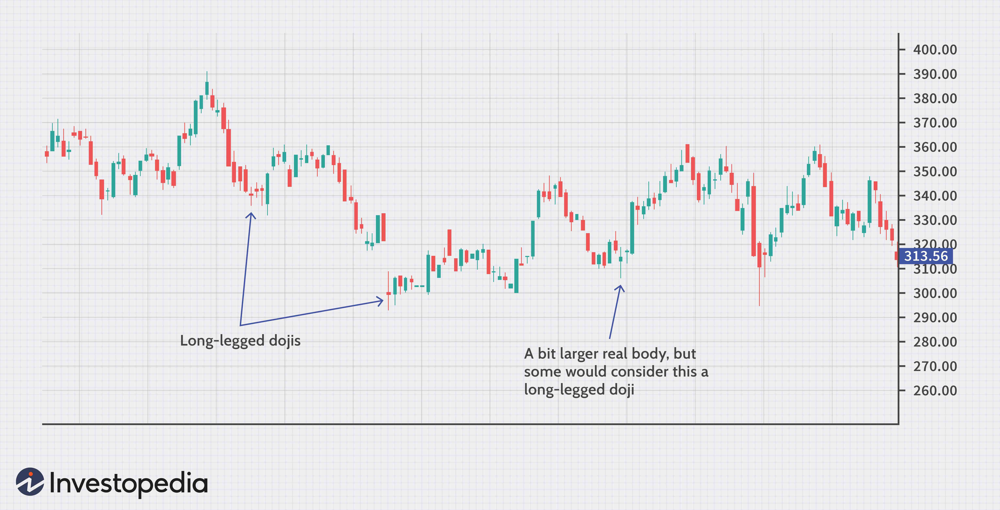

## Table of Contents

## What is a Long-Legged Doji?

A Long-Legged Doji is a type of candlestick pattern that you might see on a stock chart. It looks like a plus sign or a cross with a long vertical line. This pattern happens when the price of a stock goes up and down a lot during the day, but it ends up closing at or very near the same price it started at. The long vertical line, called the wick or shadow, shows how much the price moved up and down.

This pattern is important because it can tell traders that the market is unsure about where the price is going next. When you see a Long-Legged Doji, it means that neither the buyers nor the sellers were able to take control of the price movement by the end of the trading day. Traders often look at this pattern to decide if they should buy or sell, depending on what happens next in the market.

## How can you identify a Long-Legged Doji on a chart?

To spot a Long-Legged Doji on a chart, look for a candlestick that looks like a plus sign or a cross. The key feature is the long vertical line, which shows that the price moved a lot during the day. This line is called the wick or shadow. The body of the candlestick, which is the part between the opening and closing prices, should be very small or almost non-existent. This means the stock closed at or very close to the price it opened at.

When you see this pattern, it tells you that the market couldn't decide which way to go. The price went up and down a lot, but by the end of the day, it came back to where it started. This can be a sign that the market is unsure about what will happen next. Traders watch for this pattern because it might mean that the stock's price could change direction soon.

## What does a Long-Legged Doji signify in terms of market sentiment?

A Long-Legged Doji shows that the market is feeling unsure. When you see this pattern on a chart, it means that during the trading day, the price moved a lot up and down but ended up closing at or very close to where it started. This tells us that neither the people who want to buy the stock nor the people who want to sell it could take control. It's like they were fighting all day, but no one won by the end.

This uncertainty can be a sign that the market might change direction soon. If a Long-Legged Doji shows up after a long time of the price going up, it might mean that the buyers are getting tired and the price could start to go down. If it appears after the price has been going down for a while, it could mean that the sellers are losing their power and the price might start to go up. Traders pay close attention to what happens after a Long-Legged Doji because it can help them decide whether to buy or sell.

## Can you explain the difference between a Long-Legged Doji and other types of Doji patterns?

A Long-Legged Doji is one type of Doji pattern, and it's special because it has a long vertical line, called the wick or shadow, which shows that the price moved a lot during the day. The body of the candlestick, which is the part between the opening and closing prices, is very small or almost non-existent. This means the stock closed at or very close to the price it opened at. The long legs tell us that the market was unsure and couldn't decide which way to go, making it a sign of uncertainty.

Other types of Doji patterns include the Dragonfly Doji, Gravestone Doji, and the standard Doji. A Dragonfly Doji has a long lower shadow and no upper shadow, which looks like a T. It shows that the price went down a lot during the day but came back up to close near the opening price. A Gravestone Doji is the opposite, with a long upper shadow and no lower shadow, looking like an upside-down T. This means the price went up a lot but came back down to close near the opening price. A standard Doji has short or no shadows and a very small body, showing that the price didn't move much at all during the day. Each of these Doji patterns gives different information about the market's feelings and possible future movements.

## What are the key factors to consider when a Long-Legged Doji appears in a trend?

When you see a Long-Legged Doji during a trend, it's important to pay attention to where it shows up. If the stock price has been going up for a while and then you see a Long-Legged Doji, it might mean that the buyers are getting tired. The long legs of the Doji show that the price moved a lot during the day, but it ended up closing at or very close to where it started. This can be a warning sign that the upward trend might be about to stop or even reverse. Traders might start thinking about selling or at least not buying more until they see what happens next.

On the other hand, if the stock price has been going down and then a Long-Legged Doji appears, it could mean that the sellers are losing their power. The Doji tells us that the market couldn't decide which way to go, even though the price moved a lot. This might be a sign that the downward trend could be ending, and the price might start to go up. Traders might see this as a chance to buy or at least to stop selling and wait to see what happens next. In both cases, it's a good idea to look at other signs and patterns on the chart to make a better guess about what might happen to the stock price.

## How reliable is the Long-Legged Doji as a trading signal?

The Long-Legged Doji is a helpful sign for traders, but it's not perfect. It shows that the market is unsure because the price moved a lot during the day but ended up closing at or very close to where it started. This can be a warning that the trend might change soon. However, just seeing a Long-Legged Doji isn't enough to make a good trading decision. Traders need to look at other things on the chart, like other patterns and signs, to make a better guess about what might happen next.

For example, if a Long-Legged Doji shows up after the price has been going up for a while, it might mean that the buyers are getting tired and the price could start going down. If it appears after the price has been going down, it might mean that the sellers are losing power and the price could start going up. But because the market can be unpredictable, it's smart to use the Long-Legged Doji along with other tools and not just rely on it alone. This way, traders can make more informed choices and not miss out on important information.

## What are some common trading strategies that involve the Long-Legged Doji?

One common trading strategy involving the Long-Legged Doji is to use it as a signal to take a break or be cautious. When traders see a Long-Legged Doji after a long trend, they might decide to wait and see what happens next before making any big moves. If the Doji appears after prices have been going up, traders might think about selling or at least not buying more until they see if the price starts to go down. If it shows up after prices have been going down, traders might think about buying or at least not selling more until they see if the price starts to go up. This strategy helps traders avoid making quick decisions that could lead to losses.

Another strategy is to use the Long-Legged Doji along with other signs on the chart to make a better guess about what might happen next. For example, if a Long-Legged Doji shows up and then the next few candlesticks show that the price is moving in a new direction, traders might decide to follow that new trend. They might buy if the price starts going up or sell if the price starts going down. By looking at other patterns and signs, traders can feel more confident about their decisions and not just rely on the Long-Legged Doji alone.

A third strategy is to set specific entry and [exit](/wiki/exit-strategy) points based on the Long-Legged Doji. For instance, after seeing a Long-Legged Doji, a trader might set a buy order just above the high of the Doji, hoping to catch the start of a new upward trend. If the price goes above the Doji's high, it might mean that the buyers are taking control again. On the other hand, a trader might set a sell order just below the low of the Doji, hoping to catch the start of a new downward trend. If the price goes below the Doji's low, it might mean that the sellers are taking control again. This way, traders can use the Long-Legged Doji to help them decide when to get in or out of a trade.

## How should a trader confirm a Long-Legged Doji signal before entering a trade?

Before a trader decides to enter a trade based on a Long-Legged Doji, it's important to look at other things on the chart to make sure the signal is strong. The Long-Legged Doji shows that the market is unsure because the price moved a lot during the day but ended up closing at or very close to where it started. But just seeing a Long-Legged Doji isn't enough. Traders should check for other signs that might tell them more about what the market is doing. For example, they might look at other patterns, like support and resistance levels, or use indicators like moving averages or the Relative Strength Index (RSI) to see if the market is overbought or oversold.

After looking at other signs, traders should also pay attention to what happens right after the Long-Legged Doji appears. If the Doji shows up after a long time of the price going up, traders might want to wait and see if the price starts to go down. If the next few candlesticks show that the price is indeed going down, it could be a good time to sell. On the other hand, if the Doji appears after the price has been going down for a while, traders might want to wait and see if the price starts to go up. If the next few candlesticks show that the price is going up, it could be a good time to buy. By confirming the Long-Legged Doji signal with other information and watching what happens next, traders can make smarter decisions and avoid big losses.

## What are the potential risks and limitations of trading based on the Long-Legged Doji?

Trading based on the Long-Legged Doji can be risky because it's not always a sure sign of what will happen next. The Long-Legged Doji shows that the market is unsure, but it doesn't tell you for sure if the price will go up or down. Sometimes, the price might keep going in the same direction as before, even after a Long-Legged Doji appears. This means that if you make a trade just because you see a Long-Legged Doji, you might end up losing money if the market doesn't move the way you expected.

Another limitation is that the Long-Legged Doji should not be used alone. It's important to look at other things on the chart, like other patterns and signs, to get a better idea of what might happen next. If you only rely on the Long-Legged Doji, you might miss important information that could help you make a better decision. Plus, the market can be unpredictable, so even with other signs, there's still a chance that things won't go the way you planned.

## Can you provide examples of successful trades using the Long-Legged Doji pattern?

Imagine a trader named Sarah who was watching a stock that had been going up for weeks. One day, she saw a Long-Legged Doji on the chart. It meant the price moved a lot that day but ended up closing at the same place it started. Sarah decided to wait and see what happened next. The next few days, the price started to go down. Sarah sold her stock before it fell too much and made a good profit.

Another example is a trader named Mike who was watching a stock that had been going down for a while. He saw a Long-Legged Doji, which told him the market was unsure. Mike waited to see what would happen. A few days later, the price started to go up. Mike bought the stock and made money as the price kept rising. Both Sarah and Mike used the Long-Legged Doji to help them make smart choices, but they also looked at other signs on the chart to be sure.

## How does the Long-Legged Doji fit into broader technical analysis frameworks?

The Long-Legged Doji is a helpful part of technical analysis because it shows when the market is unsure. It's like a clue that tells traders to look closely at what's happening. In technical analysis, traders use many tools and patterns to guess what the market might do next. The Long-Legged Doji fits into this by showing that the price moved a lot during the day but ended up closing at or very close to where it started. This can be a sign that the current trend might be about to change, so traders pay attention to it along with other patterns and signs on the chart.

When traders see a Long-Legged Doji, they often look at other things on the chart to make sure their guess about the market is right. For example, they might check support and resistance levels, which are like invisible lines where the price often stops moving up or down. They might also use indicators like moving averages, which show the average price over time, or the Relative Strength Index (RSI), which tells them if the market is overbought or oversold. By combining the Long-Legged Doji with these other tools, traders can make better decisions about when to buy or sell.

## What advanced techniques can traders use to enhance their analysis of the Long-Legged Doji?

To make their analysis of the Long-Legged Doji better, traders can use something called [volume](/wiki/volume-trading-strategy) analysis. This means looking at how many stocks were bought and sold on the day the Long-Legged Doji appeared. If the volume is high, it shows that a lot of people were trading, and the Long-Legged Doji might be a stronger sign that the market is unsure. Traders can also look at the volume of the days before and after the Doji to see if there's a change in how many people are trading. This can help them understand if the market might really be about to change direction.

Another way to improve their analysis is by using multiple time frames. This means looking at the Long-Legged Doji on different charts, like daily, weekly, or even hourly charts. If the Doji shows up on more than one time frame, it might be a more important sign. Traders can also use other patterns and indicators on these different time frames to see if they all point to the same thing. This can give them more confidence in their decision to buy or sell based on the Long-Legged Doji.

## References & Further Reading

[1]: ["Japanese Candlestick Charting Techniques: A Contemporary Guide to the Ancient Investment Techniques of the Far East"](https://drive.google.com/file/d/0B_CADMk621uLNDEyZTEzZjYtMmZjOS00ZmUyLTlhYmYtN2E1YTViOWRiOTdi/view) by Steve Nison

[2]: Schroeder, J. (1998). ["Candlestick Charting Explained: Timeless Techniques for Trading Stocks and Futures"](https://archive.org/details/candlestickchart0000morr) by Gregory L. Morris

[3]: ["Algorithmic Trading and DMA: An Introduction to Direct Access Trading Strategies"](https://www.amazon.com/Algorithmic-Trading-DMA-introduction-strategies/dp/0956399207) by Barry Johnson

[4]: ["Technical Analysis of the Financial Markets: A Comprehensive Guide to Trading Methods and Applications"](https://www.amazon.com/Technical-Analysis-Financial-Markets-Comprehensive/dp/0735200661) by John J. Murphy

[5]: ["Algorithmic and High-Frequency Trading"](https://www.amazon.com/Algorithmic-High-Frequency-Trading-Mathematics-Finance/dp/1107091144) by Álvaro Cartea, Sebastian Jaimungal, and José Penalva