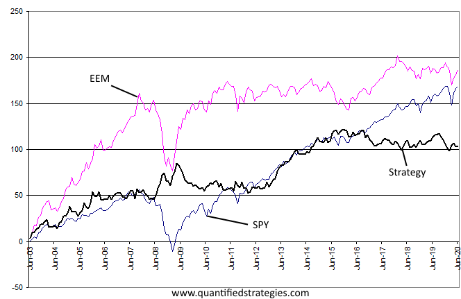

Algorithmic trading has markedly transformed financial markets by introducing advanced levels of automation and efficiency. By using sophisticated computer programs, algorithmic trading executes trades with a speed and precision unattainable by human traders, which allows market participants to capitalize on transient price movements and exploit market inefficiencies that arise for fractions of seconds. This technological advancement eliminates the emotional biases associated with human trading, aiming for more objective and data-driven decision-making processes.

In exploring this domain, we focus on two prevalent strategies: long-only and market-neutral. Each caters to distinct risk profiles and market perspectives, making their understanding crucial for traders aiming to optimize their strategies. Long-only strategies concentrate on securities that are anticipated to appreciate in value, capitalizing on upward market trends. In contrast, market-neutral strategies are designed to hedge against market risks by simultaneously maintaining long and short positions. This allows traders to profit from price discrepancies between correlated securities, minimizing their exposure to market volatility.



These strategies are not just entry points into algorithmic trading but are essential tools for modern traders who wish to navigate the complexities of financial markets effectively. The following sections of this article will provide detailed insights into these strategies, examining their unique characteristics, benefits, potential challenges, and important considerations for successful implementation. Understanding these nuances will enable traders to align their approaches with their investment goals, risk tolerance, and market outlooks.

## Table of Contents

## What is Algorithmic Trading?

Algorithmic trading, or algo trading, involves the use of computer systems to execute trades according to a set of predefined rules. This trading strategy leverages algorithms to mitigate human intervention, thereby removing the emotional biases that often plague manual trading decisions. By automating trading, algorithms enable operations at speeds and efficiencies that far surpass human capabilities. They can assess vast amounts of data in real-time and execute trades based on minor price changes and market inefficiencies.

The core components of [algorithmic trading](/wiki/algorithmic-trading) systems include historical price data, quantitative models, and real-time market feeds. These systems process input data to identify trading opportunities through complex calculations and statistical models. For instance, a moving average algorithm can trigger buy or sell signals when a short-term moving average crosses a long-term moving average. The basic formula for a moving average can be represented as:

$$
\text{MA}_n = \frac{1}{n} \sum_{i=0}^{n-1} P_i
$$

where $\text{MA}_n$ is the moving average over $n$ periods, and $P_i$ represents the price at time $i$.

The speed of execution in algorithmic trading ensures that trades are executed at the best possible prices, reducing transaction costs and slippage. This capability allows traders to exploit short-lived trading opportunities that would be missed in manual trading scenarios. Furthermore, algorithmic trading supports [backtesting](/wiki/backtesting), a process used to evaluate a strategy using historical data to ensure its viability before deployment in live markets.

In terms of coding, Python is frequently used in developing trading algorithms due to its extensive libraries and tools for data analysis and [machine learning](/wiki/machine-learning). A simple Python snippet for calculating a moving average might look like this:

```python
def moving_average(prices, window_size):
    return [sum(prices[i:i+window_size])/window_size for i in range(len(prices) - window_size + 1)]
```

The example above calculates the moving average of a price list over a specified window size, demonstrating how algorithmic trading often incorporates programming to define trading strategies.

## Understanding Long-Only Strategies

Long-only strategies focus on the acquisition of securities with the expectation that their value will appreciate over time. These strategies are straightforward, primarily involving the holding of assets in a portfolio without engaging in short selling or leveraging. They are predominantly used in bullish market conditions, where the general expectation is for market prices to rise.

This approach capitalizes on favorable market movements, making it particularly suited for environments where there is a strong projection of economic or sector-specific growth. The premise is grounded in the principle of buying low and selling high, which drives the profitability of these strategies.

The simplicity of long-only strategies makes them an attractive option for traditional investment portfolios. They align with conventional investment theories, such as the efficient market hypothesis, which suggests that it is difficult to consistently achieve higher returns without taking on additional risk. Consequently, this strategy involves lower transaction costs and requires less monitoring compared to more complex approaches like market-neutral strategies.

Moreover, long-only strategies are conducive to passive investment approaches, such as index investing. Investors purchase broad market indices with the expectation that markets, in general, will appreciate over time. This strategy is exemplified by investment vehicles like mutual funds and exchange-traded funds (ETFs), which provide investors with exposure to a wide array of securities within a single transaction, thereby reducing risk through diversification.

However, long-only strategies inherently expose investors to market downturns and require well-timed entry and [exit](/wiki/exit-strategy) points to maximize returns. The reliance on the market's upward trajectory necessitates a keen understanding of market cycles and economic indicators to anticipate future trends effectively. This reliance underscores the strategy's vulnerability during periods of economic contraction or market [volatility](/wiki/volatility-trading-strategies), where asset prices might stagnate or decline. Consequently, investors need to employ comprehensive market analysis and risk management techniques to safeguard their portfolios against adverse market conditions.

## Market-Neutral Strategies: Ensuring Balance

Market-neutral strategies aim to mitigate systematically related risks by concurrently maintaining both long and short positions in various securities. This strategy focuses on profiting from relative price movements rather than depending on the overall direction of the market. As a result, exposure to market volatility is significantly diminished, creating a more stable investment environment.

A quintessential example of a market-neutral strategy is pairs trading. In pairs trading, two closely related or historically correlated securities are selected. The strategy involves taking a long position in one security while simultaneously taking a short position in the other. The underlying assumption is that the price relationship between the two securities will revert to their historical mean over time due to their correlation. This approach offers the opportunity to profit from the adjustments in their price spreads.

For instance, consider two stocks, A and B, that typically move together. If external factors create a temporary divergence—where stock A appreciates beyond its usual ratio relative to stock B—a trader might short sell stock A and go long on stock B, anticipating a return to the average relationship. The profit is realized if the anticipated convergence occurs, regardless of the prevailing direction of the market.

The effectiveness of a market-neutral strategy, such as pairs trading, relies heavily on the detection of statistical anomalies and relationships, often requiring sophisticated statistical methods and computational tools. Quantitative techniques, such as co-integration tests and machine learning models, are often employed to identify suitable pairs and their mean-reverting characteristics.

Given the complexity of maintaining the neutrality and the computational resources required, successful implementation involves continuous monitoring and rebalancing of the portfolio to ensure sustained market neutrality. This balancing act is crucial for defending against unanticipated market shifts and for maintaining the intended risk profile of the portfolio.

## Advantages and Disadvantages

Long-only strategies find favor among traders and investors due to their straightforward implementation. These strategies primarily involve purchasing securities based on the expectation that their prices will rise, paralleling the assumption of traditional market growth. This simplicity results in lower transaction costs, as these strategies mainly involve buying assets rather than executing simultaneous long and short positions or engaging in complex trading mechanisms. The focus on rising markets aligns with the buy-and-hold investing philosophy, which has historically provided favorable returns in expanding economies.

Despite these advantages, long-only strategies [carry](/wiki/carry-trading) certain risks. Their success is heavily dependent on market timing – the need to buy at low prices and sell at higher ones. Consequently, they are more susceptible to market downturns and corrections, which can lead to significant losses if the timing is misjudged. This vulnerability necessitates a careful examination of market conditions and can result in substantial financial implications when markets decline.

Market-neutral strategies, in contrast, offer protection against market volatility. By simultaneously holding long positions in one asset or group of assets and short positions in another, traders aim to profit from the relative performance of these securities, irrespective of the broader market's direction. This approach reduces exposure to systemic market risks and allows for the potential to generate returns even in flat or declining markets.

The protection against market-wide dips comes at the cost of increased complexity and sophistication. Market-neutral strategies often demand advanced quantitative modeling and statistical analysis to identify and exploit relative price movements between the paired assets. As a result, they typically involve higher transaction costs due to the necessity of frequent trading and adjustments. Furthermore, the reliance on computational power and advanced trading platforms underscores the requirement for substantial technological and analytical resources.

In summary, the choice between long-only and market-neutral strategies involves a trade-off between simplicity and risk mitigation. Long-only strategies offer ease of execution but with exposure to broader market risks, whereas market-neutral strategies provide robustness against market volatility but require advanced capabilities and resources to be effectively implemented. The decision should reflect the investor's risk appetite, market outlook, and available technological tools.

## Conclusion: Choosing the Right Strategy

Selecting an appropriate trading strategy between long-only and market-neutral approaches hinges on several critical factors, including an investor's market outlook, risk tolerance, and technological resources. Long-only strategies are optimal for investors who anticipate bullish trends and prefer the simplicity of capitalizing on market growth. These strategies require less computational complexity and align with traditional investment paradigms where the market is expected to appreciate over time.

Conversely, market-neutral strategies are designed to mitigate market volatility and offer potential profitability irrespective of market direction. These strategies are advantageous in unpredictable market conditions, providing a hedge against systemic risk. Investors opting for market-neutral strategies often possess a higher risk tolerance for complex portfolios and are equipped with advanced computational tools to execute sophisticated algorithmic trades.

Effective execution of either strategy necessitates thorough backtesting to evaluate potential outcomes based on historical data. By simulating trades under different market scenarios, investors can gauge the performance and risks associated with each strategy. Additionally, robust risk management practices, including diversification, stop-loss orders, and adaptive algorithms, are vital in optimizing performance and safeguarding against adverse market movements.

Ultimately, the decision between long-only and market-neutral strategies reflects an investor's market perception and technological adeptness. Careful consideration of market dynamics and the integration of quantitative analysis are essential in refining strategy execution to achieve desired investment outcomes.

## References & Further Reading

[1]: ["Advances in Financial Machine Learning"](https://www.amazon.com/Advances-Financial-Machine-Learning-Marcos/dp/1119482089) by Marcos Lopez de Prado

[2]: ["Evidence-Based Technical Analysis: Applying the Scientific Method and Statistical Inference to Trading Signals"](https://www.amazon.com/Evidence-Based-Technical-Analysis-Scientific-Statistical/dp/0470008741) by David Aronson

[3]: ["Machine Learning for Algorithmic Trading"](https://github.com/stefan-jansen/machine-learning-for-trading) by Stefan Jansen

[4]: ["Quantitative Trading: How to Build Your Own Algorithmic Trading Business"](https://books.google.com/books/about/Quantitative_Trading.html?id=j70yEAAAQBAJ) by Ernest P. Chan

[5]: Treleaven, P., Galas, M., & Lalchand, V. (2013). ["Algorithmic trading review."](https://www.researchgate.net/publication/262239006_Algorithmic_Trading_Review) Communications of the ACM, 56(11), 76-85.

[6]: Gatev, E. G., Goetzmann, W. N., & Rouwenhorst, K. G. (2006). ["Pairs trading: performance of a relative-value arbitrage rule."](https://www.nber.org/papers/w7032) Review of Financial Studies, 19(3), 797-827.