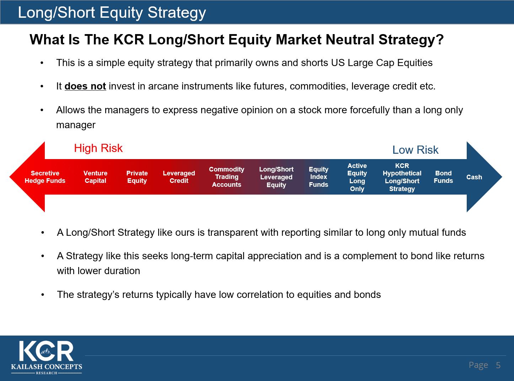

## Table of Contents

## What is a long-only investment strategy?

A long-only investment strategy is when an investor buys assets like stocks, bonds, or funds and holds them, hoping their value will go up over time. The investor does not sell or short any assets. This strategy is considered safer and simpler than other strategies that involve selling or shorting assets. Many people use this strategy in their retirement accounts or personal savings.

The main goal of a long-only strategy is to grow wealth slowly and steadily. Investors who use this strategy usually believe in the long-term growth of the market. They might buy a mix of different assets to spread out their risk. For example, they might invest in a variety of stocks from different industries or in different types of bonds. By doing this, they hope to benefit from the overall growth of the economy while minimizing the impact of any single asset performing poorly.

## What is a market-neutral investment strategy?

A market-neutral investment strategy is when an investor tries to make money without worrying about whether the overall market goes up or down. They do this by balancing their investments so that any gains from one part of their portfolio are offset by losses in another part. For example, they might buy some stocks they think will go up and sell short other stocks they think will go down. The goal is to make a profit no matter what happens in the broader market.

This strategy often involves using pairs trading, where an investor buys one stock and shorts another in the same industry. If the industry does well, the gain from the bought stock should be bigger than the loss from the shorted stock. If the industry does poorly, the loss from the bought stock should be smaller than the gain from the shorted stock. By doing this, the investor aims to remove the impact of general market movements and focus on the relative performance of the stocks they've chosen.

## How do long-only strategies differ from market-neutral strategies in terms of risk exposure?

Long-only strategies have more risk from the overall market going up or down. If the market goes down, the value of the stocks or other assets in a long-only portfolio will likely go down too. This means that someone using a long-only strategy is betting that the market will go up over time. They are exposed to what's called "market risk," which is the chance that the whole market could lose value. This kind of strategy can be good for people who believe in the long-term growth of the market and are okay with the ups and downs along the way.

On the other hand, market-neutral strategies try to avoid this market risk. People using this strategy aim to make money no matter if the market goes up or down. They do this by balancing their investments so that gains in one part of their portfolio are canceled out by losses in another part. This means they are less affected by big swings in the market. However, market-neutral strategies can still have other risks, like the risk that the specific stocks they pick won't perform as expected. This type of strategy can be good for people who want to reduce the impact of market movements on their investments.

## What are the typical returns expected from long-only strategies compared to market-neutral strategies?

Long-only strategies usually aim for returns that match or beat the overall market. If the market goes up, long-only investors hope their investments will go up too. Over many years, the stock market has generally gone up, so people using long-only strategies might expect to make money over the long term. But, their returns can vary a lot because they are tied closely to how the market does. If the market has a bad year, their investments could lose value. So, while long-only strategies can offer good returns when the market is doing well, they also come with the risk of losing money when the market goes down.

Market-neutral strategies aim for more steady returns that don't depend on the market going up or down. These strategies try to make money by finding pairs of investments where one goes up and the other goes down, balancing out the overall effect. Because of this, market-neutral strategies often have lower returns than long-only strategies when the market is doing well. But, they can still make money even when the market is going down. So, while the returns might be smaller, they can be more predictable and less risky because they aren't tied to the ups and downs of the market.

## Can you explain the concept of 'beta' in the context of long-only and market-neutral strategies?

Beta is a way to measure how much a specific investment moves with the overall market. For long-only strategies, the beta of the investments is important because these strategies aim to grow with the market. If a stock or fund has a beta of 1, it means it moves exactly with the market. So, if the market goes up by 10%, a stock with a beta of 1 would also go up by about 10%. If the beta is higher than 1, the investment will go up more than the market when it's doing well, but it will also fall more when the market goes down. A beta lower than 1 means the investment moves less than the market, which can be less risky but also means less potential for big gains.

In market-neutral strategies, the goal is to have a beta close to zero. This means the strategy should not be affected much by the ups and downs of the market. If a market-neutral strategy has a beta of zero, it means the gains and losses from the different parts of the portfolio balance each other out, so the strategy's performance is not tied to the market's performance. This helps keep the returns more stable, but it also means the strategy won't benefit as much from a rising market. So, while market-neutral strategies aim for a beta of zero to reduce risk, long-only strategies often have a positive beta to take advantage of market growth.

## What types of securities are commonly used in long-only portfolios?

Long-only portfolios usually include stocks, bonds, and mutual funds. Stocks are shares in companies that people buy because they think the companies will do well and the stock prices will go up. Bonds are loans to companies or governments that pay back the money with interest over time. Mutual funds are baskets of stocks or bonds that people can buy to spread out their risk. These securities are common in long-only portfolios because they can grow in value over time.

Sometimes, long-only portfolios also include exchange-traded funds (ETFs), which are similar to mutual funds but can be traded like stocks. ETFs can focus on specific industries, countries, or types of investments, giving investors a lot of choices. Real estate investment trusts (REITs) are another option. REITs let people invest in real estate without having to buy property directly. They can provide income and the chance for the value to go up. By using a mix of these securities, long-only investors try to grow their money over the long term while managing risk.

## How do market-neutral strategies aim to achieve zero market exposure?

Market-neutral strategies try to make money no matter what the overall market does by balancing their investments. They do this by buying some securities and selling short others. The idea is that if the market goes up, the gains from the bought securities will be offset by losses from the shorted securities, and if the market goes down, the losses from the bought securities will be offset by gains from the shorted securities. This balancing act aims to cancel out the impact of the market's ups and downs.

To achieve this, market-neutral strategies often use pairs trading. This means they find two similar securities, like stocks from the same industry, and buy one while selling the other short. If the industry does well, the stock they bought should go up more than the one they shorted goes down. If the industry does poorly, the stock they shorted should go down more than the one they bought goes up. By carefully choosing these pairs, market-neutral investors try to make sure their portfolio's performance is not tied to the overall market's performance, aiming for a beta close to zero.

## What are the advantages of using a long-only strategy for a beginner investor?

A long-only strategy is a good choice for a beginner investor because it's simple and easy to understand. You just buy stocks, bonds, or funds and hold onto them, hoping they will grow in value over time. This means you don't have to worry about complicated things like short selling or using leverage, which can be risky and hard to understand for someone new to investing. By sticking to a long-only strategy, a beginner can focus on learning about different companies and industries without getting overwhelmed by more complex investment techniques.

Another advantage of a long-only strategy for beginners is that it aligns well with long-term goals, like saving for retirement or buying a house. The stock market has generally gone up over long periods, so by holding onto your investments, you can benefit from this growth. Plus, long-only strategies can be diversified by investing in a mix of stocks, bonds, and funds, which helps spread out risk. This makes it easier for a beginner to build a solid investment portfolio without taking on too much risk right away.

## What are the key challenges faced by investors employing market-neutral strategies?

One big challenge for investors using market-neutral strategies is finding the right pairs of securities to buy and short. They need to find two things that move in opposite ways but are still related, like two companies in the same industry. If they don't pick the right pairs, the strategy might not work well. This can be hard because it takes a lot of research and understanding of how different securities behave.

Another challenge is that market-neutral strategies often have higher costs. When you short sell, you have to pay fees and interest, which can eat into your profits. Also, these strategies might need more trading, which means more transaction costs. So, even if the strategy looks good on paper, the costs can make it harder to actually make money.

## How do fees and costs compare between long-only and market-neutral funds?

Long-only funds usually have lower fees and costs than market-neutral funds. This is because long-only funds mainly buy and hold stocks or other investments without doing a lot of trading. They might charge a management fee, which is a small percentage of the money you have invested in the fund. Sometimes, they also have other small costs, like fees for buying and selling the investments in the fund. But overall, the costs for long-only funds are pretty low, which is good for people who want to keep more of their investment returns.

Market-neutral funds tend to have higher fees and costs. This is because they do more trading and often use short selling, which can be expensive. They usually charge a management fee, just like long-only funds, but it might be higher. They also have to pay for the costs of short selling, like interest and fees. Plus, because they trade more often, they have higher transaction costs. All these extra costs can add up and make it harder for market-neutral funds to make as much money as they might seem to on paper.

## What role does leverage play in market-neutral strategies, and how does it impact returns?

Leverage is like borrowing money to invest more than you actually have. In market-neutral strategies, investors sometimes use leverage to try to make bigger profits. They might borrow money to buy more stocks or to short sell more stocks than they could with just their own money. By doing this, they hope to make more money if their picks are right. But, using leverage also makes things riskier. If the investments don't go the way they hoped, the losses can be bigger because they have to pay back the borrowed money plus interest.

When leverage is used in market-neutral strategies, it can make the returns go up a lot if things go well. For example, if you use leverage to double your investment, and the market-neutral strategy makes a 5% return, you could end up making a 10% return on your own money. But, it's a double-edged sword. If the strategy loses 5%, you could lose 10% of your own money because you have to pay back the borrowed money. So, while leverage can boost your returns, it also increases the risk of bigger losses.

## How can an investor assess the performance of a long-only fund versus a market-neutral fund over different market cycles?

To assess the performance of a long-only fund versus a market-neutral fund over different market cycles, an investor should look at how each fund does during times when the market goes up and when it goes down. A long-only fund will usually do well when the market is going up because it's mainly buying stocks or other investments that grow with the market. If the market has a good year, the long-only fund should also have a good year. But, when the market goes down, the long-only fund will likely lose money too because it's tied to the market's performance.

On the other hand, a market-neutral fund tries to make money no matter what the market does. It balances its investments so that gains in one part of the portfolio are offset by losses in another part. This means that during a market downturn, a market-neutral fund might still make money or at least lose less than a long-only fund. But, when the market is doing really well, the market-neutral fund might not make as much money as the long-only fund because it's not taking advantage of the market's growth as much.

To really understand how each fund performs over different market cycles, an investor should look at historical data over several years. This will show how the funds did during bull markets, when the market is going up, and bear markets, when the market is going down. By comparing these results, an investor can see which fund might be better for their goals and how much risk they are willing to take.

## What is Algorithmic Trading?

Algorithmic trading, or algo trading, involves the use of computer systems to execute trades according to a set of predefined rules. This trading strategy leverages algorithms to mitigate human intervention, thereby removing the emotional biases that often plague manual trading decisions. By automating trading, algorithms enable operations at speeds and efficiencies that far surpass human capabilities. They can assess vast amounts of data in real-time and execute trades based on minor price changes and market inefficiencies.

The core components of [algorithmic trading](/wiki/algorithmic-trading) systems include historical price data, quantitative models, and real-time market feeds. These systems process input data to identify trading opportunities through complex calculations and statistical models. For instance, a moving average algorithm can trigger buy or sell signals when a short-term moving average crosses a long-term moving average. The basic formula for a moving average can be represented as:

$$
\text{MA}_n = \frac{1}{n} \sum_{i=0}^{n-1} P_i
$$

where $\text{MA}_n$ is the moving average over $n$ periods, and $P_i$ represents the price at time $i$.

The speed of execution in algorithmic trading ensures that trades are executed at the best possible prices, reducing transaction costs and slippage. This capability allows traders to exploit short-lived trading opportunities that would be missed in manual trading scenarios. Furthermore, algorithmic trading supports [backtesting](/wiki/backtesting), a process used to evaluate a strategy using historical data to ensure its viability before deployment in live markets.

In terms of coding, Python is frequently used in developing trading algorithms due to its extensive libraries and tools for data analysis and [machine learning](/wiki/machine-learning). A simple Python snippet for calculating a moving average might look like this:

```python
def moving_average(prices, window_size):
    return [sum(prices[i:i+window_size])/window_size for i in range(len(prices) - window_size + 1)]
```

The example above calculates the moving average of a price list over a specified window size, demonstrating how algorithmic trading often incorporates programming to define trading strategies.

## References & Further Reading

[1]: ["Advances in Financial Machine Learning"](https://www.amazon.com/Advances-Financial-Machine-Learning-Marcos/dp/1119482089) by Marcos Lopez de Prado

[2]: ["Evidence-Based Technical Analysis: Applying the Scientific Method and Statistical Inference to Trading Signals"](https://www.amazon.com/Evidence-Based-Technical-Analysis-Scientific-Statistical/dp/0470008741) by David Aronson

[3]: ["Machine Learning for Algorithmic Trading"](https://github.com/stefan-jansen/machine-learning-for-trading) by Stefan Jansen

[4]: ["Quantitative Trading: How to Build Your Own Algorithmic Trading Business"](https://books.google.com/books/about/Quantitative_Trading.html?id=j70yEAAAQBAJ) by Ernest P. Chan

[5]: Treleaven, P., Galas, M., & Lalchand, V. (2013). ["Algorithmic trading review."](https://www.researchgate.net/publication/262239006_Algorithmic_Trading_Review) Communications of the ACM, 56(11), 76-85.

[6]: Gatev, E. G., Goetzmann, W. N., & Rouwenhorst, K. G. (2006). ["Pairs trading: performance of a relative-value arbitrage rule."](https://www.nber.org/papers/w7032) Review of Financial Studies, 19(3), 797-827.