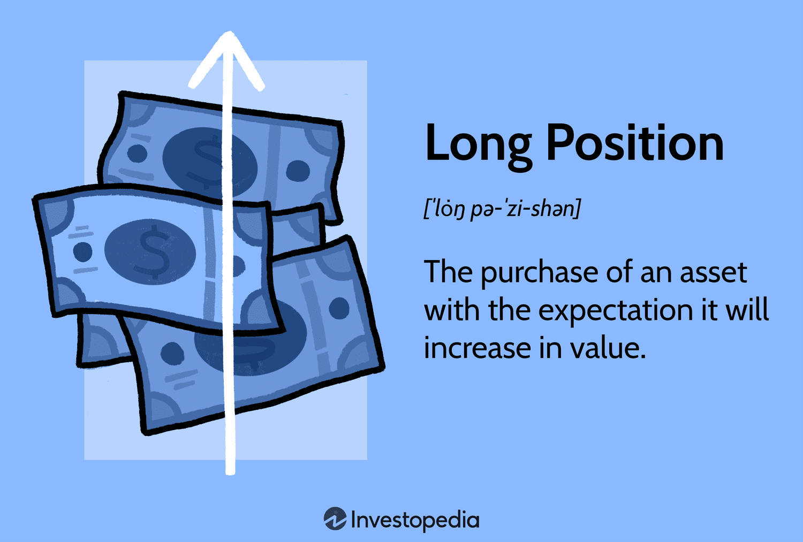

Understanding investment strategies is essential for achieving success in the ever-evolving landscape of financial trading. Key strategies, such as taking long positions and employing algorithmic trading, play vital roles in shaping how investors approach the markets. Both novices and seasoned traders can benefit significantly from mastering these concepts to enhance their trading efficacy and deepen their market understanding.

A long position is an investment strategy that involves purchasing a security with the expectation that its value will appreciate over time. This approach reflects a bullish market perspective where investors anticipate upward price movements and potential profits. Long positions can be applied across various asset classes, including stocks, mutual funds, and currencies. However, while the prospects for gains are attractive, investors must also be aware of the inherent risks, such as the potential for significant losses.



Meanwhile, algorithmic trading represents a transformative force in financial markets, utilizing computer algorithms to execute trades based on predefined criteria. This method offers traders speed and efficiency, often outperforming traditional manual trading techniques. Algorithmic trading encompasses strategies such as arbitrage, trend-following, and market-making, among others. The integration of computer algorithms helps reduce human error, allows for effective backtesting of strategies, and provides increased accessibility to intricate market dynamics.

The interplay between long positions and algorithmic trading is particularly noteworthy. Algorithms can be employed to identify optimal entry and exit points, manage risk, and even backtest strategies to assess their potential effectiveness. With advancements in machine learning, algorithmic trading continues to evolve, offering traders the tools needed to refine their strategies and maintain a competitive edge.

As we'll explore in the following sections, leveraging insights from these advanced investment strategies can significantly impact trading success. While technology continues to reshape the landscape, the essence of a well-rounded approach lies in understanding the principles behind long positions and algorithmic trading, aligning them with personal investment goals and risk tolerance levels.

## Table of Contents

## Understanding Long Position in Financial Trading

A long position in financial trading is a fundamental investment strategy where an investor purchases a security with the expectation that its price will rise over time. This approach aligns with a bullish market outlook, indicating the investor's confidence in upward price trends. Long positions are prominent across various asset classes, including stocks, mutual funds, and currencies, providing versatility to investors seeking to capitalize on growing markets.

### Bullish Market Perspective

Investors adopting a long position anticipate positive future performance by holding the security until it appreciates. This perspective is particularly prevalent when economic indicators suggest robust growth or when a company's fundamentals indicate strong potential returns.

### Asset Classes for Long Positions

A long position isn't limited to stocks but extends to mutual funds, currencies, bonds, and more. For instance, an investor might buy a stock, expecting the company's growth and revenue to increase its stock value. Similarly, in currency trading, a long position on a currency pair involves buying one currency while selling another, based on anticipated economic conditions or [interest rate](/wiki/interest-rate-trading-strategies) differentials favoring the purchased currency.

### Advantages and Risks

The primary advantage of a long position lies in its potential for substantial profits, especially in bull markets where asset values can significantly appreciate. Additionally, long positions generally involve fewer complexities than other strategies, making them accessible for beginner investors.

However, this strategy is not without risks. The most prominent risk is market [volatility](/wiki/volatility-trading-strategies), where prices can fall instead of rise, leading to substantial losses. Unlike speculative short selling, the losses from a long position are theoretically limited to the total investment amount, as opposed to unlimited potential losses in short selling scenarios.

### Practical Examples and Scenarios

Consider an investor who buys 100 shares of a company at $50 per share, anticipating that the price will rise to $70. If the price does indeed increase to $70, the investor can sell their shares to realize a profit of $2,000 (calculated as `(70 - 50) * 100`). Therefore, understanding market conditions and aligning long positions with economic forecasts or company performance becomes crucial.

Here's a simple Python example to calculate potential profit from a long position in stocks:

```python
def calculate_profit(initial_price, final_price, shares):
    return (final_price - initial_price) * shares

initial_price = 50
final_price = 70
shares = 100
profit = calculate_profit(initial_price, final_price, shares)
print(f"Potential Profit: ${profit}")
```

In conclusion, long positions serve as a cornerstone strategy in financial trading, leveraging the potential of rising market values. While they offer significant potential returns, investors must remain vigilant regarding market trends and potential downturns to protect their investments.

## Algorithmic Trading: Revolutionizing the Financial Markets

Algorithmic trading, a crucial component of modern financial markets, leverages computer algorithms to execute trades based on pre-defined criteria. This approach brings significant advantages in terms of speed and efficiency, enabling traders to react swiftly to market changes and execute large volumes of trades with minimal latency. The automation inherent in [algorithmic trading](/wiki/algorithmic-trading) helps in minimizing human intervention, leading to more precise and consistent execution of trading strategies.

### Popular Strategies in Algorithmic Trading

Several strategies are predominant within algorithmic trading, each designed to exploit different market inefficiencies:

1. **Arbitrage**: This strategy involves buying and selling an asset in different markets to take advantage of price discrepancies. Algorithms can swiftly identify and execute arbitrage opportunities across global markets, enhancing profitability.

2. **Trend-Following**: Algorithms that implement trend-following strategies analyze market data to identify and capitalize on market trends. By recognizing patterns and trends, these algorithms can make informed decisions about when to enter or exit trades.

3. **Market-Making**: Market-making algorithms continuously quote buy and sell prices for a financial instrument, facilitating liquidity in the market. These algorithms profit from the bid-ask spread, playing a critical role in maintaining market efficiency.

### Benefits Over Manual Trading

The shift from manual to algorithmic trading offers several benefits:

- **Reduced Human Error**: Algorithmic trading relies on pre-defined rules and conditions, which eliminates emotional bias and reduces the likelihood of mistakes that can occur during manual trading.

- **Backtesting**: Algorithms can be backtested against historical data to evaluate their performance under different market conditions. This allows traders to refine strategies before deploying them in live markets.

- **Market Accessibility**: Algorithmic trading democratizes access to complex strategies previously reserved for institutional traders. With technology advancements, individual traders can use sophisticated tools to participate in the markets.

### Misconceptions About Algorithmic Trading

Despite its advantages, algorithmic trading is not a guaranteed path to profit. A common misconception is that algorithms can inherently predict market directions or generate profits without risk. In reality, the success of algorithmic trading depends on the robustness of the underlying models and the quality of inputs.

### Data as a Driving Force

Data is integral to algorithmic trading. The effectiveness of trading algorithms heavily depends on the quality and diversity of the data they process. Algorithms require vast amounts of historical and real-time data to identify patterns and make informed decisions. Consequently, data providers and platforms that ensure high-quality, diverse data streams play a crucial role in the success of algorithmic trading strategies.

To illustrate, let us consider a basic algorithmic strategy using Python:

```python
import pandas as pd
import numpy as np

def moving_average_strategy(prices, short_window, long_window):
    # Calculate moving averages
    signals = pd.DataFrame(index=prices.index)
    signals['price'] = prices
    signals['short_mavg'] = prices.rolling(window=short_window, min_periods=1).mean()
    signals['long_mavg'] = prices.rolling(window=long_window, min_periods=1).mean()

    # Generate signals
    signals['signal'] = 0.0
    signals['signal'][short_window:] = np.where(
        signals['short_mavg'][short_window:] > signals['long_mavg'][short_window:], 1.0, 0.0
    )   
    signals['positions'] = signals['signal'].diff()

    return signals

# Example usage with hypothetical price data
price_data = pd.Series([100, 102, 101, 104, 107, 110, 108, 106, 109, 112])
signals = moving_average_strategy(price_data, short_window=2, long_window=3)
print(signals)
```

In this example, a simple moving average crossover strategy is implemented. The algorithm generates buy signals when the short-term moving average crosses above the long-term moving average, indicating a potential upward trend.

Overall, algorithmic trading represents a significant evolution in trading practices, driven by the capabilities of computer science and the availability of data. It offers traders tools to enhance their decision-making processes, though success is contingent upon the design of robust algorithms and the leverage of high-quality data sources.

## Integrating Long Positions with Algorithmic Trading

Algorithmic trading plays a significant role in managing and optimizing long positions by employing advanced mathematical and statistical models to make informed trading decisions rapidly. By leveraging algorithms, traders can automate the process of identifying optimal entry and [exit](/wiki/exit-strategy) points, which is paramount for maximizing returns on long positions.

**Algorithms in Hedging and Risk Management**

Algorithms offer innovative solutions for hedging long positions and managing associated risks effectively. A common approach is the use of portfolio optimization algorithms, which balance the risk and return of different assets in a portfolio containing long positions. These algorithms often employ techniques like mean-variance optimization to minimize risk while targeting desirable return levels. Furthermore, algorithms can execute hedging strategies such as options trading, where a trader might buy put options to protect against potential downturns in security prices.

**Identifying Optimal Entry and Exit Points**

Identifying entry and exit points is critical in trading, and algorithms excel at performing these tasks with precision. One common technique is the use of [momentum](/wiki/momentum) and trend-following algorithms, which analyze historical price data to forecast future movements. For example, moving average crossovers or relative strength index (RSI) indicators can trigger buy or sell signals when specific thresholds are met. Here’s a simplified Python example using a moving average crossover strategy:

```python
import pandas as pd

def moving_average_strategy(prices, short_window=40, long_window=100):
    signals = pd.DataFrame(index=prices.index)
    signals['price'] = prices['Close']
    signals['short_mavg'] = prices['Close'].rolling(window=short_window, min_periods=1).mean()
    signals['long_mavg'] = prices['Close'].rolling(window=long_window, min_periods=1).mean()

    # Buy signal when short moving average crosses above long moving average
    signals['signal'] = 0.0
    signals['signal'][short_window:] = np.where(signals['short_mavg'][short_window:] 
                                                 > signals['long_mavg'][short_window:], 1.0, 0.0)

    # Generate trading orders
    signals['positions'] = signals['signal'].diff()
    return signals
```

**Backtesting Strategies**

Algorithmic trading platforms facilitate [backtesting](/wiki/backtesting), allowing traders to test long-position strategies against historical data. This process assesses the potential success of a strategy before deploying it in live markets. By analyzing past performance, traders can optimize parameters and refine strategies to enhance profitability and reduce risks. Platforms like QuantConnect or MultiCharts provide robust backtesting environments where traders can simulate their algorithms using historical market data.

**Impact of Machine Learning**

Machine learning (ML) has a transformative impact on improving strategies that involve long positions. ML models, such as decision trees, neural networks, and [reinforcement learning](/wiki/reinforcement-learning), can analyze complex datasets to identify patterns not easily spotted by traditional algorithms. These models continuously learn from new data, adapting to changing market conditions and improving prediction accuracy. An example is the use of supervised learning to develop predictive models for estimating future asset prices based on historical price movements, news sentiment, and economic indicators.

In summary, the integration of algorithmic trading with long positions hinges on sophisticated techniques that manage risks, identify key trading opportunities, and adapt to market dynamics. As technology advances, the role of [machine learning](/wiki/machine-learning) continues to grow, offering traders cutting-edge tools to enhance their strategies and achieve their financial objectives.

## Case Studies and Real-World Applications

Successful implementation of long positions and algorithmic trading strategies can be observed in various financial markets. One notable example is Renaissance Technologies, a well-known [hedge fund](/wiki/hedge-fund-trading-strategies) that utilizes complex algorithms to manage long positions among other strategies. Founded by mathematician Jim Simons, the firm has consistently beaten the market by employing high-frequency trading and robust data analysis. Their Medallion Fund, which primarily trades equities and commodities, has achieved remarkable results, demonstrating the potential of combining long positions with algorithmic techniques.

Key lessons were learned during the 2008 financial crisis, where firms employing algorithmic trading witnessed significant volatility. Amidst the chaos, some traders managed substantial long positions effectively by employing risk management algorithms that allowed for dynamic adjustment of positions. By utilizing real-time data and machine learning models to predict market shifts, these firms minimized losses and, in some cases, capitalized on the recovery that followed. This period underscored the necessity of having adaptive algorithms capable of handling extreme conditions.

The [cryptocurrency](/wiki/cryptocurrency) sector is another area where algorithmic trading strategies have been actively applied. The volatile nature of cryptocurrencies like Bitcoin and Ethereum offers opportunities for capturing gains through long positions. Firms and individual traders utilize algorithmic strategies to execute trades swiftly, capitalizing on price swings. Crypto trading bots, such as those developed by Hummingbot, allow users to automate long positions by setting criteria-based entry and exit points, showcasing practical applications of these strategies.

In the commodities market, algorithmic trading with long positions is prevalent due to the market's inherent volatility and [liquidity](/wiki/liquidity-risk-premium). Firms like Citadel employ sophisticated models to predict commodity price movements and optimize their trading strategies. These algorithms analyze large datasets, including weather patterns and geopolitical events, to inform long-position decisions. Such strategies not only enhance return potential but also improve the precision and timing of trades.

The integration of machine learning with algorithmic trading has further refined these strategies. Machine learning models can process a multitude of variables to predict optimal timing for entering and exiting long positions, and continuously learn from market shifts to improve accuracy. This highlights an evolving landscape where long positions, supported by advanced technologies, promise greater returns while maintaining a buffer against risks.

## Managing Risks and Challenges

In financial trading, both long positions and algorithmic trading present various risks and challenges that traders must navigate to maintain effective strategies.

### Risks Associated with Long Positions

**Market Volatility:** One of the primary risks in holding a long position is market volatility. Price swings can lead to significant losses if the market moves against the investor's position. This risk is inherent in the expectation of upward price movements and can be particularly severe in highly volatile markets or during times of economic uncertainty.

**Liquidity Risks:** Trading in assets with low liquidity can amplify risks. If the market for a particular asset is not liquid, selling it at the desired price might be challenging, leading to potential losses or missed opportunities.

**Interest Rates and Inflation:** Changes in interest rates or inflation can also affect long positions, particularly in fixed-income or interest-sensitive securities. For example, a rise in interest rates typically negatively impacts bond prices.

### Risks Associated with Algorithmic Trading

**Technical Failures and System Errors:** Algorithmic trading relies on technology, and technical failures or system errors can result in incorrect trades or missed opportunities. Ensuring robust technical infrastructure and regular system checks is vital in mitigating these risks.

**Market Impact and Liquidity:** Algorithmic trading can impact market conditions, particularly in low-liquidity environments, causing prices to move unfavorably. Algorithms must be designed to minimize market impact by executing orders efficiently without causing price distortions.

**Overfitting and Data Snooping Bias:** Designing trading algorithms involves backtesting strategies on historical data. However, overfitting—a common challenge where a model performs well on historical data but poorly on live data—can lead to significant losses. Data snooping bias, where patterns are identified by chance rather than due to inherent market structures, must be carefully managed through robust validation techniques.

### Strategies to Mitigate Risks

**Risk Management Techniques:** Employing robust risk management techniques, such as setting stop-loss orders, diversifying investments, and using hedging strategies, can help maintain viable trading strategies. Regularly reviewing and updating risk management practices based on market conditions and performance metrics is crucial.

**Regulatory Compliance and Ethical Considerations:** Algorithmic trading is subject to various regulatory requirements aimed at ensuring market fairness and stability. Traders must comply with regulations such as those established by the Securities and Exchange Commission (SEC) in the U.S. Ethical considerations also play a role, as firms must avoid creating unfair market advantages or executing strategies that could harm market integrity.

To illustrate one mitigation approach in addressing overfitting, traders can employ cross-validation techniques. A simple K-fold cross-validation in Python example could look like:

```python
from sklearn.model_selection import KFold
import numpy as np

# Sample data
X = np.array([...])
y = np.array([...])

# K-Fold Cross Validation
kf = KFold(n_splits=5)
for train_index, test_index in kf.split(X):
    X_train, X_test = X[train_index], X[test_index]
    y_train, y_test = y[train_index], y[test_index]
    # Train model and evaluate performance on the test set
```

This method ensures that the trading model is tested on multiple subsets of data, reducing the risk of overfitting and improving the reliability of predictive performance on unseen data.

### Conclusion

Understanding and addressing the risks associated with long positions and algorithmic trading is crucial for sustainable success in financial markets. By employing comprehensive risk management strategies and remaining compliant with ethical and regulatory standards, traders can navigate the complexities of these investment strategies more effectively.

## Conclusion and Future Directions

In examining long positions and algorithmic trading within financial markets, several key insights emerge. At its core, a long position entails investing in a security under the expectation of appreciation in value, reflecting a bullish market perspective. Algorithmic trading, on the other hand, utilizes computer algorithms to execute trades based on predefined criteria, offering increased speed, precision, and efficiency compared to manual trading. Together, these strategies can enhance the effectiveness of investment portfolios by optimizing entry and exit points, reducing human error, and expanding market accessibility.

Looking to the future, algorithmic trading is poised to evolve significantly, with potential developments impacting long-position strategies. Advances in [artificial intelligence](/wiki/ai-artificial-intelligence) and machine learning are expected to refine algorithmic models further, enabling them to process large datasets with improved accuracy and predictive capability. This evolution will likely enhance the precision with which optimal long-position opportunities are identified, presenting opportunities to maximize returns while effectively managing risks.

Moreover, the ongoing digital transformation of financial markets suggests that traders must remain adaptable to rapidly changing technologies and market conditions. Continuous education and adaptation to these changes will be crucial for maintaining a competitive edge. This involves staying informed about emerging trends, such as the increasing integration of machine learning models and the potential shift towards decentralized and digital asset markets, such as cryptocurrencies.

Balancing the use of sophisticated technological tools with traditional investment strategies remains a critical consideration for traders. While technology provides powerful tools for analyzing and executing trades, maintaining a solid foundation in basic investment principles is essential. This balance ensures that traders can effectively leverage technology without losing sight of fundamental market dynamics. 

In conclusion, the convergence of long positions and algorithmic trading offers exciting possibilities for traders. However, successful implementation requires not only a grasp of these concepts but also the foresight to anticipate and adapt to future market and technological trends. By doing so, traders can enhance their strategic toolkit, improving their market performance while effectively managing risks.

## Frequently Asked Questions (FAQs)

### What is a long position, and how does it differ from a short position?

A long position in financial trading involves purchasing a security with the expectation that its value will rise, enabling the investor to sell it later for a profit. This approach is often considered bullish, as it anticipates upward market movements. Conversely, a short position involves selling a security not currently owned, with the aim to later purchase it back at a lower price, thus profiting from a decline in its value. Essentially, long positions profit from price increases, while short positions profit from price decreases.

### How do algorithmic trading strategies work, and are they suitable for beginners?

Algorithmic trading utilizes computer algorithms to execute trades automatically based on predefined criteria such as price, timing, or [volume](/wiki/volume-trading-strategy). These algorithms can analyze vast amounts of data at high speed, enabling rapid decision-making. The strategies might include [arbitrage](/wiki/arbitrage), trend-following, or market-making. While algorithmic trading offers efficiency and reduced human error, it can be complex for beginners. However, beginners can start with basic strategies on user-friendly platforms, gradually increasing complexity as they become more experienced.

### What are the risks associated with algorithmic trading?

Algorithmic trading, while beneficial, also comes with several risks. Technical failures such as software bugs, connectivity issues, or hardware malfunctions can disrupt trading. The reliance on historical data for algorithm design may lead to overfitting, where the model performs well on past data but poorly on new data. Additionally, market conditions can change rapidly, potentially rendering an algorithm ineffective. Traders must also be aware of regulatory requirements, as algorithmic trading is subject to stringent oversight to prevent market manipulation and to maintain fair trading practices.

### How can I start integrating long positions with algorithmic trading systems?

To integrate long positions with algorithmic trading systems, one must first define clear trading objectives and establish criteria for taking a long position. Traders can develop or use existing algorithms to identify optimal entry and exit points based on these criteria. Backtesting the algorithm on historical data is crucial to assess its potential performance. Additionally, incorporating risk management tools within the algorithm helps minimize potential losses. Beginners are encouraged to start on platforms that provide educational resources and simulations to practice trading strategies without real financial risk.

### Are there specific markets or sectors where these strategies are more effective?

Certain markets and sectors may offer better opportunities for long positions and algorithmic trading due to their liquidity, volatility, and market structure. For instance, the cryptocurrency market, with its high volatility and trading volume, can be lucrative for algorithmic strategies. Similarly, sectors like technology and pharmaceuticals, characterized by rapid innovation and market movements, may present profitable long-position opportunities. It is vital for traders to conduct thorough research and stay informed about market conditions to identify where these strategies might be most effective.

## References & Further Reading

[1]: Bergstra, J., Bardenet, R., Bengio, Y., & Kégl, B. (2011). ["Algorithms for Hyper-Parameter Optimization."](https://dl.acm.org/doi/10.5555/2986459.2986743) Advances in Neural Information Processing Systems 24.

[2]: ["Advances in Financial Machine Learning"](https://www.amazon.com/Advances-Financial-Machine-Learning-Marcos/dp/1119482089) by Marcos Lopez de Prado

[3]: ["Evidence-Based Technical Analysis: Applying the Scientific Method and Statistical Inference to Trading Signals"](https://www.amazon.com/Evidence-Based-Technical-Analysis-Scientific-Statistical/dp/0470008741) by David Aronson

[4]: ["Machine Learning for Algorithmic Trading"](https://github.com/stefan-jansen/machine-learning-for-trading) by Stefan Jansen

[5]: ["Quantitative Trading: How to Build Your Own Algorithmic Trading Business"](https://www.amazon.com/Quantitative-Trading-Build-Algorithmic-Business/dp/1119800064) by Ernest P. Chan