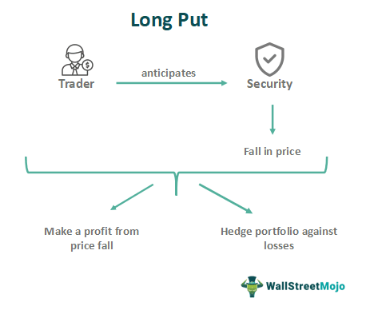

In today's ever-evolving financial markets, grasping various investment strategies is essential for both novice and seasoned investors. This article focuses on three significant investment strategies: long put options, shorting stock, and algorithmic trading. Each strategy possesses distinct advantages and challenges, making them fitting for different market conditions and aligning with diverse investor objectives.

Long put options offer a bearish approach, enabling investors to hedge against potential downturns with limited risk exposure. On the other hand, shorting stock, while a contrarian method, allows investors to profit from declining stock prices, albeit with higher risk implications. Algorithmic trading, through its use of computer algorithms, provides a technological edge by executing trades with precision and speed beyond human capability.



By understanding the workings of these strategies, investors can effectively combine them to construct robust portfolios that manage risk and potentially enhance returns. This strategic blend not only aids in capitalizing on market opportunities but also in mitigating risks, paving the way for informed, strategic decision-making aligned with financial goals.

## Table of Contents

## Understanding Long Put Options

A long put option is a financial derivative that investors use to profit from expected declines in the price of an underlying asset or to hedge against negative price movements. In this strategy, the investor purchases a put option, granting them the right, but not the obligation, to sell the underlying asset at a predetermined price, known as the strike price, before or upon the option's expiration.

The appeal of long puts lies in their limited risk profile. The most an investor stands to lose in such a strategy is the premium paid for the option itself. If the market price of the underlying asset remains above the strike price, the put option may simply expire worthless. However, if the price drops below the strike price, the investor can either exercise the option to sell the asset at the agreed-upon price or sell the option at a profit.

**Mechanics of Long Puts:**

1. **Strike Price:** This is the price at which the holder of the option can sell the underlying asset. The selection of the strike price is critical as it determines the point at which the option becomes profitable.

2. **Exercise:** There are primarily two types of options based on the timing of exercise: American and European. An American option allows the holder to exercise the option at any point up to and including the expiration date, whereas a European option can only be exercised on the expiration date.

3. **Expiration:** The expiration date is the last day the option can be exercised. The time value of the option diminishes as it approaches expiration, a phenomenon known as time decay. Therefore, investors must weigh the potential for price movement against the time until expiration.

**Hedging with Long Puts:**

Long puts serve as an effective hedging tool for bullish portfolios. An investor holding a portfolio of stocks that they anticipate will decrease in value can purchase put options as insurance. Should the market decline, the potential losses in the portfolio could be offset by gains from the puts. This approach provides a safety net, protecting the investor from significant drops in asset value while allowing them to maintain their long positions.

By incorporating long put options, investors can navigate volatile markets with greater confidence, securing themselves against unforeseen downturns while maintaining an opportunity to benefit from anticipated price movements. The careful choice of strike prices and expiration dates, coupled with a clear understanding of the option's premium, enables the investor to tailor the strategy to their specific risk tolerance and investment objectives.

## Shorting Stock: A Contrarian Approach

Shorting stock, or short selling, is a financial strategy where an investor borrows shares of a stock to sell them at the current market price, with the intention of repurchasing them later at a lower price. This approach is typically employed by investors who anticipate a decline in the price of a stock, allowing them to profit from the downward movement.

One of the critical aspects of short selling is the inherent risk involved. Unlike buying stocks, where the maximum loss is limited to the initial investment, shorting stock carries unlimited risk because stock prices can theoretically rise indefinitely. If the price of the stock increases significantly, the investor may face substantial losses.

The process of shorting stock begins with the borrowing of shares from a brokerage firm. These shares are sold on the open market, and the proceeds are held in the investor's account. The investor then monitors the stock price with the aim to repurchase the shares at a lower price, return the borrowed shares to the lender, and pocket the difference. It is essential to note that while the potential risk is unlimited, the profit is capped to the initial sale price of the borrowed stock.

Margin requirements are a crucial consideration in short selling. Since short selling involves borrowing, the investor must maintain a margin account with the broker. This account requires a minimum balance, known as the margin requirement, which could vary depending on the broker. If the stock price unexpectedly rises, the investor might receive a margin call, requiring them to deposit additional funds or securities to maintain the position.

Regulatory constraints also play a significant role in short selling. Short sales are subject to various regulations intended to curb excessive risk and market manipulation. For instance, some markets may prohibit short selling during volatile periods or require disclosure of large short positions.

To compare shorting stock with using long put options for bearish market speculation, it's important to consider both the risk profile and the cost structure. A long put option, which gives the investor the right to sell an asset at a predetermined price, limits the maximum loss to the premium paid for the option. This makes long puts a less risky alternative to shorting stock when betting on a decline in stock price. However, options can expire worthless, which means timing is critical, whereas shorting stock does not have an expiration date, offering more flexibility in terms of timing.

In summary, short selling is a sophisticated investment strategy that requires a thorough understanding of its processes, risks, and regulatory environment. Investors should weigh the potential rewards against the unlimited risks and consider whether alternative strategies, such as long put options, might better align with their risk tolerance and market outlook.

 to Algorithmic Trading

Algorithmic trading, a revolutionary advancement in financial markets, employs computer algorithms designed to execute orders based on predefined criteria. These algorithms allow trades to be conducted at a speed and precision far surpassing human capability. The primary advantages of [algorithmic trading](/wiki/algorithmic-trading) include enhanced trading precision, minimized transaction costs, and the elimination of emotional biases in trading decisions, making it a robust tool for investors.

Central to the efficacy of algorithmic trading is its ability to automate complex strategies like long put options and short selling. By employing predefined parameters and rules, algorithms can automate the execution of these strategies, thereby maximizing efficiency and mitigating human errors. For instance, an algorithm can be programmed to buy put options when certain market conditions, like a predefined drop in stock price, are met. Similarly, algorithms can automate short selling by identifying optimal entry and [exit](/wiki/exit-strategy) points based on real-time data.

Moreover, the [backtesting](/wiki/backtesting) capability of algorithmic systems allows traders to test their strategies using historical data. This process of simulation ensures that a strategy is viable before it is employed with real capital, greatly enhancing the reliability of trading decisions. Backtesting is crucial in refining strategies to ensure they are robust across various market scenarios.

The integration of [machine learning](/wiki/machine-learning) into algorithmic trading further enhances its capability by improving the predictive accuracy of trading models. Machine learning algorithms can analyze vast datasets to identify patterns and trends that are not immediately obvious, allowing for more informed decision-making. For instance, machine learning models can be trained to predict stock price movements by analyzing historical price data alongside a multitude of other factors such as news sentiment, trading volumes, and economic indicators. The continuous learning capability of these models allows them to adapt to new market conditions and maintain their predictive accuracy over time.

Inherent to algorithmic trading is the need for meticulous design and constant monitoring to manage technical risks and model inaccuracies. Traders and firms must ensure their systems are not only technically sound but also aligned with regulatory requirements. Despite these challenges, the adoption of algorithmic trading continues to grow due to its potential to significantly improve trading efficiency and effectiveness.

In summary, algorithmic trading represents a paradigm shift in how financial strategies, including long puts and short selling, are executed. Its ability to operate without human intervention, continuously optimize performance using backtesting, and enhance predictive accuracy through machine learning makes it an indispensable component of modern trading strategies.

## Combining Strategies: A Synergetic Approach

Combining investment strategies like long put options, shorting stock, and algorithmic trading can enhance portfolio diversification and optimize performance. Each of these approaches offers unique advantages that, when integrated, can effectively manage risk and exploit market inefficiencies.

Long put options provide a means of hedging against market downturns by offering the right, but not the obligation, to sell an asset at a predetermined price. This feature can serve as particularly effective protection in a bearish market environment, safeguarding an investor’s portfolio against potential losses without incurring the obligation to sell at a loss. On the other hand, shorting stock allows investors to potentially profit from declining market prices by selling borrowed shares with the expectation of buying them back at a lower price. When combined, these two strategies offer a robust mechanism for managing risk exposure to market [volatility](/wiki/volatility-trading-strategies).

Algorithmic trading further enhances these strategies by automating trade execution and leveraging computational power to analyze vast amounts of market data quickly. Algorithms can be designed to dynamically adjust the portfolio’s exposure to long puts and short sells by monitoring market conditions and executing trades based on predetermined criteria. This capacity to operate at high speed and frequency allows for capitalizing on fleeting market inefficiencies that human traders might miss.

To maximize returns through a combined strategy approach, investors may consider case studies and practical examples. For instance, an investor might allocate a portion of their portfolio to long puts for key indices to hedge systemic risk, allocate another portion to short stock positions in underperforming sectors, and use algorithmic trading models to exploit temporary price anomalies. This multi-faceted strategy not only spreads risk but also increases the potential for returns from various market movements.

Portfolio management and rebalancing are critical when employing multiple strategies concurrently. Investors must continuously assess the performance of each component and adjust allocations to maintain their desired risk-return profile. For instance, if a particular short position has yielded expected returns, it might be prudent to neutralize the position and reallocate the gains into reinforcing the portfolio’s defensive positions or enhancing the algorithmic trading component to explore new opportunities.

Ultimately, understanding how long put options, shorting stock, and algorithmic trading complement each other enables investors to tailor their investment approaches to suit different market conditions. By strategically integrating these strategies, investors can construct a portfolio capable of achieving balanced returns while maintaining a focus on risk management.

## Challenges and Risk Management

Every investment strategy, regardless of its potential benefits, carries risks that investors must manage adeptly to safeguard their portfolios. This section outlines the risks associated with long put options, short selling, and algorithmic trading, and provides practical risk management strategies.

Long put options, while offering a mechanism to profit from declining asset prices, are not without their downsides. Market timing risks are a significant concern with long puts. If an investor misjudges the timing of a market decline or the asset price does not drop as anticipated, the option can expire worthless. Consequently, the total loss potential is equivalent to the premium paid for the option. Despite the limited financial exposure, wrong timing can lead to missed opportunities for profit, emphasizing the importance of precise market analysis and entry points.

Shorting stock, often used by contrarian investors expecting price declines, inherently involves higher risk levels. Unlike long puts where losses are capped, the risk of shorting is theoretically infinite, as stock prices can rise indefinitely. This potential exposure necessitates careful consideration of margin requirements and the investor's capacity to cover margin calls, which can occur if the market moves against the short position.

Algorithmic trading, while advantageous for its speed and efficiency, presents a different set of risks. Technical failures, such as software glitches or hardware malfunctions, can lead to significant trading disruptions. Furthermore, model inaccuracies—stemming from assumptions that do not hold in actual trading environments—can lead to substantial losses. Continuous monitoring and adjustments are essential, particularly in volatile markets, to ensure that trading algorithms execute as intended.

Effective risk management is crucial for navigating the complexities of these strategies. Several practices can be implemented:

1. **Stop-Loss Orders**: This tool automatically sells a security when it reaches a certain price, limiting potential losses. Utilizing stop-loss limits in both shorting and long puts can protect against adverse price movements.

2. **Position Sizing**: Proper position sizing ensures that the capital at risk is a small percentage of the overall portfolio, thereby limiting the impact of a single losing trade.

3. **Volatility Measurement**: Regular assessment of market volatility can help adjust strategies according to changing conditions. High volatility might necessitate tighter risk controls given the greater likelihood of abrupt price changes.

In Python, calculating key metrics like portfolio volatility could be facilitated using libraries such as NumPy and Pandas, enabling the optimization of strategy parameters based on historical data:

```python
import numpy as np
import pandas as pd

# Assuming 'returns' is a DataFrame of historical returns
volatility = returns.std() * np.sqrt(252)  # Annualized volatility, assuming 252 trading days

# Set a volatility threshold for adjusting strategies
volatility_threshold = 0.2
if volatility.mean() > volatility_threshold:
    # Implement tighter risk controls
    pass
```

Developing a comprehensive risk management plan involves incorporating these practices to mitigate potential losses while striving for optimal returns. Such a plan empowers investors to navigate the financial markets more confidently, balancing the pursuit of gains with measured risk exposure.

## Conclusion

Incorporating long put options, shorting stock, and algorithmic trading into an investment strategy can offer diverse pathways to profitability. By understanding these strategies' principles and mechanics, investors are better equipped to capitalize on both bullish and bearish market conditions. Long put options provide a safeguard against market downturns, allowing investors to hedge portfolios with minimal risk, while short selling enables profit generation during declining markets. Algorithmic trading, with its ability to automate strategy execution, enhances both the precision and efficiency of trading activities.

The integration of automated systems through algorithmic trading not only streamlines strategy execution but also improves risk monitoring. By employing pre-defined criteria, algorithmic trading eliminates the emotional biases that often affect human traders, enabling consistent and rational decision-making. Furthermore, such systems offer extensive backtesting capabilities, which can optimize trading strategies for improved performance based on historical data.

This article underscores the importance of a strategic, informed approach in utilizing these investment techniques. Investors who continuously educate themselves and adapt their strategies can better navigate the dynamic world of financial markets. Staying informed about market developments and honing one's understanding of various investment tools are essential practices for any investor aiming for success.

In conclusion, the synergy of these three strategies—long put options, shorting stock, and algorithmic trading—provides a comprehensive framework for addressing diverse financial goals. By leveraging the strengths of each, investors can tailor their approach to suit various market conditions, ultimately striving for optimal returns while effectively managing risk.

## References & Further Reading

[1]: Hull, J. C. (2018). ["Options, Futures, and Other Derivatives"](https://www.semanticscholar.org/paper/Options%2C-Futures%2C-and-Other-Derivatives-Hull/89bdee500c8623864fc9eb7a471546aa713acc44) (9th Edition). Pearson Education.  

[2]: Natenberg, S. (1994). ["Option Volatility and Pricing: Advanced Trading Strategies and Techniques"](https://www.amazon.com/Option-Volatility-Pricing-Strategies-Techniques/dp/0071818774) (2nd Edition). McGraw-Hill Education.  

[3]: Hasbrouck, J. (2007). ["Empirical Market Microstructure: The Institutions, Economics, and Econometrics of Securities Trading"](https://archive.org/details/empiricalmarketm0000hasb) (1st Edition). Oxford University Press.  

[4]: Carver, C. (2019). ["Algorithmic Trading: Winning Strategies and Their Rationale"](https://www.wiley.com/en-us/Algorithmic+Trading%3A+Winning+Strategies+and+Their+Rationale-p-9781118746912). Wiley.  

[5]: De Prado, M. L. (2018). ["Advances in Financial Machine Learning"](https://www.amazon.com/Advances-Financial-Machine-Learning-Marcos/dp/1119482089). Wiley.  

[6]: Aronson, D. R. (2006). ["Evidence-Based Technical Analysis: Applying the Scientific Method and Statistical Inference to Trading Signals"](https://www.amazon.com/Evidence-Based-Technical-Analysis-Scientific-Statistical/dp/0470008741). Wiley.  

[7]: Chan, E. P. (2009). ["Quantitative Trading: How to Build Your Own Algorithmic Trading Business"](https://github.com/ftvision/quant_trading_echan_book). Wiley.  