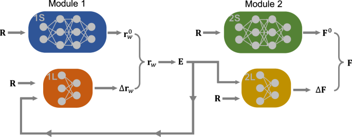

## Table of Contents

## What are Long-Range Interaction Layers in machine learning?

Long-Range Interaction Layers are a type of layer used in machine learning models to help the model understand and process information that is far apart in the input data. Imagine you're reading a long document, and you need to connect information from the beginning to the end. Long-Range Interaction Layers help the model do this by allowing it to look at and combine information from different parts of the input, even if those parts are far from each other.

These layers are especially useful in tasks like natural language processing, where understanding the context and relationships between words or sentences that are distant from each other is important. For example, in a long article, the introduction might be crucial to understanding the conclusion. Long-Range Interaction Layers make it easier for the model to capture these long-distance relationships, improving the model's performance on complex tasks.

## How do Long-Range Interaction Layers differ from traditional neural network layers?

Long-Range Interaction Layers are different from traditional neural network layers because they focus on capturing relationships between parts of the input that are far apart. Traditional layers, like convolutional layers or fully connected layers, usually look at nearby information. For example, a convolutional layer might only look at a small window of pixels in an image. But Long-Range Interaction Layers can look at the whole input at once, helping the model understand how different parts connect, even if they are far away from each other.

This ability to capture long-distance relationships makes Long-Range Interaction Layers very useful for tasks where context matters a lot. For instance, in language tasks, understanding a sentence might depend on words that appeared much earlier in the text. Traditional layers might struggle with this because they focus on local patterns. Long-Range Interaction Layers, on the other hand, can help the model see the bigger picture and make better predictions by considering the entire input.

## What is the Lambda Layer and how does it relate to Long-Range Interaction Layers?

The Lambda Layer is a type of layer in neural networks that lets you add custom functions to your model. It's like a special tool that you can use to do something specific that other layers can't do. For example, you might use a Lambda Layer to apply a custom mathematical function to your data. This can be really helpful if you need to do something that isn't covered by the standard layers in your neural network.

Lambda Layers can be related to Long-Range Interaction Layers because they can be used to create custom functions that help the model understand long-distance relationships in the data. For instance, you might use a Lambda Layer to apply a function that helps the model see how different parts of a long text are connected. This can make your model better at tasks like understanding long documents, where knowing how the beginning relates to the end is important. By using Lambda Layers in this way, you can make your model more powerful and able to handle complex tasks that need to look at the whole input.

## What are the benefits of using Long-Range Interaction Layers in neural networks?

Long-Range Interaction Layers help neural networks understand and connect information that is far apart in the input data. This is really important for tasks like reading long documents or understanding conversations where what was said at the beginning can change the meaning of what comes later. By looking at the whole input at once, these layers make it easier for the model to see how different parts connect, even if they are far away from each other. This means the model can make better predictions and understand the context better, which is something traditional layers might struggle with because they usually focus on nearby information.

For example, in natural language processing, understanding a sentence might depend on words that appeared much earlier in the text. Long-Range Interaction Layers help the model capture these long-distance relationships, making it better at tasks like summarizing long articles or answering questions about a whole document. This ability to see the bigger picture and consider the entire input can lead to more accurate and helpful results, making these layers a valuable tool for complex tasks where context matters a lot.

## Can you explain the mathematical foundation behind Long-Range Interaction Layers?

The mathematical foundation behind Long-Range Interaction Layers involves allowing the model to consider relationships between distant parts of the input. Traditional layers like convolutional layers typically use operations that focus on local areas, such as a small window of pixels in an image. In contrast, Long-Range Interaction Layers use functions that can look at the entire input at once. For example, a common approach is to use attention mechanisms, which help the model decide which parts of the input are most important for understanding other parts. This can be represented mathematically using an attention function, where the output depends on a weighted sum of all input elements, allowing the model to capture long-distance relationships.

A simple way to think about this is with the attention mechanism. Imagine you have an input sequence, and you want to understand how each element relates to every other element. You can use an attention function to compute these relationships. The attention function might look like this: $$ \text{Attention}(Q, K, V) = \text{softmax}\left(\frac{QK^T}{\sqrt{d_k}}\right)V $$, where Q, K, and V are matrices derived from the input, and $d_k$ is the dimension of the key vectors. This formula lets the model weigh different parts of the input based on their relevance to each other, helping it capture long-range dependencies. By doing this, the model can better understand the context and make more accurate predictions, especially in tasks where the relationships between distant elements are crucial.

In practice, implementing Long-Range Interaction Layers might involve using code to apply these mathematical concepts. For example, in a programming language like Python, you might use a library like PyTorch to create an attention layer. Here's a simplified example of how you might implement an attention mechanism:

```python
import torch
import torch.nn as nn

class AttentionLayer(nn.Module):
    def __init__(self, hidden_size):
        super(AttentionLayer, self).__init__()
        self.hidden_size = hidden_size
        self.query = nn.Linear(hidden_size, hidden_size)
        self.key = nn.Linear(hidden_size, hidden_size)
        self.value = nn.Linear(hidden_size, hidden_size)
        self.softmax = nn.Softmax(dim=-1)

    def forward(self, x):
        Q = self.query(x)
        K = self.key(x)
        V = self.value(x)
        attention_scores = torch.matmul(Q, K.transpose(-2, -1)) / math.sqrt(self.hidden_size)
        attention_weights = self.softmax(attention_scores)
        output = torch.matmul(attention_weights, V)
        return output
```

This code shows how you can create a layer that applies the attention mechanism to the input, allowing the model to focus on different parts of the input based on their importance. By using such layers, the model can better understand and process long-range interactions in the data.

## How do Long-Range Interaction Layers improve model performance on sequential data?

Long-Range Interaction Layers help neural networks understand and process sequential data better by allowing the model to see how different parts of the sequence are connected, even if they are far apart. Imagine you're reading a long story, and you need to remember what happened at the beginning to understand the ending. Traditional layers might only look at nearby information, like the last few sentences, but Long-Range Interaction Layers can look at the whole story at once. This helps the model capture important relationships between distant parts of the sequence, making it better at tasks like summarizing long texts or answering questions about a whole document.

A common way to implement Long-Range Interaction Layers is by using attention mechanisms. The attention mechanism helps the model decide which parts of the input are most important for understanding other parts. For example, you can use an attention function like $$ \text{Attention}(Q, K, V) = \text{softmax}\left(\frac{QK^T}{\sqrt{d_k}}\right)V $$, where Q, K, and V are matrices derived from the input, and $d_k$ is the dimension of the key vectors. This formula lets the model weigh different parts of the input based on their relevance to each other, helping it capture long-range dependencies. By doing this, the model can better understand the context and make more accurate predictions, especially in tasks where the relationships between distant elements are crucial.

In practice, implementing Long-Range Interaction Layers might involve using code to apply these mathematical concepts. For example, in a programming language like Python, you might use a library like PyTorch to create an attention layer. Here's a simplified example of how you might implement an attention mechanism:

```python
import torch
import torch.nn as nn

class AttentionLayer(nn.Module):
    def __init__(self, hidden_size):
        super(AttentionLayer, self).__init__()
        self.hidden_size = hidden_size
        self.query = nn.Linear(hidden_size, hidden_size)
        self.key = nn.Linear(hidden_size, hidden_size)
        self.value = nn.Linear(hidden_size, hidden_size)
        self.softmax = nn.Softmax(dim=-1)

    def forward(self, x):
        Q = self.query(x)
        K = self.key(x)
        V = self.value(x)
        attention_scores = torch.matmul(Q, K.transpose(-2, -1)) / math.sqrt(self.hidden_size)
        attention_weights = self.softmax(attention_scores)
        output = torch.matmul(attention_weights, V)
        return output
```

This code shows how you can create a layer that applies the attention mechanism to the input, allowing the model to focus on different parts of the input based on their importance. By using such layers, the model can better understand and process long-range interactions in sequential data, leading to improved performance in tasks like natural language processing.

## What are some common applications of Long-Range Interaction Layers?

Long-Range Interaction Layers are really helpful in tasks where you need to understand how different parts of a long sequence are connected. For example, in natural language processing, these layers help models understand long documents or conversations. When you read a long article, the beginning might be important for understanding the end. Long-Range Interaction Layers let the model see these connections, making it better at summarizing the text or answering questions about it. They use attention mechanisms, like $$ \text{Attention}(Q, K, V) = \text{softmax}\left(\frac{QK^T}{\sqrt{d_k}}\right)V $$, to weigh different parts of the input based on their importance.

Another common use is in speech recognition, where understanding the whole sentence can be important for getting the words right. If someone says a long sentence, the model needs to remember the beginning to understand the end correctly. Long-Range Interaction Layers help the model do this by looking at the entire speech at once. This makes the model better at transcribing long speeches or understanding spoken commands that depend on context. By using these layers, the model can make more accurate predictions and understand the context better, which is something traditional layers might struggle with.

## How can one implement a Long-Range Interaction Layer, such as the Lambda Layer, in a neural network?

Implementing a Long-Range Interaction Layer, like a Lambda Layer, in a neural network involves adding a custom function to your model that helps it understand relationships between distant parts of the input. For example, in natural language processing, you might want your model to connect the beginning of a long document to the end. A Lambda Layer can be used to apply a function that looks at the whole input at once, helping the model capture these long-distance relationships. This can be done by defining the custom function in the Lambda Layer and then adding it to your neural network architecture.

In practice, you can use a programming language like Python and a library like TensorFlow or PyTorch to implement this. For instance, in PyTorch, you might create a Lambda Layer using the `nn.Module` class and define a custom `forward` method to apply your function. Here's a simple example of how you might implement a Lambda Layer that uses an attention mechanism to capture long-range interactions:

```python
import torch
import torch.nn as nn

class LambdaLayer(nn.Module):
    def __init__(self, hidden_size):
        super(LambdaLayer, self).__init__()
        self.hidden_size = hidden_size
        self.query = nn.Linear(hidden_size, hidden_size)
        self.key = nn.Linear(hidden_size, hidden_size)
        self.value = nn.Linear(hidden_size, hidden_size)
        self.softmax = nn.Softmax(dim=-1)

    def forward(self, x):
        Q = self.query(x)
        K = self.key(x)
        V = self.value(x)
        attention_scores = torch.matmul(Q, K.transpose(-2, -1)) / math.sqrt(self.hidden_size)
        attention_weights = self.softmax(attention_scores)
        output = torch.matmul(attention_weights, V)
        return output
```

This code shows how you can create a Lambda Layer that applies an attention mechanism, like $$ \text{Attention}(Q, K, V) = \text{softmax}\left(\frac{QK^T}{\sqrt{d_k}}\right)V $$, to help the model focus on different parts of the input based on their importance. By using such a layer, the model can better understand and process long-range interactions in the data, improving its performance on tasks where context matters a lot.

## What are the challenges or limitations when using Long-Range Interaction Layers?

One challenge with using Long-Range Interaction Layers is that they can make the model slower and need more memory. This happens because these layers look at the whole input at once, not just nearby parts. For example, if you're working with a long document, the model has to think about every word when it's trying to understand any part of it. This can take a lot of time and space, especially if the document is very long. To make things work better, people sometimes use tricks like breaking the input into smaller pieces or using special ways to make the model focus only on the most important parts. But these tricks can also make the model a bit less good at understanding everything.

Another limitation is that Long-Range Interaction Layers can be hard to train. They have a lot of parts that need to work together, like the attention mechanism, which is often used in these layers. The attention mechanism helps the model decide which parts of the input are most important for understanding other parts. It uses a formula like $$ \text{Attention}(Q, K, V) = \text{softmax}\left(\frac{QK^T}{\sqrt{d_k}}\right)V $$, where Q, K, and V are matrices from the input, and $d_k$ is the size of the key vectors. Getting all these parts to work well can be tricky. Sometimes, the model might focus too much on some parts and not enough on others, which can make it less accurate. To fix this, people might need to try different ways of setting up the model or change how it learns, which can take a lot of time and effort.

## How do Long-Range Interaction Layers handle long sequences compared to other methods like LSTMs or Transformers?

Long-Range Interaction Layers, like those using attention mechanisms, are really good at understanding long sequences because they can look at the whole input at once. Imagine you're reading a long story, and you need to remember what happened at the beginning to understand the ending. Long-Range Interaction Layers help the model do this by using functions like $$ \text{Attention}(Q, K, V) = \text{softmax}\left(\frac{QK^T}{\sqrt{d_k}}\right)V $$ to weigh different parts of the input based on their importance. This way, the model can see how the beginning of the story relates to the end, making it better at tasks like summarizing long texts or answering questions about a whole document. However, because they look at everything at once, they can be slow and use a lot of memory, especially with very long sequences.

Compared to other methods like LSTMs (Long Short-Term Memory networks), Long-Range Interaction Layers have an advantage in capturing long-distance relationships more effectively. LSTMs process the input one step at a time, keeping track of what's important as they go, but they can struggle to remember things from the very beginning of a long sequence. This makes them less good at understanding the whole context of long texts. Transformers, which also use attention mechanisms, are similar to Long-Range Interaction Layers but are designed to handle sequences in a way that's both efficient and effective. They break down the input into smaller pieces and use multiple attention layers to process it, which helps them manage long sequences better than LSTMs. However, like Long-Range Interaction Layers, Transformers can still be challenging to train and might need a lot of memory and time to work well with very long inputs.

## What recent advancements have been made in the field of Long-Range Interaction Layers?

Recent advancements in Long-Range Interaction Layers have focused on improving their efficiency and effectiveness in handling long sequences. One significant development is the introduction of sparse attention mechanisms, which help reduce the computational cost by only looking at a subset of the input at a time. For example, instead of considering every part of a long document, the model might focus on certain important sections, making it faster and using less memory. Another advancement is the use of hierarchical attention, where the model first looks at smaller parts of the input and then combines them to understand the whole. This approach helps the model capture both local and long-range dependencies more effectively.

In addition to these improvements, researchers have been working on new ways to train Long-Range Interaction Layers more efficiently. Techniques like knowledge distillation, where a smaller model learns to mimic a larger, more complex model, have been used to make these layers easier to train without losing performance. Also, advancements in hardware, like specialized chips designed for attention mechanisms, have made it possible to process long sequences much faster. These developments are making Long-Range Interaction Layers more practical for real-world applications, allowing them to handle longer texts and more complex tasks with better performance.

## How can the effectiveness of Long-Range Interaction Layers be measured and optimized in a given model?

To measure the effectiveness of Long-Range Interaction Layers in a model, you can look at how well the model performs on tasks that need to understand long sequences. For example, if you're using the model to summarize long articles, you can check how accurate and helpful the summaries are. You can also use metrics like accuracy, F1 score, or perplexity to see how well the model is doing. These metrics help you understand if the model is capturing the long-range dependencies in the input well. By comparing the model's performance with and without Long-Range Interaction Layers, you can see how much they are helping.

To optimize Long-Range Interaction Layers, you can try different ways to set them up and see which works best. One way is to use sparse attention mechanisms, which help the model focus on the most important parts of the input instead of looking at everything at once. This can make the model faster and use less memory. You can also experiment with different sizes for the layers or change how they learn by adjusting the learning rate or using techniques like knowledge distillation. By testing these different approaches and measuring the model's performance, you can find the best way to use Long-Range Interaction Layers for your task.