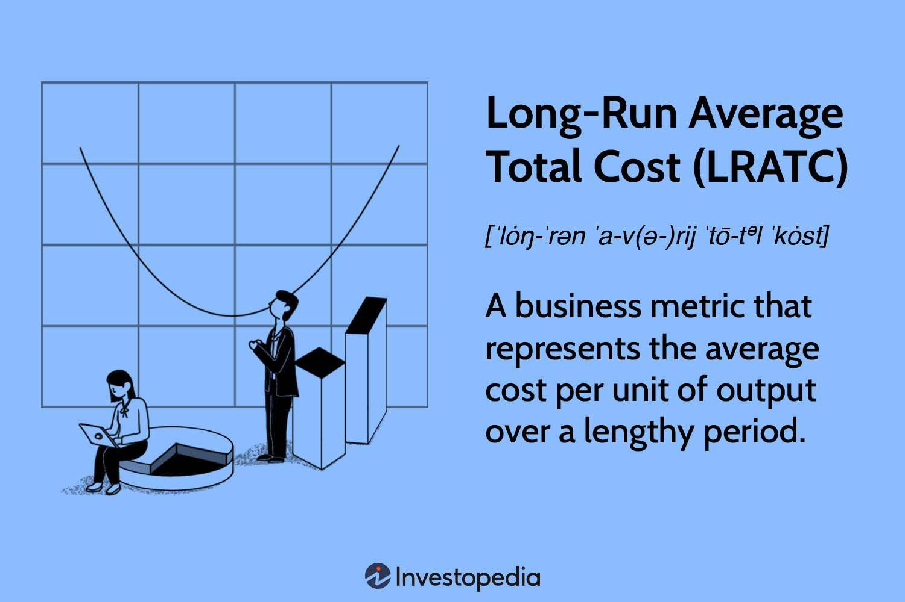

The concept of long-run average total cost (LRATC) is an essential aspect of economic analysis, particularly within industrial organization and business operations. LRATC refers to the per-unit cost incurred by a firm when all inputs are variable, which contrasts with the short-run period where at least one factor of production is fixed. The analysis of LRATC allows economists and business analysts to understand how firms can optimize resource use and achieve efficiencies over time. This concept is pivotal in determining the scale at which a firm should operate to minimize costs and maximize profitability, helping to outline the benefits of economies of scale.

Algorithmic trading and automated strategies have seen tremendous growth over recent decades, driven by advances in computing technology and data analytics. In these contexts, the principles of LRATC are highly relevant. Algorithmic trading systems, which rely on complex and fast computations, can significantly benefit from understanding and minimizing operational costs. By applying LRATC, traders can identify the most cost-effective ways to scale their technology infrastructure to support high-speed transactions, strategically managing resources to align with market dynamics.



Cost analysis has a profound impact on decision-making in trading, influencing both immediate transaction execution and long-term strategic positioning. Comprehensive understanding of economic costs guides algorithmic traders in selecting optimal trading strategies, balancing speed and cost-effectiveness, and mitigating risks associated with market fluctuations. Integrating LRATC consideration into trading models enhances the ability to adapt operations in response to changing market conditions, aiming for sustainable growth and competitive advantage.

This examination of LRATC and its role in modern trading technologies sets the stage for discussing how traditional economic cost principles intersect with cutting-edge algorithmic strategies. As finance continues to integrate technological advancements, understanding and managing costs become critical for competitive success and operational sustainability within algorithmic trading frameworks. This conversation invites a broader exploration of how these economic principles can optimize profitability and inform strategic decision-making in the evolving landscape of global markets.

## Table of Contents

## Understanding Long-Run Average Total Cost

Long-run average total cost (LRATC) is a crucial concept in economics, representing the per-unit cost of production when all input factors are variable. Unlike short-run average total cost, which considers at least one fixed input, the LRATC assumes that a firm can adjust all inputs according to its production needs. This flexibility gives firms the ability to achieve an optimal scale of operation without being constrained by existing capital or production capabilities.

In understanding LRATC, it is essential to grasp its two primary components: total cost (TC), which includes both fixed and variable costs, and the level of output (Q). The formula for calculating LRATC is expressed as:

$$
\text{LRATC} = \frac{TC}{Q}
$$

This ratio captures the average cost per unit over a range of production levels when a firm can alter all inputs to find the most cost-effective production point.

The distinction between short-run and long-run costs lies mainly in the firm's ability to adjust inputs. In the short run, at least one input (such as capital equipment) is fixed, leading to varying average total costs with changes in output levels. In contrast, the long run allows for all inputs to be variable, enabling firms to modify their input mix in pursuit of cost minimization and efficiency.

In the traditional economic perspective, LRATC is visualized through cost curves, typically U-shaped due to economies and diseconomies of scale. Initially, as production increases, firms experience economies of scale—a reduction in average cost per unit due to increased efficiency, specialization, and the ability to spread fixed costs over a larger output (e.g., bulk buying materials at lower prices or utilizing machinery more efficiently). This stage is depicted by the downward-sloping portion of the LRATC curve.

However, as production continues to expand, firms may encounter diseconomies of scale. These occur when increased production leads to inefficiencies, such as management difficulties or overextension of resources, resulting in rising average costs. This phenomenon is reflected in the upward-sloping part of the LRATC curve. 

Understanding the role and behavior of the LRATC curve is fundamental for firms looking to achieve long-term cost efficiency. By pinpointing the minimum point of the LRATC curve, known as the minimum efficient scale, businesses can determine the optimal level of output to minimize per-unit costs. Such insight is invaluable in strategic planning and decision-making, allowing firms to compete effectively by leveraging cost advantages over their industry rivals.

## Economics of Algorithmic Trading

Algorithmic trading, also known as algo-trading, utilizes complex mathematical models and pre-programmed trading instructions to execute orders at optimal speeds and frequencies. This method of trading relies heavily on statistical models that analyze real-time market data to make trading decisions. The aim is to exploit market conditions swiftly, often gaining significant advantages over traditional forms of trading that rely more on human intervention.

A central aspect of [algorithmic trading](/wiki/algorithmic-trading) is its dependency on real-time data. Algorithms are designed to respond to market changes within milliseconds, executing trades based on predefined criteria. This requires seamless integration with data feeds and exchanges, ensuring low latency in communication. The reliance on real-time data ensures that trading decisions are made with the most current information available, enhancing the likelihood of profitable outcomes.

Understanding economic cost structures plays a vital role in optimizing algorithmic trading strategies. Traditionally, economic analysis focuses on short-run and long-run costs. In the context of algorithmic trading, long-run average total cost (LRATC) becomes a critical component. LRATC refers to the per-unit cost of production (or in this case, trading activity) when all inputs are variable. It incorporates both fixed and variable costs, providing a comprehensive view of the cost associated with engaging in trading activities over time.

By integrating LRATC in algorithm design, cost management and risk assessment can be enhanced. Algorithms can be designed to optimize resource allocation, ensuring that the costs of executing trades are minimized while maximizing potential gains. The relationship between trade [volume](/wiki/volume-trading-strategy) and cost efficiency can be better understood, allowing for strategic adjustments that capitalize on economies of scale.

Moreover, LRATC can assist in risk assessment within algorithmic trading. By analyzing how costs fluctuate with varying levels of trading activity, algorithms can be programmed to adjust strategies dynamically. This may involve changing trade sizes, frequencies, or even selecting different market segments to optimize cost efficiency and manage risk effectively.

In conclusion, the integration of economic cost structures, particularly LRATC, into algorithmic trading strategies can significantly enhance their efficiency. By marrying sophisticated economic analysis with real-time data and statistical modeling, traders can develop more robust and adaptive trading strategies. This not only optimizes returns but also bolsters risk management capabilities, fostering a more sustainable trading environment in the rapidly evolving financial markets.

## Application of LRATC in Automated Trading Systems

Long-Run Average Total Cost (LRATC) is an essential concept in economic theory that can significantly enhance the efficiency of trading algorithms within automated trading systems. By analyzing cost structures over time, LRATC provides insights that are crucial for making informed decisions about resource allocation and operational strategies in trading.

### Utilization of LRATC in Trading Algorithms

The application of LRATC in trading algorithms involves evaluating the costs associated with various trading strategies over an extended period. LRATC helps identify the optimal scale of trading operations, balancing input costs with output levels to achieve minimum average costs. This understanding enables algorithm developers to design trading systems that are not only profitable in the short term but sustainable and efficient over the long term.

In practical terms, the algorithm can incorporate LRATC by embedding cost-minimization models that allow it to adjust its parameters based on observed and forecasted cost dynamics. For instance, an algorithm might assess transaction costs, data acquisition expenses, and computational overheads, adjusting its trading volume and frequency to maintain cost efficiency. 

### Integrating Economic Cost Analysis in Trading Frameworks

Integrating economic cost analysis into trading decision-making frameworks necessitates the adoption of comprehensive cost-tracking mechanisms. This involves monitoring both fixed and variable costs associated with trading activities. By doing so, an algorithm can proactively adjust its strategy in response to cost fluctuations, maintaining a competitive edge in the market.

One approach is to employ [machine learning](/wiki/machine-learning) models that analyze historical cost data to predict future average costs. These models can be trained on data that include transaction costs, execution speed, and slippage metrics. By forecasting costs, the trading algorithm can better manage its order routing strategies—determine how and where to execute trades to minimize costs. For example:

```python
import numpy as np
from sklearn.linear_model import LinearRegression

# Sample cost data (Inputs: scale of trading, Outputs: total cost)
X = np.array([[10], [20], [30], [40], [50]])  # Scale of trading
y = np.array([100, 180, 250, 310, 360])       # Total cost

# Fit linear regression model to predict costs
model = LinearRegression().fit(X, y)

# Predict future costs
future_scale = np.array([[60]])
predicted_cost = model.predict(future_scale)
print(f"Predicted Total Cost for scale {future_scale.flatten()[0]}: {predicted_cost.flatten()[0]}")
```

### Influence of Cost Adjustments on Trading

Adjustments in cost inputs can significantly influence trade execution and market positioning. For instance, an algorithm that identifies an increase in variable costs such as exchange fees or slippage might choose to reduce the frequency of trades or switch to a less expensive trading venue. Conversely, if fixed costs such as hardware or software investments result in decreased marginal costs, the algorithm might scale up trading activities to capitalize on economies of scale reflected in the LRATC curve.

A practical example can be observed in the strategic use of colocation services offered by exchanges. Although the initial investment for these services is substantial, the subsequent reduction in latency costs can lower the average total cost when spread over a higher volume of trades. This would be depicted as a downward shift in the LRATC curve, enabling more aggressive trading strategies that rely on rapid execution speeds.

In conclusion, leveraging LRATC in automated trading systems amplifies the ability to maintain efficiency and competitiveness. By systematically analyzing and integrating economic cost structures into algorithmic decision-making processes, trading systems can achieve optimized performance, adapting to evolving market conditions while controlling cost-related risks.

## Challenges in Aligning LRATC with Algorithmic Trading

Applying long-run average total cost (LRATC) analysis in algorithmic trading presents several challenges due to the high-speed and dynamic nature of the financial markets. Algorithmic trading, particularly high-frequency trading ([HFT](/wiki/high-frequency-trading-strategies)), operates on time scales often measured in microseconds, which complicates the traditional cost frameworks typically evaluated over longer periods.

One of the prominent challenges is the impact of high-frequency trading on conventional cost analysis. Traditional economic models of LRATC assume a stable environment where costs can be assessed over an extended period, allowing businesses to exploit economies of scale and optimize input factors. However, in HFT, the rapid execution of trades and the short holding periods mean that traders are primarily concerned with transaction costs—such as spreads, brokerage fees, and market impact—that can fluctuate rapidly with market conditions. This variability challenges the assumption of fixed or slowly changing costs that underlie LRATC analysis. 

Additionally, the sheer speed and volume of trades in HFT can lead to significant deviations in standard cost structures. For example, the need for substantial technological investments in infrastructure, such as co-location services and low-latency networks, represents a substantial fixed cost that must be rapidly amortized. These costs can alter the LRATC curve, potentially reducing the anticipated benefits from economies of scale due to high upfront expenditures and variable conditions that influence trade profitability on a second-by-second basis.

Maintaining cost efficiency in volatile market conditions is another critical challenge. Algorithmic trading systems often thrive on market [volatility](/wiki/volatility-trading-strategies) to generate profits but such volatility can also lead to increased transaction costs and risk exposure. Traditional economic models encourage minimizing costs and maximizing efficiency; however, in algorithmic trading, the focus might shift towards risk management and strategic adaptability amidst unpredictability. For instance, a sudden surge in market volatility can induce rapid changes in [liquidity](/wiki/liquidity-risk-premium) and price stability, complicating the cost forecasting models that inform LRATC calculations.

Moreover, algorithmic trading must constantly adapt to changes in market microstructure and regulatory environments, adding layers of complexity to cost analysis. Market structure innovations, such as dark pools and alternative trading systems, can influence transaction costs and potential profitability, thereby affecting how LRATC is integrated into strategy development and execution. Furthermore, the increasing regulatory scrutiny over trading practices necessitates frequent adjustments to algorithmic strategies, potentially disrupting established cost-efficiency plans.

In summary, applying LRATC principles in algorithmic trading requires an adaptive approach that considers the unique challenges of HFT. These include the need for flexible cost structures, rapid technological adoption, and strategic adaptability to market and regulatory shifts. Traditional economic cost models need to be re-evaluated and innovatively applied to be relevant and effective in this fast-paced trading environment.

## Case Study: LRATC in Practice

The application of Long-Run Average Total Cost (LRATC) is pivotal in understanding and optimizing trading strategies, particularly in algorithmic trading where cost efficiencies and strategic input adjustments directly influence profitability. This case study explores how LRATC principles were applied in a specific algorithmic trading strategy aimed at enhancing market positioning and liquidity provision.

### Case Overview

The trading strategy examined here is a market-making approach, where the goal is to continuously provide liquidity to the market, profiting from the bid-ask spread. The algorithm was designed to calculate the optimal price points for buying and selling securities, adjusting dynamically based on market conditions. A critical component of this strategy is managing operational costs over the long run to sustain profitability.

### Strategic Cost Management

By integrating LRATC analysis, the trading firm was able to pinpoint key cost drivers, such as transaction fees, holding costs, and infrastructure expenses. The formula for LRATC is given as:

$$
\text{LRATC} = \frac{\text{Total Cost}}{\text{Quantity Produced}}
$$

where "Total Cost" includes both fixed and variable costs over an extended period. In this context, the "quantity produced" correlates to the volume of trades executed by the algorithm.

One major efficiency was gained by optimizing the algorithm's trade execution speed, thereby reducing slippage costs (the difference between the expected price of a trade and the actual price). Further, the firm strategically negotiated volume-based discounts with exchanges to lower transaction fees, directly decreasing the average total cost.

### Outcomes

The strategic management of long-run costs yielded several significant efficiencies:

1. **Reduced Transaction Costs**: By achieving lower transaction fees through volume-based discounts, the overall cost per trade decreased, enhancing net margins.

2. **Increased Trading Volumes**: With improved cost control, the trading strategy could operate at higher volumes, leveraging economies of scale that further reduced LRATC.

3. **Enhanced Market Positioning**: The cost savings allowed the algorithm to maintain tighter spreads, improving its competitiveness and attractiveness to other market participants.

### Lessons Learned

Key lessons from this case include the importance of ongoing cost analysis and adjustment. Cost structures can change with market dynamics, technology updates, and regulatory environments. It is crucial to continuously evaluate LRATC factors to remain competitive.

Additionally, an integrated approach involving both technology and financial strategy is necessary. For this firm, the close collaboration between quantitative developers, financial analysts, and cost accountants was instrumental in realizing these efficiencies.

### Potential for Future Improvements

Future improvements might focus on leveraging advanced data analytics and machine learning to predict and react to market changes even more rapidly. This could further enhance cost management by identifying optimal trade points earlier and reducing exposure to adverse price movements. There is also potential in automating the negotiation of fees with exchanges using AI-driven models, potentially reducing administrative overhead.

In conclusion, the practical application of LRATC in algorithmic trading not only provides a robust framework for cost management but also offers a strategic advantage in optimizing trading performance. This case underscores the value of integrating economic principles with technological solutions to achieve sustainable trading success.

## Future Outlook: Evolving Cost Analysis in Trading

Technological advancements and data analytics are poised to significantly redefine the long-run average total cost (LRATC) in trading. With the advent of machine learning and [artificial intelligence](/wiki/ai-artificial-intelligence), traders can now analyze vast datasets in real-time, allowing for a more dynamic approach to cost management in automated trading systems.

One of the primary impacts of these technologies is the capability to achieve more precise cost forecasting. By utilizing machine learning algorithms, traders can predict cost patterns and trends with greater accuracy. For instance, techniques such as regression analysis and time series forecasting can model LRATC more effectively, incorporating variables that might have been overlooked in traditional methods.

Innovations in cost management are also paving the way for more comprehensive trading strategies. Advanced analytics platforms can assess transaction costs, market impact costs, and opportunity costs simultaneously. This comprehensive approach allows trading algorithms to adjust strategies in real-time, optimizing for both cost efficiency and market conditions. For example, high-frequency traders might develop algorithms that calculate the expected LRATC based on current and projected market volatility, adjusting their execution strategies accordingly to minimize costs.

In terms of future trends, the integration of economic analysis with automated trading systems can be expected to become more seamless. As technology advances, real-time data feeds and enhanced processing power will enable algorithms to incorporate economic indicators and adjust LRATC models instantly. Additionally, blockchain technology may offer new ways to track and verify costs in decentralized trading systems, providing greater transparency and potentially lowering transaction costs.

Python code might illustrate the application of an LRATC model in practice. Here, a simplified example shows how one might use Python to forecast LRATC using a time series model:

```python
import pandas as pd
from fbprophet import Prophet

# Sample data frame with dates and observed costs
data = pd.DataFrame({
    'ds': pd.date_range(start='2023-01-01', periods=100),
    'y': [100 + i * 0.5 + (i ** 0.5) for i in range(100)]  # Hypothetical cost data
})

# Initialize Prophet model
model = Prophet()

# Fit the model to the data
model.fit(data)

# Create a future dataframe
future = model.make_future_dataframe(periods=30)

# Predict future LRATC
forecast = model.predict(future)

# Output the forecast
print(forecast[['ds', 'yhat', 'yhat_lower', 'yhat_upper']].tail())
```

This example uses Facebook Prophet, a robust tool for time series forecasting, to predict LRATC. As data analytics evolve, such tools will become increasingly sophisticated, providing traders with deeper insights and more efficient strategies.

In conclusion, the continuous evolution of technology and data analytics is set to transform the understanding and application of LRATC in trading. By integrating advanced cost management techniques and predictive analytics, traders can achieve more flexible and effective strategies, keeping pace with the rapid developments in financial markets.

## Conclusion

Understanding long-run average total cost (LRATC) holds significant importance in the area of algorithmic trading, as it offers a comprehensive framework for evaluating and optimizing the economic efficiency of trading strategies. LRATC provides traders with insights into how their expenses behave as they scale their operations, which is crucial for maintaining competitiveness in the constantly evolving financial markets.

Integrating economic cost analysis, particularly the principles underlying LRATC, into algorithmic trading strategies facilitates better decision-making by enabling traders to identify cost-effective approaches to executing trades. This integration aids in determining the optimal scale of trading operations, managing risks effectively, and fine-tuning systems to enhance profitability. By deeply understanding the interplay between cost and scale, traders can design algorithms that are both efficient and responsive to market demands.

Continued exploration of economic principles is essential in the quest for developing more sophisticated automated trading solutions. The dynamic nature of financial markets demands that trading systems remain adaptable and cost-effective over time. Future advancements in technology and data analytics are expected to further refine the application of LRATC, paving the way for innovative approaches in trading strategy development. By leveraging these advancements, traders can continue to enhance their competitive edge, optimize resource allocation, and achieve sustainable long-term growth.

Ultimately, marrying economic theories such as LRATC with the precise mechanics of algorithmic trading can result in more robust and versatile trading systems, enabling market participants to navigate the complexities of modern financial landscapes with agility and insight.

## References & Further Reading

[1]: Varian, H. R. (1992). ["Microeconomic Analysis"](https://archive.org/details/microeconomicana0000vari_g1b1). W.W. Norton & Company.

[2]: Pindyck, R. S., & Rubinfeld, D. L. (2017). ["Microeconomics"](https://archive.org/details/microeconomics0007pind). Pearson.

[3]: Mishkin, F. S. (2015). ["The Economics of Money, Banking, and Financial Markets"](https://www.pearsonhighered.com/assets/preface/0/1/3/4/0134855388.pdf). Pearson.

[4]: Lopez de Prado, M. (2018). ["Advances in Financial Machine Learning"](https://www.amazon.com/Advances-Financial-Machine-Learning-Marcos/dp/1119482089). Wiley.

[5]: Chan, E. P. (2009). ["Quantitative Trading: How to Build Your Own Algorithmic Trading Business"](https://github.com/ftvision/quant_trading_echan_book). Wiley Trading.

[6]: Aronson, D. (2006). ["Evidence-Based Technical Analysis: Applying the Scientific Method and Statistical Inference to Trading Signals"](https://www.amazon.com/Evidence-Based-Technical-Analysis-Scientific-Statistical/dp/0470008741). Wiley Trading.

[7]: Jansen, S. (2020). ["Machine Learning for Algorithmic Trading"](https://github.com/stefan-jansen/machine-learning-for-trading). Packt Publishing.