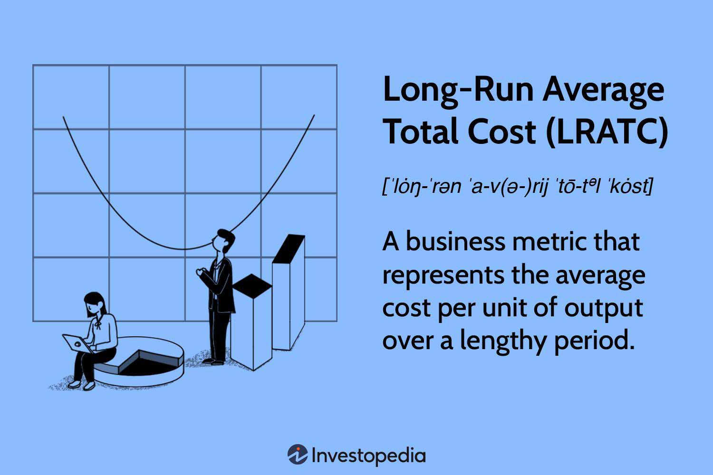

In the contemporary financial landscape, the intersection of economics and algorithmic trading offers unique insights and opportunities. This fusion allows for the development of sophisticated trading strategies that leverage economic principles to optimize performance and enhance outcomes. The focus of this article is to explore the synergies between long-run economic principles and algorithmic trading, shedding light on how these two domains can be integrated for improved strategic decision-making.

Long-run economic theories, which encompass aspects such as production costs, market entry dynamics, and technological advancements, provide a robust framework for understanding market behaviors over extended periods. These theories enable traders and algorithms to anticipate shifts in the economic environment, thus positioning them to make more informed trading decisions. By understanding the long-run implications of economic activities, traders can develop algorithms that are not only reactive but also proactive in adjusting to evolving market conditions.



The article will investigate how these extended economic theories translate into practical applications within algorithm-driven trading environments. It will examine the vital role of production costs in influencing market strategies and how technological evolutions can impact trading efficiency. Furthermore, the interplay between market entry factors and long-term strategic planning will be analyzed to provide a comprehensive overview of how economic insights can be harnessed in modern algorithmic trading.

By exploring various examples and strategies, we aim to illustrate the practical integration of long-run economic understanding with cutting-edge algorithmic trading techniques. This analysis is crucial for traders who wish to develop robust algorithms capable of navigating the complexities of today's financial markets while preparing for the future dynamics of economic change.

## Table of Contents

## Understanding the Long Run in Economics

The 'long run' in economics represents a period during which all factors of production are considered variable, allowing firms to adjust their production capacity freely. This flexibility enables businesses to explore and implement optimal production methods, scale their operations, and strive for the utmost cost efficiency. Unlike the short run, where certain inputs are fixed, the long run allows companies to alter all aspects of their production process in response to changing market conditions.

A critical concept within this framework is the long-run average cost (LRAC) curve, which illustrates how the average cost per unit varies with different levels of output. The LRAC curve is usually U-shaped, reflecting economies of scale initially, followed by diseconomies of scale at higher levels of production. As firms increase production, they may benefit from lower average costs due to factors such as improved specialization and more efficient use of technology. However, beyond a certain point, the firm might experience increased average costs due to complexities in management or resource constraints.

Mathematically, the LRAC can be defined as:

$$
\text{LRAC}(Q) = \frac{TC(Q)}{Q}
$$

where $\text{LRAC}(Q)$ is the long-run average cost at quantity $Q$, and $TC(Q)$ is the total cost function dependent on $Q$.

Competitive market dynamics play a crucial role in the long run, as they tend to erode abnormal profits through mechanisms such as market entry and imitation. When firms perceive opportunities for excess profits, new competitors are likely to enter the market, increasing the supply and driving prices down to a level where only normal profits remain. Consequently, firms must continuously innovate and adapt, seeking cost advantages or differentiated products to maintain profitability.

In understanding these long-run economic principles, one can better interpret their implications for [algorithmic trading](/wiki/algorithmic-trading). Firms that effectively adjust to long-run dynamics can influence trading strategies by anticipating shifts in production costs, technological advancements, and market entries that affect stock valuations and investment decisions. Sustainable competitive advantages in the long run often stem from a firm's ability to leverage economies of scale, innovate efficiently, and respond swiftly to economic changes. As such, these concepts are crucial for developing robust algorithmic trading models that incorporate long-term economic insights.

## Basics of Algorithmic Trading

Algorithmic trading involves the use of pre-programmed instructions to execute trades based on defined criteria such as timing, price, and [volume](/wiki/volume-trading-strategy). This approach aims to optimize trading precision and efficiency by minimizing the influence of human emotions and errors, which often lead to suboptimal trading decisions. 

One of the primary advantages of algorithmic trading is its ability to handle large datasets and execute trades at unmatched speeds. This capability is essential in contemporary financial markets where rapid order execution can significantly impact profitability. By employing various strategies like trend-following and [arbitrage](/wiki/arbitrage), algorithmic trading systems exploit market inefficiencies to achieve favorable outcomes. For instance, a trend-following strategy might use historical price data to identify and capitalize on emerging market trends, while an arbitrage strategy might take advantage of price discrepancies across different markets or instruments.

To illustrate a basic algorithmic trading script in Python, consider a simple moving average crossover strategy, which is commonly used to identify trend reversals. Below is a basic example using pandas and numpy:

```python
import pandas as pd
import numpy as np

# Load historical price data
data = pd.read_csv('price_data.csv')  # CSV file with columns: 'Date', 'Close'
data['Date'] = pd.to_datetime(data['Date'])
data.set_index('Date', inplace=True)

# Calculate moving averages
short_window = 40
long_window = 100

data['short_mavg'] = data['Close'].rolling(window=short_window, min_periods=1).mean()
data['long_mavg'] = data['Close'].rolling(window=long_window, min_periods=1).mean()

# Generate trading signals
data['signal'] = 0
data['signal'][short_window:] = np.where(data['short_mavg'][short_window:] > data['long_mavg'][short_window:], 1, 0)
data['positions'] = data['signal'].diff()

# Example of a position change
print(data[(data['positions'] == 1) | (data['positions'] == -1)])
```

This script calculates short-term and long-term moving averages based on historical closing prices. It generates buy signals when the short-term moving average crosses above the long-term moving average, and sell signals when it crosses below. Such strategies can be enhanced with additional parameters and adapted to meet specific trading requirements.

Understanding these basics is crucial for traders looking to integrate economic principles into their algorithmic strategies. By leveraging algorithmic trading's capabilities, traders can develop models that account for not just market data but potentially complex economic indicators, aiming to optimize trading performance in a systematic and disciplined manner.

## Linking Long Run Economics and Algorithmic Trading

Leveraging long-run economic insights within algorithmic trading involves the strategic integration of economic variables and forecasts into trading algorithms, allowing for enhanced anticipation of market shifts. By examining factors such as variable costs, production technologies, and market entry dynamics, traders are better equipped to configure algorithms that align with expected economic conditions.

Variable costs, which change with the level of output, are key considerations for algorithms aiming to optimize trade decisions based on long-run economic changes. For instance, fluctuations in commodity prices or labor costs can be analyzed to adjust trading strategies accordingly. Algorithms can incorporate data on these variables to forecast potential changes in the market, thus optimizing portfolio decisions. A Python snippet that calculates expected variable cost changes might look as follows:

```python
def calculate_expected_cost_change(current_cost, forecasted_growth_rate):
    return current_cost * (1 + forecasted_growth_rate)

current_cost = 100  # Example current cost
forecasted_growth_rate = 0.05  # 5% expected growth
expected_new_cost = calculate_expected_cost_change(current_cost, forecasted_growth_rate)
print(f"Expected new cost: {expected_new_cost}")
```

Similarly, advancements in production technologies can signal shifts in competitive advantages across industries. Algorithms can track and analyze technological trends to predict companies or sectors likely to benefit the most, providing traders with timely investment opportunities. This approach is supported by the natural evolution of industries towards efficiency, as described by economic growth models that emphasize technological improvements as a crucial [factor](/wiki/factor-investing) in long-term productivity gains.

Additionally, understanding market entry dynamics is crucial for forecasting how new firms might influence market structures and pricing strategies. Algorithmic models can leverage this insight to predict long-term shifts in competitive landscapes, thus allowing traders to diversify their investments and hedge against potential market disruptions.

The integration of economic data and industry reports into algorithmic models exemplifies how economics can enhance the adaptability of trading strategies to long-term market conditions. Such integration supports strategic execution during market fluctuations as firms adjust for long-term efficiency. By predicting long-term trends, algorithms can optimize asset allocations and improve risk management.

For example, algorithms might use GDP growth forecasts to adjust investment strategies in sectors with anticipated expansion. This foresight allows for more resilient trading algorithms that can withstand market [volatility](/wiki/volatility-trading-strategies) by focusing on sustainable, long-term growth opportunities.

By harnessing cumulative knowledge in economics, traders can develop more robust trading algorithms that not only react to immediate market conditions but are also proactive in anticipating long-term economic trends. This creates a strategic advantage, allowing traders to mitigate risks and capitalize on emerging opportunities driven by shifts in economic landscapes.

## Examples of Long Run Algorithmic Trading Strategies

Incorporating long-run economic principles into algorithmic trading strategies involves understanding and anticipating macroeconomic trends to optimize investment decisions. A prominent strategy involves adjusting portfolio compositions according to economic cycles, where expected changes in long-run interest rates or key macroeconomic variables can signal shifts in asset valuation.

### Dynamic Asset Reallocation

Algorithms designed for dynamic asset reallocation can use predictive models to adapt to anticipated changes in production costs or technological advancements. By analyzing historical data on production inputs and technological trends, these algorithms can forecast which sectors are likely to benefit or suffer in the long run. For instance, if an algorithm detects a potential rise in energy prices, it might shift investments from energy-intensive industries to sectors less affected by such changes. The formula for reallocation might look like this:

$$
\text{New Allocation} = \text{Current Allocation} \times \left(1 + \frac{\Delta \text{Forecasted Cost}}{\text{Current Cost}}\right)
$$

Where $\Delta \text{Forecasted Cost}$ is the anticipated change in production costs.

### Utilizing Macroeconomic Indicators

Another approach is integrating long-term economic indicators such as GDP growth forecasts or sector-specific growth projections. These indicators can be employed to guide investment decisions, as they provide insights into the overall economic environment and potential market expansions or contractions. For example, a predicted increase in GDP might lead an algorithm to increase exposure to consumer goods, anticipating higher consumer spending. Python libraries such as Pandas for data manipulation and Scikit-learn for predictive modeling are often used to process these indicators:

```python
import pandas as pd
from sklearn.linear_model import LinearRegression

# Example data for GDP forecast and sector growth
data = pd.DataFrame({'GDP_Forecast': [2.3, 2.5, 2.7], 'Sector_Growth': [3.0, 3.5, 3.8]})

# Simple linear model
model = LinearRegression()
model.fit(data[['GDP_Forecast']], data['Sector_Growth'])

# Predict future growth
future_GDP = [[2.9]]
predicted_growth = model.predict(future_GDP)
```

### Sector-Specific Strategies

Algorithms may also focus on specific industrial sectors by incorporating relevant economic data such as labor costs, capital investment preferences, and regulatory changes. By evaluating these factors, traders can optimize their investment strategies within chosen sectors. For instance, automated strategies can adjust industry weightings in a portfolio to reflect sectors poised for growth due to favorable economic conditions.

### Conclusion

These strategies highlight the practical applications of long-term economic insights in developing robust and adaptive algorithmic trading models. By harnessing macroeconomic data and trends, traders can create strategies that not only respond to immediate market conditions but also prepare for future economic shifts, thus securing a competitive advantage in the financial landscape.

## Challenges and Benefits of Long Run Algo-Trading

Long-run algorithmic trading presents a unique set of challenges and benefits that must be meticulously managed to harness the potential of integrating economic insights into trading strategies. A significant challenge arises from the inherent difficulty in predicting long-run economic trends with precision. The accuracy of these forecasts is crucial, as any misestimation can drastically affect the performance of trading algorithms. Ensuring that these economic forecasts are seamlessly incorporated into algorithms requires sophisticated computational techniques and is often accompanied by high computational demands.

Despite these challenges, the adaptability and scalability of long-run algorithmic trading offer substantial benefits. By aligning trading strategies with anticipated long-term economic conditions, firms can achieve sustained competitive advantages. The ability to adapt to evolving market conditions while maintaining a scalable model allows for superior market performance over time. Algorithmic trading in the long run also benefits from employing sophisticated statistical models and extensive historical data analysis. Such an approach necessitates a robust computational infrastructure, facilitating the handling of large datasets and complex models that predict market trends and volatilities.

Integrating economic insights inherently stabilizes trading performance by mitigating volatility risks and enhancing portfolio diversification. By aligning investment decisions with long-term economic indicators, traders can reduce exposure to short-term market fluctuations. This strategic alignment provides a more resilient trading approach, balancing volatility with stable returns. Moreover, enhanced diversification achieved by incorporating varied economic indicators helps in spreading risk across different asset classes and geographical regions.

Ultimately, balancing these aspects is essential for unlocking the full potential of long-run algorithmic trading. Traders must weigh the benefits of enhanced predictive accuracy and adaptability against the computational challenges and the need for continuous updates to economic forecasts. By doing so, algorithmic traders can leverage insights from long-run economic analysis to enhance performance and ensure that their strategies remain competitive and effective in an ever-evolving financial landscape.

## Conclusion: The Future of Long Run Economics in Algo-Trading

As algorithmic trading continues to evolve, the integration of long-run economic perspectives will become increasingly pivotal. This evolution is driven by advancements in data analytics and [machine learning](/wiki/machine-learning), which offer the means to refine these integrative strategies, ultimately enhancing predictive accuracy. The ability to process and analyze massive amounts of data has facilitated the development of models that are more adaptive to the nuances of long-term economic trends.

Emerging technologies such as [deep learning](/wiki/deep-learning) and [artificial intelligence](/wiki/ai-artificial-intelligence) are at the forefront of these advancements, providing sophisticated tools for analyzing complex market behaviors and economic indicators. Future developments in algorithmic trading will likely emphasize the creation of models that can dynamically adjust to shifts in economic trends over extended periods. This adaptive capacity is essential for remaining competitive in an environment where economic variables are in constant flux.

Continuous innovation and strategic evolution are necessary for traders seeking to maintain relevance and secure a competitive edge. The rapid pace of technological changes emphasizes the need for ongoing development in algorithmic strategies. Traders must be equipped with both the technical expertise to leverage new tools and the economic acumen to interpret long-term market signals effectively.

Ultimately, the effective blend of long-run economic principles with emerging trading technologies is poised to shape the future trajectory of the investment landscape. As these disciplines converge, they promise to introduce transformative practices that enhance market efficiency, offer robust predictive insights, and optimize trading strategies to more accurately reflect economic realities. This synthesis of economic understanding and technological capability will likely define the next era of financial markets, offering a strategic advantage to those who harness its potential fully.

## References & Further Reading

An extensive reading list including seminal works on economics and algorithmic trading strategies can significantly enhance understanding of the topics. Among the essential readings, "Advances in Financial Machine Learning" by Marcos Lopez de Prado is highly recommended. This book investigates into the application of machine learning techniques in the financial sector, providing practical solutions and insights that can be applied to algorithmic trading. Lopez de Prado's work emphasizes the development of algorithms capable of adapting to changing market conditions, a core aspect of harnessing long-term economic insights.

In addition to this, exploring supplementary materials from financial and economic journals is crucial. Journals such as the "Journal of Financial Economics" and "Quantitative Finance" offer diverse perspectives on integrating economic principles with modern technology, focusing on the use of advanced quantitative methods in finance. These resources provide a thorough understanding of how economic theories can be operationalized within algorithmic trading systems.

Furthermore, staying updated with the latest studies and industry reports is essential for maintaining an informed and strategic approach to trading. Publications like the "Financial Analysts Journal" and reports from institutions such as the Bank for International Settlements (BIS) and the International Monetary Fund (IMF) offer valuable insights into global economic trends and financial market developments. These reports often include data-driven analyses that can guide the calibration and adjustment of trading algorithms to align with anticipated economic shifts.

To complement these resources, engaging with online platforms like arXiv.org for preprints and SSRN (Social Science Research Network) can be beneficial. These platforms host a plethora of working papers and research articles from finance and economics scholars worldwide, offering early access to cutting-edge research that can influence trading strategies.

Adopting this comprehensive approach to further reading will provide valuable knowledge that can be directly applied in refining algorithmic trading methodologies. By integrating insights from [books](/wiki/algo-trading-books), journals, reports, and online resources, traders and researchers can develop more robust and forward-looking trading strategies that effectively combine economic understanding with algorithmic precision.