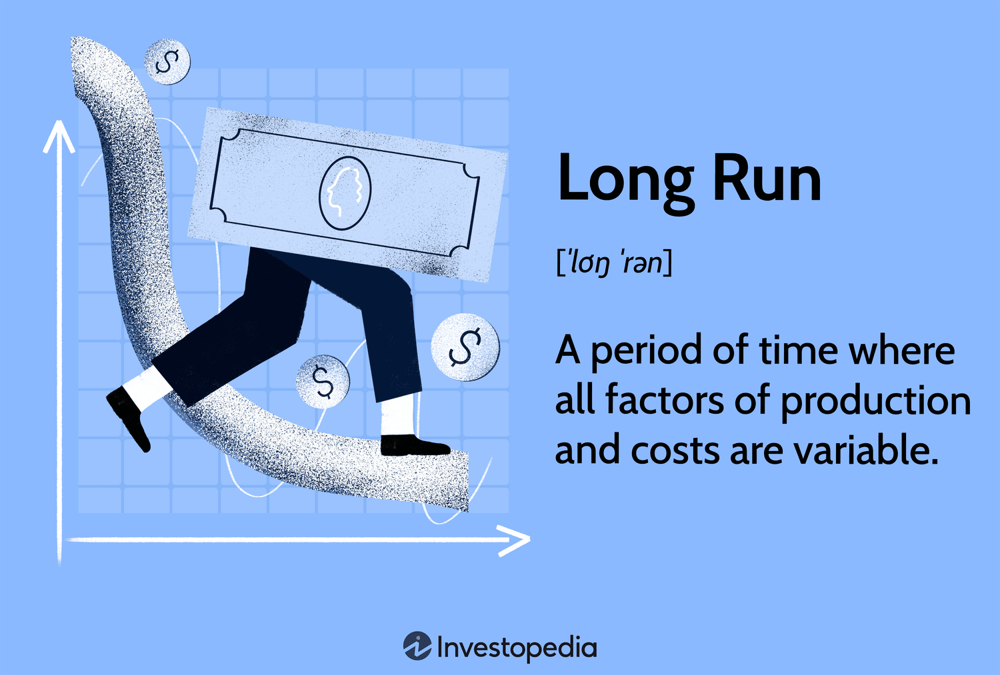

## Table of Contents

## What is the long run in economics?

In economics, the long run is a period of time where all factors of production can be changed. This means that businesses can adjust things like the size of their factories, the number of workers they hire, and the technology they use. Unlike the short run, where some things are fixed, the long run gives companies more flexibility to make big changes to how they operate.

The concept of the long run is important because it helps economists understand how businesses respond to changes in the market over time. For example, if demand for a product increases, a company might decide to build a bigger factory in the long run to produce more of that product. This ability to make long-term adjustments helps businesses stay competitive and adapt to new economic conditions.

## How does the long run differ from the short run in economic theory?

In economic theory, the short run and the long run are two different time periods that businesses consider when making decisions. The short run is a time when some things can't be changed quickly. For example, a factory might be too small to make more products, and building a new one takes time. So, in the short run, businesses can only change things like how many workers they have or how much they produce with what they already have. They can't make big changes like building new factories or buying new machines.

The long run, on the other hand, is when businesses can change everything. They can build new factories, buy new machines, and even change the way they make their products. This means that in the long run, businesses have more options to grow or change how they work. For example, if people want more of a product, a company can decide to build a bigger factory in the long run to meet that demand. The long run gives businesses the flexibility to make big changes that can help them stay competitive and adapt to new situations.

## What are the key characteristics of the long run in a firm's production?

In the long run, a firm can change everything about how it makes things. This means it can build new factories, buy new machines, or even change the way it makes its products. Because the firm can make these big changes, it has more options to grow or to make things better. For example, if people want more of what the firm makes, it can build a bigger factory to make more products.

The long run is different from the short run because in the short run, some things can't be changed quickly. A firm might have a factory that's too small, and building a new one takes time. So, in the short run, the firm can only change things like how many workers it has or how much it makes with what it already has. But in the long run, the firm can make big changes that help it stay competitive and adapt to new situations.

## Can you explain how firms adjust their production in the long run?

In the long run, firms can make big changes to how they produce things. They can build new factories, buy new machines, or change the way they make their products. This means they have more options to grow or make things better. For example, if more people want what the firm makes, it can build a bigger factory to make more products. This helps the firm meet the demand and make more money.

The long run is different from the short run because, in the short run, some things can't be changed quickly. A firm might have a factory that's too small, and building a new one takes time. So, in the short run, the firm can only change things like how many workers it has or how much it makes with what it already has. But in the long run, the firm can make big changes that help it stay competitive and adapt to new situations. This flexibility is important for the firm to grow and succeed over time.

## What role does the long run play in market equilibrium?

In the long run, market equilibrium is about how supply and demand balance out over time. When a firm can change everything about how it makes things, like building new factories or buying new machines, it can adjust to what people want. If more people want a product, firms can make more of it. This helps the market reach a new balance where the amount of the product made matches what people want to buy.

This long-run adjustment is important because it helps keep prices stable. If there's too much of a product, firms might make less or even leave the market, which can bring prices back to a normal level. On the other hand, if there's not enough of a product, more firms might start making it, or existing firms might make more, which can also help balance things out. So, the long run is key to understanding how markets can change and stay in balance over time.

## How do economies of scale influence a firm's decisions in the long run?

Economies of scale can really change how a firm makes decisions in the long run. When a firm gets bigger, it can often make things cheaper. This is because it can spread out the costs of things like factories and machines over more products. So, if a firm thinks it can get these savings, it might decide to grow in the long run. It could build bigger factories or buy more machines to make more stuff and save money.

But, it's not always easy to get these savings. Sometimes, if a firm grows too big, it might start to have problems. It could be harder to manage everything, or it might have to pay more for things like materials or workers. So, firms need to think carefully about how big they should get. In the long run, they need to balance the chance to save money with the risks of growing too big. This helps them make smart choices about how to grow and stay competitive.

## What are some common examples of long-run adjustments in different industries?

In the car industry, a common long-run adjustment is building new factories. If more people want to buy cars, a car company might decide to build a bigger factory to make more cars. This can take a long time, but it helps the company meet the demand and make more money. Another example is changing the way cars are made. A company might decide to use new machines or technology to make cars faster and cheaper. This can help the company stay competitive and keep up with what people want.

In the farming industry, long-run adjustments can include buying new land or using new farming methods. If a farmer sees that people want more of a certain crop, they might buy more land to grow more of it. This can help them make more money in the long run. Another example is using new technology, like better machines or new ways of growing crops. These changes can help farmers produce more food and save money, which is important for staying successful over time.

In the tech industry, companies often make long-run adjustments by investing in research and development. If a tech company sees that people want new kinds of products, like better smartphones or computers, it might spend a lot of time and money to create them. This can lead to new products that meet what people want. Another example is expanding into new markets. A tech company might decide to sell its products in new countries, which can take a long time to set up but can help the company grow and make more money in the long run.

## How does the concept of the long run apply to different market structures like perfect competition and monopoly?

In a perfect competition market, the long run is really important because it's when firms can enter or leave the market easily. If firms are making a lot of money, new firms will want to join in and make money too. This means more firms will start making the product, and the price will go down until it's just enough for firms to stay in business. On the other hand, if firms are losing money, some will leave the market. This means less of the product will be made, and the price will go up until it's just enough for the remaining firms to stay in business. So, in the long run, perfect competition markets tend to balance out so that firms just make enough money to keep going.

In a monopoly, the long run is different because there's only one firm making the product. This firm can decide to build bigger factories or use new technology to make more of the product. Because there's no competition, the firm can often set the price higher to make more money. But, the firm still has to think about what people want. If it charges too much, people might not buy the product, and the firm could lose money. So, in the long run, a monopoly firm needs to find a good balance between making more of the product and setting a price that people will pay.

## What are the implications of long-run cost curves for a firm's profitability?

In the long run, a firm can change everything about how it makes things. This means it can look at its long-run cost curves to see how much it costs to make different amounts of the product. If the firm can find a way to make things cheaper by getting bigger, it might decide to grow. This is called economies of scale. If the firm can make more stuff for less money, it can make more profit. But, if the firm gets too big and costs start to go up, this is called diseconomies of scale. The firm needs to be careful not to grow too much and lose money.

Long-run cost curves are important for a firm's profitability because they show where the firm can make the most money. If the firm can make things at a lower cost than other firms, it can set a lower price and still make a profit. This can help the firm get more customers and make more money. But, if the firm's costs are higher than other firms, it might need to set a higher price, which could make it hard to compete. So, understanding long-run cost curves helps the firm make smart choices about how big to get and how to stay profitable.

## How do technological changes affect long-run production decisions?

Technological changes can really change how a firm makes things in the long run. When new technology comes out, like better machines or new ways of making things, a firm might decide to use it. This can help the firm make more stuff or make things cheaper. For example, if a new machine can make cars faster, a car company might decide to buy it and build a new factory around it. This can help the company meet what people want and make more money.

But, using new technology can be tricky. It can cost a lot of money to buy new machines or change how things are made. A firm needs to think carefully about if the new technology will really help it make more money. If it does, the firm might decide to make big changes in the long run. But, if the new technology is too expensive or doesn't help much, the firm might decide to stick with what it has. So, technological changes can make a big difference in what a firm decides to do in the long run.

## Can you discuss any historical economic events that illustrate long-run adjustments?

One big example of long-run adjustments happened during the Industrial Revolution in the late 1700s and early 1800s. This was a time when new machines and factories changed how things were made. Before, people made things by hand, which was slow and expensive. But with new machines, like the spinning jenny for making cloth, factories could make a lot more stuff much faster. Companies built bigger factories and used new technology to make things cheaper. This helped them meet the growing demand for products like cloth and steel. Over time, these long-run adjustments helped the economy grow and change a lot.

Another example is the shift to renewable energy in recent years. As people became more worried about climate change, governments and companies started to think about using less fossil fuels like coal and oil. This meant making long-run adjustments to how energy is made. For example, some countries built big wind farms and solar panels to make electricity from the wind and sun. Companies also started to invest in new technology to make this happen. These changes took a long time and a lot of money, but they helped move the economy towards cleaner energy. This shows how long-run adjustments can help the economy adapt to new challenges and opportunities.

## What are the challenges in predicting long-run economic outcomes?

Predicting long-run economic outcomes is hard because there are a lot of things that can change over time. For example, new technology can come out and change how things are made. This can make it hard to guess what will happen in the future. Also, things like wars, natural disasters, or big changes in what people want can happen and change the economy in ways we can't predict. So, even if we know a lot about the economy now, it's tough to say exactly what will happen in the long run.

Another challenge is that people and companies can change what they do based on what they think will happen. If people think prices will go up, they might buy more stuff now, which can change the economy. This means that what people expect can affect what actually happens. It's like trying to guess what will happen in a game where everyone else is also trying to guess and change their moves. So, predicting long-run economic outcomes is really tricky because there are so many things that can change and affect each other in ways we can't always see.

## What is the understanding of the long run in economics?

The 'long run' in economics represents a period during which all factors of production are considered variable, allowing firms to adjust their production capacity freely. This flexibility enables businesses to explore and implement optimal production methods, scale their operations, and strive for the utmost cost efficiency. Unlike the short run, where certain inputs are fixed, the long run allows companies to alter all aspects of their production process in response to changing market conditions.

A critical concept within this framework is the long-run average cost (LRAC) curve, which illustrates how the average cost per unit varies with different levels of output. The LRAC curve is usually U-shaped, reflecting economies of scale initially, followed by diseconomies of scale at higher levels of production. As firms increase production, they may benefit from lower average costs due to factors such as improved specialization and more efficient use of technology. However, beyond a certain point, the firm might experience increased average costs due to complexities in management or resource constraints.

Mathematically, the LRAC can be defined as:

$$
\text{LRAC}(Q) = \frac{TC(Q)}{Q}
$$

where $\text{LRAC}(Q)$ is the long-run average cost at quantity $Q$, and $TC(Q)$ is the total cost function dependent on $Q$.

Competitive market dynamics play a crucial role in the long run, as they tend to erode abnormal profits through mechanisms such as market entry and imitation. When firms perceive opportunities for excess profits, new competitors are likely to enter the market, increasing the supply and driving prices down to a level where only normal profits remain. Consequently, firms must continuously innovate and adapt, seeking cost advantages or differentiated products to maintain profitability.

In understanding these long-run economic principles, one can better interpret their implications for [algorithmic trading](/wiki/algorithmic-trading). Firms that effectively adjust to long-run dynamics can influence trading strategies by anticipating shifts in production costs, technological advancements, and market entries that affect stock valuations and investment decisions. Sustainable competitive advantages in the long run often stem from a firm's ability to leverage economies of scale, innovate efficiently, and respond swiftly to economic changes. As such, these concepts are crucial for developing robust algorithmic trading models that incorporate long-term economic insights.

## What are some examples of long run algorithmic trading strategies?

Incorporating long-run economic principles into algorithmic trading strategies involves understanding and anticipating macroeconomic trends to optimize investment decisions. A prominent strategy involves adjusting portfolio compositions according to economic cycles, where expected changes in long-run interest rates or key macroeconomic variables can signal shifts in asset valuation.

### Dynamic Asset Reallocation

Algorithms designed for dynamic asset reallocation can use predictive models to adapt to anticipated changes in production costs or technological advancements. By analyzing historical data on production inputs and technological trends, these algorithms can forecast which sectors are likely to benefit or suffer in the long run. For instance, if an algorithm detects a potential rise in energy prices, it might shift investments from energy-intensive industries to sectors less affected by such changes. The formula for reallocation might look like this:

$$
\text{New Allocation} = \text{Current Allocation} \times \left(1 + \frac{\Delta \text{Forecasted Cost}}{\text{Current Cost}}\right)
$$

Where $\Delta \text{Forecasted Cost}$ is the anticipated change in production costs.

### Utilizing Macroeconomic Indicators

Another approach is integrating long-term economic indicators such as GDP growth forecasts or sector-specific growth projections. These indicators can be employed to guide investment decisions, as they provide insights into the overall economic environment and potential market expansions or contractions. For example, a predicted increase in GDP might lead an algorithm to increase exposure to consumer goods, anticipating higher consumer spending. Python libraries such as Pandas for data manipulation and Scikit-learn for predictive modeling are often used to process these indicators:

```python
import pandas as pd
from sklearn.linear_model import LinearRegression

# Example data for GDP forecast and sector growth
data = pd.DataFrame({'GDP_Forecast': [2.3, 2.5, 2.7], 'Sector_Growth': [3.0, 3.5, 3.8]})

# Simple linear model
model = LinearRegression()
model.fit(data[['GDP_Forecast']], data['Sector_Growth'])

# Predict future growth
future_GDP = [[2.9]]
predicted_growth = model.predict(future_GDP)
```

### Sector-Specific Strategies

Algorithms may also focus on specific industrial sectors by incorporating relevant economic data such as labor costs, capital investment preferences, and regulatory changes. By evaluating these factors, traders can optimize their investment strategies within chosen sectors. For instance, automated strategies can adjust industry weightings in a portfolio to reflect sectors poised for growth due to favorable economic conditions.

### Conclusion

These strategies highlight the practical applications of long-term economic insights in developing robust and adaptive algorithmic trading models. By harnessing macroeconomic data and trends, traders can create strategies that not only respond to immediate market conditions but also prepare for future economic shifts, thus securing a competitive advantage in the financial landscape.

## References & Further Reading

An extensive reading list including seminal works on economics and algorithmic trading strategies can significantly enhance understanding of the topics. Among the essential readings, "Advances in Financial Machine Learning" by Marcos Lopez de Prado is highly recommended. This book investigates into the application of [machine learning](/wiki/machine-learning) techniques in the financial sector, providing practical solutions and insights that can be applied to algorithmic trading. Lopez de Prado's work emphasizes the development of algorithms capable of adapting to changing market conditions, a core aspect of harnessing long-term economic insights.

In addition to this, exploring supplementary materials from financial and economic journals is crucial. Journals such as the "Journal of Financial Economics" and "Quantitative Finance" offer diverse perspectives on integrating economic principles with modern technology, focusing on the use of advanced quantitative methods in finance. These resources provide a thorough understanding of how economic theories can be operationalized within algorithmic trading systems.

Furthermore, staying updated with the latest studies and industry reports is essential for maintaining an informed and strategic approach to trading. Publications like the "Financial Analysts Journal" and reports from institutions such as the Bank for International Settlements (BIS) and the International Monetary Fund (IMF) offer valuable insights into global economic trends and financial market developments. These reports often include data-driven analyses that can guide the calibration and adjustment of trading algorithms to align with anticipated economic shifts.

To complement these resources, engaging with online platforms like arXiv.org for preprints and SSRN (Social Science Research Network) can be beneficial. These platforms host a plethora of working papers and research articles from finance and economics scholars worldwide, offering early access to cutting-edge research that can influence trading strategies.

Adopting this comprehensive approach to further reading will provide valuable knowledge that can be directly applied in refining algorithmic trading methodologies. By integrating insights from [books](/wiki/algo-trading-books), journals, reports, and online resources, traders and researchers can develop more robust and forward-looking trading strategies that effectively combine economic understanding with algorithmic precision.

