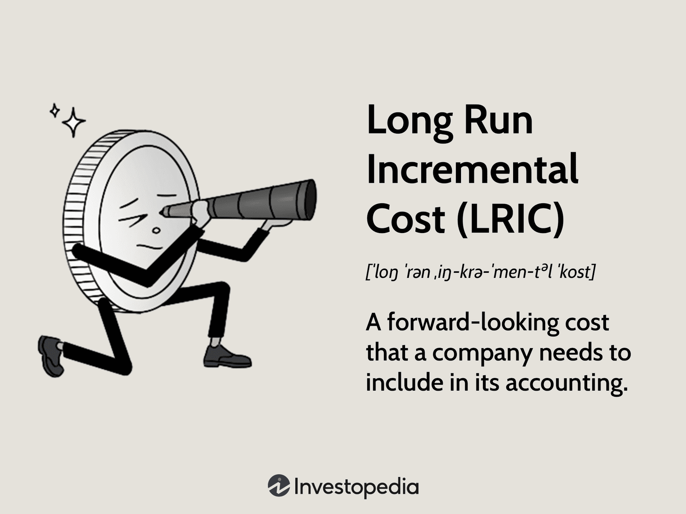

## Table of Contents

## What is Long Run Incremental Cost (LRIC)?

Long Run Incremental Cost (LRIC) is a way to figure out how much it costs to add new services or products to a business over a long time. It looks at the extra costs that come from increasing the amount of things a company makes or the services it offers. This is useful for businesses that want to grow or change what they do, because it helps them understand if adding new things will be worth the money they have to spend.

LRIC is different from short-term costs because it considers costs over a longer period, like building new factories or hiring more workers permanently. It helps companies make big decisions about expanding or changing their business. By understanding LRIC, businesses can plan better and make sure that the new things they want to add will actually help them make more money in the future.

## How does LRIC differ from short-run costs?

LRIC, or Long Run Incremental Cost, looks at the costs of adding new products or services over a long time. It includes costs like building new factories or hiring more workers permanently. These are costs that a business can change over time as it grows or changes what it does. LRIC helps businesses plan for the future because it shows them the true cost of making big changes or adding new things to what they offer.

Short-run costs, on the other hand, are the costs that a business faces right now or in the near future. These costs include things like buying more materials to make more products or paying for extra hours worked by current employees. Short-run costs are important for day-to-day decisions but don't show the full picture of what it might cost to make big changes over time. 

Understanding the difference between LRIC and short-run costs is important for businesses. LRIC gives a better idea of the costs of long-term growth or changes, while short-run costs help with immediate decisions. By looking at both, a business can make smarter choices about how to grow and what new things to add without spending too much money.

## Why is LRIC important for businesses?

LRIC is important for businesses because it helps them understand the true cost of adding new products or services over a long time. When a business wants to grow or change what it does, it needs to know how much it will cost. LRIC looks at big costs like building new factories or hiring more people permanently. By understanding these costs, a business can make smart decisions about whether adding new things will be worth the money.

Using LRIC also helps businesses plan better for the future. It's not just about the costs right now, but about the costs over many years. This long-term view helps businesses see if their plans to grow or change will actually help them make more money in the end. By looking at LRIC, businesses can avoid spending too much money on things that won't help them in the long run.

## Can you explain the components that make up LRIC?

LRIC, or Long Run Incremental Cost, is made up of different parts that help a business understand the costs of adding new things over a long time. One big part is the cost of new buildings or equipment that a business might need to make more products or offer new services. This includes things like factories, machines, or even new offices. These are costs that a business can change over time as it grows or changes what it does.

Another part of LRIC is the cost of hiring more people or training them to do new jobs. This means paying for new workers or teaching current workers how to do different things. These costs are important because they help the business keep up with the new products or services it wants to add. By looking at all these costs together, a business can see the true cost of growing or changing what it does over a long time.

## How is LRIC calculated?

To calculate LRIC, a business first looks at all the extra costs that come from adding new products or services over a long time. This includes the costs of building new factories or buying new machines, which are needed to make more products or offer new services. It also includes the costs of hiring more people or training them to do new jobs. All these costs are added up to see how much it will cost to grow or change the business over time.

Once all the costs are added up, the business then looks at how much more money it expects to make from the new products or services. This helps them understand if the new things they want to add will be worth the money they have to spend. By comparing the total costs with the expected extra money, a business can decide if it's a good idea to go ahead with the new plans.

## What are the main factors that influence LRIC?

The main factors that influence LRIC are the costs of building new things and the costs of hiring more people. When a business wants to add new products or services, it might need to build new factories or buy new machines. These are big costs that can change a lot depending on where the business is and what kind of products or services it wants to add. The cost of building or buying these things can go up or down based on things like the price of materials or how much it costs to rent or buy land.

Another big [factor](/wiki/factor-investing) is the cost of hiring more people or training them to do new jobs. If a business wants to grow, it might need to bring in new workers or teach its current workers how to do different things. The cost of hiring or training people can change based on things like how much people expect to be paid in that area or how much it costs to train them. Both of these factors - building new things and hiring more people - are important because they help a business see the true cost of growing or changing what it does over a long time.

## In what industries is LRIC most commonly used?

LRIC is most commonly used in industries where it's important to plan for growth over a long time. One of these industries is telecommunications. Companies in this industry often need to build new networks or upgrade their systems to offer new services like faster internet or better phone plans. By using LRIC, they can figure out how much it will cost to do these things and if the new services will be worth the money they have to spend.

Another industry where LRIC is used a lot is energy. Companies in the energy industry might need to build new power plants or upgrade old ones to produce more electricity or use new types of energy like wind or solar. LRIC helps these companies understand the costs of these big projects and plan for the future. This way, they can make sure that their plans to grow or change will actually help them make more money over time.

## How does LRIC affect pricing strategies?

LRIC helps businesses decide how to price their new products or services. When a business knows how much it costs to add new things over a long time, it can set prices that will cover those costs and still make money. If the LRIC is high, the business might need to charge more for the new products or services to make sure it can pay for the costs of growing or changing. This way, the business can make sure that adding new things will be worth the money they spend.

On the other hand, if the LRIC is low, the business might be able to charge less for the new products or services. This can help the business attract more customers and grow faster. By understanding LRIC, a business can find the right balance between covering its costs and setting prices that customers are willing to pay. This helps the business make smart decisions about how to grow and what new things to add without spending too much money.

## What are the limitations of using LRIC for decision-making?

Using LRIC for decision-making can have some problems. One big problem is that it's hard to guess what costs will be in the future. LRIC looks at costs over a long time, but things like the price of materials or how much people want to be paid can change a lot. If these costs go up more than expected, the business might not make as much money as it thought. This makes it hard for the business to be sure that its plans to grow or change will work out.

Another problem is that LRIC doesn't always show the full picture. It focuses on the costs of adding new things, but it might not consider other important things like how much customers will like the new products or services. If customers don't want to buy the new things, the business won't make as much money as it hoped. Also, LRIC might not look at other ways the business could grow or change, like making small changes to what it already does. This means the business might miss out on other good ideas if it only looks at LRIC.

## How can LRIC be used to assess the feasibility of new projects?

LRIC can help a business figure out if a new project is a good idea by looking at all the extra costs that come from adding new products or services over a long time. This includes costs like building new factories or hiring more people. By adding up all these costs, the business can see how much it will need to spend to make the new project happen. If the costs are too high, the business might decide that the project isn't worth it.

Once the business knows the total costs, it can compare them to how much more money it expects to make from the new project. If the extra money the business expects to make is more than the costs, the project might be a good idea. But if the costs are more than the extra money, the business might need to think again about going ahead with the project. This way, LRIC helps the business make smart choices about whether new projects will help it grow and make more money in the future.

## What role does economies of scale play in LRIC?

Economies of scale can make LRIC lower for a business. When a business gets bigger, it can often make things cheaper. For example, if a business needs to build a new factory to make more products, it might cost less per product if it makes a lot of them instead of just a few. This is because the cost of building the factory is spread out over more products. So, when a business uses LRIC to plan for growth, it can see how getting bigger might help it save money and make the costs of adding new things lower.

But economies of scale don't always make LRIC lower. Sometimes, if a business grows too fast or too big, it might start to have problems. For example, it might be hard to manage a very big business, or it might need to spend a lot of money on things like advertising to sell all the extra products it makes. These problems can make the costs of growing higher, even if the business is making more things. So, when a business looks at LRIC, it needs to think about how getting bigger might help it save money, but also how it might make things more expensive.

## How do regulatory bodies use LRIC in industries like telecommunications?

Regulatory bodies use LRIC in the telecommunications industry to make sure that companies charge fair prices for their services. When a telecom company wants to offer new services like faster internet or better phone plans, it needs to build new networks or upgrade its systems. This can be very expensive. By using LRIC, regulatory bodies can figure out how much it really costs the company to do these things. This helps them decide if the prices the company wants to charge are fair and if they will cover the costs without being too high for customers.

Sometimes, regulatory bodies use LRIC to set rules about how much telecom companies can charge for their services. They look at the LRIC to see if the prices are reasonable and if they will help the company make enough money to keep growing and improving its services. This way, regulatory bodies can make sure that customers get good services at fair prices, and that companies can still make money and invest in new things. By understanding LRIC, regulatory bodies can help keep the telecommunications industry balanced and working well for everyone.

## References & Further Reading

[1]: Bergstra, J., Bardenet, R., Bengio, Y., & Kégl, B. (2011). ["Algorithms for Hyper-Parameter Optimization."](https://dl.acm.org/doi/10.5555/2986459.2986743) Advances in Neural Information Processing Systems 24.

[2]: ["Advances in Financial Machine Learning"](https://www.amazon.com/Advances-Financial-Machine-Learning-Marcos/dp/1119482089) by Marcos Lopez de Prado

[3]: ["Evidence-Based Technical Analysis: Applying the Scientific Method and Statistical Inference to Trading Signals"](https://www.amazon.com/Evidence-Based-Technical-Analysis-Scientific-Statistical/dp/0470008741) by David Aronson

[4]: ["Machine Learning for Algorithmic Trading"](https://github.com/stefan-jansen/machine-learning-for-trading) by Stefan Jansen

[5]: ["Quantitative Trading: How to Build Your Own Algorithmic Trading Business"](https://www.amazon.com/Quantitative-Trading-Build-Algorithmic-Business/dp/1119800064) by Ernest P. Chan