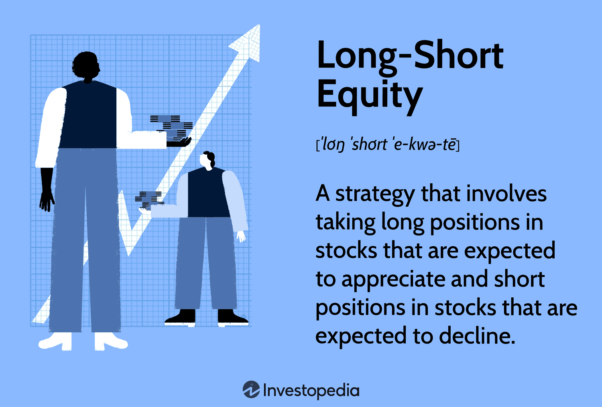

## Table of Contents

## What is a long-short equity strategy?

A long-short equity strategy is a way of investing where you buy some stocks (going long) and sell other stocks short (going short) at the same time. The idea is to make money from the stocks you think will go up in value and also from the stocks you think will go down in value. By doing both, investors try to make more money than they would if they just bought stocks.

This strategy can help reduce risk because if the market goes down, the stocks you sold short might lose value, but that can help offset the losses from the stocks you bought. It's like having a safety net. However, it can also be more complicated and risky than just buying stocks because selling short involves borrowing stocks to sell, which you have to buy back later, hopefully at a lower price.

## How does a long-short equity strategy differ from traditional investing?

A long-short equity strategy is different from traditional investing because it involves both buying and selling stocks at the same time. In traditional investing, you usually just buy stocks that you think will go up in value. With a long-short strategy, you also sell stocks short, which means you borrow stocks and sell them, hoping to buy them back later at a lower price. This allows you to make money if some stocks go down in value, not just if they go up.

This strategy can help manage risk better than traditional investing. In traditional investing, if the market goes down, your stocks might lose value, and you could lose money. But with a long-short strategy, if you've sold some stocks short, those stocks losing value can help offset the losses from the stocks you bought. However, it's also more complex and can be riskier because selling short involves borrowing, which adds another layer of risk and cost.

## What are the key components of a long-short equity strategy?

A long-short equity strategy has two main parts: going long and going short. Going long means you buy stocks that you think will go up in value. You make money if these stocks do well. Going short means you borrow stocks and sell them, hoping to buy them back later at a lower price. This way, you can make money if the stocks you think will go down actually do go down.

The strategy also involves balancing these two parts to manage risk. By having both long and short positions, you can protect yourself if the market goes down. If your long stocks lose value, your short stocks might gain value, which can help offset your losses. This balancing act is what makes a long-short strategy different from just buying stocks. However, it can be more complicated and riskier because of the need to borrow stocks for short selling.

## What are the benefits of using a long-short equity strategy?

One big benefit of using a long-short equity strategy is that it can help lower risk. When you use this strategy, you're not just betting on the market going up. You're also betting on some stocks going down. So if the market does go down, the stocks you sold short might lose value, but that can help make up for the losses from the stocks you bought. It's like having a safety net. This can make your investments more stable and less likely to lose a lot of money all at once.

Another benefit is that a long-short equity strategy can give you more chances to make money. In traditional investing, you only make money if your stocks go up. But with a long-short strategy, you can make money from stocks going down too. This means you can take advantage of more opportunities in the market. If you're good at [picking](/wiki/asset-class-picking) which stocks will go up and which will go down, this strategy can help you earn more than you might with just buying stocks.

## What are the risks associated with a long-short equity strategy?

One risk of using a long-short equity strategy is that it can be more complicated than just buying stocks. When you sell stocks short, you have to borrow them first. This means you have to pay fees for borrowing, and there's a chance you might not be able to borrow the stocks you want. If everyone wants to short the same stock, it can be hard to get. Also, if the stock you shorted goes up instead of down, you lose money. And because you borrowed the stock, you have to buy it back at the higher price, which can lead to big losses.

Another risk is that this strategy can be more expensive. Besides the borrowing fees, there are other costs like interest on the borrowed money and transaction fees for buying and selling more often. These extra costs can eat into your profits. Plus, if you're wrong about which stocks will go up and which will go down, you could lose money on both your long and short positions. This can make the strategy riskier than just buying stocks and holding them.

## How do you identify stocks to go long on in a long-short equity strategy?

To identify stocks to go long on in a long-short equity strategy, you need to find companies that you think will do well in the future. This means looking at a lot of different things about the company. You might look at how much money the company is making, how fast it's growing, and if it has good products or services that people want. You might also check if the company is doing better than other companies in the same industry. Sometimes, you look at what experts are saying about the company and what's happening in the world that could help the company grow.

Another way to find stocks to go long on is by using numbers and charts. This is called technical analysis. You look at how the stock's price has been moving over time and try to guess where it might go next. You might see patterns or trends that suggest the stock will keep going up. Some people also use computer programs that look at a lot of data to help pick stocks. The goal is to find stocks that are likely to increase in value so you can make money when you buy them.

## How do you identify stocks to short in a long-short equity strategy?

To find stocks to short in a long-short equity strategy, you need to look for companies that you think will not do well in the future. This means checking if the company is losing money, if it's growing slowly, or if it has problems like bad products or too much debt. You might also look at what's happening in the world that could hurt the company. For example, if a new law might make things harder for the company, that could be a reason to short its stock. You also want to see if the stock's price is too high compared to how well the company is doing. If the price is much higher than it should be, the stock might go down soon.

Another way to pick stocks to short is by using charts and numbers, which is called technical analysis. You look at how the stock's price has been moving and try to guess where it might go next. If you see patterns or trends that suggest the stock will go down, that could be a good sign to short it. Some people also use computer programs that look at a lot of data to help pick stocks to short. The goal is to find stocks that are likely to lose value so you can make money by selling them short and buying them back at a lower price later.

## What role does market research play in a long-short equity strategy?

Market research is really important for a long-short equity strategy. It helps you find out which stocks to buy and which ones to sell short. When you do market research, you look at things like how much money a company is making, how fast it's growing, and if it has good products or services. You also check what's happening in the world that could help or hurt the company. This information helps you pick the right stocks to go long on, which means buying stocks you think will go up in value.

Market research is also key for finding stocks to short. You want to find companies that are not doing well or might have problems soon. This means looking at things like if the company is losing money, if it's growing slowly, or if it has too much debt. You also pay attention to things like new laws or other changes that could make things harder for the company. By doing good market research, you can make better guesses about which stocks will go down in value, so you can sell them short and make money when their price drops.

## How can leverage be used in a long-short equity strategy?

Leverage can be used in a long-short equity strategy to try to make more money. When you use leverage, you borrow money to buy more stocks than you could with just your own money. This means you can go long on more stocks that you think will go up in value. You can also use leverage to short more stocks, betting that they will go down in value. If you're right about which stocks will go up and which will go down, using leverage can help you make bigger profits because you're investing more money.

But using leverage also makes things riskier. If the stocks you bought with borrowed money go down instead of up, you can lose a lot more money than if you just used your own money. The same goes for the stocks you shorted. If they go up instead of down, you have to buy them back at a higher price, and your losses can be bigger because you borrowed more money. So while leverage can help you make more money, it can also lead to bigger losses if things don't go the way you planned.

## What are some common pitfalls to avoid in implementing a long-short equity strategy?

One common pitfall in a long-short equity strategy is not doing enough research. Picking stocks to buy and sell short can be tricky. If you don't look closely at a company's money, growth, and what's happening in the world, you might pick the wrong stocks. This can lead to losing money on both the stocks you buy and the ones you short. So, it's really important to take the time to do good research before making any moves.

Another pitfall is using too much leverage. Leverage means borrowing money to buy more stocks. It can help you make more money if you're right about which stocks will go up and down. But if you're wrong, you can lose a lot more money because you borrowed so much. It's like betting more than you can afford to lose. So, be careful with how much leverage you use, and make sure you understand the risks.

Lastly, not managing risk well can also be a big problem. A long-short equity strategy is supposed to help you manage risk by balancing stocks you buy with stocks you short. But if you don't keep a good balance, you might end up losing more money than you planned. Always keep an eye on your investments and be ready to make changes if things aren't going well.

## How do you measure the performance of a long-short equity strategy?

To measure the performance of a long-short equity strategy, you look at how much money you made or lost over time. You do this by adding up the profits from the stocks you bought (went long on) and the profits from the stocks you sold short. Then, you subtract any losses from the stocks that didn't go the way you thought they would. You also need to take away any costs like fees for borrowing stocks to short or interest on money you borrowed to invest more. The final number tells you if the strategy worked well or not.

Another way to measure performance is by comparing your results to a benchmark, like a stock market index. If your long-short strategy made more money than the index, it's doing well. If it made less, it's not doing as well. You can also look at things like how much risk you took to get those returns. A good long-short strategy should give you higher returns for the same amount of risk, or the same returns with less risk. This helps you see if the strategy is worth the extra work and risk compared to just buying stocks.

## What advanced techniques can be used to enhance a long-short equity strategy?

One advanced technique to enhance a long-short equity strategy is using quantitative models. These are computer programs that look at a lot of data to help pick which stocks to buy and which to sell short. They can look at things like how stocks have moved in the past, how much money companies are making, and even what people are saying about the companies on social media. By using these models, you can find patterns and make better guesses about which stocks will go up and which will go down. This can help you make more money and manage your risk better.

Another technique is called pairs trading. This is when you find two stocks that usually move together but one is doing better than the other right now. You buy the stock that's doing worse (going long) and sell short the stock that's doing better. The idea is that the two stocks will go back to moving together, so the one you bought will go up and the one you shorted will go down. This can help you make money even if the overall market isn't moving much. It's a way to take advantage of small differences between similar stocks and can make your long-short strategy more effective.

## References & Further Reading

[1]: Bergstra, J., Bardenet, R., Bengio, Y., & Kégl, B. (2011). ["Algorithms for Hyper-Parameter Optimization."](https://dl.acm.org/doi/10.5555/2986459.2986743) Advances in Neural Information Processing Systems 24.

[2]: ["Advances in Financial Machine Learning"](https://www.amazon.com/Advances-Financial-Machine-Learning-Marcos/dp/1119482089) by Marcos Lopez de Prado

[3]: ["Evidence-Based Technical Analysis: Applying the Scientific Method and Statistical Inference to Trading Signals"](https://www.amazon.com/Evidence-Based-Technical-Analysis-Scientific-Statistical/dp/0470008741) by David Aronson

[4]: ["Machine Learning for Algorithmic Trading"](https://github.com/stefan-jansen/machine-learning-for-trading) by Stefan Jansen

[5]: ["Quantitative Trading: How to Build Your Own Algorithmic Trading Business"](https://www.amazon.com/Quantitative-Trading-Build-Algorithmic-Business/dp/1119800064) by Ernest P. Chan