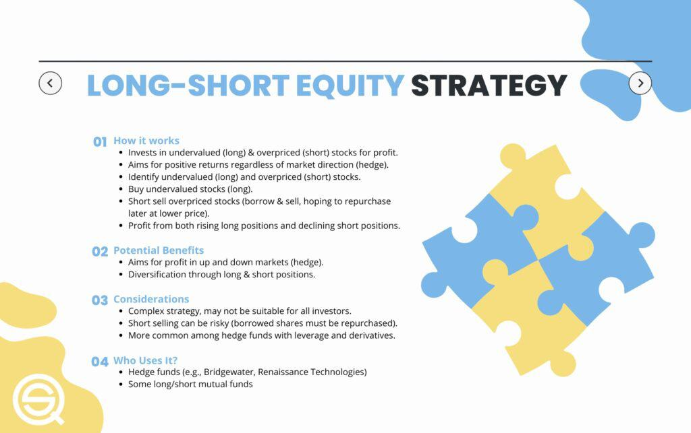

Investing in hedge funds often involves deploying sophisticated strategies designed to achieve high returns, particularly in unstable market environments. Among these strategies, the long-short equity approach holds a prominent position. It involves creating a portfolio of long and short positions, enabling investors to capitalize on market movements in both directions, thereby offering a mechanism to potentially enhance returns and reduce risk. This dual positioning allows skilled managers to benefit from identifying undervalued securities to buy (long) and overvalued securities to sell (short), ideally offsetting losses in downturns with gains on short positions.

The evolution of financial technology has significantly altered the landscape of investing, with algorithmic trading standing at the forefront of these changes. Algorithmic trading platforms empower investors by automating the complex execution of long-short strategies. These systems are designed to increase efficiency and accuracy, minimizing errors inherent in manual processes. They achieve this by implementing sophisticated algorithms capable of analyzing vast datasets to swiftly recognize and exploit trading opportunities.



This article offers insights into the complexities and functionalities of long-short equity strategies and their interplay with algorithmic trading. It examines fundamental components such as risk management, which is crucial in safeguarding against potential losses, and highlights the importance of technology in executing strategies effectively. Understanding these elements is vital, as they collectively form the backbone of a successful hedge fund investment strategy. In the sections that follow, we will explore various types of long-short equity funds, the implementation of algorithmic trading within these strategies, and the inherent risks and challenges faced by investors. Ultimately, the goal is to illuminate the adaptability and effectiveness of long-short equity strategies in managing market volatility and achieving superior investment outcomes.

## Table of Contents

## What is a Long-Short Equity Strategy?

Long-short equity strategies involve taking long positions in stocks deemed undervalued while shorting those considered overvalued. This dual strategy allows investors to potentially profit from price movements in both increasing and decreasing markets. The goal is to minimize market exposure while maximizing returns by leveraging market inefficiencies.

In a long position, an investor purchases a stock with the expectation that its price will rise over time, enabling them to sell it at a higher price for a profit. Conversely, a short position involves borrowing and selling a stock that is anticipated to decline in value, with the expectation of repurchasing it at a lower price to return to the lender, thus capitalizing on the price differential. The combination of long and short positions can be tailored with a particular bias, allowing hedge funds and other investment entities to adapt to varying market conditions.

The execution of long-short strategies requires a keen understanding of market dynamics. It's essential to identify valuation discrepancies accurately, which involves a careful analysis of financial statements, market trends, and economic indicators. Investors also utilize metrics such as the Price-to-Earnings (P/E) ratio, Price-to-Book (P/B) ratio, and other valuation tools to assess whether a stock is undervalued or overvalued.

The critical advantage of this strategy lies in its market neutrality potential. By balancing long and short positions, investors can reduce their exposure to overall market movements, focusing instead on the performance of individual stocks. This aspect makes long-short equity strategies particularly attractive in volatile or uncertain market environments, where the direction of the broader market is unpredictable.

An example calculation to illustrate this strategy involves assessing the potential profit from both long and short positions:

Python Code Example:
```python
def long_short_profit(initial_investment, long_price, long_target_price, short_price, short_target_price, short_borrowing_fee):
    # Calculate profit from long position
    long_shares = initial_investment // long_price
    long_profit = (long_target_price - long_price) * long_shares

    # Calculate profit from short position
    short_shares = initial_investment // short_price
    short_profit = (short_price - short_target_price) * short_shares - short_borrowing_fee * short_shares

    # Total profit
    total_profit = long_profit + short_profit
    return total_profit

# Example: Investing $10,000
initial_investment = 10000
long_price = 50
long_target_price = 60
short_price = 70
short_target_price = 60
short_borrowing_fee = 0.5

profit = long_short_profit(initial_investment, long_price, long_target_price, short_price, short_target_price, short_borrowing_fee)
print(f"Total Profit: ${profit}")
```

Understanding long-short equity strategies is crucial for investors aiming to achieve superior returns while managing risk effectively in various market conditions. This strategic versatility, when executed with precision and insight, can significantly enhance portfolio performance.

## Types of Long-Short Equity Funds

Different types of funds that employ long-short equity strategies include hedge funds, mutual funds, and exchange-traded funds (ETFs), each catering to varying investment needs and risk appetites.

### Hedge Funds

Hedge funds are most widely recognized for utilizing long-short equity strategies. They are private investment partnerships that typically require substantial initial investments and are reserved for accredited investors. The primary objective of hedge funds is to generate high returns, often exceeding those of standard market indices. To achieve this, they often employ leverage, borrowing capital to amplify potential returns. This approach, however, comes with increased risk exposure.

Hedge funds have the flexibility to employ various strategies and asset classes, and often have fewer regulatory constraints than mutual funds and ETFs. The investment horizon for hedge funds can be shorter, allowing managers to exploit short-term market inefficiencies. This agility can be advantageous in volatile markets, where rapid shifts can present both opportunities and risks.

### Mutual Funds

Mutual funds utilizing long-short equity strategies offer a more accessible option to a broader investor base. Unlike hedge funds, mutual funds are highly regulated, providing greater transparency and investor protection. They typically have lower entry thresholds, making them suitable for retail investors.

While mutual funds can adopt long-short strategies, they tend to do so in a more conservative manner compared to hedge funds. The use of leverage is generally limited by regulatory frameworks, which reduces potential returns but also mitigates risk. Mutual funds might focus on less aggressive strategies, aiming for moderate, consistent returns over longer investment horizons.

### Exchange-Traded Funds (ETFs)

ETFs employing long-short strategies are an emerging asset class designed to combine the benefits of traditional ETFs with the hedging capabilities of long-short approaches. ETFs are known for their [liquidity](/wiki/liquidity-risk-premium), trading like stocks on exchanges, and providing investors with the advantage of real-time pricing.

ETFs can offer diversified exposure to long-short strategies at a lower cost compared to hedge funds. They are often passively managed, tracking specific indices designed to reflect long-short strategies. This passive nature can limit the flexibility available to actively managed hedge funds but offers a viable option for investors seeking systematic exposure to long-short tactics with potentially lower fees and expenses.

### Conclusion

Overall, the choice between hedge funds, mutual funds, and ETFs employing long-short equity strategies depends on factors such as investment objectives, risk tolerance, and the investor’s level of sophistication. Hedge funds offer potential for higher returns through leverage and flexible strategies but require acceptance of greater risk and investment capital. Mutual funds provide regulated access with potentially lower risk and longer investment horizons, while ETFs offer liquidity and diversified exposure at a lower cost, suiting investors inclined towards systematic strategy deployment.

## Algorithmic Trading and Long-Short Strategies

Algorithmic trading platforms are transforming the execution of long-short equity strategies by bringing automation and precision into the trading process. These platforms leverage sophisticated algorithms to systematically manage trades, reducing the dependency on human discretion and potentially minimizing errors. The automation of trade execution not only enhances efficiency but also ensures consistency, particularly in volatile markets where rapid decision-making is crucial.

At the core of [algorithmic trading](/wiki/algorithmic-trading) is the ability to analyze vast datasets in real-time. This capability is critical for long-short strategies, where identifying undervalued and overvalued stocks with accuracy can significantly impact performance. Advanced algorithms are designed to sift through financial data, news feeds, and even social media sentiment to pinpoint trading opportunities. These algorithms can employ various techniques, such as statistical [arbitrage](/wiki/arbitrage), [machine learning](/wiki/machine-learning), and natural language processing, to generate insights. For instance, a common machine learning approach is to use historical price data to train models that predict future stock movements, enabling the strategy to adapt dynamically to market conditions.

A fundamental aspect of algorithmic trading in long-short strategies is the optimization of trade execution. Algorithms can determine the optimal timing and order size to reduce market impact and transaction costs, a process often referred to as trade scheduling. By predicting the liquidity conditions of the market, algorithms can spread large trades over time or break them into smaller blocks to avoid drastic price movements that could adversely affect returns.

Additionally, [backtesting](/wiki/backtesting) algorithms is a critical procedure that involves applying trading strategies to historical data to evaluate their effectiveness before deployment. This process helps in fine-tuning the algorithms for better performance and in compliance with risk management protocols. In Python, backtesting can be done using libraries such as `[backtrader](/wiki/backtrader)` which facilitates strategy testing over historical data and provides detailed performance metrics. Below is a simple snippet demonstrating a basic backtest setup using `backtrader`:

```python
import backtrader as bt

class LongShortStrategy(bt.Strategy):
    def __init__(self):
        self.data_close = self.datas[0].close

    def next(self):
        if self.data_close[0] > self.data_close[-1]:
            self.buy()
        elif self.data_close[0] < self.data_close[-1]:
            self.sell()

if __name__ == '__main__':
    cerebro = bt.Cerebro()
    data = bt.feeds.YahooFinanceData(dataname='AAPL', fromdate=datetime(2020, 1, 1), todate=datetime(2023, 1, 1))
    cerebro.adddata(data)
    cerebro.addstrategy(LongShortStrategy)
    cerebro.run()
```

The continual evolution of these technologies promises further enhancements in the performance of long-short equity strategies. As the markets become more complex and data-driven, the role of algorithmic trading in executing and refining long-short strategies will likely grow, offering investors a robust framework to capitalize on market inefficiencies.

## Risk Management in Long-Short Strategies

Effective risk management is a cornerstone of successful long-short equity strategies. This involves the continuous monitoring of positions with the aim of mitigating potential losses. Such an approach accounts for the inherent [volatility](/wiki/volatility-trading-strategies) of financial markets and positions investors to respond promptly to adverse movements.

One key aspect of risk management in these strategies is diversification. By spreading investments across various sectors and geographical regions, investors can reduce unsystematic risks—those not correlated with market movements. Diversification ensures that the impact of a negative event affecting a particular sector or region is minimized, thereby stabilizing the overall portfolio performance.

Quantitative tools like Value at Risk (VaR) and stress testing play a significant role in assessing potential losses under different market conditions. VaR provides an estimate of the maximum potential loss over a specific time frame at a given confidence level. For example, a one-day VaR of $1 million at a 95% confidence level implies that, statistically, there's a 5% chance the portfolio could lose more than $1 million in a single day. This statistical approach allows investors to quantify and manage their risk exposure systematically.

```python
import numpy as np

# Sample portfolio data
portfolio_returns = np.random.normal(0, 1, 1000)  # Simulated returns

# Calculating VaR at 95% confidence level
confidence_level = 0.95
VaR = np.percentile(portfolio_returns, (1 - confidence_level) * 100)

print(f"Value at Risk (95% confidence): {VaR}")
```

Stress testing, on the other hand, evaluates how a portfolio would perform under extreme market conditions. This involves hypothetical scenarios, such as economic crises or sudden market downturns, allowing investors to understand potential vulnerabilities and prepare accordingly. Stress tests can help in recalibrating strategies and refining risk management tactics to withstand market shocks.

Together, these methodologies underscore the importance of not only recognizing potential risks but also actively managing them through structured techniques and quantitative analysis. As markets evolve, continuous advancements in technology and analytics provide investors with increasingly sophisticated tools to enhance risk management practices in long-short equity strategies.

## Challenges and Considerations

Long-short equity strategies offer compelling opportunities for investors but come with inherent complexities that require careful consideration. One of the main challenges is execution risk, which refers to the potential losses stemming from the difficulties in perfectly executing trades as intended. Market conditions can change rapidly, and the appropriate execution of long and short positions is essential for realizing the anticipated gains from these strategies.

Sophisticated market analysis is pivotal for successful implementation. Investors must effectively analyze various factors, including macroeconomic indicators, sector performance, and individual stock specifics. They utilize both quantitative and qualitative analyses to forecast market movements accurately. However, this requires advanced analytical skills and access to comprehensive data, which can be resource-intensive.

Transaction costs and slippage are significant factors that can diminish net returns. Transaction costs, including brokerage fees, taxes, and other charges, can accumulate and impact profit margins, particularly when high trading volumes are involved. Slippage, which occurs when there is a difference between the expected price of a trade and the actual price at which it is executed, can lead to substantial erosion of profits. This is particularly prevalent during periods of high market volatility when prices can fluctuate rapidly.

A robust framework for strategy implementation is essential alongside skilled managerial execution. This involves establishing a clear strategy blueprint that aligns with investment goals and risk tolerance. Effective implementation requires a deep understanding of market dynamics and the flexibility to adapt strategies as conditions evolve.

The combination of a sound framework and efficient execution enhances the likelihood of achieving desired outcomes. Managers must be equipped with the necessary tools and knowledge to navigate the intricacies of the markets and respond proactively to emerging trends. As such, continual education and experience play a vital role in optimizing strategy performance and maintaining competitiveness in the market.

## Conclusion

Long-short equity strategies, when enhanced by algorithmic trading, offer powerful tools for managing and capitalizing on market volatility. The core strength of these strategies lies in their flexibility, allowing investors to adapt to the dynamic nature of financial markets by taking advantage of both rising and falling stock prices. This adaptability is particularly beneficial in volatile market conditions, where traditional investment approaches may falter.

Algorithmic trading plays a crucial role in elevating the efficiency and precision of long-short strategies. By leveraging advanced algorithms, traders can swiftly process vast data sets to identify profitable opportunities, execute trades with minimal latency, and reduce human errors. The integration of technology with these investment strategies enables more efficient risk management and maximizes potential returns.

To sustain superior investment outcomes with long-short strategies, continuous development and refinement are essential. As markets evolve, so too must the algorithms and models that drive these strategies. Refining these tools involves not only enhancing their analytical capabilities but also incorporating the latest market trends and data. This iterative process ensures that the strategies remain robust and effective across various market conditions, maintaining their relevance and competitiveness.

In conclusion, the combination of long-short equity strategies with algorithmic trading provides a sophisticated approach to navigating market fluctuations. Their adaptability and the potential for high returns make them an appealing choice for investors seeking to outperform traditional investment methods. However, to fully realize their benefits, it is imperative to maintain an ongoing commitment to innovation and refinement in strategy implementation.

## References & Further Reading

[1]: Bergstra, J., Bardenet, R., Bengio, Y., & Kégl, B. (2011). ["Algorithms for Hyper-Parameter Optimization."](https://dl.acm.org/doi/10.5555/2986459.2986743) Advances in Neural Information Processing Systems 24.

[2]: ["Advances in Financial Machine Learning"](https://www.amazon.com/Advances-Financial-Machine-Learning-Marcos/dp/1119482089) by Marcos Lopez de Prado

[3]: ["Evidence-Based Technical Analysis: Applying the Scientific Method and Statistical Inference to Trading Signals"](https://www.amazon.com/Evidence-Based-Technical-Analysis-Scientific-Statistical/dp/0470008741) by David Aronson

[4]: ["Machine Learning for Algorithmic Trading"](https://github.com/stefan-jansen/machine-learning-for-trading) by Stefan Jansen

[5]: ["Quantitative Trading: How to Build Your Own Algorithmic Trading Business"](https://www.amazon.com/Quantitative-Trading-Build-Algorithmic-Business/dp/1119800064) by Ernest P. Chan