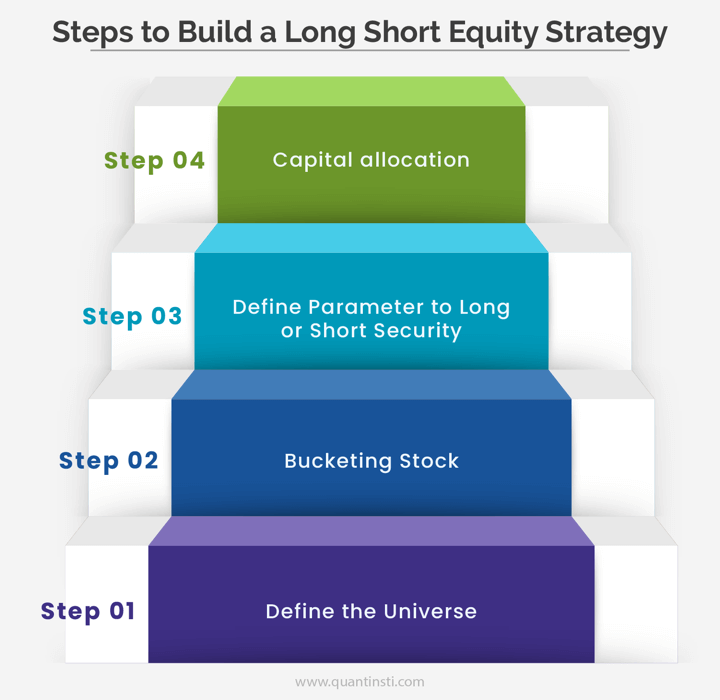

## Table of Contents

## What is a long-short equity strategy?

A long-short equity strategy is a way of investing where you buy some stocks (that's the "long" part) and sell other stocks you don't own (that's the "short" part). The idea is to make money from the stocks you think will go up in value and also from the stocks you think will go down in value. By doing both at the same time, you can try to make a profit no matter what the overall market is doing.

This strategy can be useful because it lets investors take advantage of opportunities in the market, both when prices are going up and when they are going down. For example, if you believe a certain company is going to do well, you can buy its stock. At the same time, if you think another company is going to do poorly, you can short its stock. By balancing these positions, investors aim to reduce risk and potentially increase their returns.

## How does a long-short equity strategy differ from traditional investing?

A long-short equity strategy is different from traditional investing because it involves both buying and selling stocks at the same time. In traditional investing, you usually just buy stocks that you think will go up in value. This is called taking a "long" position. But in a long-short strategy, you also sell stocks you don't own, which is called taking a "short" position. You do this when you think a stock's price will go down. By doing both, you can try to make money whether the market goes up or down.

This approach can help manage risk better than traditional investing. In traditional investing, if the market goes down, your investments might lose value. But with a long-short strategy, the gains from your short positions can help offset losses from your long positions. This means you're not just hoping the market will go up; you're also trying to profit from stocks that you think will go down. It's a more flexible way to invest, but it can also be more complex and requires a good understanding of the market.

## What are the key components of a long-short equity strategy?

The key components of a long-short equity strategy are the long positions and the short positions. Long positions are when you buy stocks that you believe will go up in value. You make money if these stocks increase in price. Short positions are when you sell stocks you don't own, with the hope that their price will go down. If the price does drop, you can buy the stocks back at a lower price and make a profit from the difference.

Another important part of a long-short equity strategy is balancing these positions. Investors try to find the right mix of long and short positions to reduce risk and increase potential returns. By having both types of positions, they can make money whether the overall market goes up or down. This balancing act requires a good understanding of the market and the ability to predict which stocks will rise and which will fall.

The final component is active management. A long-short equity strategy often involves frequent buying and selling of stocks to adjust the portfolio based on changing market conditions. This active approach can help investors take advantage of new opportunities and manage risks better than a buy-and-hold strategy. It requires constant monitoring and a willingness to make quick decisions.

## What are the potential benefits of using a long-short equity strategy?

One big benefit of using a long-short equity strategy is that it can help you make money no matter if the market goes up or down. When you think some stocks will go up, you buy them (that's the long part). When you think other stocks will go down, you sell them (that's the short part). By doing both at the same time, you can make money from the stocks that go up and also from the ones that go down. This can be really helpful because it means you're not just hoping the whole market will go up; you're also trying to make money from parts of the market that might be going down.

Another benefit is that a long-short equity strategy can help you manage risk better. In traditional investing, if the market goes down, your investments might lose value. But with a long-short strategy, the money you make from your short positions can help cover the losses from your long positions. This balancing act can make your investments less risky. Plus, because you're always looking for new opportunities to buy and sell, you can adjust your investments quickly to take advantage of changes in the market. This active approach can lead to better returns over time.

## What are the risks associated with a long-short equity strategy?

One risk of a long-short equity strategy is that it can be more complicated than traditional investing. You have to keep track of both the stocks you buy and the ones you sell short. If you guess wrong about which stocks will go up or down, you could lose money on both sides. This means you need to be good at understanding the market and making quick decisions. If you're not careful, you might end up with bigger losses than you would with a simpler investment approach.

Another risk is that short selling can lead to unlimited losses. When you sell a stock short, you're betting that its price will go down. But if the stock price goes up instead, you have to buy it back at a higher price, which can cost you a lot more than you expected. This is different from buying stocks, where the most you can lose is what you paid for them. So, short selling adds an extra layer of risk that you need to be ready for.

## How do you identify stocks to go long on in a long-short equity strategy?

To identify stocks to go long on in a long-short equity strategy, you need to look for companies that you think will do well in the future. This means finding businesses that are growing, have good management, and are in industries that are doing well. You can start by looking at a company's financial reports to see if they are making more money over time. It's also helpful to read news and analysis about the company to understand what is happening in their industry and if there are any big changes coming up that could affect them.

Another way to find good stocks to go long on is by using different tools and data. For example, you can use stock screeners to filter out companies based on certain criteria like earnings growth or price-to-earnings ratio. You might also look at what other investors and analysts are saying about the stock. If a lot of smart people think a company will do well, that can be a good sign. But remember, no matter how much research you do, there's always a chance that things won't go as planned, so it's important to keep an eye on your investments and be ready to make changes if needed.

## How do you identify stocks to short in a long-short equity strategy?

To identify stocks to short in a long-short equity strategy, you look for companies that you think are going to do poorly in the future. This means finding businesses that might be struggling, have weak management, or are in industries that are not doing well. You can start by checking a company's financial reports to see if they are losing money or if their profits are going down. It's also important to read news and analysis to understand if there are any big problems coming up that could hurt the company. For example, if a company is losing customers or facing new competition, it might be a good candidate to short.

Another way to find stocks to short is by using tools and data. You can use stock screeners to filter out companies based on things like high debt levels or poor earnings growth. You might also look at what other investors and analysts are saying about the stock. If a lot of people think a company will do badly, that can be a good sign that it's a stock to short. But remember, short selling can be risky because if the stock price goes up instead of down, you could lose a lot of money. So, it's important to do your research carefully and keep watching your investments to make sure you're making the right moves.

## What role does market neutrality play in a long-short equity strategy?

Market neutrality is an important part of a long-short equity strategy. It means trying to make your investments not depend too much on whether the whole market goes up or down. By balancing the stocks you buy (long positions) with the stocks you sell (short positions), you aim to make money no matter what the market does. This can help you manage risk better because if the market goes down, the money you make from your short positions can help cover the losses from your long positions.

To achieve market neutrality, you need to carefully choose which stocks to go long on and which to short. You want the total value of your long positions to be about the same as the total value of your short positions. This way, any big changes in the market should affect both sides of your investments equally, leaving you with a more stable portfolio. It's not always easy to get this balance right, but when you do, it can help you focus on the performance of individual stocks rather than the overall market.

## How can leverage be used in a long-short equity strategy?

Leverage can be used in a long-short equity strategy to increase the amount of money you can invest without putting in more of your own money. This means you can borrow money to buy more stocks (long positions) or to sell more stocks short (short positions). By using leverage, you can potentially make bigger profits if your guesses about which stocks will go up or down are right. But remember, using leverage also makes your investments riskier because if you're wrong, you could lose more money than you put in.

When you use leverage in a long-short equity strategy, it's important to be careful. Because you're borrowing money, any losses you have will be bigger than if you were just using your own money. This means you need to be really sure about your choices and keep a close eye on your investments. Leverage can help you take advantage of more opportunities and possibly make more money, but it can also lead to bigger losses if things don't go as planned.

## What are some common performance metrics used to evaluate a long-short equity strategy?

When you want to see how well a long-short equity strategy is doing, you can look at a few common performance metrics. One important metric is the "return," which tells you how much money you've made or lost over a certain time. You can compare the return of your long-short strategy to other investments or to the overall market to see if it's doing better or worse. Another useful metric is the "Sharpe ratio," which measures how much return you're getting for the risk you're taking. A higher Sharpe ratio means you're getting more return for each unit of risk, which is good.

Another metric to consider is the "alpha," which shows how much better or worse your strategy is doing compared to what you would expect based on the market's performance. A positive alpha means your strategy is beating the market, while a negative alpha means it's underperforming. "Beta" is also important because it shows how much your strategy moves with the market. A beta close to zero means your strategy is more market-neutral, which is often a goal in long-short equity strategies. By looking at these metrics, you can get a good idea of how well your long-short equity strategy is working and whether you need to make any changes.

## How do regulatory environments affect long-short equity strategies?

Regulatory environments can have a big impact on long-short equity strategies. Different countries have different rules about what you can and can't do when you're investing. For example, some places might have strict rules about short selling, which is a key part of a long-short strategy. If a country bans or limits short selling, it can make it harder to use this strategy effectively. Also, rules about how much you can borrow to invest (leverage) can affect how much money you can put into your long and short positions. If regulators make it harder to borrow money, you might not be able to use as much leverage, which can limit your potential profits.

Another way regulations can affect long-short equity strategies is through reporting requirements. In some places, you might have to tell the government about your short positions, which can make your strategy less secret. This can be a problem because other investors might see what you're doing and try to do the same thing, which could affect the prices of the stocks you're trading. Plus, if the rules change a lot, it can be hard to keep up and adjust your strategy quickly. So, it's important to always know the rules in the places where you're investing and be ready to change your approach if the regulations change.

## What advanced techniques can be employed to optimize a long-short equity strategy?

One advanced technique to optimize a long-short equity strategy is using quantitative models. These models use math and data to help you pick which stocks to buy and which to sell short. They can look at a lot of information at once, like how a company is doing financially, what's happening in the market, and even things like the weather or political news. By using these models, you can make better guesses about which stocks will go up or down, which can help you make more money. But remember, even the best models can be wrong sometimes, so it's important to keep checking and updating them.

Another technique is called "factor investing." This means you look at certain things, or "factors," that can affect how a stock does. For example, you might look at a company's size, how much it's growing, or how much it pays in dividends. By focusing on these factors, you can build a long-short strategy that takes advantage of them. For instance, you might go long on stocks that are small but growing fast, and short on stocks that are big but not growing much. This can help you find patterns in the market that you can use to make better investment choices.

A third technique is using options and other derivatives. Options let you bet on whether a stock will go up or down without actually buying or selling the stock itself. This can be a good way to add more flexibility to your long-short strategy. For example, you might use options to protect yourself from big losses if the market goes against you. Or you could use them to make more money if you're right about which way a stock is going to move. But options can be tricky and risky, so it's important to understand them well before you start using them in your strategy.

## What are the types of Long-Short Funds?

Different investment funds utilize the long-short strategy by adapting it to particular market conditions or investment goals. The primary types of funds that adopt this strategy include sector-specific, market-neutral, and geographic funds.

**Sector-Specific Funds**

Sector-specific funds channel their investments into defined segments of the market, such as technology, healthcare, or energy. By concentrating on industries expected to outperform or underperform relative to the broader market, these funds strategically buy undervalued stocks within a specific sector (long positions) while shorting overvalued stocks within the same sector. This focused approach allows investors to capitalize on intra-sector dynamics and trends that may not affect the market as a whole. For instance, a technology-focused long-short fund might capitalize on the ebb and flow of innovation cycles, consumer demand changes, and regulatory impacts specific to the tech industry.

**Market-Neutral Funds**

Market-neutral funds aim to achieve a position where net market exposure is effectively zero. This is accomplished by maintaining a balance between long and short positions, such that the positive and negative movements in the market offset each other. The objective is to extract alpha, or excess return, from the manager's stock-[picking](/wiki/asset-class-picking) ability rather than from general market movements. The formula for market neutrality can be expressed as:

$$

\text{Net Market Exposure} = \sum (\text{Long Position Values}) - \sum (\text{Short Position Values}) \approx 0
$$

By design, these funds reduce market risk, allowing them to potentially perform well regardless of whether the broader market is trending upward or downward. This approach can be particularly attractive during periods of market volatility.

**Geographic Funds**

Geographic funds implement the long-short strategy by focusing on specific regions, tailoring their investments to local economic conditions, regulatory environments, and market dynamics. These funds may decide to go long on securities from countries or regions experiencing economic growth or favorable policies while shorting those from areas facing economic headwinds or unfavorable regulations. By doing so, geographic funds can mitigate broader market risks and leverage region-specific opportunities and threats.

Overall, each type of long-short fund attempts to utilize a unique approach to maximize returns while managing risks through diversified investment strategies. Their ability to adapt to specific segments, balance market exposure, or focus on regional advantages makes them versatile tools within the financial landscape.

## How do these strategies compare with other strategies?

The long-short strategy offers a unique framework within the landscape of investment strategies, standing apart from long-only, market-neutral, and value investing approaches. This strategy uniquely blends risk management with the potential for diversification, allowing traders to simultaneously exploit rising and falling market conditions.

### Long-Only vs. Long-Short

A long-only strategy focuses solely on holding undervalued stocks, relying on the anticipation of price appreciation to generate returns. Its primary limitation is exposure to market downturns, which can result in significant losses. In contrast, the long-short strategy addresses this limitation by incorporating short positions. This allows investors to profit from overvalued stocks' price declines, providing a more balanced approach to potential market scenarios. The risk-adjusted return model, illustrated by:

$$
\text{Adjusted Return} = \frac{\text{Portfolio Return} - \text{Risk-Free Rate}}{\text{Portfolio Risk}}
$$

is better achieved through long-short positions by reducing systematic risk.

### Market-Neutral vs. Long-Short

Market-neutral strategies aim to minimize market exposure, focusing on generating alpha from security selection rather than market movements. This is achieved by equally balancing long and short positions, resulting in a beta close to zero. While similar, the long-short strategy can be more aggressive by adjusting weights, either favoring long or short depending on market outlook, thus potentially offering higher returns alongside controlled risk exposure.

### Value Investing vs. Long-Short

Value investing is rooted in identifying and investing in undervalued securities based on fundamental analysis, a practice popularized by Benjamin Graham. This strategy is inherently long-biased, often requiring patience to realize returns as markets correct inefficiencies. In contrast, long-short strategies leverage both undervalued and overvalued stocks, potentially speeding up profit realization and offering protection through diversified positions. The P/E ratios, for instance, could be pivotal in both strategies' analyses:

$$
\text{P/E Ratio} = \frac{\text{Market Value per Share}}{\text{Earnings per Share (EPS)}}
$$

While value investing emphasizes low P/E ratios for entry, long-short strategies might capitalize on high P/E ratios for short selling.

In summary, the long-short strategy distinguishes itself through its balanced approach to market sensitivity, profit potential, and risk management. By harnessing the complementary benefits of long and short positions, this strategy provides a versatile and dynamic approach to investing that contrasts distinctly with traditional methods.

## References & Further Reading

[1]: Bergstra, J., Bardenet, R., Bengio, Y., & Kégl, B. (2011). ["Algorithms for Hyper-Parameter Optimization."](https://papers.nips.cc/paper/4443-algorithms-for-hyper-parameter-optimization) Advances in Neural Information Processing Systems 24.

[2]: ["Advances in Financial Machine Learning"](https://www.amazon.com/Advances-Financial-Machine-Learning-Marcos/dp/1119482089) by Marcos Lopez de Prado

[3]: ["Evidence-Based Technical Analysis: Applying the Scientific Method and Statistical Inference to Trading Signals"](https://www.amazon.com/Evidence-Based-Technical-Analysis-Scientific-Statistical/dp/0470008741) by David Aronson

[4]: ["Machine Learning for Algorithmic Trading"](https://github.com/stefan-jansen/machine-learning-for-trading) by Stefan Jansen

[5]: ["Quantitative Trading: How to Build Your Own Algorithmic Trading Business"](https://books.google.com/books/about/Quantitative_Trading.html?id=j70yEAAAQBAJ) by Ernest P. Chan