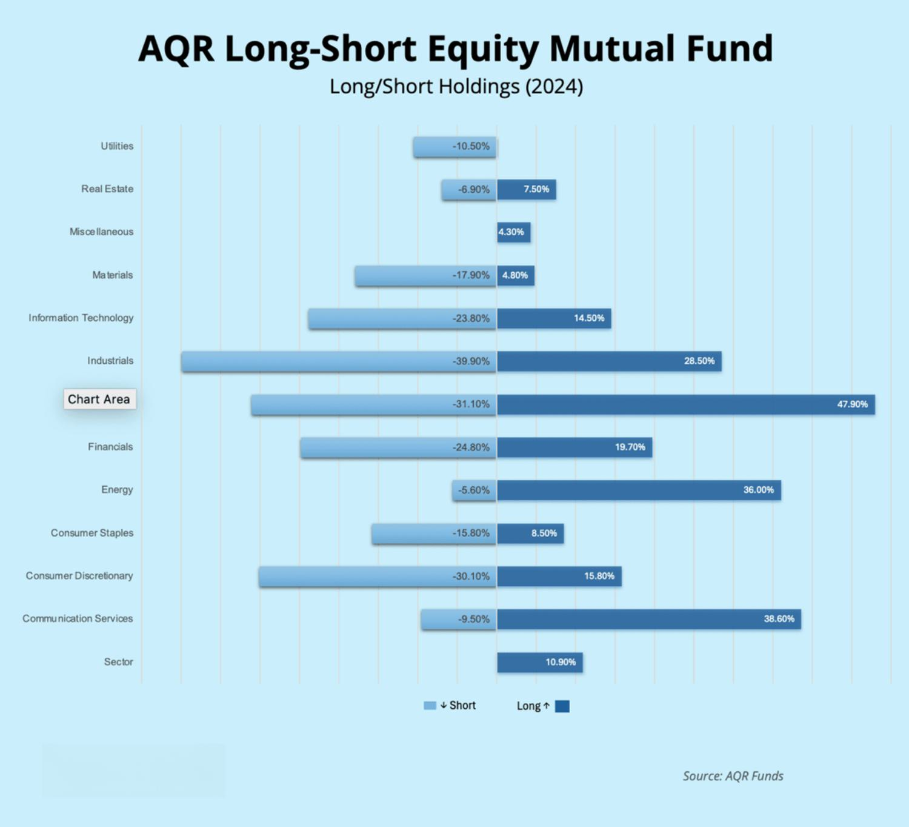

Hedge funds have emerged as prominent players in high finance, leveraging complex financial strategies to achieve maximum returns while effectively managing risk. One of the most notable strategies employed by these funds is the long/short investment strategy. This approach involves taking long positions in stocks anticipated to appreciate in value while simultaneously shorting stocks expected to depreciate. By balancing these opposing market positions, hedge funds aim to exploit market inefficiencies, potentially generating returns that are uncorrelated with general market movements.

This article explores the structure and implementation of long/short funds with a particular emphasis on algorithmic trading strategies. Algorithmic trading has revolutionized the efficiency and precision of executing these sophisticated strategies. By automating trade decisions, algorithms enable hedge funds to rapidly capitalize on investment opportunities that arise from market fluctuations. This technological advancement not only enhances the scalability of long/short strategies but also improves their execution speed and precision, allowing for greater agility in volatile markets.



We will examine how long/short strategies are constructed and the benefits they offer investors, such as portfolio diversification and the ability to profit from both rising and falling markets. The integration of algorithmic trading in these funds serves to refine these strategies further, offering investors an innovative approach to navigating complex financial landscapes.

## Table of Contents

## What is a Long/Short Fund?

A long/short fund is an investment vehicle specifically structured to optimize the potential for capital appreciation by strategically taking long positions in undervalued stocks while simultaneously seeking gains from declining stock prices via short positions. This dual approach allows these funds to exploit market opportunities by betting on both the rise and fall of individual securities, making them versatile tools for sophisticated investors.

The financial instruments utilized by long/short funds often include leverage and derivatives, which help to amplify returns while endeavoring to keep market risk exposure balanced. Leverage, in this context, refers to using borrowed capital to increase the potential return on investment. For instance, if a fund employs a leverage ratio of 2:1, it would mean that for every dollar of its capital, it borrows an additional dollar to invest, thereby potentially doubling its returns or losses. Derivatives, such as options and futures, are also employed to manage risk and gain exposure to various market movements without investing directly in the underlying assets.

These funds are known for their flexibility in catering to diverse market segments. They can invest in equities, bonds, and commodities, allowing fund managers to tailor their investment strategies based on market conditions and investor goals. Additionally, long/short strategies are not confined to the traditional [hedge fund](/wiki/hedge-fund-trading-strategies) structure. They are also available in mutual funds and Exchange-Traded Fund (ETF) formats, which offer varying degrees of accessibility, [liquidity](/wiki/liquidity-risk-premium), and regulatory oversight to a broader range of investors.

The distinct advantage of a long/short fund lies in its adaptability across different market environments. By engaging in both long and short strategies, these funds can potentially maintain positive performance irrespective of overall market direction. This capability makes them a valuable component in the portfolio of investors looking to hedge against market [volatility](/wiki/volatility-trading-strategies) or capitalize on specific market inefficiencies.

## Mechanics of Long/Short Strategies

Long/short strategies are designed to capitalize on market inefficiencies by simultaneously holding long and short positions in equities. The objective is to identify undervalued stocks to buy (go long) and overvalued stocks to sell (go short), thereby aiming to generate returns from both rising and falling market conditions. This approach offers an avenue for absolute return regardless of general market trends.

One prevalent variant within long/short funds is the 130-30 strategy. In this configuration, a fund allocates 130% of its assets to long positions and 30% to short positions. This results in a total exposure of 160% of the fund's equity, yet the net exposure remains at 100% of the fund's capital:

$$
\text{Net Exposure} = \text{Long Exposure} - \text{Short Exposure} = 130\% - 30\% = 100\%
$$

This strategic structure allows the fund to exploit potential upside from long positions while simultaneously benefiting from declines in shorted stocks, all with a controlled net market exposure.

Algorithmic trading has significantly transformed the execution of long/short strategies, integrating advanced algorithms to enhance decision-making processes. Algorithms can analyze vast quantities of market data at high speed, pinpointing opportunities in a manner that is more efficient than traditional manual analysis. These algorithms are typically designed to identify signals or patterns that predict stock price movements, enabling traders to execute trades with increased accuracy and reduced latency.

For instance, consider a basic Python implementation that uses moving averages as a signal for long or short positions:

```python
import numpy as np
import pandas as pd

# Sample stock price data
data = pd.DataFrame({
    'price': [100, 101, 102, 103, 99, 98, 101, 104, 106, 105]
})

# Calculate moving averages
data['short_mavg'] = data['price'].rolling(window=3, min_periods=1).mean()
data['long_mavg'] = data['price'].rolling(window=5, min_periods=1).mean()

# Generate trading signals
data['signal'] = 0
data['signal'][data['short_mavg'] > data['long_mavg']] = 1  # Long signal
data['signal'][data['short_mavg'] < data['long_mavg']] = -1  # Short signal

# Print results
print(data)
```

This example illustrates how an algorithm can systematically apply a simple strategy over historical price data to generate buy and sell signals. While moving averages are a basic tool, sophisticated long/short funds employ complex algorithmic models incorporating multiple signals and factors to refine their investment decisions.

Overall, the adoption of [algorithmic trading](/wiki/algorithmic-trading) in long/short strategies aids in augmenting the speed and precision of trade implementations, providing a competitive edge to funds seeking to optimize performance across varying market conditions.

## Examples of Long/Short Funds

The AQR Long-Short Equity Fund is a noteworthy example of a long/short fund that demonstrates the practical application of these strategies across diverse sectors. Managed by AQR Capital Management, this fund seeks to balance long positions in undervalued equities with short positions in overvalued ones, aiming to capture alpha regardless of the broader market's direction. The fund's diversified global investments allow it to operate across various industries and geographies, exemplifying how long/short funds can be adaptable in targeting specific market opportunities while managing exposure to risk factors.

Another prominent example is the Invesco S&P 500 Downside Hedged [ETF](/wiki/etf-trading-strategies), designed to offer investors protection during downward market trends while allowing participation in upward movements. This ETF employs various hedging mechanisms, such as purchasing put options, to mitigate potential losses in declining markets. By integrating downside protection strategies within a conventional equity framework, the fund maintains a degree of flexibility and resilience, making it an appealing option for those seeking to balance risks and rewards in volatile market conditions.

These examples underscore the flexibility and adaptability inherent in long/short funds, allowing them to adjust to various market conditions and align with diverse investment objectives. Whether through global equity diversification or strategic hedging mechanisms, these funds demonstrate how long/short strategies effectively navigate the complexities of financial markets while striving to optimize returns for investors.

## Algorithmic Trading in Long/Short Funds

Algorithmic trading employs sophisticated algorithms to automate trading decisions by parsing through vast amounts of market data to identify investment opportunities. Within long/short funds, this approach enables the systematic identification of overvalued and undervalued securities, thus facilitating more efficient trades compared to manual methods. The approach harnesses computational power to process quantitative data, reduce human error, and expedite trade executions, effectively capitalizing on fleeting market opportunities.

By leveraging algorithmic trading, long/short funds can intensify their scalability and consistency. Algorithms optimize the decision-making process by continuously scanning the markets, executing trades at optimal prices, and adjusting positions based on pre-defined criteria. For example, [machine learning](/wiki/machine-learning) models can be trained to recognize patterns or anomalies in trading volumes or price movements, leading to predictive analytics that support timely and informed investment decisions.

An illustrative Python snippet for a simple trading strategy could involve libraries such as numpy and pandas for data handling, along with statsmodels or scikit-learn for predictive modeling. These tools facilitate the development of models to predict stock returns, enabling the construction of both long and short positions.

```python
import pandas as pd
import numpy as np
from sklearn.linear_model import LinearRegression

# Simulated dataset for stock prices
data = pd.DataFrame({
    "stock_A": np.random.randn(100),
    "stock_B": np.random.randn(100)
})

# Define long/short position based on a simple prediction model
def get_trading_signal(data):
    X = data["stock_A"].values.reshape(-1, 1)
    y = data["stock_B"].values
    model = LinearRegression().fit(X, y)
    predictions = model.predict(X)
    signal = np.where(predictions > y, "long", "short")
    return signal

signals = get_trading_signal(data)
```

This code is a rudimentary illustration of how algorithmic strategies can be developed. In more advanced implementations, these systems integrate with trading platforms to execute orders in real-time, employing more complex models like neural networks or high-frequency trading algorithms.

The automation of trade execution not only increases the speed but also the precision of transactions, thereby reducing market impact and slippage. As such, algorithmic trading represents a vital innovation in implementing long/short strategies by providing a refined toolset that enhances the robustness and delivery of investment objectives.

## Risks and Challenges

Long/short funds and algorithmic trading strategies present significant opportunities in the investment world, yet they are not devoid of risks and challenges. A primary concern is the high volatility that these financial instruments can exhibit. The dynamic nature of financial markets means that both long and short positions are subject to fluctuations that can affect the value of an investment portfolio drastically. Investors must be prepared for periods of rapid price swings, which require a resilient risk management strategy.

One of the most notable risks associated with long/short funds is related to short selling. Unlike long positions, where the maximum potential loss is limited to the initial investment, short selling carries the risk of potentially limitless losses. This situation can occur when a shorted stock experiences a price surge, necessitating the repurchase of shares at a much higher price, leading to substantial losses. Investors engaging in short selling must constantly monitor market conditions and be prepared for sudden and significant reversals.

Another significant challenge associated with these strategies is the management fees. Long/short funds, particularly those that utilize sophisticated algorithmic trading, often demand higher management fees compared to traditional investment funds. These fees can diminish the overall returns, making it crucial for investors to weigh the cost against the potential benefits. Furthermore, the complexity and structure of these funds mean that the cost of maintaining and executing trades can be higher.

Investors should conduct a thorough evaluation of their risk tolerance before investing in long/short funds. This encompasses understanding the inherent risks of volatility, the technical complexity of algorithmic-based strategies, and the financial implications of management expenses. Thorough due diligence, a well-defined investment strategy, and robust risk management practices are essential to mitigate these challenges and harness the benefits that long/short funds and algorithmic trading can offer.

## Conclusion

Long/short funds provide investors with a versatile tool for achieving portfolio diversity and effectively responding to varying market conditions. By combining long and short positions, these funds are uniquely positioned to extract value from both rising and falling market trends. This strategic approach allows for a balanced exposure, aiming to generate positive returns regardless of the overall market direction.

The integration of algorithmic trading significantly enhances the sophistication and execution of long/short strategies. Algorithms analyze market data at an unprecedented speed, allowing for the swift identification and exploitation of trading opportunities. This capability not only improves the precision of trade executions but also enables funds to operate at a greater scale with consistent performance outcomes.

For investors who are keen to navigate the complexities of market volatility, long/short strategies represent an appealing option. They offer a pathway to hedge against risks while seeking potential returns in diverse economic conditions. However, understanding the inherent risks and aligning them with one's risk tolerance remains crucial. As such, long/short funds, underpinned by the precision of algorithmic trading, offer a robust approach to sophisticated investing in modern financial markets.

## References & Further Reading

[1]: Asness, C., Moskowitz, T., & Pedersen, L. (2013). ["Value and Momentum Everywhere."](https://pages.stern.nyu.edu/~lpederse/papers/ValMomEverywhere.pdf) Journal of Finance, 68(3), 929-985. 

[2]: Lopez de Prado, M. (2018). ["Advances in Financial Machine Learning."](https://books.google.com/books/about/Advances_in_Financial_Machine_Learning.html?id=oU9KDwAAQBAJ) Wiley.

[3]: Aronson, D. (2006). ["Evidence-Based Technical Analysis: Applying the Scientific Method and Statistical Inference to Trading Signals."](https://www.amazon.com/Evidence-Based-Technical-Analysis-Scientific-Statistical/dp/0470008741) Wiley.

[4]: Jansen, S. (2020). ["Machine Learning for Algorithmic Trading: Predictive models to extract signals from market and alternative data for systematic trading strategies with Python."](https://github.com/stefan-jansen/machine-learning-for-trading) Packt Publishing.

[5]: Chan, E. P. (2008). ["Quantitative Trading: How to Build Your Own Algorithmic Trading Business."](https://github.com/ftvision/quant_trading_echan_book) Wiley.