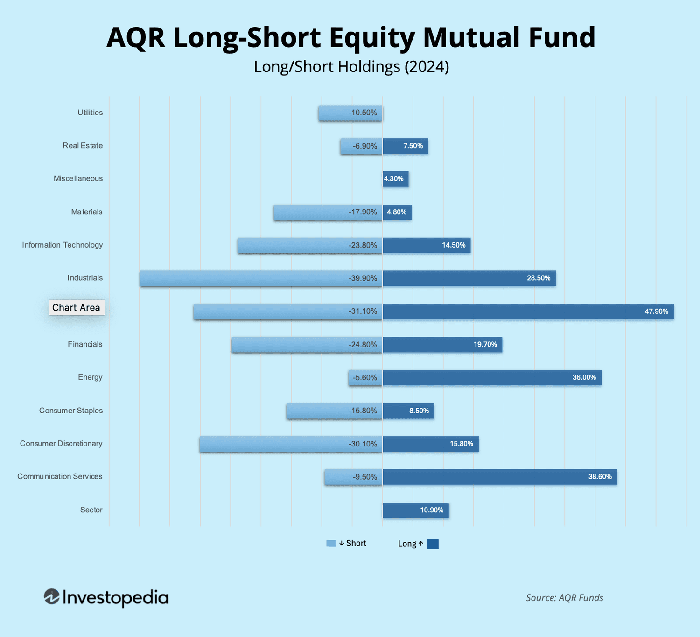

## Table of Contents

## What is a long-short mutual fund?

A long-short mutual fund is a type of investment fund that uses a strategy to buy some stocks and sell others at the same time. When the fund buys stocks, it is called "going long." This means the fund expects these stocks to go up in value. On the other hand, when the fund sells stocks, it is called "going short." This means the fund expects these stocks to go down in value. By doing both, the fund tries to make money no matter if the stock market goes up or down.

These funds are managed by professionals who decide which stocks to buy and which to sell. The goal is to make more money from the stocks that go up than they lose from the stocks that go down. This can help protect the fund from big losses if the market goes down. However, long-short mutual funds can be riskier than regular mutual funds because they use more complex strategies. It's important for investors to understand these risks before putting their money into a long-short mutual fund.

## How does a long-short mutual fund differ from traditional mutual funds?

A long-short mutual fund and a traditional mutual fund are different in how they invest money. A traditional mutual fund mostly buys stocks or other investments and holds onto them, hoping they will increase in value over time. They aim to make money by investing in a broad range of stocks or a specific sector, and their success depends on the overall market going up.

On the other hand, a long-short mutual fund uses a more complex strategy. It not only buys stocks (going long) but also sells stocks it doesn't own (going short). The fund manager tries to make money from stocks that go up and also from stocks that go down. This means the fund can potentially make money even if the market is falling, but it also comes with more risk because of the short-selling part.

Because of these differences, long-short mutual funds can be more appealing to investors who want to protect their money from market downturns. However, they are also more complex and might be riskier than traditional mutual funds. It's important for investors to understand these differences and risks before deciding which type of fund to invest in.

## What are the basic mechanics of a long-short mutual fund?

A long-short mutual fund works by buying some stocks and selling others at the same time. When the fund buys a stock, it's called "going long." This means the fund thinks the stock will go up in price. If it does, the fund makes money. On the other hand, when the fund sells a stock it doesn't own, it's called "going short." This means the fund thinks the stock will go down in price. If it does, the fund can buy the stock back at a lower price and make money from the difference.

The fund manager decides which stocks to buy and which to sell. They try to make more money from the stocks that go up than they lose from the stocks that go down. This way, the fund can make money even if the stock market is going down. But, using this strategy can be riskier because short selling can lead to big losses if the stocks go up instead of down. So, the fund manager needs to be good at [picking](/wiki/asset-class-picking) the right stocks to buy and sell.

## What are the potential benefits of investing in a long-short mutual fund?

One big benefit of a long-short mutual fund is that it can make money even when the stock market goes down. This is because the fund can sell stocks short. When a stock goes down, the fund can buy it back at a lower price and make money from the difference. This can protect your investment from big losses if the market takes a turn for the worse. So, it's like having a safety net for your money during tough times.

Another advantage is that these funds can be more flexible. The fund manager can pick and choose which stocks to buy and sell based on what they think will happen in the market. This means they can try to make the most money possible by taking advantage of both rising and falling stock prices. It's like having two ways to win instead of just one, which can lead to better returns if the manager makes good choices.

## What are the risks associated with long-short mutual funds?

Long-short mutual funds can be riskier than regular mutual funds. One big risk is that when the fund sells stocks short, it can lose a lot of money if those stocks go up instead of down. When you go short, you borrow stocks and sell them, hoping to buy them back cheaper later. But if the stock price goes up, you have to buy it back at a higher price, which means you lose money. This can lead to big losses, especially if the market goes up a lot.

Another risk is that these funds use more complex strategies. Managing a long-short fund takes a lot of skill and good decision-making. If the fund manager makes bad choices about which stocks to buy and sell, the fund can lose money. This makes the fund's performance depend a lot on the manager's skills. It's not just about the market going up or down; it's also about how well the manager can predict and react to changes in the market.

Also, long-short mutual funds often cost more than regular mutual funds. They have higher fees because they need more active management. These higher costs can eat into your returns, making it harder for the fund to perform well over time. So, while a long-short fund can offer some protection against a falling market, it comes with more risks and costs that you need to think about before investing.

## How do long-short mutual funds manage market volatility?

Long-short mutual funds handle market ups and downs by using a special way of investing. They buy some stocks, thinking these will go up in price. This is called going long. At the same time, they sell other stocks they don't own, hoping these will go down in price. This is called going short. By doing both, the fund can make money even if the market goes down. If the stocks they short go down, they can buy them back cheaper and keep the difference. This helps protect the fund from big losses when the market is not doing well.

The people who run these funds, called fund managers, play a big role in dealing with market changes. They decide which stocks to buy and which to sell. If they are good at picking stocks, the fund can do well even when the market is shaky. But it's not easy, and if they make bad choices, the fund can lose money. So, the success of a long-short mutual fund depends a lot on the skills of the manager. They need to be smart about predicting what will happen in the market and making quick decisions to help the fund do well no matter what the market is doing.

## What strategies do fund managers use in long-short mutual funds?

Fund managers of long-short mutual funds use different strategies to make money. One common strategy is called "market neutral." This means they try to balance the stocks they buy with the stocks they sell short. The goal is to make the fund's performance not depend too much on whether the whole market goes up or down. They pick stocks they think will do better than others and also pick stocks they think will do worse. By doing this, they hope to make money from the difference between the winners and losers, no matter what the market does.

Another strategy is called "sector rotation." Here, the fund manager looks at different parts of the economy, like technology or healthcare, and tries to guess which ones will do well and which ones will not. They buy stocks in the sectors they think will grow and sell short stocks in the sectors they think will shrink. This way, they can try to make money by moving money around between different parts of the market.

Sometimes, fund managers use "[pair trading](/wiki/pair-trading)." This means they find two companies that are similar but one is doing better than the other. They buy the stock of the company that's doing better (going long) and sell short the stock of the company that's doing worse. If they are right, they make money from the difference between the two stocks. These strategies help fund managers try to make the most of their investments and handle the ups and downs of the market.

## How is performance measured in long-short mutual funds?

Performance in long-short mutual funds is measured by looking at how much money the fund makes or loses over time. The main way to do this is by checking the fund's total return, which includes any money made from stock prices going up or down, plus any dividends or interest earned. This total return is often shown as a percentage, so you can see how well the fund did compared to how much money was invested in it. Another important measure is the fund's risk-adjusted return, which looks at how much risk the fund took to get those returns. A common way to measure this is by using something called the Sharpe ratio, which compares the fund's returns to how much it moved up and down (its volatility).

Another way to measure performance is by comparing the long-short mutual fund to a benchmark, like a stock market index. This helps investors see if the fund did better or worse than the market as a whole. For long-short funds, a common benchmark is the risk-free rate, like the return on a U.S. Treasury bond, because these funds aim to beat this rate no matter what the market does. By looking at all these measures, investors can get a good idea of how well the fund is doing and whether it's worth putting their money into it.

## What are the tax implications of investing in long-short mutual funds?

Investing in long-short mutual funds can have different tax effects than other types of funds. When a long-short fund sells a stock it owns, it might have to pay capital gains tax if the stock went up in value. But when it sells a stock short and then buys it back cheaper, it can have a capital gain too. This means that long-short funds might have more frequent buying and selling, which can lead to more taxable events. This could mean you have to pay taxes more often than with a regular mutual fund that holds onto stocks for a longer time.

Also, the way long-short funds make money can affect how much tax you owe. If the fund makes money from dividends or interest, that income can be taxed differently than capital gains. Dividends might be taxed at a lower rate if they are qualified dividends, but interest income is usually taxed as regular income. Because long-short funds use both long and short strategies, the mix of income types can be more complex. This means it's a good idea to talk to a tax advisor to understand how investing in a long-short mutual fund might change your taxes.

## How do long-short mutual funds fit into a diversified investment portfolio?

Long-short mutual funds can be a good addition to a diversified investment portfolio because they can help protect your money when the stock market goes down. These funds buy some stocks and sell others at the same time. If the market falls, the stocks they sell short can go down in value, which means the fund can make money from those stocks. This can help balance out any losses from the stocks they bought. So, having a long-short mutual fund in your portfolio can make it less risky overall, because it can do well even when other parts of your investments are not doing so great.

Adding a long-short mutual fund to your mix of investments can also help you make more money in different market conditions. Because these funds can make money whether the market goes up or down, they can add another way to earn returns to your portfolio. But remember, long-short funds can be more complex and might cost more than regular mutual funds. So, it's important to think about how much risk you want to take and to talk to a financial advisor to see if a long-short mutual fund is right for your investment goals.

## What are some historical performance examples of long-short mutual funds?

Long-short mutual funds have had mixed results over the years. For example, during the financial crisis of 2008, some long-short funds did better than the overall stock market. The market dropped a lot, but these funds made money by selling stocks short. This helped them lose less money than many other types of funds. One famous long-short fund, managed by a well-known investor, actually made money that year, which was a big deal when so many others were losing it.

In other times, like the bull market that followed the crisis, long-short funds sometimes didn't do as well as regular mutual funds. When the market was going up a lot, the gains from the stocks they bought were good, but the money they lost from the stocks they sold short could drag down their overall performance. For instance, in the years from 2010 to 2015, many long-short funds had a hard time keeping up with the S&P 500 because the market kept going up and up. So, their performance can really depend on what the market is doing at the time.

## How can an investor evaluate and select a long-short mutual fund?

When picking a long-short mutual fund, an investor should first look at the fund's past performance. This means checking how well the fund has done over time, especially during different market conditions. You can see if the fund made money when the market went down, which is what long-short funds are good at. It's also smart to compare the fund's returns to a benchmark, like the S&P 500, to see if it did better or worse. Remember, past performance doesn't tell you what will happen in the future, but it can give you an idea of how the fund has worked before.

Next, an investor should think about the fund's fees and costs. Long-short funds often cost more than regular mutual funds because they need more active management. These higher fees can eat into your returns, so it's important to make sure the fund's performance is worth the extra cost. Also, look at the fund manager's experience and track record. A good manager can make a big difference in how well the fund does. Talking to a financial advisor can help you understand all these things and pick the right long-short mutual fund for your investment goals.

## What is the key to understanding mutual funds?

Mutual funds serve as collective investment schemes where resources from multiple investors are pooled to purchase a diversified portfolio of securities, such as stocks, bonds, and other assets. This structure allows individual investors to gain access to professional management, diversification, and economies of scale, which they might not achieve on their own. Professional fund managers oversee these funds, making investment decisions aimed at achieving specific financial objectives while carefully managing associated risks. 

Investors in mutual funds are subject to management fees, commonly known as expense ratios. These fees cover the cost of fund management and other administrative expenses and can affect overall returns. The expense ratio is calculated as follows:

$$
\text{Expense Ratio} = \frac{\text{Total Fund Costs}}{\text{Average Net Assets}}
$$

It is crucial for investors to consider expense ratios when selecting mutual funds, as higher fees can erode returns over time.

Mutual funds are categorized into various types, each catering to different investment objectives and risk appetites. Key types include:

1. **Stock Funds**: These funds invest primarily in equities. They are designed for investors seeking capital appreciation and are willing to accept higher risk for potentially higher returns. Stock funds can be further subdivided into categories based on company size, industry sectors, or geographic regions.

2. **Bond Funds**: These focus on investing in fixed-income securities like government or corporate bonds. They are generally considered lower risk compared to stock funds and provide regular income, making them suitable for conservative investors.

3. **Money Market Funds**: These invest in short-term, high-quality fixed-income securities such as Treasury bills and commercial paper. They aim to offer high liquidity with a relatively lower level of risk, making them ideal for investors seeking to preserve capital.

4. **Balanced Funds**: These funds maintain a mix of stocks, bonds, and other securities in an effort to provide a balanced blend of growth and income. They are designed to reduce the impact of major losses by diversifying their portfolios across different asset classes and often appeal to moderate-risk investors.

The diversification inherent in mutual funds mitigates specific risks by spreading investments across a large number of securities. This risk management strategy can reduce the overall [volatility](/wiki/volatility-trading-strategies) of returns, which is particularly beneficial for individual investors lacking the time or expertise to assess and balance risk on their own. By selecting mutual funds that align with their financial goals and risk tolerance, investors can potentially enhance their investment outcomes while mitigating some of the inherent risks of the financial markets.

## What are Long-Short Mutual Fund Strategies?

Long-short mutual funds are specialized investment vehicles that engage in both buying undervalued stocks (long positions) and selling short overvalued securities. This dual approach allows these funds to potentially profit from market discrepancies, whether the market is rising or falling. The core strategy centers around capturing returns from both asset price appreciation and depreciation.

The 130-30 strategy exemplifies a long-short mutual fund approach. It allows a fund to hold long positions up to 130% of the portfolio's capital, while also maintaining short positions up to 30%. This strategy is designed to enhance returns by taking advantage of profitable opportunities on both sides of the market. The theoretical structure of a 130-30 fund is such that the leverage from short positions finances the additional long positions, providing the ability to outperform traditional long-only strategies by capitalizing on market inefficiencies.

Mathematically, the portfolio can be represented as follows:

$$
\text{Net Exposure} = (\text{Long Positions} - \text{Short Positions})
$$

Where:
- Long Positions = 130% of capital
- Short Positions = 30% of capital

Thus, the net exposure is 100%, maintaining a market-neutral stance in terms of total asset allocation while seeking to optimize returns.

Managing a long-short fund requires adept analysis and management skills. Fund managers employ in-depth research, including quantitative analysis, to identify mispriced securities and execute trades effectively. This active management incurs higher fees relative to traditional mutual funds due to the complexity and frequency of trades. Active trading requires continuous monitoring of market conditions and positions, making it critically important for fund managers to stay informed and agile.

Despite the higher fees, investors may find long-short funds attractive due to their potential for reduced market risk through diversified tactics and positions. However, it is important to note that these strategies do not eliminate risk entirely. Market volatility, the cost of borrowing securities for short positions, and incorrect stock valuation predictions are some of the risks inherent in long-short investing. Successful implementation heavily relies on the skill and experience of the fund management team, as well as robust analytical tools to make informed decisions.

## References & Further Reading

Explore Investopedia and BlackRock for detailed guides on mutual funds and [algorithmic trading](/wiki/algorithmic-trading). Investopedia offers a wealth of information on various types of mutual funds, their structure, management strategies, and the role of algorithmic trading in modern finance. BlackRock, one of the world's leading investment firms, provides insights into the utilization of technology in fund management, highlighting the efficiency and precision brought by algorithmic strategies.

For those interested in academic perspectives, seminal works by Meir Statman, William Sharpe, and Martin Gruber are essential reading. Statman's research often focuses on behavioral finance and its impact on investment decision-making, providing a deeper understanding of investor behavior and market dynamics. William Sharpe, a Nobel laureate, is renowned for his development of the Capital Asset Pricing Model (CAPM) and the Sharpe Ratio, which are pivotal in assessing investment performance and risk-adjusted returns. Martin Gruber has contributed extensively to the field of mutual fund performance analysis and the evaluation of active versus passive management strategies.

These resources provide foundational and advanced knowledge, catering to both novice investors seeking to understand the basics and seasoned professionals aiming to refine their strategic approach.

