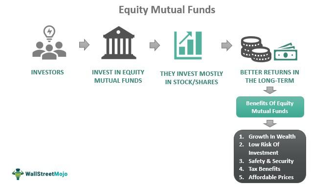

The investment landscape is evolving rapidly, characterized by the increasing prominence of mutual funds, diverse strategies, and algorithmic trading. Investment funds, particularly mutual funds, play a pivotal role by offering investors a platform to achieve diversification and benefit from professional management. These funds pool resources from numerous investors, allowing for the acquisition of a diversified portfolio of securities, thereby mitigating risk and aiming for stable returns.

Long-short mutual funds have emerged as a compelling strategy, leveraging both long and short positions to potentially enhance returns. By taking long positions in undervalued stocks while shorting overvalued ones, these funds strive to capitalize on market inefficiencies. This approach allows them to benefit from both the appreciation and depreciation of asset prices, offering a more versatile tool for portfolio management.

Algorithmic trading has introduced a new dimension to investment strategies, characterized by rapid, data-driven decision-making. This method employs complex algorithms to execute trades at lightning speeds, optimizing timing and minimizing market impact. Algorithmic trading enhances traditional mutual fund management by providing precise execution capabilities and dynamic asset allocation.

This article examines how these elements interact to form effective investment strategies. By exploring the synergy between mutual funds, diverse investment approaches, and algorithmic trading, we aim to highlight the potential benefits and challenges that modern investors face in an ever-evolving financial landscape.

## Table of Contents

## Understanding Mutual Funds

Mutual funds serve as collective investment schemes where resources from multiple investors are pooled to purchase a diversified portfolio of securities, such as stocks, bonds, and other assets. This structure allows individual investors to gain access to professional management, diversification, and economies of scale, which they might not achieve on their own. Professional fund managers oversee these funds, making investment decisions aimed at achieving specific financial objectives while carefully managing associated risks. 

Investors in mutual funds are subject to management fees, commonly known as expense ratios. These fees cover the cost of fund management and other administrative expenses and can affect overall returns. The expense ratio is calculated as follows:

$$
\text{Expense Ratio} = \frac{\text{Total Fund Costs}}{\text{Average Net Assets}}
$$

It is crucial for investors to consider expense ratios when selecting mutual funds, as higher fees can erode returns over time.

Mutual funds are categorized into various types, each catering to different investment objectives and risk appetites. Key types include:

1. **Stock Funds**: These funds invest primarily in equities. They are designed for investors seeking capital appreciation and are willing to accept higher risk for potentially higher returns. Stock funds can be further subdivided into categories based on company size, industry sectors, or geographic regions.

2. **Bond Funds**: These focus on investing in fixed-income securities like government or corporate bonds. They are generally considered lower risk compared to stock funds and provide regular income, making them suitable for conservative investors.

3. **Money Market Funds**: These invest in short-term, high-quality fixed-income securities such as Treasury bills and commercial paper. They aim to offer high liquidity with a relatively lower level of risk, making them ideal for investors seeking to preserve capital.

4. **Balanced Funds**: These funds maintain a mix of stocks, bonds, and other securities in an effort to provide a balanced blend of growth and income. They are designed to reduce the impact of major losses by diversifying their portfolios across different asset classes and often appeal to moderate-risk investors.

The diversification inherent in mutual funds mitigates specific risks by spreading investments across a large number of securities. This risk management strategy can reduce the overall [volatility](/wiki/volatility-trading-strategies) of returns, which is particularly beneficial for individual investors lacking the time or expertise to assess and balance risk on their own. By selecting mutual funds that align with their financial goals and risk tolerance, investors can potentially enhance their investment outcomes while mitigating some of the inherent risks of the financial markets.

## Investment Strategies for Mutual Funds

Investment strategies are critical in guiding how mutual funds are managed to achieve a balance between risk and return. The selection of an appropriate strategy is fundamental to aligning a fund's performance with the financial goals of its investors. A major distinction in investment strategies is between active and passive management.

Active management involves the tactical selection of assets with the objective of outperforming market indices. Fund managers employing this strategy engage in extensive research and analysis to identify undervalued securities, take advantage of market inefficiencies, and capitalize on short-term trading opportunities. The managers make frequent buying and selling decisions to optimize the portfolio based on their market predictions and analyses. This proactive approach is often associated with higher management fees due to the necessity of continuous analysis and administrative costs, known as expense ratios. The challenge with active management lies in consistently beating the market, as it requires a deep understanding of market conditions and potential factors influencing asset performance.

On the other hand, passive management seeks to replicate the performance of a specific index, such as the S&P 500, by holding a mix of securities that mirrors the index's composition. This strategy, often associated with index funds, aims to achieve returns similar to those of the underlying index, minimizing transaction costs and management expenses. Passive management advocates argue that markets are efficient and that, over the long term, passive funds often achieve competitive returns due to lower operational costs and less frequent trading.

A profound understanding of risk-return trade-offs is indispensable for investors and fund managers when crafting strategies for mutual funds. Investors must evaluate their risk tolerance and investment horizon to select a strategy that aligns with their personal financial goals. For instance, investors with a higher risk appetite and longer time frames might favor funds with more aggressive active strategies, while those with lower risk tolerance might prefer the stability of passive management.

Diversification is another essential strategy for mutual fund management. By spreading investments across various asset classes, industries, and geographic markets, mutual funds can mitigate specific risks associated with individual securities or sectors. Diversification helps reduce volatility and potential losses, contributing to a more stable return profile. For example, a diversified mutual fund might include a mix of equities, fixed income, and international stocks, thus limiting exposure to any single economic or political event.

In summary, choosing an investment strategy for mutual funds involves a careful assessment of active versus passive management approaches, a thorough understanding of risk-return dynamics, and the implementation of diversification to safeguard against specific risks. These elements work together to shape a mutual fund's performance and align it with the financial objectives of its investors.

## Long-Short Mutual Fund Strategies

Long-short mutual funds are specialized investment vehicles that engage in both buying undervalued stocks (long positions) and selling short overvalued securities. This dual approach allows these funds to potentially profit from market discrepancies, whether the market is rising or falling. The core strategy centers around capturing returns from both asset price appreciation and depreciation.

The 130-30 strategy exemplifies a long-short mutual fund approach. It allows a fund to hold long positions up to 130% of the portfolio's capital, while also maintaining short positions up to 30%. This strategy is designed to enhance returns by taking advantage of profitable opportunities on both sides of the market. The theoretical structure of a 130-30 fund is such that the leverage from short positions finances the additional long positions, providing the ability to outperform traditional long-only strategies by capitalizing on market inefficiencies.

Mathematically, the portfolio can be represented as follows:

$$
\text{Net Exposure} = (\text{Long Positions} - \text{Short Positions})
$$

Where:
- Long Positions = 130% of capital
- Short Positions = 30% of capital

Thus, the net exposure is 100%, maintaining a market-neutral stance in terms of total asset allocation while seeking to optimize returns.

Managing a long-short fund requires adept analysis and management skills. Fund managers employ in-depth research, including quantitative analysis, to identify mispriced securities and execute trades effectively. This active management incurs higher fees relative to traditional mutual funds due to the complexity and frequency of trades. Active trading requires continuous monitoring of market conditions and positions, making it critically important for fund managers to stay informed and agile.

Despite the higher fees, investors may find long-short funds attractive due to their potential for reduced market risk through diversified tactics and positions. However, it is important to note that these strategies do not eliminate risk entirely. Market volatility, the cost of borrowing securities for short positions, and incorrect stock valuation predictions are some of the risks inherent in long-short investing. Successful implementation heavily relies on the skill and experience of the fund management team, as well as robust analytical tools to make informed decisions.

## Integrating Mutual Funds with Algo Trading

Algorithmic trading employs computer algorithms to execute trades with precision, speed, and efficiency. Its integration into mutual fund management brings several advantages. By utilizing [algorithmic trading](/wiki/algorithmic-trading), mutual funds can achieve precise timing in trade execution, reducing the impact of market fluctuations. This precision allows fund managers to maximize returns by minimizing slippage and transaction costs, which are critical for maintaining portfolio profitability.

The real-time data analysis capabilities inherent in algorithmic trading systems allow mutual fund managers to swiftly respond to market shifts. Algorithms systematically analyze vast amounts of market data, identifying patterns and trends that might be imperceptible to human analysts. This enables managers to execute trades based on current market conditions rather than relying solely on historical data or human intuition. As a result, mutual funds can optimize their investment strategies to better align with evolving market conditions, thereby enhancing overall performance.

Another significant advantage is the capacity for dynamic asset allocation. Algorithmic trading systems can automatically adjust asset allocations in response to market changes or shifts in fund strategy. This adaptability helps in maintaining an optimal diversification level in the portfolio, consequently improving risk management. By systematically reallocating assets, funds can exploit short-term inefficiencies while maintaining long-term investment goals.

The benefits of integrating algorithmic trading into mutual fund management are clear. However, it requires careful implementation. Advanced programming skills and knowledge of financial markets are essential to developing and maintaining effective algorithms. Regular [backtesting](/wiki/backtesting) of strategies is necessary to ensure their continued relevance and effectiveness. Considerations include the potential for overfitting models to historical data, which can lead to suboptimal performance in live markets, and the challenge of maintaining robust and scalable technological infrastructure.

Incorporating algorithmic trading into mutual funds can lead to increased efficiency, adaptability, and performance. Funds can achieve superior execution, informed by real-time data-driven insights, thereby positioning themselves competitively in the fast-paced financial markets.

## Challenges and Considerations

Algorithmic trading, while transformative, is not without its challenges and considerations. One of the primary concerns is technological dependency, which can lead to risks such as system failures. These failures can be due to hardware malfunctions, software bugs, or network issues, resulting in significant financial losses if not promptly addressed. Thus, maintaining robust IT infrastructure is critical to mitigate these risks.

Regulatory compliance is another crucial aspect, as algorithmic trading must conform to stringent financial laws designed to ensure market stability and integrity. Regulations may include specific trading limits, reporting requirements, and obligations to prevent market manipulation. For instance, the U.S. Securities and Exchange Commission (SEC) and the European Securities and Markets Authority (ESMA) have set guidelines for automated trading to curtail excessive market volatility and protect investors.

The effectiveness of an algorithm depends significantly on continuous backtesting and validation. Backtesting involves applying trading strategies to historical data to assess their potential profitability, while validation ensures the algorithm performs as expected in real-world scenarios. These processes help refine the algorithms, improving their predictive accuracy and reliability.

Moreover, investors must be educated about the intricacies and potential risks of algorithmic trading to set realistic expectations. Financial markets are inherently unpredictable, and even the most sophisticated algorithms can face challenges from unforeseen events or market anomalies. Understanding these dynamics enables investors to make informed decisions and manage their portfolios with a balanced perspective on risk and reward.

## Conclusion

The synergy between mutual funds and algorithmic trading presents a powerful investment model that capitalizes on the strengths of both elements. By merging the diversification and professional management of mutual funds with the speed and precision of algorithmic trading, investors can potentially achieve superior returns while managing risks more effectively. This integration enables quick adaptation to market movements, optimizing trading decisions and enhancing the overall performance of investment portfolios.

Embracing technological advancements in trading is essential for staying competitive in the rapidly changing financial market. Algorithmic trading provides mutual funds with the ability to process and analyze large datasets, offering insights that can drive informed investment decisions. The use of sophisticated algorithms for dynamic asset allocation and risk management is transforming traditional investment approaches, making them more adaptive and responsive.

Investors must prioritize ongoing education and adaptation to successfully navigate this evolving investment landscape. Understanding the complexities of both mutual funds and algorithmic trading, including their inherent risks and opportunities, is vital for setting realistic expectations and making informed investment choices. As the financial market continues to evolve, those who remain informed and adaptable are better positioned to exploit emerging opportunities and mitigate potential challenges.

## References & Further Reading

Explore Investopedia and BlackRock for detailed guides on mutual funds and algorithmic trading. Investopedia offers a wealth of information on various types of mutual funds, their structure, management strategies, and the role of algorithmic trading in modern finance. BlackRock, one of the world's leading investment firms, provides insights into the utilization of technology in fund management, highlighting the efficiency and precision brought by algorithmic strategies.

For those interested in academic perspectives, seminal works by Meir Statman, William Sharpe, and Martin Gruber are essential reading. Statman's research often focuses on behavioral finance and its impact on investment decision-making, providing a deeper understanding of investor behavior and market dynamics. William Sharpe, a Nobel laureate, is renowned for his development of the Capital Asset Pricing Model (CAPM) and the Sharpe Ratio, which are pivotal in assessing investment performance and risk-adjusted returns. Martin Gruber has contributed extensively to the field of mutual fund performance analysis and the evaluation of active versus passive management strategies.

These resources provide foundational and advanced knowledge, catering to both novice investors seeking to understand the basics and seasoned professionals aiming to refine their strategic approach.

