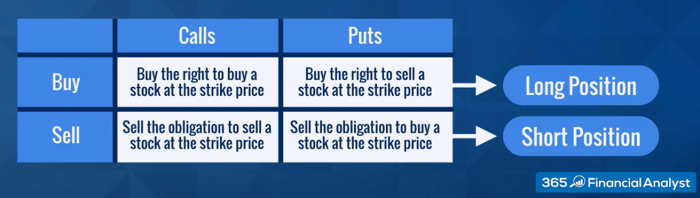

## Table of Contents

## What is a long position in derivatives?

A long position in derivatives means you are buying a contract that gives you the right or obligation to buy an asset at a set price in the future. It's like betting that the price of the asset will go up. For example, if you think the price of gold will increase, you might buy a futures contract for gold. If the price does go up, you can buy the gold at the lower price you agreed on and then sell it at the higher market price, making a profit.

However, there's a risk involved. If the price of the asset goes down instead, you could lose money. In the gold example, if the price drops, you would still have to buy the gold at the higher price you agreed on, but you would have to sell it at the lower market price, resulting in a loss. So, taking a long position means you are optimistic about the future price of the asset, but you need to be prepared for the possibility that you might be wrong.

## What is a short position in derivatives?

A short position in derivatives means you are selling a contract that gives you the right or obligation to sell an asset at a set price in the future. It's like betting that the price of the asset will go down. For example, if you think the price of oil will decrease, you might sell a futures contract for oil. If the price does go down, you can buy the oil at the lower market price and then sell it at the higher price you agreed on, making a profit.

However, there's a risk involved. If the price of the asset goes up instead, you could lose money. In the oil example, if the price rises, you would have to buy the oil at the higher market price, but you would still have to sell it at the lower price you agreed on, resulting in a loss. So, taking a short position means you are pessimistic about the future price of the asset, but you need to be prepared for the possibility that you might be wrong.

## How do you initiate a long position in a futures contract?

To start a long position in a futures contract, you first need to find a futures exchange where the contract you want is traded. This could be a place like the Chicago Mercantile Exchange (CME) or the New York Mercantile Exchange (NYMEX). Once you've chosen your exchange, you'll need to open an account with a broker who can help you trade futures. After setting up your account, you'll need to deposit some money as a margin, which is like a down payment to cover potential losses.

Next, you'll choose the specific futures contract you want to buy. For example, if you think the price of corn will go up, you might choose a corn futures contract. You'll need to decide on the contract's expiration date and the quantity you want to buy. Once you've made these choices, you can place your order through your broker. If the price of corn goes up before the contract expires, you can sell the contract at a higher price than you bought it for, making a profit. But if the price goes down, you could lose money.

## How do you initiate a short position in an options contract?

To start a short position in an options contract, you first need to find an options exchange where the contract you want is traded. This could be a place like the Chicago Board Options Exchange (CBOE). You'll need to open an account with a broker who can help you trade options. After setting up your account, you'll need to deposit some money as a margin, which is like a down payment to cover potential losses.

Next, you'll choose the specific options contract you want to sell. For example, if you think the price of a stock will go down, you might choose a put option on that stock. You'll need to decide on the contract's expiration date and the strike price, which is the price at which the option can be exercised. Once you've made these choices, you can place your order through your broker. If the price of the stock goes down before the contract expires, you can buy back the option at a lower price than you sold it for, making a profit. But if the price goes up, you could lose money.

## What are the risks associated with holding a long position?

When you hold a long position, you're betting that the price of something will go up. If it does, you can make money by selling it at a higher price than you bought it for. But there's a big risk: if the price goes down instead, you could lose money. The more the price drops, the more you could lose. So, the main risk is that you might be wrong about the price going up.

Another risk is that you might have to wait a long time for the price to go up. If you need your money back sooner, you might have to sell at a loss. Also, holding a long position can tie up your money, so you can't use it for other investments. This is called opportunity cost. If the price doesn't go up as quickly as you hoped, you could miss out on other good investment opportunities.

## What are the risks associated with holding a short position?

When you hold a short position, you're betting that the price of something will go down. If the price does drop, you can buy it back at a lower price than you sold it for and make a profit. But if the price goes up instead, you could lose a lot of money. The more the price rises, the more you could lose. This is the main risk: you might be wrong about the price going down, and the potential losses can be much bigger than with a long position.

Another risk is that there's no limit to how high the price can go. With a long position, the most you can lose is what you paid for it. But with a short position, there's no cap on your potential losses. Also, you might have to wait a long time for the price to go down. If you need your money back sooner, you might have to buy back at a higher price and take a loss. Holding a short position can also tie up your money, so you can't use it for other investments. This is called opportunity cost. If the price doesn't go down as quickly as you hoped, you could miss out on other good investment opportunities.

## How does leverage affect long and short positions in derivatives?

Leverage in derivatives can make both long and short positions more exciting but also more risky. When you use leverage, you're borrowing money to make a bigger bet. For a long position, this means you can control a lot more of the asset than you could with just your own money. If the price goes up, you can make a lot more money because you're betting on a bigger amount. But if the price goes down, you can lose a lot more money too. It's like using a magnifying glass: it makes everything bigger, both the wins and the losses.

For a short position, leverage works the same way but in reverse. You're betting that the price will go down, and with leverage, you can bet on a bigger amount than you could with just your own money. If the price does go down, you can make a lot more money. But if the price goes up, your losses can be huge. Leverage makes the game more intense, so you need to be really careful and understand the risks. It's like riding a bike with no brakes: it can be fun and fast, but if you're not careful, you could crash hard.

## What strategies can be used to manage risk in long and short positions?

To manage risk in long positions, you can use stop-loss orders. This means you set a price at which you'll sell if the price starts to drop too much. It's like having a safety net that stops you from losing too much money. You can also diversify your investments, which means not putting all your money into one thing. If one investment goes down, the others might go up and balance it out. Another way is to do your homework and understand the market well. The more you know, the better you can guess if the price will go up or down.

For short positions, managing risk is a bit trickier because the potential losses can be bigger. You can still use stop-loss orders, but you set them to buy back if the price starts to go up too much. This can limit your losses if the price goes the wrong way. It's also important to keep an eye on the market all the time because things can change quickly. And just like with long positions, diversifying your investments can help. If one bet goes wrong, the others might help you out. The key is to be careful and not bet more than you can afford to lose.

In both long and short positions, using leverage can make things more exciting but also more dangerous. If you use leverage, be extra careful and maybe use less of it. It's like using a magnifying glass: it can make your wins bigger, but it can also make your losses bigger. So, always think about how much risk you're comfortable with and adjust your strategies to match.

## How do market conditions influence the decision to take a long or short position?

Market conditions play a big role in deciding whether to take a long or short position. If you think the market is going to go up, like when the economy is doing well and people are buying more stuff, you might want to take a long position. This means you're betting that prices will go up, so you buy now hoping to sell later at a higher price. For example, if you see that a company is doing really well and its stock price is going up, you might decide to buy its stock or a futures contract on it.

On the other hand, if you think the market is going to go down, like when there's bad news or the economy is slowing down, you might want to take a short position. This means you're betting that prices will go down, so you sell now hoping to buy back later at a lower price. For example, if you see that a company is having problems and its stock price is going down, you might decide to sell its stock or an options contract on it. Always remember, though, that market conditions can change quickly, so you need to keep an eye on them and be ready to change your mind if things don't go the way you thought they would.

## What are the tax implications of profits and losses from long and short positions in derivatives?

When you make money from long or short positions in derivatives, you have to pay taxes on your profits. In the United States, these profits are usually treated as capital gains. If you hold the position for less than a year, the gains are considered short-term and are taxed at your regular income tax rate, which can be pretty high. But if you hold the position for more than a year, the gains are considered long-term and are taxed at a lower rate, which can save you money. It's important to keep track of when you buy and sell so you know which tax rate applies to your profits.

If you lose money on your long or short positions, you can use those losses to reduce your taxes. You can subtract your losses from your gains to lower your taxable income. If your losses are more than your gains, you can use up to $3,000 of those extra losses to reduce your other income, like your salary. If you still have more losses after that, you can [carry](/wiki/carry-trading) them over to future years to keep lowering your taxes. Always remember to keep good records of all your trades so you can report your profits and losses correctly on your tax return.

## How can advanced traders use combinations of long and short positions to create complex trading strategies?

Advanced traders often use combinations of long and short positions to create complex trading strategies that can help them make money in different market conditions. One common strategy is called a "straddle," where a trader buys both a call option and a put option on the same asset with the same expiration date and strike price. This means they're betting that the price will move a lot in either direction. If the price goes up a lot, the call option will make money; if it goes down a lot, the put option will make money. This can be a good way to make money when you think the market will be really volatile but you're not sure which way it will go.

Another strategy is called a "spread," where a trader takes both a long and a short position on the same asset but with different expiration dates or strike prices. For example, a trader might buy a call option with a lower strike price and sell a call option with a higher strike price. This is called a "bull call spread" and it's a way to bet that the price will go up but not too much. By combining long and short positions like this, traders can create strategies that fit their view of the market and manage their risk better. It's like mixing and matching different pieces to build a puzzle that works for them.

## What are the regulatory considerations for traders engaging in long and short positions in derivatives markets?

When traders engage in long and short positions in derivatives markets, they need to follow rules set by regulators to make sure everything is fair and safe. In the United States, the main regulators are the Commodity Futures Trading Commission (CFTC) for futures and the Securities and Exchange Commission (SEC) for options. These regulators make sure that traders report their positions correctly, don't manipulate the market, and have enough money to cover their bets. They also check that brokers and exchanges follow the rules and treat everyone fairly.

Another important thing to know is that different countries have different rules. For example, some countries have strict rules about short selling, which means selling something you don't own hoping to buy it back cheaper later. Traders need to understand these rules and make sure they follow them, or they could get into trouble. It's a good idea for traders to keep up with changes in regulations and maybe even talk to a lawyer to make sure they're doing everything right.

## References & Further Reading

Bergstra, J., Bardenet, R., Bengio, Y., & Kégl, B. (2011). 'Algorithms for Hyper-Parameter Optimization.' Advances in Neural Information Processing Systems 24. This paper introduces methodologies for optimizing hyper-parameters, which are crucial for refining [algorithmic trading](/wiki/algorithmic-trading) models to enhance their predictive capabilities and efficiency.

Lopez de Prado, M. (2018). 'Advances in Financial Machine Learning.' This book presents cutting-edge techniques in [machine learning](/wiki/machine-learning) that can be applied to solve complex problems in financial markets, including the development of robust algorithmic trading strategies that leverage long and short positions for optimized returns.

Aronson, D. R. (2007). 'Evidence-Based Technical Analysis: Applying the Scientific Method and Statistical Inference to Trading Signals.' Aronson emphasizes the importance of rigorous statistical methods to evaluate trading signals, encouraging a scientific approach to determine the efficacy of long and short strategies within algorithmic systems.

Jansen, S. (2020). 'Machine Learning for Algorithmic Trading.' This resource explores the implementation of machine learning techniques in algorithmic trading, focusing on practical applications and case studies that demonstrate the use of data-driven approaches to enhance trading performance.

Chan, E. P. (2008). 'Quantitative Trading: How to Build Your Own Algorithmic Trading Business.' Chan provides a comprehensive guide to the establishment of an algorithmic trading business, covering essential concepts like risk management, trading psychology, and the integration of long and short positions into comprehensive trading strategies.

