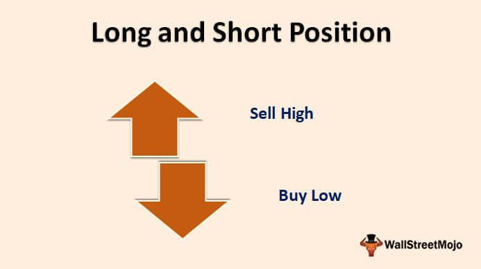

In finance, understanding foundational concepts like long and short positions is crucial for traders and investors. Long positions involve purchasing assets with the expectation of future appreciation, while short positions anticipate declines in asset value, allowing for profit through selling high and buying back at lower prices. These strategies serve as essential building blocks in the financial toolkit, enabling participants to leverage market movements effectively.

This article explores the definitions, roles, and strategies connected to long and short positions in derivatives, highlighting their significance in the trading ecosystem. Derivatives, which derive value from underlying assets, offer a versatile platform for employing long and short positions, accommodating a wide range of financial objectives and risk tolerances.



Additionally, we examine the impact of algorithmic trading, a transformative force enhancing trading precision and efficiency. Algorithmic trading utilizes technology to execute trades based on predefined criteria, processing vast quantities of data at unprecedented speeds and volume. This technological advancement mitigates emotional biases and ensures a systematic approach to trading long and short positions in volatile markets.

Understanding these aspects is essential for traders focused on constructing and refining their market strategies. By integrating long and short positions with algorithmic trading, financial practitioners can optimize their engagements in financial markets, balancing risk and return dynamics effectively. This exploration will uncover the core principles and practical applications that make long and short positions, alongside algorithmic trading, indispensable tools in contemporary finance.

## Table of Contents

## Understanding Long and Short Positions

A long position involves purchasing an asset with the expectation that its value will appreciate over time, allowing for a profitable sale. This strategy is typically employed in bullish market conditions, where investors believe prices will rise. For example, if an investor buys shares of a company at $50 per share, anticipating the price will rise to $70, they stand to gain a profit of $20 per share upon sale, excluding transaction costs and related fees.

Conversely, a short position is taken with the anticipation that an asset's value will decline, allowing the investor to profit by selling high and repurchasing lower. Here, an investor borrows shares and sells them at the current price, hoping to buy them back later at a reduced price. For instance, consider an investor who shorts a stock at $100 per share. If the stock price falls to $80, they can repurchase the shares at this lower price, secure a $20 profit per share, and return the borrowed shares.

Both strategies require a comprehensive understanding of market trends, technical analysis, and the potential risks involved. Engaging in either a long or short position involves predicting asset price movements, a task that demands careful analysis of market signals and economic indicators. 

Investors often balance long and short positions to diversify portfolios and mitigate risks associated with market movements. This balanced approach, known as a market-neutral strategy, aims to capitalize on both upward and downward price changes, reducing the [volatility](/wiki/volatility-trading-strategies) impact on the portfolio. By maintaining a balance, an investor can potentially offset a loss in one position with gains in another.

Technical and fundamental analyses play significant roles in informing these investment strategies. Technical analysis involves studying price charts, patterns, and trading volumes to forecast future price movements. Techniques like moving averages, trend lines, and [momentum](/wiki/momentum) indicators are often employed. Fundamental analysis, on the other hand, assesses a company's financial health, examining earnings reports, industry conditions, and overall economic factors to evaluate an asset’s intrinsic value.

In practice, investors may use a combination of both analyses to fine-tune their long and short positions. By doing so, they can develop a more robust framework for making informed investment decisions. The strategic deployment of long and short positions, supported by technical and fundamental analyses, plays a crucial role in navigating financial markets and optimizing portfolio performance.

## The Role of Algorithmic Trading

Algorithmic trading refers to the automated execution of trades based on a predefined set of instructions or rules, optimizing the implementation of long and short positions. By leveraging computational technology, [algorithmic trading](/wiki/algorithmic-trading) systems are capable of processing vast quantities of market data at speeds unattainable by human traders, thus enhancing the precision and efficiency of executing trading strategies.

One of the principal efficiencies provided by algorithmic trading lies in its capacity to mitigate emotional biases that can affect human decision-making, particularly in volatile markets. The automation ensures that trading decisions are executed consistently according to the defined parameters, reducing the likelihood of human error and emotional reactions influencing trades.

The technological infrastructure supporting algorithmic trading allows for the rapid analysis and execution of trades, utilizing sophisticated algorithms that assess market conditions, identify trading opportunities, and act on these opportunities at optimal speeds. This advantage is particularly evident in high-frequency trading ([HFT](/wiki/high-frequency-trading-strategies)) contexts where algorithms are designed to operate within microseconds, facilitating trades at volumes and speeds beyond human capability.

Despite these benefits, the use of algorithmic trading is not without its drawbacks. One of the primary concerns is the potential for increased market volatility. Rapid and large-scale trades executed by algorithms can lead to significant and abrupt price movements. Moreover, systemic risks can arise if multiple algorithms respond similarly to market events, leading to simultaneous sell-offs or acquisitions that exacerbate market instability.

To ensure the effectiveness of algorithmic trading systems amidst evolving market conditions, continuous [backtesting](/wiki/backtesting) and model updates are crucial. Backtesting involves simulating the algorithm's performance using historical data to ensure reliability and accuracy before implementation. Continuous updates are necessary to adapt to new market information and technological advancements, maintaining the relevance and competitiveness of the trading strategies.

In addition, the design of algorithmic trading systems often incorporates [machine learning](/wiki/machine-learning) techniques to enhance adaptability and predictive power. These systems can learn from new data, refining their predictive models and improving the accuracy of trade execution over time. As financial markets continue to evolve, the integration of advanced algorithms and [artificial intelligence](/wiki/ai-artificial-intelligence) presents opportunities for more sophisticated and responsive trading strategies. 

However, care must be taken to balance the sophistication of algorithmic models with transparency and oversight, ensuring that their operations do not inadvertently contribute to systemic financial risks or undermine market integrity. In conclusion, while algorithmic trading continues to revolutionize the financial trading landscape, its application requires careful management to harness its full potential while mitigating associated risks.

## Developing a Financial Strategy Using Long and Short Positions

Successful financial strategies that incorporate long and short positions require a nuanced understanding of several core principles, including market conditions, asset diversification, and personal risk tolerance. The ability to flexibly employ these positions allows investors to react effectively to changing financial environments and optimize their portfolios for desired outcomes.

**Market Conditions**

The choice between initiating a long or short position is often guided by prevailing market conditions. Technical indicators like moving averages and the Relative Strength Index (RSI) provide valuable insights into market trends. For instance, if an asset's price is consistently above a moving average, this may suggest a bullish trend, potentially favoring long positions. Conversely, an RSI above 70 may indicate an overbought condition, suggesting an impending price drop and thus favoring short positions. Understanding these indicators enables investors to make informed decisions that align with the directional movement of the market.

**Asset Diversification**

Diversification across asset classes is a key [factor](/wiki/factor-investing) in stabilizing returns. By spreading investments across various types of assets, investors can offset potential losses in one area with gains in another, thereby reducing overall portfolio risk. This approach not only aids in preserving capital during volatile periods but also in maximizing returns over time. For example, an investor might hold long positions in tech stocks balanced by short positions in sectors perceived to be overvalued, such as real estate.

**Personal Risk Tolerance**

Aligning financial strategies with personal risk tolerance is essential for successful investing. Investors should carefully assess their willingness and capacity to endure potential losses. This assessment informs the proportion of resources allocated to long versus short positions. A risk-averse investor may prefer a conservative strategy with fewer short positions, while a more risk-tolerant individual might pursue aggressive shorting opportunities, seeking to capitalize on potential downturns.

**Integration of Algorithmic Trading**

Implementing algorithmic trading can significantly enhance the execution of long and short strategies by providing precise entry and [exit](/wiki/exit-strategy) points based on quantitative signals. Algorithmic systems utilize vast datasets and advanced computational techniques to identify market inefficiencies and execute trades with precision and speed that manual methods cannot achieve. Such systems can be tailored to account for an investor’s specific risk parameters and objectives, optimizing the strategic deployment of capital.

Below is a simple example in Python illustrating how one might use moving averages to determine trading signals:

```python
import pandas as pd

def moving_average_strategy(data, short_window=40, long_window=100):
    signals = pd.DataFrame(index=data.index)
    signals['price'] = data['Close']
    signals['short_mavg'] = data['Close'].rolling(window=short_window, min_periods=1, center=False).mean()
    signals['long_mavg'] = data['Close'].rolling(window=long_window, min_periods=1, center=False).mean()

    # Create signals
    signals['signal'] = 0.0
    signals['signal'][short_window:] = np.where(signals['short_mavg'][short_window:] > signals['long_mavg'][short_window:], 1.0, 0.0)

    # Generate trading orders
    signals['positions'] = signals['signal'].diff()
    return signals

# usage with a DataFrame 'data' that includes a 'Close' column
# signals = moving_average_strategy(data)
```

This script generates trading signals based on the crossing of short and long moving averages, a common strategy for determining the point at which to take a long or short position.

Overall, developing a sound financial strategy leveraging long and short positions requires thoughtful analysis of market conditions, diversification principles appropriate to the investor's risk tolerance, and potentially, the use of algorithmic trading systems to enhance precision and execution.

## Case Studies and Examples

Real-world case studies underscore the practical application and complexities associated with using long and short positions in conjunction with algorithmic trading. In this section, we highlight key events and examples that illustrate both the potential and the challenges inherent in such strategies.

One significant example is the 2007 quant meltdown, which revealed vulnerabilities in [quantitative trading](/wiki/quantitative-trading) strategies. During this period, a number of quant funds experienced unexpected losses due to simultaneous selling pressures on similar positions. This event highlighted the risks of crowding within similar algorithmic models and underscored the importance of diversification. The quant meltdown illustrated how correlated positions could lead to systemic instability when multiple funds react to market conditions in similar ways.

Another pivotal event was the 2010 Flash Crash. Characterized by a rapid and severe drop in the securities market, this event exposed the dangers associated with high-frequency trading algorithms. A convergence of sell-side pressure and algorithmic trading that rapidly withdrew [liquidity](/wiki/liquidity-risk-premium) led to the Dow Jones Industrial Average plunging nearly 1,000 points within minutes. This crash highlighted the efficiency of algorithms in executing trades at unprecedented speeds, but also showcased the systemic risks they may pose when technical glitches or market misinterpretations occur.

Conversely, Renaissance Technologies exemplifies the potential for high returns through sophisticated algorithmic trading models. Known for its flagship Medallion Fund, Renaissance Technologies has achieved extraordinary returns by leveraging complex mathematical models and vast data inputs to inform its trading decisions. This success illustrates how advanced algorithmic strategies can effectively exploit market inefficiencies while minimizing risks through precise model calibration and diversification.

However, the failure of Long-Term Capital Management (LTCM) serves as a cautionary tale. LTCM utilized high-leverage betting on market convergence strategies, but failed to account for geopolitical and psychological factors influencing markets. The firm’s near-collapse in 1998 demonstrated the critical need for considering external factors beyond algorithmic predictions, such as risk of unprecedented market events and liquidity crises.

Algorithmic trading within the [cryptocurrency](/wiki/cryptocurrency) sector provides yet another example of these models' adaptability. The fragmented and highly volatile nature of cryptocurrency markets presents unique opportunities for algorithmic strategies, allowing traders to capitalize on price discrepancies and market inefficiencies across different exchanges and trading pairs. The profusion of algorithmic trading in this sector underscores its flexibility and applicability across diverse market landscapes and asset classes, offering profitable avenues while also demanding robust risk management frameworks.

These case studies and examples collectively illustrate the dichotomy of algorithmic trading's efficiency and risk, emphasizing the necessity for careful strategy development, consistent performance monitoring, and comprehensive risk assessment in the utilization of long and short positions within algorithmically-driven environments.

## Conclusion

Long and short positions are foundational concepts in financial markets, each providing strategic leverage to address various market conditions. Long positions allow investors to benefit from asset appreciation, while short positions enable profit from declining asset prices. The integration of algorithmic trading into these strategies offers precise execution, mitigating emotional biases often exhibited by human traders. With algorithms handling trading parameters at high speeds, traders can optimize their market positions effectively.

Technological integration in trading strategies enhances responsiveness in complex markets, helping investors capitalize on rapid changes and emerging opportunities. The automation provided by algorithms not only refines entry and exit points but also allows for continuous adaptation to evolving market dynamics without the delays inherent in manual trading.

For investors and traders, staying informed about market trends and technological advancements is critical. Continuous learning and adaptation ensure that strategies remain effective and competitive. Resources such as 'Advances in Financial Machine Learning' by Marcos Lopez de Prado and 'Evidence-Based Technical Analysis' by David Aronson are valuable for developing data-driven and statistically robust trading strategies.

In conclusion, this article provides a framework aiding investors in the construction of informed trading strategies, leveraging long and short positions and algorithmic trading. This approach enhances the ability to seize market opportunities, paving the way for sustained success in the financial arena.

## References & Further Reading

Bergstra, J., Bardenet, R., Bengio, Y., & Kégl, B. (2011). 'Algorithms for Hyper-Parameter Optimization.' Advances in Neural Information Processing Systems 24. This paper introduces methodologies for optimizing hyper-parameters, which are crucial for refining algorithmic trading models to enhance their predictive capabilities and efficiency.

Lopez de Prado, M. (2018). 'Advances in Financial Machine Learning.' This book presents cutting-edge techniques in machine learning that can be applied to solve complex problems in financial markets, including the development of robust algorithmic trading strategies that leverage long and short positions for optimized returns.

Aronson, D. R. (2007). 'Evidence-Based Technical Analysis: Applying the Scientific Method and Statistical Inference to Trading Signals.' Aronson emphasizes the importance of rigorous statistical methods to evaluate trading signals, encouraging a scientific approach to determine the efficacy of long and short strategies within algorithmic systems.

Jansen, S. (2020). 'Machine Learning for Algorithmic Trading.' This resource explores the implementation of machine learning techniques in algorithmic trading, focusing on practical applications and case studies that demonstrate the use of data-driven approaches to enhance trading performance.

Chan, E. P. (2008). 'Quantitative Trading: How to Build Your Own Algorithmic Trading Business.' Chan provides a comprehensive guide to the establishment of an algorithmic trading business, covering essential concepts like risk management, trading psychology, and the integration of long and short positions into comprehensive trading strategies.

