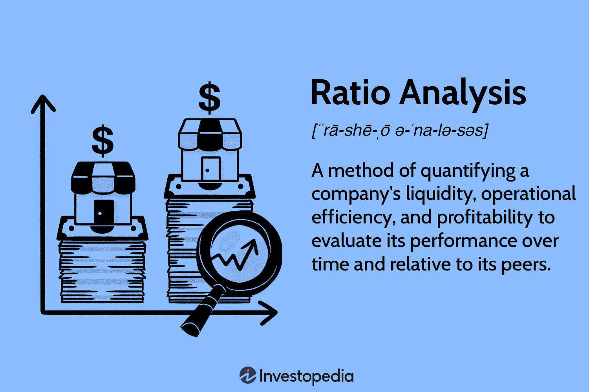

In the ever-evolving world of finance, adopting and adapting investment strategies is crucial. A sophisticated strategy, the long-short ratio in the context of algorithmic trading, offers a dynamic approach to contemporary investment challenges. Algorithmic trading has traditionally been associated with short-term gains. However, it can also be effectively employed for long-term investment strategies. This approach utilizes computer algorithms to execute trades based on various signals and criteria, providing a systematic and disciplined means to navigate the financial markets.

The core of algorithmic trading is its reliance on high-frequency technology and pre-set rules, which facilitate quick and precise trade execution. This technology-driven methodology can identify opportunities and execute trades far faster than manual trading, capitalizing on even minute market fluctuations. By programming algorithms to follow specific patterns or signals, traders aim for consistent returns while mitigating emotional biases and human error.



The long-short strategy is particularly intriguing. It involves taking long positions in undervalued stocks while simultaneously shorting overvalued stocks. This dual approach allows investors to balance risk and potential returns across various market conditions. By betting on both sides of the market, practitioners of the long-short strategy can hedge their bets, creating a cushion against potential losses from unfavorable price movements in a single direction.

This article will explore the mechanics of the long-short strategy, its application within algorithmic trading, and comparisons with other investment strategies. We will delve into the intricacies of algorithm-driven decision-making, which promises enhanced precision, speed, and scalability in the financial markets. Technologies like machine learning and big data analytics are increasingly integral to refining these strategies, pushing the boundaries of what algorithmic trading can achieve. Understanding the long-short strategy's potential benefits and risks is key to optimizing its application within a broader investment framework.

## Table of Contents

## Understanding the Long-Short Ratio

The long-short ratio is a pivotal metric in understanding market dynamics and investor sentiment. It quantifies the relationship between the volume of a security held long versus the volume sold short. Specifically, it provides insights into how much of the security is available for short selling as opposed to how much is actively being shorted by market participants.

A heightened long-short ratio typically signals bullish sentiment. This scenario arises when the amount of securities held long considerably outpaces those being shorted, indicating that investors are predominantly optimistic about the security's future price movements. They anticipate its value will rise, thus favoring long positions.

Conversely, a diminished long-short ratio suggests bearish sentiment, where the prominence of short positions highlights investor skepticism regarding the security's potential to appreciate in value. Here, more securities are shorted relative to those held long, reflecting a prediction of price decline.

Several factors influence the long-short ratio. Primarily, it is affected by the demand for securities to be borrowed for short selling. A high demand could potentially elevate the costs or restrict accessibility of the security for shorting. Additionally, the overall supply of the security available for lending is a significant determinant. If the supply is limited, it could tilt the ratio by constricting the [volume](/wiki/volume-trading-strategy) of short positions open to investors.

Understanding the long-short ratio is crucial for traders and analysts aiming to make well-informed decisions. By assessing this ratio, they can identify and exploit market imbalances and gauge investor emotions and crowd behavior, which often drive market movements and reflect underlying market sentiment trends.

## Algorithmic Trading and Long-Short Strategy

Algorithmic trading has significantly enhanced the capability to execute long-short strategies with efficiency and precision. These strategies utilize advanced computer algorithms to scrutinize large volumes of data, identifying market opportunities that are often imperceptible to human traders. The primary goal of a long-short strategy in [algorithmic trading](/wiki/algorithmic-trading) is to exploit market inefficiencies by taking advantage of price discrepancies. This is achieved by taking long positions in stocks projected to appreciate and short positions in those expected to decline.

Implementing a long-short strategy through algorithmic means involves various methodologies, each catering to different market conditions and investor preferences. Some of the prominent approaches include:

1. **Mean Reversion**: This approach is grounded in the statistical notion that asset prices and returns eventually revert to their long-term mean or average level. In a market context, mean reversion strategy anticipates that assets which have diverged from their historical average will eventually return to it. Traders can capitalize on this by shorting assets significantly above their mean and taking long positions on those significantly below. Formally, this can be described by the equation:
$$
   \text{Z-Score} = \frac{(P_t - \mu)}{\sigma}

$$

   where $P_t$ is the current price of the asset, $\mu$ is the mean price, and $\sigma$ is the standard deviation. A high Z-Score might trigger a short position, whereas a low one might trigger a long position.

2. **Momentum Investing**: Contrary to mean reversion, momentum strategies focus on securities that are trending strongly in one direction. The underlying belief is that these securities will continue their trajectory for some time due to prevailing market sentiment. The strategy is executed by holding long positions in upward-trending stocks and shorting those on a downward trend. Momentum can be quantitatively captured by indicators like the Relative Strength Index (RSI) or rate of change (ROC).

3. **Machine Learning-Based Techniques**: With the advent of machine learning, algorithmic trading has evolved to include models that learn from historical data, making predictions about future price movements. These models, such as random forests or deep neural networks, use feature selection and training data to forecast price trends and asset volatility, thereby optimizing the decision-making process in real-time.

The power of algorithmic trading lies in automation, enabling rapid execution and precise portfolio management. Algorithms can process vast amounts of market data simultaneously, providing an edge in execution speed and accuracy over traditional manual trading. Additionally, algorithms facilitate extensive [backtesting](/wiki/backtesting), where strategies are tested against historical data to determine potential performance across different market scenarios. This rigorous testing process helps in refining strategies, reducing exposure to unexpected risks, and improving overall return potential.

Algorithmic trading's synergy of speed, computational power, and sophisticated analytical capability makes it a potent tool for executing long-short strategies, enhancing adaptability to market dynamics and empowering traders to make data-driven decisions efficiently.

## Comparisons with Other Strategies

The long-short strategy distinguishes itself from traditional long-only investment strategies by mitigating reliance on the overall market's direction. By taking both long positions on undervalued stocks and short positions on overvalued ones, investors can hedge against market downturns, thus enhancing risk management. This dual mechanism significantly reduces the vulnerability associated with market [volatility](/wiki/volatility-trading-strategies), providing a more balanced approach to navigating fluctuating financial conditions.

In comparison to market-neutral strategies, which strive to achieve zero net market exposure, long-short strategies offer the potential for higher returns. This is achieved by dynamically adjusting the proportion of long and short positions in response to shifting market outlooks. While market-neutral approaches seek to eliminate beta exposure to capitalize on alpha generation exclusively, long-short strategies embrace both alpha and beta opportunities, thereby enabling more flexible tactical positioning to exploit anticipated market trends.

Unlike value investing, which often concentrates on undervalued assets with the expectation of future appreciation, long-short strategies capitalize on insights from both undervalued and overvalued securities. By simultaneously holding long and short positions, investors can potentially realize profits more rapidly and maintain a balanced risk profile. This approach enables investors to profit from mispricings on either side of the valuation spectrum, providing a broader set of opportunities compared to a purely value-driven methodology.

The versatility of the long-short strategy makes it particularly appealing across various market environments. By blending active investment strategies with the protective elements of hedging, it allows investors to adapt to complex and unpredictable markets. The ability to tailor the balance of long and short allocations empowers investors to optimize returns, regardless of prevailing market conditions, thereby offering a robust framework for both capital preservation and growth.

## Challenges and Risk Management

Executing a successful long-short strategy in algorithmic trading encompasses several challenges that require meticulous risk management. One of the primary concerns is transaction costs. These costs, which include brokerage fees, taxes, and the bid-ask spread, can significantly erode profits, especially in high-frequency trading environments. To manage these, traders can employ techniques such as order slicing to minimize market impact and smart order routing to find the best prices across different trading venues.

Slippage is another critical challenge. It occurs when the actual execution price of a trade deviates from its intended price, often due to market volatility. To reduce slippage, traders might utilize limit orders instead of market orders, although this can introduce the risk of non-execution. Additionally, employing algorithms that adapt to current market [liquidity](/wiki/liquidity-risk-premium) conditions can aid in minimizing slippage.

Market fluctuations can be unpredictable, presenting further risks to a long-short strategy. Robust risk management practices are essential to mitigate these risks. Advanced order types, including stop orders and conditional orders, can help manage positions dynamically. For instance, a stop-loss order can automatically sell a security when its price falls to a certain level, thereby limiting potential losses.

Maintaining regular portfolio rebalancing ensures that the risk profile and strategy objectives remain consistent, especially as market conditions change. This involves adjusting the weights of the assets in the portfolio to align with the desired exposure, often driven by predefined criteria.

Continuous strategy evaluation and adaptation are paramount. Backtesting with historical data is indispensable for validating the efficacy of a strategy under different market scenarios. The process typically involves refining models based on historical performance metrics and incorporating changes to improve predictive accuracy.

Leveraging technology is crucial for enhancing decision-making in algorithmic trading. Machine learning algorithms, for instance, can identify patterns in complex datasets, providing insights that traditional models may overlook. These technologies enable traders to make data-driven decisions, optimize execution strategies, and react swiftly to market changes.

Here is a simple example of calculating a moving average in Python, which can be a component of such strategies:

```python
import numpy as np

def moving_average(prices, window_size):
    return np.convolve(prices, np.ones(window_size)/window_size, mode='valid')

prices = [120, 125, 130, 127, 132, 136, 138, 142, 140]
window_size = 3
ma = moving_average(prices, window_size)
print(ma)
```

In summary, a successful long-short algorithmic trading strategy requires balancing risk and maximizing returns. This involves proactive adjustments, employing technological advancements, and integrating comprehensive risk management practices. Emphasizing strategy refinement and evaluation ensures maintaining a competitive edge in volatile markets.

## Conclusion

The long-short ratio, when implemented through algorithmic trading, offers a sophisticated framework for enhancing portfolio performance. By balancing market exposure and capitalizing on both upward and downward price movements, investors can manage their risks more effectively. The key to success in employing this strategy lies in a commitment to continuous research and strategy refinement. Traders need to leverage advanced technological tools and educational resources to stay effective.

Algorithmic trading's effectiveness depends on the ability to integrate complex datasets and adapt to market conditions using technology. This approach allows investors to optimize returns by making informed decisions based on comprehensive analyses of market trends and forces. The dynamic financial landscape necessitates the constant evolution of strategies and the utilization of cutting-edge technologies to maintain competitiveness.

Looking ahead, the field of investment is poised for further integration of algorithmic techniques. As data analytics and computational power continue to advance, they will drive enhanced decision-making capabilities in trading strategies. This evolution will enable investors to navigate the ever-changing market environment more effectively, optimizing performance while adeptly managing market-related risks. Through the continuous integration of these innovative methods, investors can better align their portfolios with market movements, ensuring a strategic advantage in achieving investment objectives.

## References & Further Reading

[1]: Bergstra, J., Bardenet, R., Bengio, Y., & Kégl, B. (2011). ["Algorithms for Hyper-Parameter Optimization."](https://dl.acm.org/doi/10.5555/2986459.2986743) Advances in Neural Information Processing Systems 24.

[2]: ["Advances in Financial Machine Learning"](https://www.amazon.com/Advances-Financial-Machine-Learning-Marcos/dp/1119482089) by Marcos Lopez de Prado

[3]: ["Evidence-Based Technical Analysis: Applying the Scientific Method and Statistical Inference to Trading Signals"](https://www.amazon.com/Evidence-Based-Technical-Analysis-Scientific-Statistical/dp/0470008741) by David Aronson

[4]: ["Machine Learning for Algorithmic Trading"](https://github.com/stefan-jansen/machine-learning-for-trading) by Stefan Jansen

[5]: ["Quantitative Trading: How to Build Your Own Algorithmic Trading Business"](https://www.amazon.com/Quantitative-Trading-Build-Algorithmic-Business/dp/1119800064) by Ernest P. Chan