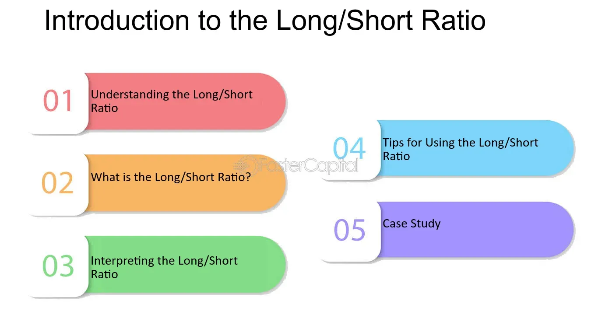

## Table of Contents

## What is the Long-Short Ratio?

The Long-Short Ratio is a measure used in finance to understand how investors are feeling about the market. It compares the number of long positions, where investors buy assets hoping their value will go up, to the number of short positions, where investors borrow assets to sell them, hoping to buy them back later at a lower price. If the ratio is high, it means more people are betting that the market will go up. If it's low, more people think the market will go down.

This ratio can help investors make decisions. For example, if the Long-Short Ratio is very high, it might mean the market is too optimistic and could be due for a fall. On the other hand, a very low ratio might suggest the market is too pessimistic and could be ready for a rise. By looking at this ratio, investors can get a sense of market sentiment and adjust their strategies accordingly.

## How is the Long-Short Ratio calculated?

The Long-Short Ratio is calculated by dividing the total value of long positions by the total value of short positions. Long positions are when investors buy assets with the expectation that their value will increase. Short positions are when investors borrow assets to sell them, hoping to buy them back at a lower price later. To find the ratio, you take all the long positions, add them up, and then divide by the total of all the short positions.

For example, if the total value of long positions in a market is $100 million and the total value of short positions is $50 million, the Long-Short Ratio would be $100 million divided by $50 million, which equals 2. This means there are twice as many long positions as short positions. This simple calculation helps investors understand the overall sentiment in the market, whether it's more optimistic with more long positions or more pessimistic with more short positions.

## Why is the Long-Short Ratio important in trading?

The Long-Short Ratio is important in trading because it shows what other investors are thinking about the market. If the ratio is high, it means more people are buying assets hoping they will go up in value. This can tell a trader that the market might be feeling good and could keep going up. But if the ratio is low, it means more people are betting the market will go down. This can warn a trader that the market might not be doing well and could go down more.

Traders use this information to make better decisions. For example, if the Long-Short Ratio is really high, a trader might think the market is too happy and could be ready for a fall. So, they might decide to sell some of their assets to be safe. On the other hand, if the ratio is very low, a trader might see it as a chance to buy assets at a lower price before the market starts to go up again. By looking at the Long-Short Ratio, traders can get a sense of what might happen next and plan their moves accordingly.

## What does a high Long-Short Ratio indicate?

A high Long-Short Ratio means more people are buying assets hoping they will go up in value than people betting they will go down. This shows that the market is feeling good and optimistic. When lots of people are buying and holding onto assets, it can push prices higher because there's more demand for those assets.

However, a very high Long-Short Ratio can also be a warning sign. It might mean the market is too happy and could be ready for a fall. If everyone thinks prices will keep going up and they're all buying, the market might be overvalued. This could lead to a drop in prices if something changes and people start selling their assets. So, traders watch the Long-Short Ratio to decide when to buy or sell.

## What does a low Long-Short Ratio suggest?

A low Long-Short Ratio means more people are betting that the market will go down than people hoping it will go up. This shows that the market is feeling worried or not so good about the future. When lots of people are selling assets or borrowing them to sell, it can push prices down because there's more supply of those assets on the market.

Even though a low Long-Short Ratio can be a sign of trouble, it can also be a chance for smart traders. If everyone is selling and the market is feeling bad, prices might be lower than they should be. So, traders might see this as a good time to buy assets at a lower price, hoping to sell them later when the market feels better and prices go up again.

## How can the Long-Short Ratio be used to assess market sentiment?

The Long-Short Ratio helps traders figure out how people feel about the market. It's like taking the temperature of the market's mood. When the ratio is high, it means more people are buying and holding onto assets, hoping they'll go up in value. This shows the market is feeling good and optimistic. Traders see a high ratio as a sign that prices might keep going up because everyone is buying.

On the other hand, when the Long-Short Ratio is low, it means more people are betting the market will go down. They're selling assets or borrowing them to sell, which can make prices drop because there's more of those assets on the market. A low ratio tells traders that the market is feeling worried or not so good. But it can also be a chance for smart traders to buy assets at a lower price, hoping to sell them later when the market feels better.

## Can the Long-Short Ratio predict market trends?

The Long-Short Ratio can give clues about where the market might be headed, but it can't predict the future for sure. When the ratio is high, it means more people are buying and holding onto assets, thinking prices will go up. This can be a sign that the market might keep going up because there's a lot of buying going on. But if the ratio is really high, it might mean the market is too happy and could be ready for a fall. So, traders watch the ratio to guess what might happen next, but it's not a perfect tool.

On the other hand, when the Long-Short Ratio is low, it means more people are betting the market will go down. They're selling or borrowing assets to sell, which can push prices down. A low ratio can be a warning that the market might keep falling, but it can also be a chance for smart traders to buy at lower prices before the market turns around. The Long-Short Ratio is just one piece of the puzzle, and traders use it along with other information to make their best guesses about future market trends.

## What are the limitations of using the Long-Short Ratio as a standalone indicator?

The Long-Short Ratio can be helpful, but it has some limits when used by itself. It shows how people feel about the market, but feelings can change fast. Just because lots of people are buying or selling now doesn't mean they'll keep doing that. Also, the ratio doesn't tell you why people are making those choices. There might be big news or events that change the market, but the ratio won't show that. So, if you only look at the Long-Short Ratio, you might miss important things happening in the market.

Another problem is that the Long-Short Ratio can be wrong sometimes. It can make the market look too good or too bad. For example, a high ratio might make you think the market will keep going up, but it could be ready to fall instead. And a low ratio might make you think the market will keep going down, but it could be ready to go up. That's why smart traders use the Long-Short Ratio along with other tools and information. They look at things like company news, economic reports, and other market indicators to get a better idea of what might happen next.

## How does the Long-Short Ratio differ across various asset classes?

The Long-Short Ratio can be different for different types of assets like stocks, bonds, and commodities. For stocks, the ratio shows how many people are buying and holding onto stocks hoping they'll go up in value compared to those who are borrowing stocks to sell them, betting the price will drop. In the stock market, a high Long-Short Ratio might mean investors are feeling good about the economy and think companies will do well. On the other hand, a low ratio might show worry about the economy or specific companies.

In the bond market, the Long-Short Ratio can tell us about how investors feel about interest rates and inflation. When people buy bonds and hold onto them, they might think interest rates will stay the same or go down. But if they're selling bonds or betting against them, they might think interest rates will go up. The ratio can be different here because bonds react to different things than stocks do.

For commodities like gold or oil, the Long-Short Ratio can show how people feel about supply and demand. A high ratio might mean investors think there will be a lot of demand for these commodities, pushing prices up. A low ratio might show they think there will be too much supply, which could make prices go down. Each asset class has its own reasons for why people buy or sell, so the Long-Short Ratio can look very different across them.

## What are some advanced strategies for incorporating the Long-Short Ratio into trading algorithms?

One advanced strategy for using the Long-Short Ratio in trading algorithms is to combine it with other market indicators. For example, you could look at the Long-Short Ratio along with moving averages or the Relative Strength Index (RSI). If the Long-Short Ratio is high and the RSI is also showing that the market is overbought, your algorithm might decide it's a good time to sell some assets. On the other hand, if the Long-Short Ratio is low and the RSI shows the market is oversold, your algorithm might see it as a good time to buy. By using the Long-Short Ratio with other indicators, your algorithm can make smarter choices based on more information.

Another strategy is to use the Long-Short Ratio to adjust your trading positions over time. If your algorithm sees the Long-Short Ratio getting higher, it might slowly increase the size of your long positions, betting that the market will keep going up. But if the ratio starts to drop, your algorithm could slowly reduce your long positions or even start taking short positions. This way, your algorithm can try to make money by following the trends shown by the Long-Short Ratio, but without making big, risky moves all at once.

## How can historical Long-Short Ratio data be used to refine trading strategies?

Looking at past Long-Short Ratio data can help traders make better plans for the future. By studying how the ratio changed before big market moves, traders can spot patterns. For example, if the ratio was really high before the market went down, traders might use that to know when to sell their assets. Or if the ratio was low before the market went up, they might see it as a good time to buy. By understanding these patterns, traders can adjust their strategies to take advantage of what might happen next.

Another way to use historical Long-Short Ratio data is to test trading ideas. Traders can use old data to see how well their strategies would have worked in the past. If a strategy made money when the Long-Short Ratio was high or low, traders might decide to use it again when they see the same conditions. This helps them feel more sure about their choices because they've seen how things worked out before. By using past data, traders can make their plans smarter and more likely to succeed.

## What are the current research findings on the effectiveness of the Long-Short Ratio in different market conditions?

Current research shows that the Long-Short Ratio can be a helpful tool, but its effectiveness changes depending on the market conditions. In strong bull markets, where prices are going up a lot, a high Long-Short Ratio often means the market will keep going up. This is because when lots of people are buying and holding onto assets, it pushes prices higher. But in these conditions, a very high ratio can also be a warning sign that the market might be ready for a fall, as it could be overvalued.

In bear markets, where prices are going down, a low Long-Short Ratio can be a good sign to buy. When many people are selling or betting against the market, it can push prices down to levels that are too low. Smart traders might see this as a chance to buy assets at a good price before the market turns around. However, research also shows that the Long-Short Ratio works best when used with other indicators, as it alone can't predict everything and market conditions can change quickly.

## What is Algorithmic Trading and how does it relate to Long-Short Strategy?

Algorithmic trading has significantly enhanced the capability to execute long-short strategies with efficiency and precision. These strategies utilize advanced computer algorithms to scrutinize large volumes of data, identifying market opportunities that are often imperceptible to human traders. The primary goal of a long-short strategy in [algorithmic trading](/wiki/algorithmic-trading) is to exploit market inefficiencies by taking advantage of price discrepancies. This is achieved by taking long positions in stocks projected to appreciate and short positions in those expected to decline.

Implementing a long-short strategy through algorithmic means involves various methodologies, each catering to different market conditions and investor preferences. Some of the prominent approaches include:

1. **Mean Reversion**: This approach is grounded in the statistical notion that asset prices and returns eventually revert to their long-term mean or average level. In a market context, mean reversion strategy anticipates that assets which have diverged from their historical average will eventually return to it. Traders can capitalize on this by shorting assets significantly above their mean and taking long positions on those significantly below. Formally, this can be described by the equation:
$$
   \text{Z-Score} = \frac{(P_t - \mu)}{\sigma}

$$

   where $P_t$ is the current price of the asset, $\mu$ is the mean price, and $\sigma$ is the standard deviation. A high Z-Score might trigger a short position, whereas a low one might trigger a long position.

2. **Momentum Investing**: Contrary to mean reversion, momentum strategies focus on securities that are trending strongly in one direction. The underlying belief is that these securities will continue their trajectory for some time due to prevailing market sentiment. The strategy is executed by holding long positions in upward-trending stocks and shorting those on a downward trend. Momentum can be quantitatively captured by indicators like the Relative Strength Index (RSI) or rate of change (ROC).

3. **Machine Learning-Based Techniques**: With the advent of machine learning, algorithmic trading has evolved to include models that learn from historical data, making predictions about future price movements. These models, such as random forests or deep neural networks, use feature selection and training data to forecast price trends and asset volatility, thereby optimizing the decision-making process in real-time.

The power of algorithmic trading lies in automation, enabling rapid execution and precise portfolio management. Algorithms can process vast amounts of market data simultaneously, providing an edge in execution speed and accuracy over traditional manual trading. Additionally, algorithms facilitate extensive [backtesting](/wiki/backtesting), where strategies are tested against historical data to determine potential performance across different market scenarios. This rigorous testing process helps in refining strategies, reducing exposure to unexpected risks, and improving overall return potential.

Algorithmic trading's synergy of speed, computational power, and sophisticated analytical capability makes it a potent tool for executing long-short strategies, enhancing adaptability to market dynamics and empowering traders to make data-driven decisions efficiently.

## References & Further Reading

[1]: Bergstra, J., Bardenet, R., Bengio, Y., & Kégl, B. (2011). ["Algorithms for Hyper-Parameter Optimization."](https://dl.acm.org/doi/10.5555/2986459.2986743) Advances in Neural Information Processing Systems 24.

[2]: ["Advances in Financial Machine Learning"](https://www.amazon.com/Advances-Financial-Machine-Learning-Marcos/dp/1119482089) by Marcos Lopez de Prado

[3]: ["Evidence-Based Technical Analysis: Applying the Scientific Method and Statistical Inference to Trading Signals"](https://www.amazon.com/Evidence-Based-Technical-Analysis-Scientific-Statistical/dp/0470008741) by David Aronson

[4]: ["Machine Learning for Algorithmic Trading"](https://github.com/stefan-jansen/machine-learning-for-trading) by Stefan Jansen

[5]: ["Quantitative Trading: How to Build Your Own Algorithmic Trading Business"](https://www.amazon.com/Quantitative-Trading-Build-Algorithmic-Business/dp/1119800064) by Ernest P. Chan