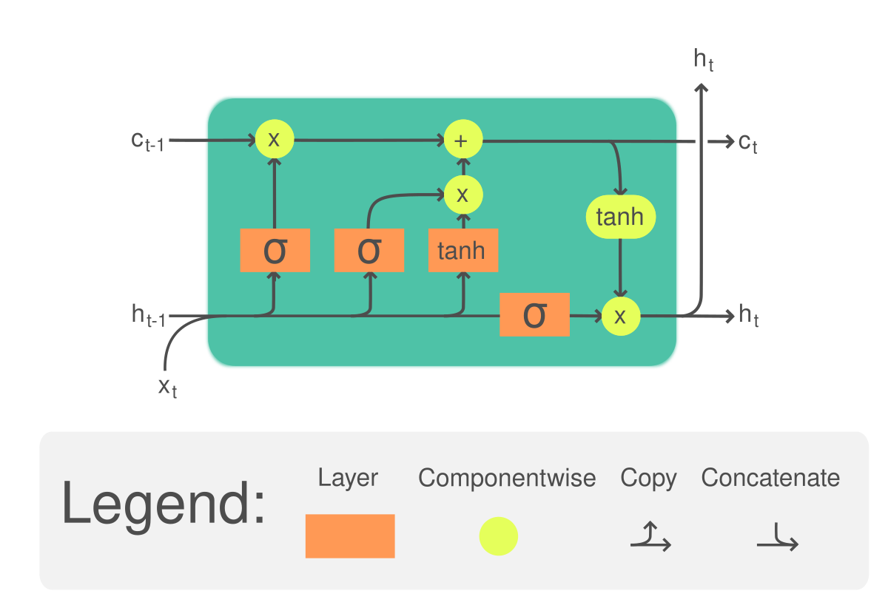

## Table of Contents

## What is Long Short-Term Memory (LSTM) in the context of machine learning?

Long Short-Term Memory (LSTM) is a type of recurrent neural network (RNN) designed to remember information for long periods of time. In simple terms, it's a way for a computer to keep track of what it has seen or heard over time, which is really useful for things like understanding language or predicting what might happen next in a sequence. LSTMs solve the problem that traditional RNNs have with remembering things over long sequences by using special units called memory cells. These cells can keep information for a long time, and they decide what to keep or forget using gates.

The way an LSTM works is by using these gates to control the flow of information. There are three main types of gates: the input gate, which decides what new information to store; the forget gate, which decides what information to throw away; and the output gate, which decides what information to output. This process is described by a set of equations, but at its core, it's about selectively remembering or forgetting things based on what's important. This makes LSTMs very good at tasks where you need to understand the context of what came before, like in speech recognition or language translation.

## How does LSTM differ from traditional Recurrent Neural Networks (RNNs)?

LSTMs are a special kind of RNN that are better at remembering things over long periods. Traditional RNNs have a hard time remembering information from many steps back because they can suffer from something called the vanishing gradient problem. This means that as the network processes more and more data, it can start to forget the earlier information. LSTMs solve this problem by using memory cells and gates. These gates help the LSTM decide what information to keep, what to forget, and what to output at each step, allowing it to maintain a memory of important information over long sequences.

In simpler terms, imagine you're trying to remember a long story. A traditional RNN might forget the beginning of the story by the time it gets to the end. But an LSTM is like having a notebook where you can jot down important parts of the story and refer back to them later. The gates in an LSTM act like a smart editor, deciding which parts of the story are worth keeping and which can be forgotten. This makes LSTMs much better at tasks like understanding language, where you need to remember earlier parts of a sentence or conversation to understand what's happening later on.

## What are the key components of an LSTM cell?

An LSTM cell has three main parts called gates: the input gate, the forget gate, and the output gate. The input gate decides what new information to add to the cell's memory. It looks at the current input and the previous hidden state, then uses this information to decide what to add. The forget gate decides what old information to keep or throw away. It looks at the same things as the input gate and decides what's no longer important. The output gate decides what information from the cell's memory should be used to create the new hidden state and output.

These gates work together to help the LSTM remember important things over long periods. The input gate might decide to add new information about a character in a story, the forget gate might decide to forget less important details, and the output gate might decide to use the information about the character to predict what happens next. This way, the LSTM can keep track of long stories or sequences without forgetting the important parts.

The way these gates work can be described with some math. For example, the forget gate's decision can be written as $$ f_t = \sigma(W_f \cdot [h_{t-1}, x_t] + b_f) $$, where $$ f_t $$ is the forget gate's output, $$ \sigma $$ is the sigmoid function, $$ W_f $$ and $$ b_f $$ are weights and biases, $$ h_{t-1} $$ is the previous hidden state, and $$ x_t $$ is the current input. This formula shows how the LSTM decides what to forget based on what it has seen before and what it is seeing now.

## Can you explain the role of the forget gate in an LSTM?

The forget gate in an LSTM is like a smart decision-maker that helps the network decide what information it should keep or forget. Imagine you're reading a long story, and you need to remember important details but also forget less important ones to make room for new information. The forget gate looks at the current input and the previous hidden state, and then decides what old information is no longer needed. This helps the LSTM focus on what's important and not get overwhelmed by too much information.

The way the forget gate works can be described with a simple formula. It uses a sigmoid function, which outputs a number between 0 and 1, to decide how much of the old information to keep. If the output is close to 0, the LSTM will forget that piece of information. If it's close to 1, it will keep it. The formula for the forget gate's decision is $$ f_t = \sigma(W_f \cdot [h_{t-1}, x_t] + b_f) $$, where $$ f_t $$ is the forget gate's output, $$ \sigma $$ is the sigmoid function, $$ W_f $$ and $$ b_f $$ are weights and biases, $$ h_{t-1} $$ is the previous hidden state, and $$ x_t $$ is the current input. This formula shows how the LSTM decides what to forget based on what it has seen before and what it is seeing now.

## How does the input gate function within an LSTM?

The input gate in an LSTM is like a gatekeeper that decides what new information should be added to the cell's memory. Imagine you're reading a story and you come across a new character or an important event. The input gate looks at the current information and the previous context to decide if this new detail is worth remembering. It does this by using a sigmoid function, which helps it decide how much of the new information to let in. If the output of the sigmoid function is close to 1, the LSTM will add more of the new information; if it's close to 0, it will add less.

The formula for the input gate's decision is $$ i_t = \sigma(W_i \cdot [h_{t-1}, x_t] + b_i) $$, where $$ i_t $$ is the input gate's output, $$ \sigma $$ is the sigmoid function, $$ W_i $$ and $$ b_i $$ are weights and biases, $$ h_{t-1} $$ is the previous hidden state, and $$ x_t $$ is the current input. This formula shows how the LSTM decides what new information to keep based on what it has seen before and what it is seeing now. By carefully choosing what to add to its memory, the input gate helps the LSTM stay focused on the most important parts of the story or sequence it's processing.

## What is the purpose of the output gate in an LSTM?

The output gate in an LSTM is like a filter that decides what information from the cell's memory should be used to create the new hidden state and output. Imagine you're telling a story and you need to decide what details to share next. The output gate looks at the current input, the previous hidden state, and the updated cell state to decide what's important to say now. It uses a sigmoid function to determine how much of the cell state should be let through.

The formula for the output gate's decision is $$ o_t = \sigma(W_o \cdot [h_{t-1}, x_t] + b_o) $$, where $$ o_t $$ is the output gate's output, $$ \sigma $$ is the sigmoid function, $$ W_o $$ and $$ b_o $$ are weights and biases, $$ h_{t-1} $$ is the previous hidden state, and $$ x_t $$ is the current input. This formula helps the LSTM decide what information to share based on what it has seen before and what it is seeing now. By carefully choosing what to output, the LSTM can provide relevant information at each step, making it very useful for tasks like language understanding or time series prediction.

## How do LSTMs handle the vanishing gradient problem?

LSTMs handle the vanishing gradient problem by using special units called memory cells and gates. The vanishing gradient problem happens when traditional RNNs struggle to remember things from many steps back because the gradients used to update the network can get very small. This makes it hard for the network to learn long-term dependencies. LSTMs solve this by allowing the gradients to flow through the memory cells, which can keep information for a long time. The gates in an LSTM decide what information to keep or forget, helping the network focus on what's important and avoid the vanishing gradient problem.

The key to this is the forget gate, which decides what old information to throw away. For example, the formula for the forget gate's decision is $$ f_t = \sigma(W_f \cdot [h_{t-1}, x_t] + b_f) $$. This formula shows how the LSTM decides what to forget based on what it has seen before and what it is seeing now. By selectively forgetting less important information, the LSTM can keep the gradients from vanishing, allowing it to learn from long sequences of data. This makes LSTMs much better at tasks like understanding language or predicting what might happen next in a time series.

## What are some common applications of LSTMs in real-world scenarios?

LSTMs are really useful in understanding and generating text. They're used in things like chatbots, where they help the bot understand what people are saying and respond in a way that makes sense. For example, if you're talking to a customer service chatbot, an LSTM can help it keep track of the conversation and remember what you've said before. This makes the conversation feel more natural. LSTMs are also used in machine translation, where they help translate text from one language to another by understanding the context of whole sentences, not just individual words.

Another common use of LSTMs is in predicting things over time, like stock prices or weather forecasts. They're good at this because they can remember patterns from the past and use them to guess what might happen next. For example, if you're trying to predict tomorrow's weather, an LSTM can look at the weather data from the last few days and make a better guess than just looking at today's weather. This makes them very helpful in fields like finance and meteorology, where understanding trends over time is important.

## How can hyperparameters like learning rate and batch size affect LSTM performance?

The learning rate is like how big of a step the LSTM takes when it's trying to learn from its mistakes. If the learning rate is too big, the LSTM might take too big of steps and miss the best solution. If it's too small, it might take too long to learn or get stuck. For example, if you're trying to teach a kid to ride a bike, a big learning rate would be like pushing them really hard, which might make them fall. A small learning rate would be like barely nudging them, so they never really learn to balance. The right learning rate helps the LSTM find the best way to remember and predict things without going too fast or too slow.

The batch size is about how many examples the LSTM looks at before it updates what it knows. If the batch size is small, the LSTM updates more often, which can help it learn faster but might make it focus too much on small details. If the batch size is big, the LSTM updates less often, which can help it see the bigger picture but might make it slower to learn. It's like studying for a test. If you study a little bit every day, you might remember more details but it takes longer. If you study a lot all at once, you might get a good overview but miss some smaller points. Finding the right batch size helps the LSTM learn well without getting overwhelmed or missing important information.

## What are some advanced techniques for optimizing LSTM models?

One advanced technique for optimizing LSTM models is using techniques like gradient clipping to help with the problem of exploding gradients. When training an LSTM, the gradients can sometimes get very big, which can make the model hard to train. Gradient clipping means setting a limit on how big the gradients can get. If a gradient gets too big, it's brought back down to the limit. This helps the LSTM learn more smoothly and avoid getting stuck. Another technique is using learning rate schedules, where the learning rate changes over time. For example, you might start with a bigger learning rate to learn quickly, then make it smaller later on to fine-tune the model. This can help the LSTM find the best solution faster and more accurately.

Another way to optimize LSTM models is by using regularization techniques like dropout. Dropout means randomly turning off some of the connections in the LSTM during training. This helps prevent the model from relying too much on any one part and makes it more general, so it works better on new data. You can also use advanced architectures like bidirectional LSTMs, which look at the data in both directions. This can help the LSTM understand the context better, especially in tasks like language understanding where what comes before and after a word is important. For example, in a bidirectional LSTM, the forward pass might be $$ \overrightarrow{h_t} = \text{LSTM}(x_t, \overrightarrow{h_{t-1}}) $$ and the backward pass might be $$ \overleftarrow{h_t} = \text{LSTM}(x_t, \overleftarrow{h_{t+1}}) $$. Combining these forward and backward states can give a fuller picture of the data.

## How do you implement an LSTM model using a popular machine learning framework like TensorFlow or PyTorch?

To implement an LSTM model using TensorFlow, you start by importing the necessary libraries and preparing your data. Let's say you're working on a text classification task. You'd first load and preprocess your text data, converting it into sequences of numbers that the LSTM can understand. Then, you define your LSTM model using TensorFlow's Keras API. You might use something like `model = tf.keras.Sequential([tf.keras.layers.Embedding(input_dim=vocab_size, output_dim=embedding_dim, input_length=max_length), tf.keras.layers.LSTM(units=64), tf.keras.layers.Dense(units=num_classes, activation='softmax')])`. This model starts with an embedding layer to convert the input sequences into dense vectors, followed by an LSTM layer with 64 units, and ends with a dense layer for classification. After defining the model, you compile it with an optimizer like Adam and a loss function like categorical cross-entropy, then train it on your data using `model.fit(X_train, y_train, epochs=10, batch_size=32, validation_data=(X_val, y_val))`.

In PyTorch, implementing an LSTM model follows a similar process but with some differences in syntax. You begin by importing PyTorch and preparing your data. For the same text classification task, you'd convert your text into tensors. Then, you define your LSTM model as a class that inherits from `nn.Module`. Your class might look like this:

```python
import torch
import torch.nn as nn

class LSTMModel(nn.Module):
    def __init__(self, vocab_size, embedding_dim, hidden_dim, num_classes):
        super(LSTMModel, self).__init__()
        self.embedding = nn.Embedding(vocab_size, embedding_dim)
        self.lstm = nn.LSTM(embedding_dim, hidden_dim, batch_first=True)
        self.fc = nn.Linear(hidden_dim, num_classes)

    def forward(self, x):
        embedded = self.embedding(x)
        lstm_out, _ = self.lstm(embedded)
        output = self.fc(lstm_out[:, -1, :])
        return output

# Initialize the model
model = LSTMModel(vocab_size, embedding_dim, hidden_dim, num_classes)

# Define loss function and optimizer
criterion = nn.CrossEntropyLoss()
optimizer = torch.optim.Adam(model.parameters(), lr=0.001)

# Training loop
for epoch in range(10):
    for inputs, labels in train_loader:
        optimizer.zero_grad()
        outputs = model(inputs)
        loss = criterion(outputs, labels)
        loss.backward()
        optimizer.step()
```

This model includes an embedding layer, an LSTM layer, and a fully connected layer for classification. You compile the model with a loss function like cross-entropy and an optimizer like Adam, then train it using a loop that iterates over your data, computes the loss, and updates the model parameters.

## What are the current research trends and future directions for LSTM and its variants?

Current research trends in LSTM and its variants are focusing on making these models more efficient and effective. One big trend is looking at ways to speed up training and inference. For example, researchers are working on techniques like pruning, where they remove parts of the LSTM that aren't very important. This can make the model smaller and faster without losing much accuracy. Another trend is exploring new architectures, like the attention mechanism, which helps the LSTM focus on the most important parts of the input. This can make the model better at tasks like language translation, where understanding context is key.

Future directions for LSTM and its variants include combining them with other types of neural networks to create even more powerful models. For instance, researchers are looking at how to integrate LSTMs with transformers, which are really good at understanding long sequences of data. By combining the strengths of both, these hybrid models could be better at tasks like speech recognition and natural language processing. Another future direction is making LSTMs more interpretable, so we can understand how they make decisions. This could help us trust these models more and use them in more important applications, like healthcare or finance.

## References & Further Reading

[1]: Hochreiter, S., & Schmidhuber, J. (1997). ["Long Short-Term Memory."](https://www.researchgate.net/publication/13853244_Long_Short-term_Memory) Neural Computation, 9(8), 1735-1780.

[2]: Gers, F. A., Schmidhuber, J., & Cummins, F. (2000). ["Learning to Forget: Continual Prediction with LSTM."](https://pubmed.ncbi.nlm.nih.gov/11032042/) Neural Computation, 12(10), 2451-2471.

[3]: Tang, Y., Almeida, D., & Koller, D. (2013). ["Learning Graphical Models with Neural Networks."](https://dl.acm.org/doi/10.5555/1795555) Proceedings of the 30th International Conference on Machine Learning (ICML-13), 1319-1327.

[4]: Olah, C. (2015). ["Understanding LSTM Networks."](https://colah.github.io/posts/2015-08-Understanding-LSTMs/) Colah’s Blog.

[5]: Greff, K., Srivastava, R. K., Koutník, J., Steunebrink, B. R., & Schmidhuber, J. (2017). ["LSTM: A Search Space Odyssey."](https://ieeexplore.ieee.org/document/7508408) Journal of Machine Learning Research, 18(1), 1-87.

[6]: Chollet, F. (2017). ["Deep Learning with Python."](https://www.manning.com/books/deep-learning-with-python) Manning Publications. 

[7]: Goodfellow, I., Bengio, Y., & Courville, A. (2016). ["Deep Learning."](https://link.springer.com/article/10.1007/s10710-017-9314-z) MIT Press. 

[8]: Karpathy, A. (2015). ["The Unreasonable Effectiveness of Recurrent Neural Networks."](http://karpathy.github.io/2015/05/21/rnn-effectiveness/) Andrej Karpathy's Blog.